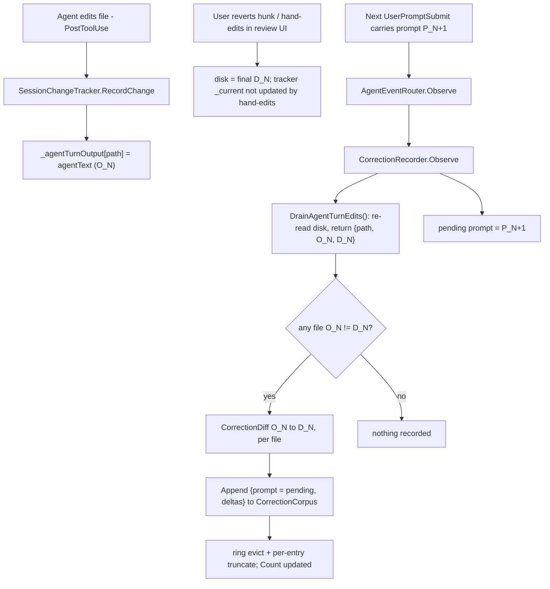
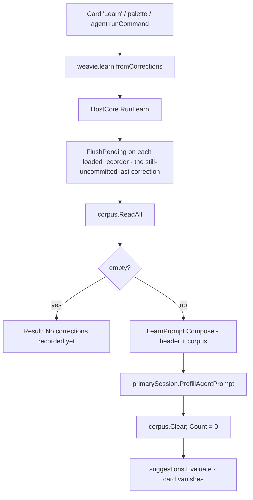

# Learn from corrections

Weavie sits between the user and the embedded agent and observes turn-review. When the user **reverts a
hunk or hand-edits the agent's output**, that correction happens out-of-band and never enters the agent's
transcript — so it is invisible to the model forever. That *net edit over agent output* is signal only
Weavie has.

This feature persists those corrections per-workspace and lets the user run **`/learn`** to have the
primary session's Claude mine them for `CLAUDE.md` rules. The division of labor is firm: **Weavie stores
the signal; Claude does all the reasoning** — there is no classifier, scorer, or intent-detector in Core.
The corpus holds raw deltas only.

It reuses two existing systems almost whole:

- The [contextual suggestions](../concepts/suggestions.md) surface (the `workspace.setup` card is the
  template for the nudge, the command, and prompt-into-session delivery).
- The per-session agent-event fan-out (`AgentEventRouter`), where a new `CorrectionRecorder` slots in as a
  fourth observer beside `SessionChangeTracker`.

The only new primitive is a compact unified-diff emitter (`CorrectionDiff`) so a delta stores as one diff
rather than doubling bytes with before/after text.

## Model

- **`CorrectionRecord`** — one turn's correction: the turn's user `Prompt` (inline, truncated) plus a list
  of `CorrectionFile { RelativePath, Delta }`. `Delta` is a unified diff of `agentText → finalText` for
  that file. Serializes as one JSONL line.
- **`CorrectionCorpus`** (per workspace) — a byte-capped ring over `IFileSystem` at
  `~/.weavie/workspaces/<id>/corrections.jsonl`: `Append`, `ReadAll`, `Clear`, and an in-memory `Count`.
  Oldest-first; eviction drops whole leading lines.
- **`CorrectionRecorder`** (per session) — an `AgentEventRouter` observer. Holds the pending prompt, and on
  each turn boundary drains the tracker, diffs, and appends to the shared corpus.
- **`SessionChangeTracker` snapshot** — a retained `_agentTurnOutput` map (what the agent wrote this turn,
  untouched by keep/revert) plus `DrainAgentTurnEdits()`, which re-reads disk for the final state and
  returns `{path, agentText, finalText}`.

The corpus is **per-workspace** (rules about "how the agent codes in this repo" are repo-level, pooled
across every session/worktree), which is why it is a standalone store and **not** part of the per-session
tracker persistence tracked separately.

## Capturing a correction

Capture happens at the turn boundary — the existing `AgentPromptSubmitted` commit point. The agent's
original output cannot be reconstructed from live tracker state (`_current` is overwritten by reverts;
`_reviewBaseline` is pre-turn), so it is snapshotted on agent writes; the final state is a fresh disk read,
which captures hand-edits the `WorkspaceWatcher` never routes to the tracker. The stored prompt is the
*previous* turn's — the one that produced the corrected output.

An empty delta (the user kept everything) records nothing.

## Running `/learn`

`/learn` is the Core command `weavie.learn.fromCorrections`. It assembles the corpus into a static
analysis prompt (`LearnPrompt`, mirroring `WorkspaceSetupPrompt`), **prefills** it into the **primary**
session (Claude via bracketed-paste, Codex via `PrefillPrompt`) — never auto-submits; the user reviews and
presses Enter — then clears the ring. Because prefill does not fire `AgentPromptSubmitted`, `/learn`
records no spurious correction of its own.

`/learn` is reachable from the card and the command palette. Per
[default-keybindings-sparingly], it gets **no default chord** — it is infrequent and already discoverable
through two surfaces.

## The nudge

A second suggestion, `corrections.learn`, mirrors `workspace.setup`: predicate
`ctx.PendingCorrectionCount >= corrections.learnThreshold`, primary action
`RunCommand(weavie.learn.fromCorrections)`, plus Snooze / DismissForever. It self-regulates — it appears
once enough corrections accumulate and vanishes after `/learn` clears the ring.

`SuggestionContext` gains a `PendingCorrectionCount` field. Unlike the one-shot `HasBuildManifest`, the
count changes over time, so `SuggestionService` reads it fresh each `Evaluate()` from a supplier
(`() => corpus.Count`, a locked int — free). `IsRelevant` stays a pure, no-I/O predicate. `Evaluate()`
fires at three moments: workspace-open, session-created, and session-load.

## Storage, eviction, truncation

On-disk is JSONL, oldest-first, one `CorrectionRecord` per line, at
`~/.weavie/workspaces/<id>/corrections.jsonl`. The corpus loads into an ordered in-memory line list with a
running byte total; `Append` pushes, evicts from the front while over the cap, then atomically rewrites the
file (temp + rename — the ≤~100 KB cap makes a full rewrite per turn trivial).

The byte cap doubles as a **context budget**: the whole ring feeds one `/learn` analysis and must fit the
model's window. Per-entry caps (`MaxPromptBytes`, `MaxDeltaBytesPerFile`, and a whole-entry ceiling of
`MaxBytes / 4`) ensure one monster turn cannot evict all history behind it; overflow is truncated with a
marker. These caps are fixed named constants — a context-budget invariant, not user config. Only the nudge
threshold is a user-facing setting.

Evicting the oldest correction is the **one sanctioned fallback** here (a deliberate exception to the
no-silent-cap rule): this is a best-effort *learning* corpus, not a correctness path, and biasing toward
recent corrections is the intent, not a hidden failure. Everywhere else the no-safety-net rule holds — a
corpus-write failure surfaces at the command result, not a console log.

## Non-goals

- **No reasoning in Core.** Detection, classification, and rule-authoring are Claude's; the corpus is raw
  deltas.
- **No live feedback per correction.** Preventing the agent from building on a reverted hunk mid-session is
  a separate, live concern (a `systemMessage` on the next `UserPromptSubmit`); this feature is the batch,
  reflective half.
- **No auto-submit and no background model calls.** Tokens are spent only when the user clicks Learn or
  presses Enter.

## Known approximations

Both follow from the best-effort-corpus stance and are surfaced, not hidden:

- A correction made to turn N *during* turn N+1 lands after the boundary and is attributed to N+1's prompt.
- A correction to the final turn is not in the ring until the next prompt — mitigated by `FlushPending()`
  on `/learn`.

Codex's turn-start carries no prompt, so a Codex correction records `{prompt: null, deltas}` — acceptable,
since the delta is the signal and the prompt is context.

## Testing

Per [integration-testing-strategy](integration-testing-strategy.md), the fake agent at the process seam
drives everything; the model's analysis text is never asserted. Coverage:

- **Capture** — replay `UserPromptSubmit(P1)` → edit → a revert and a simulated hand-edit → `UserPromptSubmit(P2)`; assert one record with `Prompt == P1` and a delta reflecting both. Keeping everything records nothing.
- **`/learn`** — with N recorded, dispatch the command; assert the primary session's stubbed PTY received one bracketed-paste containing the header + corpus, the ring is empty after, `FlushPending` pulled the last uncommitted correction, and the empty-corpus path writes nothing.
- **Nudge** — below threshold, no card; crossing it plus an `Evaluate()` trigger, card present; after `/learn`, gone. `IsRelevant` does no I/O.
- **Ring** — append past `MaxBytes` drops oldest FIFO; a single over-ceiling entry truncates rather than evicting all history; per-file cap enforced.
- **Transport** — on `remote`, only that the `/learn` paste crosses the wire intact.

## Build order

1. `CorrectionRecord`, `CorrectionCorpus`, `CorrectionDiff` — pure Core, unit-tested over `InMemoryFileSystem`.
2. Prompt plumbing — `HookRequest.Prompt`, `AgentPromptSubmitted(SessionId, Prompt)`, adapter, Codex protocol.
3. Tracker snapshot — `_agentTurnOutput` + `DrainAgentTurnEdits()` (new `SessionChangeTracker.Corrections.cs` partial).
4. `CorrectionRecorder` + `AgentEventRouter` wiring + `HostSession` construction — first full-stack capture test.
5. `LearnSettings`, `SuggestionContext.PendingCorrectionCount`, the service supplier, the `corrections.learn` card, the session-load/create `Evaluate()` triggers.
6. `weavie.learn.fromCorrections` command + `HostCore.Learn.cs` (`RunLearn`, `FlushPending`) + `LearnPrompt` — full-stack `/learn` test.

[default-keybindings-sparingly]: ../../CLAUDE.md#keyboard-first-navigation
