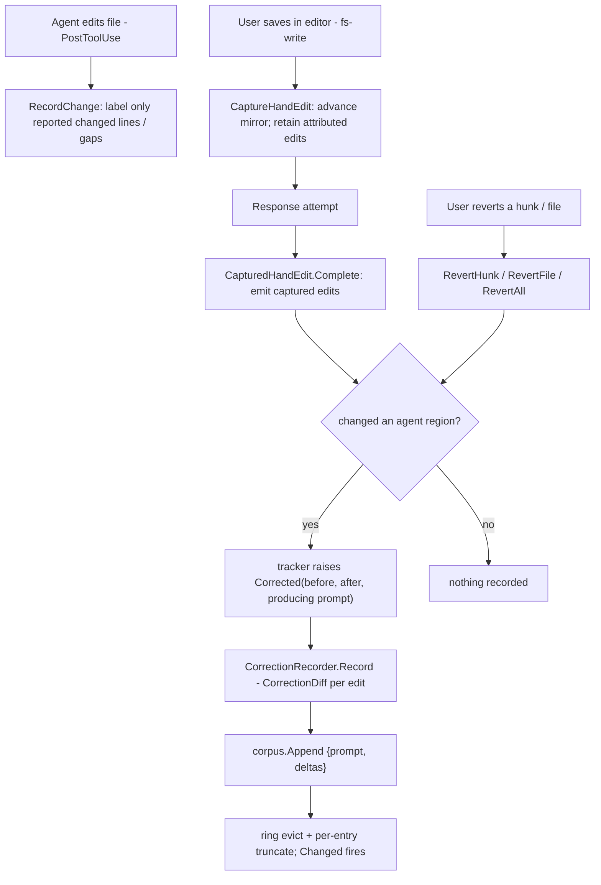
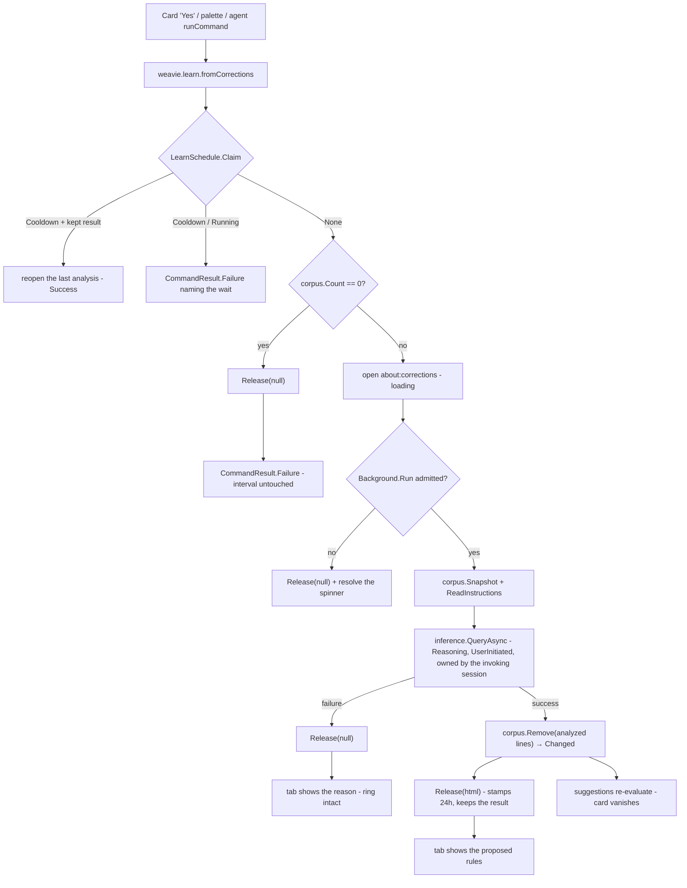

# Learn from corrections

Status: implemented
Last updated: 2026-08-30

Weavie sits between the user and the embedded agent. When the user **edits the agent's output in the editor
or reverts a hunk in the review UI**, that correction never enters the agent's transcript — so it is
invisible to the model forever. That *edit over agent output* is signal only Weavie has.

This feature persists those corrections per-workspace. When the user asks, Weavie mines them for `AGENTS.md`
rules in **one isolated [ad-hoc inference](../concepts/ad-hoc-inference.md) query** and shows the proposed rules
in a read-only editor tab — the user never types or sends a prompt. The division of labor is firm: **Weavie
stores the signal and bounds it; the model does all the reasoning** — there is no classifier, scorer, or
intent-detector in Core. The corpus holds raw deltas only.

Two rules keep it from becoming a background token drain: the analysis runs **only on an explicit click** (the
card's "Yes", the palette command, or `runCommand`), and **at most once every 24 hours** per workspace.

A correction is captured **as a discrete event, at the moment the user acts** — an editor save that lands
over an agent hunk, or a review-UI revert — never reconstructed by diffing the working tree at a turn
boundary. This is the definitive design: the tree-diff-at-boundary approach it replaces swept in machine
noise (formatter reflow, regenerated build artifacts, a parallel agent's commits) and depended on a
full-repo content scan. Capturing at the user's action, gated to the lines the agent actually wrote, records
only genuine corrections.

It reuses three existing systems almost whole:

- The [contextual suggestions](../concepts/suggestions.md) surface (the `workspace.setup` card is the
  template for the nudge and the command).
- The `SessionChangeTracker` review model, which already holds each file's agent output (`_current`) and
  review baseline. The tracker raises a `Corrected` event; the `CorrectionRecorder` is a plain subscriber
  (`Changes.Corrected += recorder.Record`) — no injected dependency, no router slot.
- The `about:`-source read-only tab the log viewer already uses: the host fills the document state directly
  (`SourceTab.Loading/Html/Error`, the one place those wire shapes live) and opens the overlay, so no persistent
  output panel is introduced.

The only new primitives are a line-alignment helper (`LineHunker`, which also backs `CorrectionDiff`) and a
compact unified-diff emitter (`CorrectionDiff`) so a delta stores as one diff rather than doubling bytes.

## Model

All in `Weavie.Core.Corrections` unless noted:

- **`CorrectionRecord`** — one user action's corrections: the producing turn's `Prompt` (inline, truncated;
  null for providers that report none) plus a list of `CorrectionFile { Path, Delta }`. `Delta` is a
  unified diff of `before → after`; `Path` is workspace-root-relative. Serializes as one JSONL line.
- **`CorrectionCorpus`** (per workspace) — a byte-capped ring over `IFileSystem` at
  `~/.weavie/workspaces/<id>/corrections.jsonl` (`WeaviePaths.WorkspaceCorrectionsFile`): `Append` (returns the
  stored line), `Coalesce(record, previousLine)` (replaces that line in place, or appends fresh when it is gone),
  `Remove(lines)`, `ReadAll`, `Snapshot` (each record with the exact line storing it), a locked `Count`, and a
  `Changed` event. Oldest-first; eviction drops whole leading lines. A `Coalesce` that replaces (count unchanged)
  does not fire `Changed`, so the nudge is not re-evaluated per keystroke-save.
- **`LearnSchedule`** (per workspace) — the pacing rules and the last result in one place: `Ready` (may an
  analysis start right now), `Claim(out message)` → `LearnRefusal { None, Running, Cooldown }` (the single run
  slot plus the 24-hour interval, with the user-facing refusal wording), `Release(result)`, `LastResult`, and a
  `Changed` event. Both the stamp and the rendered result persist to `~/.weavie/workspaces/<id>/learn.json`
  (`WeaviePaths.WorkspaceLearnFile`), so the limit *and* the answer survive a restart. `Ready` and `Claim` read
  the same state — including the in-flight flag — so a nudge keyed off `Ready` can never offer a run `Claim`
  would turn down.
- **`CorrectionLessons`** (`Weavie.Core.Corrections`) — the typed query: `CorrectionLessonsInput`
  (`ExistingInstructions` + the records), `CorrectionLessonsOutput` (`Rules[]` of `{ Rule, Evidence }` +
  `Summary`), the instruction text, the strict response `JsonTypeInfo`, the declared bounds, and
  `ReadInstructions` (the repository's root `AGENTS.md`/`CLAUDE.md`, bounded).
- **`CorrectionRecorder`** (per session) — a plain subscriber to the tracker's `Corrected` event. A discrete
  revert appends one `CorrectionRecord` per producing prompt. An editor save (which autosave repeats as the user
  types) **coalesces per agent region**: successive saves that keep retyping over one region supersede a single
  entry (anchored at the region's original agent text through to the current content) instead of recording every
  intermediate keystroke-save; retyping a region back to the agent's own output drops the entry. It keys
  coalescing on the region's origin id plus running-replacement continuity (the save's new text picks up where the
  last left off, over text that still had content), so a restore-from-empty or a deletion boundary stays a
  distinct correction.
- **`SessionChangeTracker.Corrected`** (`SessionChangeTracker.Corrections.cs`) — the event, raising
  `CorrectionEdit { RelativePath, Before, After, Prompt }` batches from completed hand-edit captures and reverts.
- **`CorrectionText`** — the shared UTF-8 byte truncation used by both the ring's per-entry ceilings and the
  prompt's instructions budget.
- **`LineHunker`** (`Weavie.Core.Changes`) — the LCS line alignment: `Hunks(before, after)` returns each
  changed region's range on both sides. Its exact linear-memory alignment backs both provenance tracking and
  `CorrectionDiff` (one alignment, no coarse large-file fallback).

The corpus and the schedule are **per-workspace** (rules about "how the agent codes in this repo" are
repo-level, pooled across every session/worktree), which is why they are standalone stores owned by `HostCore`
and **not** part of the per-session tracker state. The *query*, by contrast, is owned by the **invoking
session**: per [ad-hoc inference](../concepts/ad-hoc-inference.md), the session supplies both the agent provider
and the worktree the query runs in.

## Capturing a correction

A correction is emitted at the two moments the user acts on the agent's output; the tracker raises
`Corrected` and the recorder appends. Nothing is reconstructed later, and nothing scans the tree.

**Editor save — `CaptureHandEdit(path, content)`** (called from the `fs-write` bridge handler on every
successful editor save). Capture rebases the in-memory provenance mirror before the response, so a concurrent
agent edit cannot move the attributed region first. Its idempotent completion raises `Corrected` after the
response attempt, keeping corpus I/O out of the save result. Each tracked file has a full-text provenance mirror
whose live lines and deletion gaps carry their producing prompt and pending/kept state:

1. agent completion aligns the pre-tool file with the provider-reported file and labels only changed lines
   or deletion gaps; unchanged origins survive, including origins from earlier turns;
2. every editor save advances the full mirror, but only a change wholly over one pending origin records.
   An insertion records at an attributed deletion gap or strictly between lines from the same origin;
3. unrelated user/external edits remain unlabelled, so a later agent edit cannot absorb them into agent
   ownership. The review-only `_current` projection applies only attributed agent/correction changes.

**Review-UI revert.** `RevertHunk` records the rejected hunk (`before` = the agent's lines, `after` = the
baseline lines spliced back); `RevertFile`/`RevertAll` record the whole file (`before` = `_current`,
`after` = the review baseline, or empty when reverting a created file deletes it). Reverts write disk
directly (never through `fs-write`), so they never double-fire with the editor path.

Because capture is scoped to agent regions, **out-of-band edits are intentionally invisible**: a change made
in vim, by a formatter run over the agent's Bash/exec, or by a parallel agent never flows through
`fs-write` or a revert, so it is never a correction. This is what kills the false-positive classes the old
tree-diff approach suffered — it is a deliberate narrowing, not a gap.

**Prompt attribution.** Each attributed line/gap stores the in-flight turn's prompt, so different hunks in
one file retain different producing turns. Codex reports no prompt, so its origins carry null.

```mermaid
flowchart TD
  A[Agent edits file - PostToolUse] --> B["RecordChange: label only reported changed lines / gaps"]
  S[User saves in editor - fs-write] --> C["CaptureHandEdit: advance mirror; retain attributed edits"]
  C --> Q[Response attempt]
  Q --> P["CapturedHandEdit.Complete: emit captured edits"]
  V[User reverts a hunk / file] --> W[RevertHunk / RevertFile / RevertAll]
  P --> E{"changed an agent region?"}
  W --> E
  E -- yes --> F["tracker raises Corrected(before, after, producing prompt)"]
  F --> G[CorrectionRecorder.Record - CorrectionDiff per edit]
  G --> I["corpus.Append {prompt, deltas}"]
  I --> J[ring evict + per-entry truncate; Changed fires]
  E -- no --> K[nothing recorded]
```

An empty delta (the difference was EOL-only, or the save touched nothing the agent wrote) records nothing.
A file the **agent itself** deletes (a Bash rm reconciled at PostToolUse) records nothing — no user action
fired — while a **user revert** that deletes a created file records the full rejection.

**Prompt plumbing.** `HookRequest` carries `Prompt` (parsed from the Claude `UserPromptSubmit` payload) and
`AgentPromptSubmitted` carries a `Prompt` field.

## Running the analysis

`weavie.learn.fromCorrections` ("Learn From My Corrections") is handled in `HostCore.Learn.cs`. Corrections are
already in the ring (recorded at each user action), so the command:

1. asks `LearnSchedule.Claim` first — inside the interval the **last analysis is reopened** rather than refused
   (see below), and an analysis already running is refused;
2. refuses loudly on an empty ring, releasing the slot it just claimed so the day is untouched;
3. opens `about:corrections` as a **read-only source tab in its loading state** and returns immediately;
4. starts the work in the session's background scope — and if that scope refuses it (the session is unloading),
   releases the claim and resolves the spinner, because a claim held by work that never runs would wedge the
   feature for the app's life;
5. in that work, snapshots the ring and runs **one** `IInferenceService.QueryAsync` (`Reasoning` category,
   `UserInitiated` origin, images empty), owned by the invoking session — its agent provider answers, in its
   worktree;
6. on success, consumes exactly the analyzed lines and fills the tab with the proposed rules;
7. releases the slot **before** publishing, so acting on what the user just read is never refused as
   "already being analyzed".

The query runs **without tools**, so its only view of the repository's existing rules is what travels in the
prompt: `CorrectionLessons.ReadInstructions` reads the root `AGENTS.md` and `CLAUDE.md` (bounded to 32 KB) into
`existingInstructions`, and the instructions tell the model not to re-propose what they already state. A read
failure there fails the analysis visibly rather than quietly proposing duplicates.

The result is **shown, never applied**: `CorrectionLessonsOutput` is rendered to HTML (every model-authored
string HTML-encoded — it reaches an `innerHTML` sink, with DOMPurify downstream) inside the same `about:` source
tab the log viewer uses. It is an ordinary closable editor tab, not a new persistent output panel, and Weavie
edits no file — so the rules also come as one paste-ready `<pre>` block under "Copy into AGENTS.md", because
otherwise acting on them means retyping each by hand out of the evidence list.

**A refusal is never a dead end.** A successful analysis consumes the ring, so its rendered result is the only
copy of the day's answer; the schedule keeps it, and a cooldown refusal reopens it instead of failing. Closing
the tab, or restarting the host, therefore cannot destroy the result — running the command again brings it
back.

Loud edges, no silent paths:

- An **empty ring fails the command** ("No corrections recorded yet…") — visible in the palette/toast, not a
  quiet no-op, and it never spends the interval.
- A **refusal names its reason and its wait** ("…at most once every 24 hours — the next analysis is available
  in 7 hours"), worded once inside `LearnSchedule`.
- **Every failure resolves the spinner** in the tab the user is watching — an inference failure's `Detail`, an
  unreadable instructions file, a malformed envelope, a session that refused the work. The tab never spins
  forever.
- A **failed analysis costs nothing**: the ring is consumed only after a result exists, and only a completed
  analysis stamps the interval and replaces the kept result.
- The consume is **by line** (`Snapshot` → `Remove(lines)`), so a correction another session appends while the
  query runs is not in the list and survives — it can never be evicted unanalyzed.

```mermaid
flowchart TD
  A[Card 'Yes' / palette / agent runCommand] --> B[weavie.learn.fromCorrections]
  B --> C{LearnSchedule.Claim}
  C -- Cooldown + kept result --> D[reopen the last analysis - Success]
  C -- Cooldown / Running --> E[CommandResult.Failure naming the wait]
  C -- None --> F{corpus.Count == 0?}
  F -- yes --> G["Release(null)"] --> H[CommandResult.Failure - interval untouched]
  F -- no --> I[open about:corrections - loading]
  I --> J{"Background.Run admitted?"}
  J -- no --> K["Release(null) + resolve the spinner"]
  J -- yes --> L[corpus.Snapshot + ReadInstructions]
  L --> M["inference.QueryAsync - Reasoning, UserInitiated, owned by the invoking session"]
  M -- failure --> N["Release(null)"] --> O[tab shows the reason - ring intact]
  M -- success --> P["corpus.Remove(analyzed lines) → Changed"] --> Q["Release(html) - stamps 24h, keeps the result"]
  Q --> R[tab shows the proposed rules]
  P --> S[suggestions re-evaluate - card vanishes]
```

The command is reachable from the card and the command palette (and the agent itself via `runCommand`). Per
the keyboard-first rule's "default keybindings sparingly" stance, it gets **no default chord** — it is
infrequent and already discoverable through two surfaces.

## The nudge

A second suggestion, `corrections.learn`, mirrors `workspace.setup`: predicate
`ctx.Corrections.Ready && ctx.Corrections.Pending >= corrections.learnThreshold`, primary action
`RunCommand(weavie.learn.fromCorrections)`, plus Snooze / DismissForever. It self-regulates — it appears once
enough corrections accumulate and vanishes once an analysis consumes the ring. Because `Ready` is the same
state `Claim` checks (interval **and** in-flight run), **the card can never offer a run the command would
refuse**.

`SuggestionContext` carries a `CorrectionsStatus { Pending, Ready }`. Unlike the one-shot `HasBuildManifest`
these change over time, so `SuggestionService` reads them fresh each `Evaluate()` from one supplier
(`() => new CorrectionsStatus(corpus.Count, schedule.Ready)` — two locked reads, free). `IsRelevant` stays a
pure, no-I/O predicate. Beyond the existing triggers (probe completion, setting change), **the corpus's and the
schedule's `Changed` events re-evaluate** — the card appears the moment an append crosses the threshold and
withdraws the moment an analysis starts or consumes the ring, with no per-session trigger plumbing.

`corrections.learnThreshold` (Int, default 10, min 1, `Live`) is the only user-facing setting — the 24-hour
interval and the byte caps below are invariants, not config. Because per-region coalescing makes each recorded
entry a distinct correction rather than an intermediate keystroke-save, the count is a meaningful signal, and
the default asks for a genuine pattern before nudging.

## Storage, eviction, truncation

On-disk is JSONL, oldest-first, one `CorrectionRecord` per line. The corpus loads into an ordered
in-memory line list with a running byte total; `Append` pushes, evicts from the front while over the cap,
then atomically rewrites the file (temp + rename — the ≤96 KB cap makes a full rewrite per turn trivial).
A malformed line is dropped at load rather than wedging the ring.

The byte cap doubles as a **context budget**: the whole ring feeds one analysis and must fit the model's
window (the query's declared `MaxPromptBytes` is derived from this cap and the instructions cap, so a normal
corpus can never be rejected as oversized). Fixed named constants: `MaxBytes` 96 KB; per-entry ceiling `MaxBytes / 4` (one monster
turn keeps ≥3 entries of history — trailing files drop with a `DroppedFiles` count, never silently, and a
lone delta whose JSON escaping inflates past the ceiling shrinks until the line fits); prompt 2 KB;
per-file delta 8 KB. Overflow is truncated with a marker.

**The ring stores printable text plus `\n`/`\t` only.** Deltas embed raw file content, which then travels into
an analysis prompt and a rendered tab, so `Append` strips every other control character (C0/C1 incl. ESC, DEL,
CR) from prompt, path, and delta at the one choke point — a hostile file's escape sequences never leave the
ring. The rendered tab additionally HTML-encodes everything it shows.

Evicting the oldest correction is the **one sanctioned silent cap** here (a deliberate exception to the
no-silent-fallback rule): this is a best-effort *learning* corpus, not a correctness path, and biasing
toward recent corrections is the intent, not a hidden failure. Everywhere else the loud-path rule holds —
an empty ring fails the command at the surface that meets the user.

## Non-goals

- **No reasoning in Core.** Detection, classification, and rule-authoring are the model's; the corpus is raw
  deltas. The `CorrectionLessons` instructions tell it to ignore noise (one-off fixes, unrelated edits,
  another agent's concurrent work) rather than Core trying to filter it.
- **Weavie never edits `AGENTS.md`.** The analysis proposes; the user copies what they agree with.
- **No live feedback per correction.** Preventing the agent from building on a reverted hunk mid-session
  is a separate, live concern (a `systemMessage` on the next `UserPromptSubmit`); this feature is the
  batch, reflective half.
- **No background model calls.** Nothing is inferred on a timer, on a turn boundary, or on the corpus crossing
  the threshold. Tokens are spent only when the user clicks Learn — and then at most once a day.

## Known approximations

All follow from the best-effort-corpus stance and are surfaced to the model (which reasons about noise),
not hidden:

- Only edits made **through Weavie's editor** (an `fs-write`) or a review-UI revert are captured; an edit
  to an agent hunk made in an external editor is not. This is the deliberate narrowing that excludes machine
  noise — the realistic correction workflow is in-editor.
- Successive editor saves that **retype over one agent region** coalesce into a single entry. One agent edit mints
  one origin across all its hunks, so a region is identified within its origin by running-replacement continuity (a
  live chain per region), letting the user alternate corrections between two regions of one edit and have each
  coalesce independently. What deliberately does *not* coalesce is a genuinely distinct correction — a
  restore-from-empty, a deletion boundary, or a discontinuous re-edit — which starts its own entry, as intended.
- A pure **insertion of new lines at the top or bottom edge** of an agent region (a prepend or an append,
  rather than lines inserted *between* agent-written lines) is treated as new authoring, not a correction, so
  it does not record — and so a run of the user's own lines typed at the end of an agent file, which autosave
  saves repeatedly, never accumulates bogus corrections.
- A successful analysis consumes the ring even when it proposed no rule: re-reading the same corpus tomorrow
  would reach the same conclusion.
- The analysis sees the root `AGENTS.md`/`CLAUDE.md` only — not nested instruction files or the docs they
  link — so a rule already stated somewhere deeper can be re-proposed. Those files are also cut at 32 KB with a
  marker the model sees; a repository whose root instructions exceed that is far past what one prompt should
  carry.
- Only the most recent analysis is kept. A second one replaces it — by then its rules have either been copied
  into `AGENTS.md` or judged not worth keeping.

## Testing

Per [integration-testing-strategy](integration-testing-strategy.md), no test runs the real model; hooks
are replayed at the seam and the analysis text is never asserted. Coverage:

- **Hunker / diff / corpus / recorder** (Core, `InMemoryFileSystem`) — `LineHunker` change grouping +
  range overlap; `CorrectionDiff` hunk grouping + headers + EOL-normalized no-ops; ring reload, FIFO
  eviction, per-entry ceilings, counted clears, malformed-line tolerance, `Changed` events, `Coalesce`
  (replace-in-place / append-when-gone, no `Changed` on a replace) and `Remove`; capture
  semantics (hand-edit over an agent hunk recorded; edit to an agent-untouched region **not** recorded;
  repeated save of the same content records once; **progressive typing over one hunk coalesces to a single
  agent-output → final entry**, two regions edited across saves coalesce independently; hunk/file revert recorded; late revert still recorded and
  attributed to the producing prompt; kept-file edits not recorded; agent deletion not recorded; user
  revert-delete recorded; Codex null prompt).
- **`LearnSchedule`** (Core) — first run allowed; while a run is in flight `Ready` is false and a second claim
  is refused as `Running`; refused as `Cooldown` within 24 hours of a completed run, with the remaining wait
  named and the kept result still available; allowed once the interval elapses; a run that produced nothing
  leaves both the allowance and the kept result intact; stamp + result survive a restart; a malformed stamp
  resets; `Changed` fires on claim and release.
- **`CorrectionLessons`** (Core) — both root instruction files carried, empty when absent, bounded to the
  instructions budget with a marker; the prompt's JSON input round-trips the corrections; the declared prompt
  bound cannot be tripped by a full ring plus full instructions.
- **Nudge** (Core) — below/at threshold, threshold setting honored, refused while the daily interval is
  running, supplier re-read per `Evaluate()`.
- **Full-stack** (`TestHost`, stubbed `IInferenceService`) — hook-driven agent turns whose output the user
  edits via an `fs-write` (the editor-save capture point) surface the card at the threshold; the command runs
  exactly one `Reasoning`/`UserInitiated` query owned by the invoking session, carrying the corpus deltas and
  the repository's `AGENTS.md`; the `about:corrections` tab goes loading → document with the model's rules
  HTML-encoded plus a paste-ready block, the agent PTY receives nothing, and the persisted ring empties as the
  card withdraws. A second run inside 24 hours starts no query and reopens the kept result with the newer
  correction still in the ring; a failed query shows its reason in the tab and spends neither the ring nor the
  day; an empty ring fails the command without querying the model.
- **`SessionTaskScope`** (Hosting) — a closed scope returns `null` from `Run` (admitting nothing), which is
  what lets a caller release the resource it was holding for that work.

The journey is also recorded as a video tour (`src/web/e2e/tour/learn-corrections.tour.spec.ts`, run under
`e2e/tour/video.config.ts`), which stubs `claude --print` inside the test's isolated `$HOME` rather than on any
shared PATH. Tours are evidence, not a CI gate — the durable coverage is the list above.

`HostSession` wires the recorder to the production event (`Changes.Corrected += Corrections.Record`), so the
full-stack test drives the real capture seam (the `fs-write` handler) rather than a test-only re-plumb.

## Build order (as landed)

1. `CorrectionRecord`, `CorrectionCorpus`, `LineHunker`, `CorrectionDiff` — pure Core, unit-tested over `InMemoryFileSystem`.
2. Prompt plumbing — `HookRequest.Prompt`, `AgentPromptSubmitted(SessionId, Prompt)`, adapter, Codex protocol.
3. Tracker `Corrected` event + action-time provenance mirror + revert capture
   (`SessionChangeTracker.Corrections.cs`).
4. `CorrectionRecorder` subscriber + `Changes.Corrected` wiring in `HostSession` + the `fs-write` capture
   point (`HostCore.WebBridge.cs`) + capture tests.
5. `CorrectionsSettings`, `SuggestionContext.Corrections`, the service supplier, the
   `corrections.learn` card, the corpus `Changed` → `Evaluate()` trigger.
6. `weavie.learn.fromCorrections` + `HostCore.Learn.cs` + `CorrectionLessons` + `LearnSchedule` — the isolated
   inference query, the daily interval, and the read-only result tab; full-stack tests.
