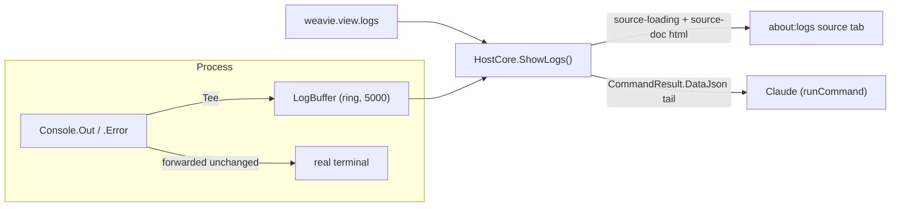

# In-app log viewer

## Problem

Weavie's diagnostics — the editor-init failure, malformed-settings notices, LSP reconnect logs, crash-report
pointers — are written to the host's `Console.Out`/`Console.Error`. Unless the app was launched from a terminal,
that output is invisible: a user who double-clicks the app and hits "The editor failed to load" has no way to see
*why*, and Claude (embedded in the app) can't read it either, so the user ends up copy-pasting stdout by hand.

## Shape

A Core-owned bounded capture of the process's console output, surfaced two ways by one command:

- **`weavie.view.logs`** ("View Logs") — a `Core` command, palette + Claude, **no default keybinding** (a
  diagnostic, not a hot path — see the keyboard-first note below).
- **For the user:** opens the snapshot as a read-only `about:logs` **source tab**, reusing the existing
  source-doc render path (`SourceView` shadow root) — no new web component.
- **For Claude:** returns the most-recent tail as the command's `CommandResult` **data payload**, so
  `runCommand("weavie.view.logs")` hands the log straight back over MCP — self-serve, no paste.

## Capture

`LogBuffer` (`Weavie.Core/Diagnostics/`) is a thread-safe ring of the most recent `DefaultCapacity` (5000) lines.
On overflow it evicts the oldest line and increments a `dropped` counter, so a truncation is never silent:
`Snapshot()` returns `(lines, dropped)` and both the tab and the Claude payload surface the dropped count.

`ConsoleTee` (internal `TextWriter`) forwards every write to the wrapped writer unchanged and mirrors completed
lines (split on `\n`, `\r` dropped) into the buffer — so the real terminal still shows everything while Weavie
keeps a copy. `LogBuffer.Tee(inner)` returns it as a plain `TextWriter` (the seam the tests drive without touching
Console); `LogBuffer.InstallConsoleCapture()` wraps `Console.Out` + `Console.Error` and returns the buffer.

The buffer is an **app-global** store (one per process, like `RailStateStore`), created and installed at each host
entry point — `HostServices.CreateDefault()` (Mac/Headless) and `AppController` (Windows) — and passed to
`HostCore` via `HostServices.LogBuffer`. Install is deliberately kept **out of `CreateDefault`'s test path**:
tests build `HostServices` inline and inject a fresh `new LogBuffer(...)`, never teeing the xunit console.

## Render

`HostCore.ShowLogs()` (`HostCore.Logs.cs`) snapshots the buffer and:

1. Posts `source-loading` (`target: "about:logs"`) — the only message the web opens a source tab on — then
   `source-doc` (same target, `title: "Weavie Logs"`, `html`) — the full buffer as an escaped `<pre>` (via
   `WebUtility.HtmlEncode`; `SourceView` re-sanitizes with DOMPurify), prefixed with a dropped-lines marker when
   the ring evicted earlier output. `html` is the source-doc body for host-rendered docs; Notion docs send
   `markdown` instead.
2. Returns `CommandResult.Success(message, dataJson)` where `dataJson` is `{ log, shown, omitted }` — the last
   `LogTailForClaude` (500) lines, with `omitted = dropped + (buffered − shown)` so Claude sees when more exists.

Because a `source` tab overlays the editor host without touching Monaco (`applyActive` returns immediately for
`kind: "source"`), **the viewer opens even when Monaco init failed** — the exact condition it exists to diagnose.
The Claude data path needs no editor pane at all.

Web `{type:"log"}` messages (e.g. an editor-init failure the web reports) are formatted host-side as
`[web:{level}] {message}` into the same console stream, so they land in the viewer as readable lines.

## Keyboard-first

No default keybinding: this is a rarely-used diagnostic, and default bindings are reserved for
truly important / high-frequency commands (the palette is the keyboard path for the rest). The command is fully
reachable from the palette and from Claude.

## Not in v1

- **Snapshot, not live tail.** The tab shows a point-in-time snapshot; re-running the command refreshes it.
- **No stale restore.** A persisted `about:logs` tab restores empty on relaunch (source-tab content is never
  persisted — same as a Notion tab); re-running the command repopulates it.
- **Earliest process output** (banners printed before the host builds `HostServices`/`AppController`) predates
  the tee and isn't captured; the diagnostics that motivate this feature all come later.
