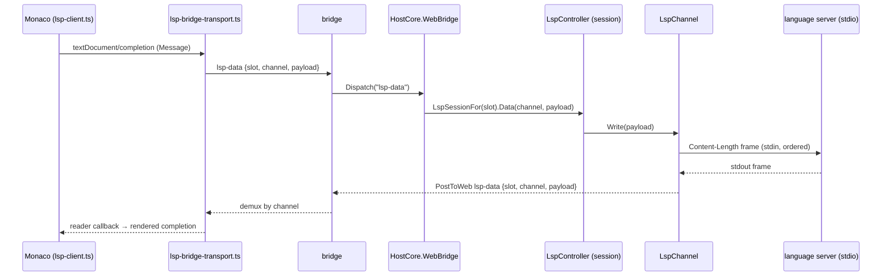

# LSP over the bridge

Language intelligence (autocomplete, hover, diagnostics, go-to-definition) is the one capability that did not
reach remote sessions. This spec records why, the design that fixes it, the tradeoffs it accepts, and how it
clears the path to TLS on the runner.

## The problem

Until now each session ran its **own loopback WebSocket server** (`LspBridgeServer`): a `TcpListener` on
`127.0.0.1:{lspPort}` that spawned one language server per connection and proxied WebSocket frames ↔ server
stdio. The page learned the endpoint from an `lsp-config`/`__WEAVIE_LSP__` payload carrying a literal
`ws://127.0.0.1:{lspPort}` plus a per-session token.

That URL is the browser's **own** loopback. On a local desktop host it happens to be the right machine, so it
works. On a **remote** session the page runs on the user's machine but the language server lives on the remote
worker — and `ws://127.0.0.1` points at the user's machine, where nothing is listening. The server also binds
loopback-only with a per-session token, so it is not merely mis-addressed but unreachable. Result: everything
in a remote session worked except language intelligence, which silently resolved against the wrong machine.

This is the loopback half of the same **mixed-content** constraint that gates the whole remote feature: a page
at the secure origin `https://weavie.dev` may only open an insecure socket to loopback or to a TLS origin.

## The design

Stop giving LSP its own socket. Tunnel LSP JSON-RPC over the **existing web↔host bridge**, the same channel the
terminal and the file provider already ride. LSP then inherits whatever transport the active backend has —
in-process for the native host, WebSocket for a remote worker, or a future TLS-proxied one — and reaches remote
sessions for free.

The terminal already multiplexes many PTYs over the one bridge by tagging every frame with a `slot` (session)
and a `session` (pane). LSP mirrors that exactly: every frame carries a `slot` (session) and a page-minted
`channel` (one per language client).

The only thing different from the old path is that the JSON-RPC rides the same socket as `term-*`/`fs-*`, so it
reaches the remote worker instead of the browser's dead loopback.

### Wire protocol

One UTF-8 JSON object per message, `{type, …}`, like everything on the bridge. The JSON-RPC payload rides
**embedded inline** — it is already JSON, so no base64 like the terminal's PTY bytes.

Web → host:

| type | fields | meaning |
| --- | --- | --- |
| `lsp-start` | `slot`, `server`, `channel` | a language client opened; spawn `server` for `slot`, bound to `channel` |
| `lsp-data` | `slot`, `channel`, `payload` | one JSON-RPC message → the server's stdin |
| `lsp-stop` | `slot`, `channel` | the client closed (document closed / session switch); kill the server |

Host → web:

| type | fields | meaning |
| --- | --- | --- |
| `lsp-data` | `slot`, `channel`, `payload` | one JSON-RPC frame from the server's stdout |
| `lsp-exit` | `slot`, `channel`, `code`, `reason?` | the server exited or never started; `reason` carries the host-side cause ("no server on PATH (tried …)") |

`LspConfigJson` / `__WEAVIE_LSP__` drops `url` and `token` and adds `slot`; it keeps `workspace` and the server
catalog. One fewer secret — the bridge's existing gate is the only gate.

### Components

- **`LspController`** (`Weavie.Hosting`) — one per `HostSession`, owned as `session.Lsp`. Resolves an
  `lsp-start` selector to a recipe, spawns a server per channel, routes JSON-RPC both ways, and fans
  `workspace/didChangeWatchedFiles`. The successor to `LspBridgeServer`.
- **`LspChannel`** (`Weavie.Hosting`) — one language server bound to a channel, under a `ProcessSupervisor`
  (`RestartPolicy.Never`). Streams stdout frames out as `lsp-data`; reports a self-exit as `lsp-exit`. Disposing
  kills and reaps the server.
- **`ILspServerProcess` / `ILspServerLauncher` / `LspServerProcess` / `LspServerLauncher`** (`Weavie.Core`) — the
  process seam (mirrors `IPtyLauncher`). The real launcher spawns a `Process`; a fake supplies a scripted server
  so a full LSP round-trip stays deterministic in tests. `LspServerProcess` owns the stdout/stderr read loops
  and a single-consumer stdin write queue (preserving JSON-RPC submission order).
- **`lsp-bridge-transport.ts`** (web) — `BridgeMessageReader`/`BridgeMessageWriter` implementing
  `vscode-jsonrpc`'s reader/writer over the bridge, plus the per-channel demux. Replaces `vscode-ws-jsonrpc`.
- **`lsp-client.ts`** (web) — unchanged lazy-start, rebind-on-switch, and supervised-reconnect machinery; only
  the transport primitive swapped from a WebSocket to a bridge channel.

### Lifecycle and ordering

The socket no longer *is* the lifecycle. `lsp-start` spawns, `lsp-stop` (or session/worktree dispose) kills and
reaps. `LspController.DisposeAsync` reaps every channel on a background thread, each `LspChannel.Dispose`
blocking until its server is killed + waited — the same guarantee `LspBridgeServer.DisposeAsync` gave, so a
worktree removal still can't race a live server (the Windows "Directory not empty" hazard).

**Restart authority stays with the client.** A restarted server needs a fresh `initialize` and re-`didOpen` of
every open document, which only `monaco-languageclient` can drive, and only on a transport close. So the host
supervises with `RestartPolicy.Never`; the web's existing capped-backoff reconnect (on a fresh channel) is the
restart controller. The host wrapping in `ProcessSupervisor` is for uniform launch/stop/teardown and crash
observability, and to satisfy the project's "all long-lived children go through the supervisor" rule.

**Write ordering** is preserved per channel: `LspServerProcess` drains an unbounded single-consumer queue onto
stdin, so `didOpen` always precedes the completion that depends on it. A `SemaphoreSlim` around stdin would not
guarantee FIFO.

The `WorkspaceWatcher` moved off the LSP layer onto `HostSession` (started eagerly), since it must keep feeding
the editor's `file://` provider even with zero language servers connected. It fans each batch to the provider
(`FileChanges`) and to the controller (`NotifyWatchedFileChanges`).

## Tradeoffs accepted

- **Head-of-line blocking.** Every server plus terminal bytes plus fs reads now share one ordered pipe. On the
  native transport there is no transport-level HoL (discrete `postMessage` dispatches, not a byte stream); on a
  remote WebSocket a large LSP frame (semantic tokens, big completion lists) can sit ahead of a terminal frame.
  Accepted for v1 — the large payloads are occasional and editor-debounced, and a second logical stream fights
  the deliberately-dumb wire. The named mitigation *if a spike shows a problem* is to chunk large host→web
  `lsp-data` frames so terminal frames interleave — local to the LSP path, far cheaper than priority lanes. Not
  built speculatively.
- **Backpressure.** Outbound (web→host), the writer **rejects** while the backend is offline rather than
  buffering into the bridge's unbounded outbox — a loud failure the supervised reconnect handles, with the
  reconnecting banner already on screen. Host→web rides the existing bounded outbox, which drops the connection
  loudly on overflow (surfaced as a "lost connection" toast). No silent cap, no unbounded growth.

These need a spike before they are considered closed: HoL under concurrent terminal load over a real
Tailscale backend, and large-message cost on the native `postMessage` channel.

## Why this enables TLS on the runner

The runner's transport is Tailscale-only today (no TLS); the eventual goal is TLS on its endpoints. This change
is a prerequisite, not an aside.

With LSP on its own port there were **two** sockets per backend to secure and to proxy — one of them a per-session
dynamic loopback port. With LSP folded into the bridge there is **exactly one** socket per backend. So "host acts
as a TLS proxy" / "`tailscale serve` terminates TLS" only ever has to wrap that one endpoint, and LSP comes along
for free — it carries no scheme or port of its own. The web already derives `wss://` from an `https://` page
(`pageUrlToBridgeWs`, `resolveBridgeWsUrl`), so when the bridge upgrades to `wss://`, LSP rides it transparently
with no LSP-side change. Solve the bridge's reachability once and language intelligence inherits it.

**Now built** — `--tls tailscale` (or `--tls proxy`) terminates TLS in front of that one loopback bridge, so a
remote session reaches the app as `wss://` and LSP comes along for free. See
[tls-on-the-runner.md](tls-on-the-runner.md).

## Status

Built on branch `worktree-lsp-over-bridge`. Host + web compile; the `Weavie.LspHarness` dev tool was retargeted
from the loopback server to the new in-process bridge path (a fake `IHostBridge` driving a real `LspController`),
so it still proves diagnostics/semantic-tokens/hover/completion against real servers. TLS on the runner and the
reconnection resync (the offline write-rejection + missed `didChangeWatchedFiles`, closed by re-pushing
`lsp-config` on every `ready`) are now built — see [tls-on-the-runner.md](tls-on-the-runner.md). Remaining: the
HoL and native-large-message spikes above, and the remote end-to-end run confirming language intelligence
resolves over `wss://` in a remote session.
