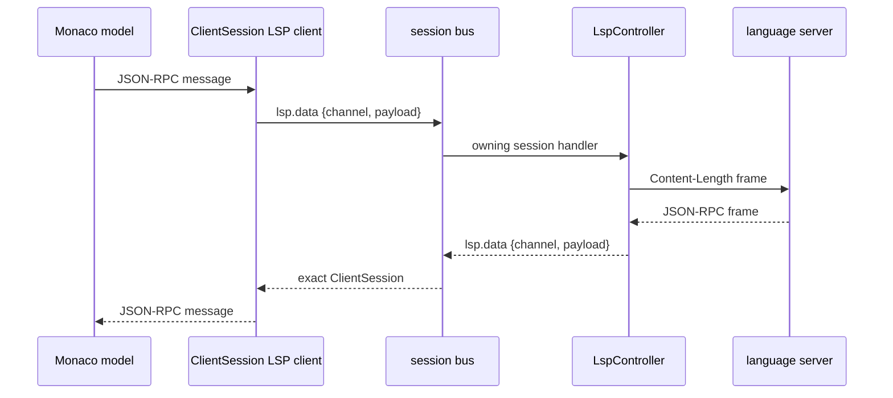

# LSP on the session bus

**Status:** implemented.

Language intelligence belongs to the workspace session whose files it reads. The browser-side language
client and host-side language server communicate through that session's message bus; LSP has no separate
socket, port, token, backend selector, or active-session route.

## Ownership

Each loaded `HostSession` owns:

- one `LspController`;
- zero or more `LspChannel` instances, one per browser language client;
- the language-server processes behind those channels;
- the workspace watcher that feeds file changes to the editor and all live servers.

Each `ClientSession` owns its LSP configuration and pooled language clients. Monaco models carry a
session-namespaced URI, so the model itself identifies which `ClientSession`, bus, workspace, and language
server own a request.

```mermaid
sequenceDiagram
    participant M as Monaco model
    participant C as ClientSession LSP client
    participant B as session bus
    participant L as LspController
    participant S as language server

    M->>C: JSON-RPC message
    C->>B: lsp.data {channel, payload}
    B->>L: owning session handler
    L->>S: Content-Length frame
    S-->>L: JSON-RPC frame
    L-->>B: lsp.data {channel, payload}
    B-->>C: exact ClientSession
    C-->>M: JSON-RPC message
```

Selection is absent from this path. A model in a background session keeps using that session's language
client, and a response cannot enter a same-slot replacement because the envelope includes the session
incarnation.

## Feature protocol

All messages use the standard session envelope with `feature: "lsp"`.

Client to host events:

| name | payload | meaning |
| --- | --- | --- |
| `start` | `{server, channel}` | Resolve the recipe and start one server for the channel. |
| `data` | `{channel, payload}` | Forward one JSON-RPC message to the channel. |
| `stop` | `{channel}` | Dispose that channel and server. |
| `reset` | `{epoch}` | Dispose channels left by earlier page instances. |

Host to client events:

| name | payload | meaning |
| --- | --- | --- |
| `config` | `{workspace, servers}` | Configure the owning session's clients. |
| `data` | `{channel, payload}` | Deliver one server JSON-RPC message. |
| `exit` | `{channel, code, reason?}` | Report exit or failure to start. |

`lifecycle.sync` publishes `lsp.config` along with the rest of the session snapshot. Reconnect therefore
restores configuration explicitly; it does not replay commands or infer a selected workspace.

## Ordering and concurrency

The LSP feature uses the session bus's serialized lane. `start`, `data`, `stop`, and `reset` are admitted in
receive order for one session, while other features and other sessions continue independently.

`LspServerProcess` also uses a single-consumer stdin queue. This preserves JSON-RPC ordering after bus
dispatch, including `didOpen` before requests that depend on it. Each channel owns a separate server process
and output loop.

## Warm clients

`language-client-pool.ts` keeps one client per `(HostConnection, SessionAddress, server)` while that session
has matching open models. Switching the visible session does not start or stop clients.

The pool removes a client when:

- its exact `ClientSession` closes;
- its LSP configuration changes;
- no matching model remains after a server failure;
- its supervised reconnect exhausts the visible retry policy.

A page-instance epoch lets the host reap channels orphaned by a reload. Session disposal remains the final
owner: it kills and reaps every remaining server before the worktree may be removed.

Language-server commands are process-global in Monaco even though language clients are session-owned. At the
protocol-conversion boundary, Weavie replaces each command advertised by a server with an alias unique to that
client's channel. Every command-bearing result and resolve request converts through that alias in both directions;
the exact producing client is therefore retained until invocation while the server sees only its raw command id.
Client-local commands remain unchanged. A reconnect uses a new channel namespace, so stale UI can never invoke
the replacement client. Selection, active models, command arguments, and registration order are never routing
inputs.

## Transport

Native hosts carry the envelopes through their in-process bridge. Headless hosts carry the same envelopes
through the authenticated WebSocket. LSP therefore follows remote sessions without exposing a second
network service and inherits the bridge's TLS policy.

## Required coverage

- model-to-session routing uses the namespaced URI, never selection;
- same-language clients answer only for their own session models;
- duplicate server command ids receive distinct per-client aliases and execute only on their producing client;
- aliases round-trip to raw ids through code-action, completion, CodeLens, and inlay-hint resolve requests;
- reconnect teardown cannot remove or receive commands belonging to its replacement;
- clients stay warm across selection changes;
- removing or replacing a session disposes only that session's clients;
- start/data/stop ordering is preserved;
- an old incarnation's frames cannot reach a reused slot;
- reload epoch cleanup cannot remove the new page's channels;
- host disposal kills and reaps all language-server processes.

See [session-message-bus.md](session-message-bus.md) for the common envelope and lifecycle contract.
