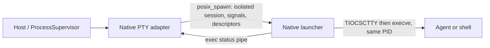

# macOS PTY process isolation

The host starts terminals through `ProcessSupervisor` and `PosixPtyTerminal`. On macOS,
`weavie_pty_spawn` uses `posix_spawn` to start the bundled `weavie-pty-launcher`, which
acquires the controlling terminal and replaces itself with the requested command.
The supervisor therefore owns the same PID throughout the launcher's and agent's lifetime.

The native adapter establishes a new session, resets signal dispositions and the signal mask,
and explicitly inherits only stdin/stdout/stderr plus a launch-status pipe. The status pipe
closes on successful exec; setup and exec failures return errno synchronously to the host.
All failure paths close their descriptors and reap any owned failed child.

## Why a separate executable

A raw fork inside a managed/AppKit host carries runtime handlers and descriptors into the child.
Before exec, a child signal can reach a runtime signal pipe shared with the host. The runtime's
own launch code documents and prevents this hazard. See the
[.NET process implementation](https://github.com/dotnet/runtime/blob/main/src/native/libs/System.Native/pal_process.c)
and [signal implementation](https://github.com/dotnet/runtime/blob/main/src/native/libs/System.Native/pal_signal.c).
The executable boundary avoids host-runtime code running in the child.

This defect was reproduced with an isolated harness injecting a child-only SIGTERM immediately
after fork and observing the parent's signal pipe. It establishes an unsafe launch mechanism;
it does not establish that every reported macOS disappearance had this cause.

## Build and validation

`src/MacPty.targets` produces both native assets for the shared macOS minimum version.
Core project references carry them into flat hosts, tests, and publish outputs; the Mac host
places them in its bundle. Missing assets fail at launch rather than selecting another backend.

macOS CI runs `tests/native/macos-pty.c` against the production native sources to verify session
and controlling-terminal ownership, descriptor exclusion, signal reset, exact launch errors,
and repeated immediate teardown. Managed PTY tests exercise the packaged P/Invoke path.
Full-stack restart and session-deletion tests exercise the user paths through the headless host.
Linux results validate shared behavior; macOS results are required for Darwin-specific claims.

The exit journal reports prior signal exits on the next launch and preserves the signal reason
when the runtime subsequently reports generic process exit.
