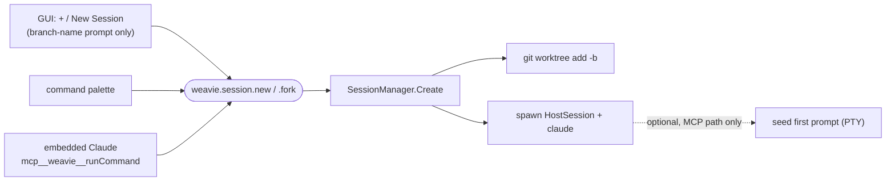

# Multi-session & worktrees

Status: proposed
Last updated: 2026-06-19

The deferred layer on top of [file-management-and-sessions.md](file-management-and-sessions.md):
that spec built the **session seam** (everything session-scoped) but shipped exactly one
auto-created session per workspace and punted three things — the **session switcher UI**,
**worktree-per-session**, and **multi-session creation**. This spec covers all three, plus the
**per-session Claude status** that makes a wall of parallel agents legible.

The thesis carries over: **a session is a unit of agentic work — a Claude + a working directory.**
What's new here is that "more than one Claude" almost always means "more than one *branch*," because
isolating parallel agents from each other's edits is exactly what git worktrees are for. So the
mechanism that makes parallel Claudes safe (a worktree each) and the mechanism git already enforces
(one branch per worktree) are the same thing — and we lean into it instead of hiding a tree behind a
"just N Claudes" abstraction that would let two agents stomp one working tree.

## What already exists (the seam)

`HostSession` (`src/Weavie.Win/Hosting/HostSession.cs`) is already a self-contained per-session
backend: its own cwd (`WorkspaceRoot`), Claude PTY + shell PTY, IDE-MCP server **on its own port with
its own `~/.claude/ide/<port>.lock`**, LSP bridge rooted at the cwd, file index, file opener, diff
presenter, and change tracker. The cwd is a constructor argument. So a worktree session is just a
`HostSession` rooted at a different path — LSP, file browser, file index, and terminals all re-root
for free. This is a UI + state-machine + git-service feature, **not** a backend re-architecture.

## Sessions, worktrees, branches — the coupling

A git worktree is an additional working tree linked to the same repo: it shares the object store
(history isn't duplicated) but has its own working directory, `HEAD`, and index. **A branch can be
checked out in only one worktree at a time** — git hard-refuses a second (`fatal: '<b>' is already
checked out at …`). So a worktree is inherently tied to a distinct branch; that's git's rule, not
Weavie's.

The model that falls out:

- **First / default session** = the repo *as-is*: the main worktree, on whatever branch was already
  checked out. No new branch, no surprises — opening a folder behaves exactly like today.
- **Each additional session** = a new worktree + new branch, created under a managed location the
  user never has to know about (see [Worktree lifecycle](#worktree-lifecycle)).
- **Not a git repo** → fall back to the current behavior: a session is just a cwd, no worktree, no
  branch. The rail's worktree affordances are hidden.

A new worktree branches off a **commit** (the base ref's `HEAD`), so it starts from committed state —
uncommitted working-tree changes in the source worktree do **not** come along. That's standard and
desirable (clean starting point per agent).

## Creating a session

Two entry points, **one command** underneath (per the
[capability registry](../concepts/mcp-registry.md) rule: surface verb actions as commands, not
bespoke tools, so keyboard + palette + Claude all reach them by id — see
[mcp-registry.md](../concepts/mcp-registry.md) and [commands.md](commands.md)).

### GUI path — branch only, no seed

The `+` on the rail (and File ▸ New Session) prompts for **a branch name and nothing else**, creates
the worktree off the current session's `HEAD`, and opens a session with a **fresh, un-seeded Claude**.
No "what do you want to do?" prompt — the user lands in a normal Claude pane and types. This is the
common, low-ceremony path: "give me another tree like this one."

### Claude / MCP path — may seed a first prompt

`weavie.session.new` and `weavie.session.fork` are auto-exposed to the embedded Claude via
`runCommand`. Because the **IDE-MCP server is per-session (per-port lock)**, Weavie already knows
*which* session is calling — so "fork **this** session" / "branch off **my** `HEAD`" is unambiguous
for free. The Claude path can carry a `prompt` (new) or `handoff` (fork) that Weavie injects as the
new session's first message.

### Seeding the first prompt — PTY injection (experimental)

There is **no Claude Code flag that auto-submits a first prompt into the interactive TUI**, and the
`SessionStart` hook can inject orientation *context* but cannot submit a user prompt interactively
(Weavie already writes a system-prompt file for orientation; this is separate). But **Weavie owns the
PTY** (`TerminalController`): seeding the first message is just writing the prompt text + Enter to the
PTY once the TUI is ready. It's simulated typing — and the user *sees* it land in the Claude pane, so
it reads as legible rather than magic.

This path is **explicitly experimental / iterable** — the uncertain part is detecting TUI readiness
(when is `claude` accepting input?) and getting the timing robust. It is **not load-bearing**: the
GUI path doesn't seed, and a session with an un-seeded Claude is fully functional. Build it, try it,
iterate; don't let the rest of the feature depend on it.

### Fork

Two fidelity tiers, same plumbing: new worktree off the source session's `HEAD`, spawn a Claude there.

- **Handoff-brief (robust v1).** The `fork` command takes a `handoff` argument; the forking Claude
  writes its own summary and Weavie injects it as the new session's first prompt (PTY). Public surface
  only, version-proof, lossy on conversation *detail*.
- **Transcript fork (higher fidelity).** `claude --resume <parentSessionId> --fork-session` in the new
  worktree. `<parentSessionId>` is **captured from `HookRequest.SessionId`** on the source session's
  hook stream — so we never need a (nonexistent) `--session-id` launch flag. `--fork-session` branches
  into a new id, leaving the original intact. **Open question:** whether `--resume` *resolves across
  worktrees of the same repo* (sessions are cwd-scoped at `~/.claude/projects/<cwd-key>/`). The fork
  seam **tries `--resume <id> --fork-session` and falls back to the handoff-brief** if resume can't
  find the session in the new cwd. Needs live verification; the deeper fallback is relocating the
  transcript `.jsonl` (coupled to Claude's storage layout — deferred).

**Mid-turn fork — fork from the last *completed* turn, don't block on the in-flight one.** A true
transcript fork can only branch from a completed turn: the transcript holds completed turns, and a
half-finished turn (a pending `tool_use` with no result) isn't resumable — that's why Claude Code's
`/fork` waits for the turn to finish. Weavie removes the *wait* without the impossible part: it tracks
turn boundaries via the `Stop` hook, so it forks from the **last completed turn while the source Claude
keeps running uninterrupted** — the copy just omits the in-flight turn, not the original's progress. A
**fresh / handoff session** carries none of the source's live state, so it can be seeded at any moment.

> **On "true fork" and the thinking question.** An LLM is stateless between turns: the context *is*
> the message array, not a hidden mind-state. Extended-thinking blocks are per-turn scratch and aren't
> needed to continue coherently (the only exception — an unanswered mid-turn `tool_use` keeping its
> signed thinking block — is exactly the half-finished turn the mid-turn rule above forks *before*).
> Claude Code's own `--resume`/`--continue` reconstruct a session from its stored transcript and
> continue fine, so that is the fidelity ceiling — the transcript fork rides the same mechanism and
> reaches it; it is **not** degraded by "lost thinking." The reason handoff-brief is v1 is
> **mechanical**, not fidelity: cross-worktree `--resume` is unverified, and the deeper fallback
> (copying the `.jsonl` into the new worktree's project dir) couples Weavie to Claude's project-dir
> hashing and writes into `~/.claude` internals — version-fragile, against the "don't touch Claude's
> global state" rule.

## Per-session Claude status

The payoff of N sessions is that you tab away and Weavie tells you which one needs you. Each
`HostSession` already observes its Claude's full hook stream (`Ide.HookBridge.Observed`), and every
session's backend processes stay live regardless of which session is *visible* — so background
sessions are observable. Status is **derived from the hook stream + the ProcessSupervisor**, owned in
Core as a `SessionStatus` on the session, and pushed to the web. The web rail only renders it (per
[prefer-Core-over-per-OS]).

| Source signal | Status |
|---|---|
| spawning, before first hook | `Starting` |
| `UserPromptSubmit` → `PreToolUse`/`PostToolUse`, no `Stop` yet | `Working` |
| **`Notification` hook** (permission / idle-input prompt) | `NeedsInput` |
| `Stop` (turn ended) | `Idle` (calm; fades to neutral) |
| ProcessSupervisor crash / crash-loop breaker tripped | `Error` |

Two concrete prerequisites this exposes:

- **`HookEventKind.Notification` does not exist yet** — it's currently folded into `Other`
  (`src/Weavie.Core/Hooks/HookEventKind.cs`; `HookRequest` maps only `"Stop"`). It's the single most
  valuable signal ("Claude is waiting on you"), so adding it + feeding a session state machine is
  step one of the status work.
- **Error has no clean hook.** Claude erroring mid-turn emits no distinct event, so v1 `Error` comes
  from `ProcessSupervisor` (the channel that already owns crash/restart/crash-loop). Don't scrape the
  TUI.

**Principle: communicate *attention*, not status.** `NeedsInput` (amber) and `Error` (red) draw the
eye; `Working` is a subtle pulse; `Idle` is quiet and *fades* — a session that finished an hour ago
isn't interesting, and a wall of bright greens is noise. (This is the user's "calming green for done"
instinct: calm = low-attention.) Status colors come from **theme tokens** (Weavie Dark's green
identity / amber accent), never hardcoded — see [theming-and-lsp.md](theming-and-lsp.md).

**Escalate past the rail** when a *backgrounded* session goes `NeedsInput` or `Error`: flash the OS
taskbar / badge / notification. That's the real value — you stop babysitting and it pings you. Ties
into the existing global window-toggle hotkey and the planned remote-agent viewing.

## The rail (switcher UI)

A **thin vertical rail on the far left** (~36–40px, icons-only), not horizontal — the Windows custom
title bar is web-rendered but macOS doesn't render it, so a vertical web rail is identical on both
hosts. **Hidden entirely when there is ≤1 session** (i.e. today), so it costs zero space until you
branch; "New Session" stays reachable via menu + palette + keybinding meanwhile, and the rail's `+`
appears once a second session exists.

Each session is a **chip** whose identity is **deterministic, not random** — derived from the branch
name so it's stable across restarts and learnable:

- **Fill + monogram** — background hue = a hash of the branch name (fixed S/L tuned to the dark
  theme); glyph = the branch's 1–2 significant initials (common prefixes like `feature/` stripped).
  Same branch → same chip, every launch. (A curated `lucide-solid` glyph indexed by the same hash is
  an alternative to the monogram, still deterministic — see [ui-design-direction].)
- **State** = a small corner badge/treatment overlaid on the identity fill: none when `Idle` (calm),
  a pulse when `Working`, amber when `NeedsInput`, red when `Error`. Identity stays put; state is the
  overlay. Keeps "done" quiet.
- **Active session** = a distinct rail accent (left bar / brighter border), *separate from* the state
  treatment — "you are here" must not be confused with "this one's green."
- **Dormant (unloaded)** = a session whose backend has been torn down — manually via *unload*, or
  automatically when idle. Its chip **stays on the rail** so the worktree is never lost from view, but
  rendered **faded/de-emphasized**, **sorted below all loaded sessions**, and **skipped by next/prev
  cycling**: clicking it (or `Switch Session…`) reloads it on demand. Reconcile-on-open also surfaces
  worktrees left on disk by a past run as dormant chips, so none ever leak. (Ordering: loaded sessions
  hold their order at the top, dormant ones sink to the bottom — a session moving between the two states
  re-sorts.)
- **Tooltip** = full branch + status + **the switch shortcut**, per the keyboard-first rule that
  every action advertises its keybinding where the user meets it, read from the command catalog
  (`CommandInfo.keys` + `formatKey`), never hardcoded (CLAUDE.md "Keyboard-first navigation").

Switching a session **re-binds the layout slots** to that session's instances
(`slot[kind] ← activeSession.instance[kind]`) — the [layout-vs-instances split](
file-management-and-sessions.md#layout-vs-instances--the-key-split) from the parent spec. The frame
stays; the contents swap. Every per-session surface **follows the active session**: the
`ChangesPanel` (change tracking is per-session), the `FileBrowser` + omnibar file index (rooted at the
session cwd), and the `openDiff` target. Cross-session etiquette: if session B's Claude proposes a
diff while you're in A, badge B `NeedsInput` — **never yank focus**.

## Commands & keybindings

Declared once in Core (`CommandDefinition`), surfaced to palette + keybindings + Claude. New chords
must dodge the taken ones: `$mod+1–9` (pane focus), `$mod+Tab` (editor tabs), `$mod+N`/`$mod+W` (new
file / close tab).

| Id | Title | Runs in | Default chord | Args (`ArgsSchemaJson`) |
|---|---|---|---|---|
| `weavie.session.new` | New Session | Core | `$mod+Shift+n` | `{ branch?, base?: "current"\|"main", prompt? }` |
| `weavie.session.fork` | Fork Session | Core | — (palette + MCP) | `{ branch?, handoff? }` (off current `HEAD`) |
| `weavie.session.next` | Next Session | Web | `$mod+Shift+]` | — |
| `weavie.session.prev` | Previous Session | Web | `$mod+Shift+[` | — |
| `weavie.session.switch` | Switch Session… | Web | — (palette) | — |
| `weavie.session.unload` | Unload Session | Core | — (rail menu + palette) | `{ id? }` (default: active) |
| `weavie.session.delete` | Delete Session | Core | — (rail menu + palette, guarded) | `{ id?, force? }` (default: active; `force` overrides the dirty guard) |

Notes: the GUI `+` invokes `weavie.session.new` with **only** `branch` (no `prompt`) — fresh Claude.
`base` defaults to `current` (the session you're branching from); `main` is the alternate. Args
follow the embedded-Claude scalar-coercion convention (lenient at the MCP boundary —
[embedded-claude-stringifies-mcp-scalars]). Direct-index switch (`$mod+Shift+1–9`) is deferred to
keep v1's chord surface small; cycle + palette cover it. **`unload` replaces the old `close`** — it
parks a session as dormant (keeps worktree + chip). **`delete` is the only verb that removes a
worktree**; it keeps the branch, gates on uncommitted changes (`force` to override), and gets **no
default chord** because it's destructive — reached from the rail menu (with a confirm) or the palette.
`next`/`prev` cycle the **loaded** sessions only; dormant chips are reached by click or `switch`.

## Worktree lifecycle

Keep worktrees **out of the user's repo** — a managed dir, `~/.weavie/worktrees/<workspace-id>/<branch-slug>/`,
that the user never `cd`s into. (Worktrees share the object store so this is cheap on history, but
each still materializes a full working copy — flagged for very large repos.) Three distinct things
the model must keep straight:

- **Session** (live: a `HostSession` + its Claude/PTYs/LSP)
- **Worktree** (on disk: the checked-out files)
- **Branch** (in git)

Operations — two user-facing verbs, **unload** and **delete**. There is deliberately **no "close"**:
the old "close session" was an unload wearing a misleading name (it kept the worktree), and a worktree
is only ever removed by an explicit, guarded *delete*. So nothing silently goes away with a worktree
left behind, and nothing destroys a worktree without asking.

- **Unload session** = tear the live backend down (Claude / PTYs / LSP), **keep the worktree and its
  rail chip** — the session goes *dormant*, not away. Reload it by clicking the chip; the worktree is
  fully resumable. Unload is also reached **automatically** (idle-unload / the future `Suspended` state
  in [Resource model](#resource-model)), so the manual verb is just the explicit form of something that
  mostly happens on its own. A dormant chip **sorts to the bottom of the rail** and is **skipped by
  next/prev cycling** (see [The rail](#the-rail-switcher-ui)) — a parked session shouldn't sit between
  two live ones you're tabbing through.
- **Delete session** = `git worktree remove`, then drop the chip from the rail — but **keep the
  branch**. The branch holds the user's *committed* work; removing the worktree discards only the
  working copy, so committed-but-unmerged commits survive on the branch and the session can be re-created
  on it later. **Dirty-guarded** (`WorktreeDirtyException`): if the working tree has uncommitted
  changes, delete refuses and the user must confirm — only that confirmation forces the removal. Never
  destroy uncommitted work silently (CLAUDE.md "no silent fallbacks", [despises-fallbacks]). The one
  thing delete leaves behind is the branch — a cheap ref, not a working copy — reaped by the cleanup
  flow below, not by delete itself.
- **Surface stale/merged worktrees + branches** for cleanup ("3 inactive worktrees, 2 fully merged —
  clean up?") rather than leaving git debris forever *or* auto-destroying. This is also where the
  branches left behind by *delete* get reaped. Loud, opt-in, observable.

v1's exit is "this session's branch is X — merge or delete," **not** auto-merge. A "land this
session" (merge / PR) flow is a great future step, out of the first cut. So is **"move to new
session"** — re-home an existing branch onto a fresh session (the inverse of delete-keeps-branch:
delete frees a branch, this re-attaches one) — noted, not built. Git is invoked from a **Core git
service** (shell out to `git worktree`/branch), keeping both hosts thin.

## Resource model

N sessions = N Claude + N LSP + N PTYs — intrinsic to N parallel agents for the *backend*. The
parent spec's **view virtualization** (one live Monaco + one live xterm, re-hydrated on focus) caps
the *frontend* cost. Beyond that, a **`Suspended`** session state (later) tears down the heavy backend
(the LSP server especially) while keeping the worktree + serialized session state, re-hydrating on
focus — so ten idle worktrees don't each pin a language server. Sessions persist per-workspace
(alongside `layout.json`) and restore on reopen; whether to auto-`claude --continue` each restored
session or cold-start is an open question.

## Per-session routing — a prerequisite to verify

IDE-MCP (per-port lock) and LSP (per-session token) are already per-session. The **hook bridge pipe
must be per-session too**, or session B's Claude events feed session A's status *and* change tracker
once N>1. This is load-bearing for both this spec's status feature and the existing change tracking —
**verify it before multi-session lands** (see [hook-bridge concept](../concepts/hook-bridge.md) and
[permission-modes-and-change-tracking.md](permission-modes-and-change-tracking.md)).

## Implementation status (2026-06-19)

The **Core layer, per-session status, and the session switcher + worktree creation are implemented**
(all host-side committed; the web rail + status render verified with tsc+biome but uncommitted). What
remains is **runtime/GUI verification** and the per-session editor/LSP swap polish. Worktree creation
goes through the tested `WorktreeManager` and is reconciled on open, so worktrees are surfaced — never
silently leaked.

**Done — session deletion (`feat/session-deletion`), statically verified (Core 368 tests + web tsc/biome
+ Win build all green; runtime + macOS host pending):** the lifecycle reframe in
[Worktree lifecycle](#worktree-lifecycle) is wired end to end.
1. **Renamed `weavie.session.close` → `weavie.session.unload`** (Core command + `ISessionHost.UnloadSessionAsync`
   + the `unload-session` bridge message). The host behavior was already "go dormant, keep worktree + chip"
   (`UnloadSlotAsync`), so this was a rename plus the rail changes: `PushSessionList` now orders **loaded
   chips first, dormant last** (stable `OrderByDescending(Loaded)`), and the web's `stepSession` **cycles
   only loaded chips**.
2. **Added `weavie.session.delete`** (`{ id?, force? }`) → `ISessionHost.DeleteSessionAsync`, which checks
   for uncommitted changes *before* any teardown, then unloads (if loaded) and calls
   `WorktreeManager.RemoveAsync(deleteBranch: false, force)` — keeping the branch and dropping the chip.
   The web rail's "Delete…" opens a confirm; the host's `DeleteSessionFromWebAsync` re-checks dirtiness and,
   when dirty, bounces a `session-delete-blocked` message so the page escalates to a louder
   "delete anyway?" (force) confirm. `RemoveAsync` previously had no callers.
3. **Rail affordance:** a right-click context menu on a non-primary chip (Load/Unload depending on state, then
   Delete…); the primary checkout has no menu. It uses the **shared command-driven `ContextMenu`** (the same
   component the editor tab strip uses — context menus are one consistent, command-driven system, never
   hand-rolled per surface), so every row is a command and advertises its shortcut. The rail actions are
   commands: `weavie.session.load` (Core; background-load a dormant session without switching — starts its
   backend muted, `TerminalController.EnsureStarted`), `weavie.session.unload` (Core), and the interactive
   `weavie.session.deletePrompt` (Web; opens the classify→confirm dialog). The raw `weavie.session.delete`
   (Core, with `force`) stays the programmatic/MCP entry. No default chord (delete is destructive).

**Done — `Weavie.Core` (46 new tests; full suite green at 364), committed (`35c40a7`, `725f453`):**
- `Git/` — `IGitService` + `GitService` (worktree add/list/remove; branch/HEAD/default/merged/dirty;
  pure porcelain parser).
- `Worktrees/` — `WorktreeRegistry` (per-workspace `worktrees.json`) + `WorktreeManager`: create, and
  `ListAsync`/`ReconcileAsync` that reconcile the registry against live `git worktree list` and classify
  every worktree (managed / primary / orphan / untracked / dirty / merged / safe-to-remove). Removal is
  dirty-guarded (`WorktreeDirtyException`). **This is the "no leaked worktrees" guarantee** — proven by
  real-git integration tests (externally-removed → orphan → reconcile prunes it; externally-created →
  surfaced as untracked; dirty → removal refused without force).
- `Sessions/` — `SessionStatus` + `SessionStatusMachine` (hook stream + supervisor → status);
  `SessionId` / `SessionDescriptor` / `SessionStore` (per-workspace `sessions.json` + active pointer);
  `SessionIdentity` (deterministic branch → hue + monogram); the `ISessionHost` host seam.
- `Commands/SessionCommands` — the six commands declared (new/fork/next/prev/switch/close) + Core
  handler wiring to `ISessionHost`. `Hooks` — `HookEventKind.Notification` added and Stop/Notification
  registered so Claude fires the relay for them.

**Done — per-session status, end-to-end, verified both sides:**
- **Host (committed `8e2c197`, Win build green):** `TerminalController.SupervisorChanged` →
  `HostSession.SessionStatusMachine` (hook stream + supervisor) → `WorkspaceWindow` pushes a
  `session-status` message to the page.
- **Web (complete, tsc + biome green; uncommitted):** a `session-status` bridge message + a status dot
  in the Claude pane head, colored by `--ok/--warn/--bad/--busy` theme vars derived in `chrome-vars.ts`.
  Left uncommitted only because `bridge.ts` is mid a large unrelated parallel refactor (`hostInjected`
  used across `registry.ts`/`editor-options.ts`/`fonts.ts`/`controller.ts`) — committing it would
  entangle that work. The four web files (`bridge.ts`, `App.tsx`, `theme/chrome-vars.ts`, `styles.css`)
  are a clean follow-up commit once that refactor lands.

**Done — session switcher + worktree creation (compile/verify-level; host committed, web verified):**
- **Win host** (committed `11072f9`, `165a5c8`): `SessionManager` owns N `HostSession`s; `ISessionHost`
  implements new/fork/close (worktree-backed via the tested `WorktreeManager`); `WireSession` gates
  per-session pushes so only the active session drives the page (single-session = identical behavior);
  `SwitchToSession` mutes the previous session's terminals (they keep running) and resets the page's
  xterms; reconcile-on-open surfaces worktrees (toast); the bridge routes `switch`/`new`/`close-session`;
  `SessionCommands.RegisterHandlers` wired. Win build green; missing-git guarded.
- **Web** (verified tsc + biome; uncommitted with the status files, pending the `bridge.ts` parallel
  refactor): `chrome/SessionRail.tsx` — a left rail of chips (deterministic hue + monogram via
  `SessionIdentity`, a status dot, an active accent, hidden ≤1 session, "+" to create); the
  `session-list` / `switch`/`new`/`close-session` bridge messages; App wiring.

**Remaining — runtime verification + polish:**
- **Run the app** to verify switching, worktree create/close, the rail, and status colors end-to-end
  (not autonomously testable here).
- **Per-session file surfaces on switch — DONE.** Switching re-roots every file-related surface to the
  active session's worktree: the editor tabs rebind (`set-editor-session` → `host.rebindSession()` releases
  the previous worktree's working copies and reopens the new one's), and the host re-pushes a `file-index`
  built from the **active** session's `WorkspaceFileIndex` so the omnibar "Go to File" and the file browser
  list the worktree's own files. Before this, both stayed pinned to the primary checkout, so opening a file
  in a worktree session failed — the worktree's file provider refuses an out-of-root (primary) path, which
  surfaces as "Unable to resolve nonexistent file". `SaveScratchAs` also defaults to / validates against the
  active session's root. (`reveal-file`, `fs-read/write`, `list-dir`, change tracking already routed through
  the active session.)
- **Per-session LSP on switch (still deferred):** the LSP websocket doesn't yet re-bind to the new session,
  so semantic features point at the primary worktree in a secondary session — tracked with the other LSP/idle
  deferrals. Plus `next`/`prev` cycle + omnibar session mode, and a worktree-cleanup surface. PTY first-prompt
  seeding is wired but experimental (TUI-readiness timing).
- **Commit the web** (`bridge.ts`, `App.tsx`, `chrome/SessionRail.tsx`, `theme/chrome-vars.ts`,
  `styles.css`) once the parallel `hostInjected` refactor lands, so it isn't entangled.
- **macOS host**: mirror the Win wiring (needs the parent spec's HostSession-per-window split first).

## Build sequence

Each phase: build + unit tests + drive the live app to validate, then commit. Windows-first; the
macOS host still needs the parent spec's `HostSession`-per-window split before it can multiplex
sessions (see [file-management-and-sessions.md](file-management-and-sessions.md) status).

- **Phase 0 — multi-session backend.** Lift the one-session-per-window assumption: a per-workspace
  `SessionManager` owning N `HostSession`s, active-session tracking, and the layout slot-rebinding on
  switch. **Verify the hook pipe is per-session.** No worktrees yet (sessions share the workspace
  root) — proves the switch.
- **Phase 1 — session status.** Add `HookEventKind.Notification`; a Core `SessionStatus` state
  machine fed by the hook stream + ProcessSupervisor; push to web.
- **Phase 2 — the rail.** Deterministic chips (hash hue + monogram), state overlay, active accent,
  tooltips with catalog-read shortcuts, cycle/switch commands, per-session surfaces follow active.
  Hidden ≤1 session.
- **Phase 3 — worktree creation.** Core git service; `weavie.session.new` + GUI branch-name prompt;
  managed worktree location; not-a-git-repo fallback.
- **Phase 4 — Claude-driven creation + seeding.** `weavie.session.new`/`.fork` over `runCommand`;
  PTY first-prompt injection (experimental); handoff-brief fork.
- **Phase 5 — lifecycle.** Unload (→ dormant: keep worktree + chip, sort to bottom, skip cycling) /
  delete (`git worktree remove`, keep branch, dirty-guarded confirm) / resume; stale/merged-worktree +
  branch surfacing. ("Move to new session" — re-home a branch — is later.)
- **Later.** Suspend + deeper virtualization; transcript-copy true fork; OS attention escalation;
  direct-index switch; poppable sessions; "land this session" merge/PR flow.

## Decisions (this spec)

- **Sessions switch within a window**; poppable-to-own-window is wanted *eventually*, not now.
- **GUI `+` = branch-name prompt only, fresh un-seeded Claude.** No "what do you want to do?".
- **PTY first-prompt seeding is experimental/iterable**, only on the Claude/MCP path, never
  load-bearing.
- **Fork v1 = handoff-brief** (robust, public-surface-only); transcript-copy fork deferred as a
  fidelity upgrade — for mechanical reasons, not thinking-loss.
- **Fork base = current `HEAD`**; `new` base defaults to `current`, `main` as alternate.

## Open questions / deferred

- **PTY readiness detection** for prompt seeding (when is the TUI accepting input?).
- **Auto-resume on restore** — `claude --continue` each restored session, or cold-start?
- **Fork base selection UI** beyond the default.
- **Transcript-copy true fork** — only if we accept coupling to Claude's project-dir layout.
- **OS attention escalation** — per-host taskbar-flash / notification APIs.
- **Suspend thresholds** — when to tear down a background session's backend.
- **Branch-name collisions** — picking a branch already checked out elsewhere should offer to switch
  to that session rather than erroring.
