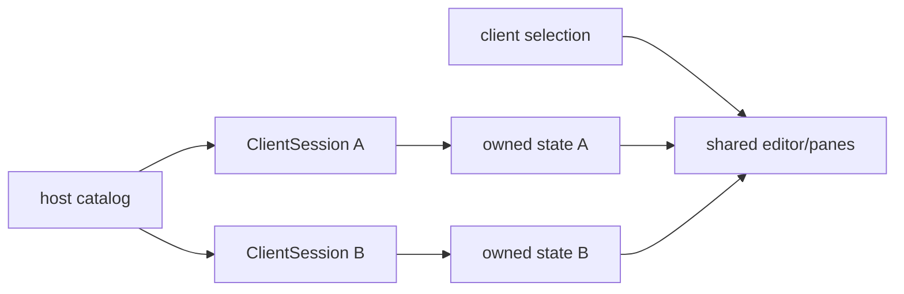

# Multiple sessions and worktrees

**Status:** implemented.

A workspace host owns a catalog of stable session slots. A loaded slot owns one live `HostSession`; a
dormant slot keeps only its worktree metadata. Each client independently selects which live session to
present. Selection is not host state and never determines message routing.

## Slot and incarnation

`SessionSlot` is the rail identity:

```text
id             stable slot id
label          branch/folder label
worktreePath   workspace root for this slot
isPrimary      primary checkout marker
agentProvider  provider chosen for the session
session        live HostSession or null
```

A loaded `HostSession` receives a fresh `SessionAddress(slot, incarnation)`. The slot survives unload/reload;
the incarnation does not. Every session envelope carries both, so work delayed from an earlier backend cannot
enter a newly loaded instance of the same slot.

The catalog describes both loaded and dormant slots. Only loaded entries carry an address and create a
`ClientSession`.

## Primary and worktree sessions

The primary slot is the workspace checkout as opened:

- always loaded;
- never unloadable or deletable;
- may exist even when the folder is not a git repository.

Every additional session is backed by a git worktree:

- its branch is checked out once, under the workspace's managed worktree area;
- agent, terminals, files, LSP, hooks, review state, and commands are rooted there;
- the provider choice is stored with the worktree/session metadata;
- reconciliation surfaces existing managed worktrees as dormant slots.

Git remains authoritative about branches and worktrees. Weavie does not duplicate checkout state in the
message protocol.

## Creating and attaching

New Session creates a worktree from an explicit base or from the invoking session's HEAD. Fork Session uses
the invoking session as the base and may seed a handoff prompt. Attach Existing checks out an existing branch
unless it already corresponds to a slot.

The command returns:

```json
{
  "id": "branch-name",
  "address": {"slot": "branch-name", "incarnation": "..."}
}
```

The requesting page chooses whether to select that exact address. The host creates and publishes the slot; it
does not switch an active session.

A setup command runs only for a newly created worktree. Reusing an existing slot or worktree never re-seeds
its initial prompt.

## Loading, unloading, and deleting

Loading a dormant slot:

1. creates a new exact-addressed `HostSession`;
2. registers its bus before feature traffic can arrive;
3. starts its agent and shell in the background;
4. publishes the new catalog address.

It does not select the session.

Unloading:

1. clears the slot's live session and publishes the dormant catalog state;
2. removes the endpoint from inbound routing;
3. cancels and drains owned handlers/background work;
4. stops and reaps agent, terminal, LSP, watcher, MCP, and media resources;
5. keeps the worktree and branch.

Deleting first classifies tracked and untracked changes. A non-forced dirty delete fails before teardown.
After confirmation it unloads the backend, removes the worktree, keeps the branch, removes the slot, and
publishes the catalog. The primary cannot be deleted.

## Client model

Each catalog address creates one `ClientSession`. Feature installers run automatically for all current and
future sessions. Session-owned state includes:

- terminal and agent pane state;
- editor tabs/models/view state;
- files, source documents, and reviews;
- LSP configuration and clients;
- git/PR/test/status/attention state.

The shared page renders `selectedSession()`. Switching presentation does not move data between session
objects, ask the host to switch, or dispose background state.


```mermaid
flowchart LR
    C["host catalog"] --> A["ClientSession A"]
    C --> B["ClientSession B"]
    A --> SA["owned state A"]
    B --> SB["owned state B"]
    SEL["client selection"] --> UI["shared editor/panes"]
    SA --> UI
    SB --> UI
```

Same-host and cross-host selection use the same `ClientSession` object. Crossing hosts additionally detaches
the old transient view before attaching the new one; both transports and all durable session subscriptions
remain live.

## Status and attention

Every `HostSession` has its own status machine. Status events update its catalog entry and session state
regardless of visibility. A transition to waiting, idle, or error may raise a session-owned attention event.
The page decides whether sound or OS notification is appropriate from focus and selected-session state.

This is intentionally different from suppressing the event at the host. A background completion must be
observable.

## Commands

Session commands are registered on each `HostSession` dispatcher and invoked through that session's bus.
Handlers that omit an explicit target act on their owner. Commands never ask a host coordinator for the
current session.

Web-only commands that require mounted presentation use the owning session's `SessionView`. See
[command-responses.md](command-responses.md).

## Resource model

Loaded sessions are intentionally live in parallel: N loaded sessions may mean N agents, shells, language
servers, watchers, and session state graphs. Unload is the explicit resource-release operation. There is no
hidden LRU or automatic background-session eviction.

The web shares expensive presentation infrastructure where safe:

- one Monaco editor widget with session-owned models and state;
- xterm views retained per loaded session and mounted according to presentation;
- one transport per host, multiplexing exact session endpoints.

Sharing a widget must not imply shared domain state.

## Required coverage

- the primary and worktree slots coexist on every host platform;
- loading reuses a slot but creates a new incarnation;
- old-incarnation traffic is rejected;
- a naive session feature reaches its owner while another session is selected;
- sessions and unrelated feature lanes execute in parallel;
- selection changes neither host routing nor background processing;
- unload drains all owned work and preserves the worktree;
- dirty delete fails before unload; confirmed delete removes only the target;
- background completion updates state and raises attention;
- multiple hosts contribute sessions to one rail without sharing buses.

See [session-message-bus.md](session-message-bus.md),
[editor-session.md](editor-session.md), and [remote-sessions.md](remote-sessions.md).
