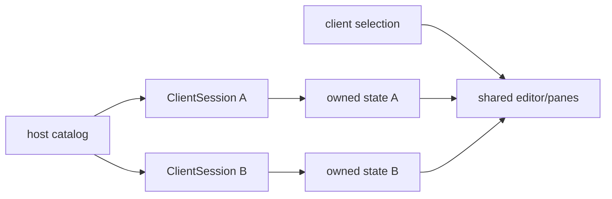

# Multiple sessions and worktrees

**Status:** implemented.

A workspace host owns a catalog of stable session slots. A loaded slot owns one live `HostSession`; a
dormant slot keeps only its worktree metadata. Each client independently selects which live session to
present. Selection is not host state and never determines message routing.

## Slot and incarnation

`SessionSlot` is the rail identity:

```text
id             stable slot id
label          branch/folder label
worktreePath   workspace root for this slot
managedCheckout whether the checkout lives in Weavie's managed worktrees directory
agentProvider  provider chosen for the session
editorSession  persisted tab and view state
session        live HostSession or null
```

A loaded `HostSession` receives a fresh `SessionAddress(slot, incarnation)`. The slot survives unload/reload;
the incarnation does not. Every session envelope carries both, so work delayed from an earlier backend cannot
enter a newly loaded instance of the same slot.

The catalog describes both loaded and dormant slots. Only loaded entries carry an address and create a
`ClientSession`.

## Workspace and managed sessions

On a workspace's first open, the host creates one ordinary loaded session for its user-owned checkout. Its
label is usually the current branch (`main` in a typical new repository). If deleting a session leaves the
catalog empty, the host creates a fresh workspace-checkout session for the same convenience. Deleting that slot
while other slots remain is preserved across later opens.

This session has no routing or lifecycle privilege. It can be unloaded and deleted like any other session.
Deleting it removes only the slot and runtime because Weavie does not own the checkout the user opened.

Managed sessions are backed by git worktrees:

- its branch is checked out once, under the workspace's managed worktree area;
- agent, terminals, files, LSP, hooks, review state, and commands are rooted there;
- the provider choice is stored with the worktree/session metadata;
- reconciliation surfaces every existing non-primary worktree as a dormant slot.

Git remains authoritative about branches and worktrees. Weavie does not duplicate checkout state in the
message protocol.

## Creating and attaching

New Session creates a worktree from an explicit base or from the invoking session's HEAD. Fork Session uses
the invoking session as the base and may seed a handoff prompt. Attach Existing checks out an existing branch
unless it already corresponds to a slot.

The command returns:

```json
{
  "id": "branch-name",
  "address": {"slot": "branch-name", "incarnation": "..."}
}
```

The requesting page chooses whether to select that exact address. The host creates and publishes the slot; it
does not switch an active session.

A setup command runs only for a newly created worktree. Reusing an existing slot or worktree never re-seeds
its initial prompt.

The initial prompt is the new session's opening turn, delivered through the agent's own entry point — never by
writing keystrokes at it. A terminal-backed agent carries it into its launch (Claude's positional prompt
argument, image paths first), consumed by the first launch so a restart never resubmits it; a structured agent
submits it over the protocol once the agent reports idle. Injection is not an option for a terminal agent: its
TUI discards input written while it is still starting, and once running it reads a burst of raw input as a
paste, so the submit key riding that burst becomes text and the turn is never sent — either way the prompt
disappears silently.

## Loading, unloading, and deleting

Loading a dormant slot:

1. creates a new exact-addressed `HostSession`;
2. registers its bus before feature traffic can arrive;
3. starts its agent and shell in the background;
4. publishes the new catalog address.

It does not select the session.

Unloading:

1. clears the slot's live session and publishes the dormant catalog state;
2. removes the endpoint from inbound routing;
3. cancels and drains owned handlers/background work;
4. stops and reaps agent, terminal, LSP, watcher, MCP, and media resources;
5. keeps the worktree and branch.

Deleting first classifies tracked and untracked changes. A non-forced dirty delete fails before teardown.
After confirmation it unloads the backend, removes the worktree the session sits on while keeping its branch —
whoever created that worktree — removes the slot, and publishes the catalog. The workspace's own checkout is
the one a delete keeps, since it is re-created rather than rediscovered. Git's own refusals are refusals here:
the repository's main working tree and a locked worktree can't be removed, and a non-forced delete of a
branchless checkout fails rather than orphaning its commits. An empty catalog is immediately seeded with a
fresh session on the workspace checkout.

## Client model

Each catalog address creates one `ClientSession`. Feature installers run automatically for all current and
future sessions. Session-owned state includes:

- terminal and agent pane state;
- editor tabs/models/view state;
- files, source documents, and reviews;
- LSP configuration and clients;
- git/PR/test/status/attention state.

The shared page renders `selectedSession()`. Switching presentation does not move data between session
objects, ask the host to switch, or dispose background state.


```mermaid
flowchart LR
    C["host catalog"] --> A["ClientSession A"]
    C --> B["ClientSession B"]
    A --> SA["owned state A"]
    B --> SB["owned state B"]
    SEL["client selection"] --> UI["shared editor/panes"]
    SA --> UI
    SB --> UI
```

Same-host and cross-host selection use the same `ClientSession` object. Crossing hosts additionally detaches
the old transient view before attaching the new one; both transports and all durable session subscriptions
remain live.

## Status and attention

Every `HostSession` has its own status machine. Status events update its catalog entry and session state
regardless of visibility. A transition to waiting, idle, or error may raise a session-owned attention event.
The page decides whether sound or OS notification is appropriate from focus and selected-session state.

This is intentionally different from suppressing the event at the host. A background completion must be
observable.

## Commands

Lifecycle commands from the web use the host bus, so load, unload, delete, create, and branch inference do not
need an arbitrary live session endpoint. Their arguments identify an exact target and, when branching from a
session, an exact source. A missing target or source fails; it never falls back to another session.

The same commands are registered on each `HostSession` dispatcher for agent invocation. Handlers that omit an
explicit target act on that owning session. The host never keeps a current-session pointer.

Web-only commands that require mounted presentation use the owning session's `SessionView`. See
[command-responses.md](command-responses.md).

## Resource model

Loaded sessions are intentionally live in parallel: N loaded sessions may mean N agents, shells, language
servers, watchers, and session state graphs. Unload is the explicit resource-release operation. There is no
hidden LRU or automatic background-session eviction.

The web shares expensive presentation infrastructure where safe:

- one Monaco editor widget with session-owned models and state;
- xterm views retained per loaded session and mounted according to presentation;
- one transport per host, multiplexing exact session endpoints.

Sharing a widget must not imply shared domain state.

## Required coverage

- a workspace-checkout session is created when absent and has no lifecycle privilege;
- deleting the final slot creates a fresh workspace-checkout session;
- host-scoped lifecycle commands work with no loaded session runtime;
- loading reuses a slot but creates a new incarnation;
- old-incarnation traffic is rejected;
- a naive session feature reaches its owner while another session is selected;
- sessions and unrelated feature lanes execute in parallel;
- selection changes neither host routing nor background processing;
- unload drains all owned work and preserves the worktree;
- dirty delete fails before unload; confirmed delete removes only the target;
- a discovered checkout's delete removes its worktree; the main working tree and a locked one are refused;
- background completion updates state and raises attention;
- multiple hosts contribute sessions to one rail without sharing buses.

See [session-message-bus.md](session-message-bus.md),
[editor-session.md](editor-session.md), and [remote-sessions.md](remote-sessions.md).
