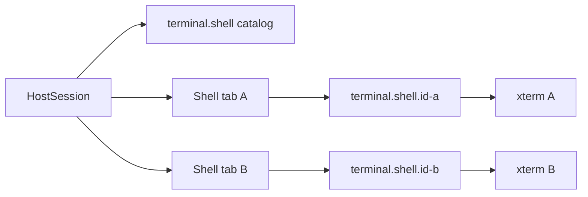

# Multiple shell terminal tabs

Status: implemented

The shell pane contains an ordered set of independently supervised terminal tabs. Agent surfaces remain
singletons: terminal-backed agents keep one `terminal.agent` channel, while structured agents retain their
existing transcript/composer surface.

## Ownership and persistence

Each loaded session owns its shell terminal set. A terminal has a stable opaque ID, one
`TerminalController`, one `ProcessSupervisor`, and one scrollback log. The ordered IDs are persisted in the
session overlay and restored in the same order across unloads and host restarts. Closing the last tab is
valid; the shell pane remains open with its New Terminal button.

The first terminal in the ordered set is the deterministic primary used by automation that has no visual
tab selection, including test running. Visual selection is client-owned state and is retained independently
for every live session.

## Protocol

- `terminal.shell/catalog` publishes `{ terminalIds: string[] }` in display order.
- Each terminal uses its exact `terminal.shell.<id>` feature for `ready`, `input`, `resize`, `cwd`,
  `output`, `exit`, and `reset`.
- Session resync publishes the catalog before resyncing each exact terminal channel.
- Creating a terminal returns its exact terminal ID and session incarnation so the web client can activate
  the right tab without changing the selected session.

Shell tabs use `RestartPolicy.Never`. A normally exited process stays visible with its exit marker until the
user reopens or closes it. New Terminal starts a process immediately. Reopen stops any existing child and
uses the existing reset/ready handshake to launch a fresh one. Close refuses a terminal with a foreground
job until the interactive web command confirms and repeats the close with `force: true`.

## Commands and shortcuts

All user-facing tab actions are commands and their buttons read effective shortcuts from the command
catalog.

| Action | Default shortcut | Behavior |
|---|---|---|
| New Terminal | `Ctrl+Shift+T` | Creates and activates a tab while the shell pane is focused. |
| Close Terminal | `Ctrl+Shift+W` | Closes the active tab; confirms before stopping a foreground job. |
| Next Terminal | `Ctrl+Tab` | Wraps through shell tabs while the shell pane is focused. |
| Previous Terminal | `Ctrl+Shift+Tab` | Wraps backward through shell tabs while the shell pane is focused. |

The terminal cycling bindings are guarded by `focusedPane == 'terminal:shell'` and are evaluated before the
unguarded session-cycling bindings. With fewer than two terminal tabs, the web handler declines, so the same
keystroke falls through to session cycling. In the editor, the existing editor-tab binding gets the same
first-refusal behavior. In the agent pane, Ctrl+Tab continues to switch sessions directly.
