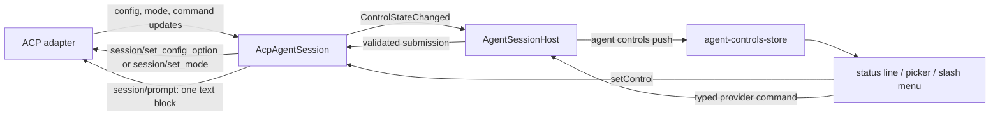

# Native ACP composer controls, slash menu, and prompt history

**Status:** implemented

The structured-agent composer is provider-neutral. `IStructuredAgentControls` exposes the live configuration and
commands of the active ACP session; the web renders that state without owning a Codex, Claude, model, or mode
catalog.

## Features

1. **Prompt history** — Up recalls the previous submitted prompt and Down recalls the next, only with a collapsed
   caret on the first or last rendered line. History is derived from durable `user-message`, `user-command`, and `user-steer`
   transcript entries, so it remains per-session and survives reloads without another store.
2. **Control status line** — every ACP `configOption` and session mode appears under the composer. Selecting a value
   applies it to the live provider session.
3. **Slash menu** — ACP `available_commands_update` entries remain typed provider commands through submission. Weavie also maps
   well-known control semantics—model, reasoning, fast mode, mode, approvals, and sandbox—to commands so the
   palette, keyboard, status line, and slash surface share one action path.

## Capability abstraction

`src/Weavie.Core/Agents/AgentControls.cs` defines the provider-neutral wire model:

- `AgentControlOption` is one advertised value.
- `AgentControlAxis` carries an opaque id, semantic category, `select` or `boolean` kind, current value, and the
  provider's options.
- `AgentSlashEntry` is a discriminated Weavie-command or provider-command action and preserves ACP's optional input hint.
- `AgentControlState` is the ordered control and slash snapshot.

`IStructuredAgentControls` exposes `ControlState`, `ControlStateChanged`, and `SetControl(axis, value)`.

## ACP control flow

ACP owns the control catalog. Initial state arrives from `session/new`, `session/load`, or `session/resume`;
subsequent changes arrive through `config_option_update`, `current_mode_update`, and
`available_commands_update`.

The host validates every selected value against the current advertised axis before sending it. A
`session/set_config_option` response must return the authoritative full `configOptions` array; there is no
optimistic or legacy response fallback. Mode changes use `session/set_mode` and are reconciled by the provider's
mode updates.

Accepted control values are stored as opaque provider defaults in `~/.weavie/acp-controls.json`. On every
`session/new`, `session/load`, or `session/resume`, the ACP client reapplies advertised saved values in catalog
order and consumes each authoritative response before the session becomes ready. This preserves selections
across process and conversation lifetimes without teaching Weavie any provider-specific model or value catalog.

The ACP agent advertises models, reasoning levels, fast mode, modes, commands, skills, and plugins. A provider
command is validated against the latest complete command snapshot, queued until the primary prompt is idle, and
sent through standard `session/prompt` as exactly one text block. It never goes through steering and never receives
implicit Weavie guidance, editor context, or image blocks. Commands without input execute when accepted; commands
with ACP input metadata stage the canonical invocation and show the provider's hint. Unknown `/name` text remains
an ordinary prompt.

`/clear` is the Weavie-owned `weavie.agent.clearConversation` command because ACP adapters do not consistently
advertise a clear command. It clears the pane and the persisted conversation association, then restarts the
supervised ACP runtime with no session id so the next open is necessarily `session/new`. A provider-advertised
`clear` entry is shadowed by this built-in. This abandons the old provider conversation; it does not delete
provider-owned history.

## Keyboard integration

Well-known actions use `weavie.agent.selectModel`, `selectEffort`, `toggleFastMode`, `togglePlanMode`,
`selectApprovalPolicy`, and `selectSandbox`. Plan mode defaults to Shift+Tab. Tooltips read the effective command
binding rather than hardcoding it.

The control picker and slash menu own their keys in capture phase and set `agentControlPickerOpen` or
`agentSlashMenuOpen`. Submit and interrupt stand down while an overlay is open. Prompt-history Up/Down handling
remains local to the textarea because its availability depends on the caret's rendered line.

## Code map

- Core: `src/Weavie.Core/Agents/AgentControls.cs`,
  `src/Weavie.Core/Agents/IStructuredAgentControls.cs`.
- ACP: `src/Weavie.AgentClientProtocol/AcpAgentSession.Controls.cs` and
  `src/Weavie.AgentClientProtocol/AcpAgentSession.Actions.cs`.
- Host: `src/Weavie.Hosting/Agents/AgentControlsProtocol.cs`,
  `src/Weavie.Hosting/Agents/AgentSessionHost.cs`, `src/Weavie.Hosting/HostSession.Messages.cs`.
- Web: `src/web/src/agent/agent-controls-store.ts`, `src/web/src/agent/agent-control-commands.ts`,
  `src/web/src/agent/AgentStatusLine.tsx`, `src/web/src/agent/AgentControlPicker.tsx`,
  `src/web/src/agent/AgentSlashMenu.tsx`, `src/web/src/agent/prompt-history.ts`, and
  `src/web/src/agent/AgentComposer.tsx`.
