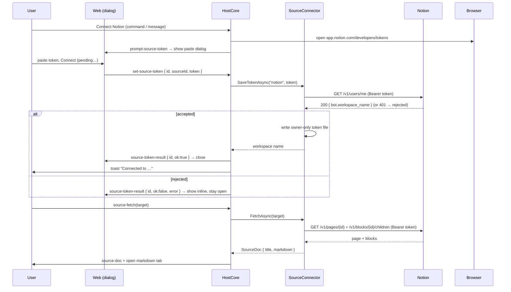

# Notion source auth (personal access token → fetch)

**Status:** implemented (the auth slice). The first vertical slice of
[web-and-source-tabs.md](web-and-source-tabs.md) — connect a Notion account and open a page as a read-only
markdown tab. The shadow-root `SourceView`, the tab-kind union, the routing resolver, and `web` tabs are
deferred to later slices.

## What ships

1. **Connect** (`weavie.source.connectNotion`, or the `connect-notion` web message) opens Notion's token page
   (`app.notion.com/developers/tokens`) in the browser **and** shows an in-app dialog to paste the **personal
   access token** (`prompt-source-token` → the `SourceTokenPrompt` modal). The pasted token comes back as
   `set-source-token`; the host validates it via `GET /v1/users/me`, and only on success writes it (owner-only)
   and toasts the authorized workspace. The dialog shows a **Connecting…** pending state and gets a
   `source-token-result` reply: success closes it, a rejected token is shown **inline** so the user can correct
   it without restarting (never saved). **No file editing** — the user only pastes into the dialog.
2. **Fetch** (`source-fetch`) resolves a Notion URL to the source, reads the page + its blocks with the token,
   maps them to markdown, and opens the result as a scratch `.md` tab (the interim visible surface until
   `SourceView` consumes the `source-doc` message directly).

Everything is **Core-first** and wired through `HostCore` like the PR flow: a Core provider behind an interface
(`ISourceConnector`), a host partial (`HostCore.Sources.cs`), web-bridge messages, and a Core command.

## Why a personal access token, not OAuth

Notion's OAuth flow is built for **distributing a public app to many workspaces**: it needs a `client_secret`
(no PKCE / public-client path), which a desktop app can't ship safely, and there is no Weavie token-broker to
hold that secret. So OAuth would force the user to register *their own* public integration **and** do a browser
consent dance — all of OAuth's friction with none of its "we own the app, you just click sign-in" payoff.

Notion's **personal access tokens** make that unnecessary. A PAT carries the user's **own workspace
permissions** ("give your tools direct access to the Notion API with your workspace permissions"), so:

- No `client_secret`, no redirect URI, no loopback listener, no OAuth code exchange.
- No per-page sharing — a PAT sees what the user sees (unlike an internal integration, which only sees pages
  explicitly shared with it).
- Setup is: create a token (one browser click to the integrations page), check **Notion API**, paste it.

If Weavie ever stands up a hosted token-broker, the polished zero-setup OAuth "Sign in with Notion" flow can be
added back as a *second* connect path — the token file + fetch are auth-method-agnostic.

## Flow

## Token storage

The token lives in `~/.weavie/sources/notion.json` with owner-only POSIX permissions (`SecureFile`), off the
Claude-facing settings surface because it holds a secret — the `remote-agents.json` precedent. The file **is**
the credential; there's no separate validated-token store (a PAT isn't exchanged for anything). OS-keychain
backends (DPAPI / Keychain / libsecret) are a deferred hardening follow-up, not shipped here because the per-OS
native interop can't be built or tested on the CI host.

## Deterministic testing

Per [integration-testing-strategy.md](integration-testing-strategy.md), no test hits real Notion:

- **Pure units** — `ParseMarkdown` (+ its truncation notice), `ExtractPageId`, `ParseTitle`, `ParseWorkspaceName`;
  `SourceConnector`'s no-network paths (setup URL, empty/unknown token, unconnected/unmatched fetch).
- **Full stack** (`HostCoreSourcesTests`) — `connect-notion` opens the token page and pushes `prompt-source-token`;
  `set-source-token` validates against a stubbed `GET /v1/users/me`, saves on success (asserts the token file is
  written + an ok `source-token-result`) and toasts the workspace; a 401 replies an inline-error `source-token-result`
  and asserts the token is **not** saved;
  `source-fetch` serves canned page + `/markdown` JSON and asserts the `source-doc` reply; opening an unconnected
  source URL routes to the connect prompt (not a toast), and a fetch failure posts `source-error` into the tab.
- **Headless capture** — `FakeNotionSource` (wired by `WEAVIE_FAKE_NOTION`, the `WEAVIE_FAKE_PRS` analogue)
  "connects" without a real call and serves a canned doc, so a capture shows the connect → open-doc journey.

## Deferred

The whole `SourceView` UI (tab-kind union, routing resolver, open-shadow-root renderer + theming, link
interception, find-in-source, selection→Claude); the per-doc `Icon`; `web` tabs; the registry-MCP surface
for sources; an OAuth "Sign in with Notion" path (needs a token-broker); OS-keychain token storage. See the
parent spec's *Deferred* table.
