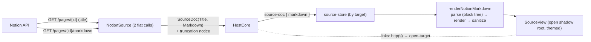

# Notion SourceView (markdown-API rendering)

**Status:** implemented. Builds on [notion-source-auth.md](notion-source-auth.md) (connect + fetch) and the
design in [web-and-source-tabs.md](web-and-source-tabs.md). Renders a fetched Notion page in an open, themed
shadow root from Notion's **markdown API** — one fetch, one markdown projection, rendered to HTML web-side.
Click-to-edit write-back builds on this render: [notion-writes.md](notion-writes.md).

## What ships

`SourceDoc` is **`(Title, Markdown)`**: a single (enhanced) markdown string that is both the rendered display
surface and Claude's reading channel. No separate HTML projection — the host produces markdown, the web renders it.

- **Core** (`NotionSource`) fetches a page in **two flat calls** (`Notion-Version: 2026-03-11`): `GET /v1/pages/{id}`
  for the title and `GET /v1/pages/{id}/markdown` for the body (`{ markdown, truncated, unknown_block_ids }`). The
  markdown stays **byte-for-byte as Notion returned it** — the write path diffs edits against it
  ([notion-writes.md](notion-writes.md)) — so truncation / unreadable-block loss travels as flags on `SourceDoc`
  (`Truncated`, `UnknownBlocks`) and renders web-side as a visible banner (`.wv-incomplete`), never a silent log.
- **Host** posts `source-loading { target, title, sourceId }` the moment a fetch starts (the tab opens with a
  titled spinner, `GuessSourceTitle` from the URL slug; `sourceId` is the claiming source's `ISource.Id` — the
  tab icon keys off it), then `source-doc { target, title, markdown, sourceId, truncated, unknownBlocks }` on
  success or `source-error { target, message }` on failure (the reason lands in the open tab, not a missable toast).
- **Web** renders the markdown in an **open shadow root** (`SourceView`) overlaying Monaco like `PreviewPane`, on a
  `kind:"source"` tab keyed by `target`. `renderNotionMarkdown` parses the dialect **directly** — Notion emits ONE
  block per line, single-`\n` separated, tab-nested, with XML-like container tags; `notion-parse.ts` turns the
  lines into a block tree (`notion-blocks.ts`) whose every node carries its original line index, and
  `notion-render.ts` renders the tree to an HTML string with the `.wv-*` classes `source-styles.ts` defines
  (inline marks via `notion-inline.ts`, a tokenizer that HTML-escapes everything it doesn't recognize; tables —
  both the `<table>` form and GFM pipes — via `notion-table.ts`). No CommonMark translation and no DOM in the
  pipeline: pure `string → string`, so the golden corpus (`corpus/`) snapshot-tests it in the node vitest env.
  `DOMPurify` sanitizes as the last boundary. The shadow stylesheet reads the app's theme custom properties
  (which pierce the boundary, so it follows dark/light live). Code reuses the Markdown preview's
  `highlightFence`/`hydrateMermaid`; links are intercepted (http(s) → host resolver; `#` → in-page heading
  scroll, the ToC's jump).

## Loading, errors & connect-on-open

The open resolver (`HostCore.OpenTargetForWeb`) matches a URL host-side and routes it three ways:

- **Claimed + connected** → fetch (spinner via `source-loading`, then `source-doc` / `source-error`). No frozen
  window during a slow fetch, and a failure shows in the tab rather than a missable toast. The catch is broad on
  purpose: the eager spinner must always resolve (a non-JSON 200 throws `JsonException` deep in the parse).
- **Claimed + not connected** → the connect prompt, with the opened URL **stashed** (`_pendingSourceTarget`) and
  fetched automatically once `SaveSourceTokenAsync` validates the token — connecting from a click lands on the page.
- **Unclaimed** → `open-web` (an iframe tab).

`NotionSource.ClaimsUrl` claims `notion.so` / `*.notion.so` / `*.notion.site` **and** `app.notion.com` (the in-app
page host) — but not the rest of `notion.com` (marketing/help), which opens as a normal web tab.

## Enhanced-markdown coverage (v1)

Notion's markdown carries HTML extensions; `renderNotionMarkdown` maps each to semantic HTML + `.wv-*` classes:

- **Inline:** bold/italic/strike/code (standard markdown), Notion's backslash escapes; `` /
  `…_bg` → `.wv-color-*` / `.wv-bg-*`; `` → `.wv-underline`; links (sanitized); ` `;
  inline math `$…$` → literal-but-styled `.wv-math`; `<mention-*>` → a link or its text (`<mention-date>` → its
  date range).
- **Block color:** a trailing `{color="…"}` on a block → the matching `.wv-*` class (the marker is stripped).
- **Blocks:** headings (anchor `id`s), lists (nested at any depth), **to-dos** (`- [ ]`/`- [x]` → read-only
  checkboxes), quotes, dividers, code fences (`<pre><code class="language-…">`, highlighted after mount),
  block equations (`$$…$$` → literal-but-styled `.wv-equation`), images (``); **tab-indented children nest
  under any block kind** (a sibling/inner `.wv-children`); `<callout>` → `.wv-callout` (icon + color);
  `
` toggles and toggle **headings** (`# H {toggle="true"}`, whose deeper-indented children collapse);
  `<columns>/<column>` → flex; tables — `<table>` (honors `header-row`/`header-column`, per-cell/row/column
  color) **and** GFM pipe tables (the API emits both); `<page>`/`<database>`, non-image media
  (`<file>/<pdf>/<audio>/<video>`), and `<unknown url alt/>` (the markdown API's placeholder for the block types
  it can't render: embed, bookmark, link preview, breadcrumb, template — `alt` names the type) → a link **card**;
  `<synced_block>` unwrapped; `<table_of_contents>` → a real anchor-linked ToC built from the page's headings;
  `<empty-block>` dropped.
- **Page header:** the fetched title + last-edited time (from the page JSON) render as a header above the body
  (`SourceView.headerNode`) — the markdown body itself carries no title.
- **Toggling:** `SourceView` drives `
` open/closed on a summary click itself (the embedded WebView doesn't
  fire the native summary-toggle for a shadow-tree `
`); `preventDefault` avoids a double-toggle.

## Sanitization contract

`renderNotionMarkdown` emits only standard tags (the inline tokenizer HTML-escapes everything it doesn't
recognize — an unknown `<tag>` becomes text, never markup), so `source-html.ts`'s `DOMPurify` allowlist stays
small and is the **last** boundary before the shadow root. The whole pipeline is pure strings: the golden corpus
(`corpus/*.md`, grown from real `GET …/markdown` responses) snapshot-tests full pages in the node vitest env, and
seam-invariant tests pin the emitted-tag ⊆ allowlist contract, the `data-wv-line` ↔ `blockSource` round-trip, and
the fence shapes `highlightCode`/mermaid expect. The `source-routing` e2e covers the real sanitize + DOM behavior
(callout + color render, toggle expands on click).

## Deferred / known v1 gaps

- **Page properties / path / icon** — only the title + last-edited time head the page today; a database page's
  property table, the parent path/breadcrumb, and the page icon are a later slice.
- **Embeds / bookmarks / link previews** arrive from the markdown API only as `<unknown/>` placeholders (the API
  doesn't render them), so they show as a link card to the block in Notion — never the live embedded content.
  Fetching the real block via the block-based API (`GET /v1/blocks/{id}`) is a later slice.
- **Equations** (`$…$`, `$$…$$`) render as literal-but-styled TeX (KaTeX is a fast-follow).
- **Custom emoji** (`:name:`) and **citations** (`[^URL]`) render as literal text.
- **Bare URLs** in text don't auto-link (Notion emits explicit `[…](…)` links).
- **Image host proxy** for expiring signed URLs; **per-doc icon**; **persisted back/forward + restore-by-refetch**;
  **web tabs as the link target**; **find-in-source / selection→Claude / Claude-reads-doc registry resource** (the
  markdown is produced but latent).
