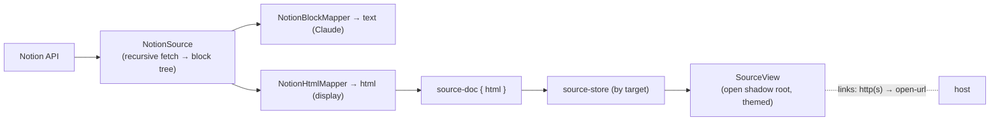

# Notion SourceView (rich-HTML rendering)

**Status:** implemented. Builds on [notion-source-auth.md](notion-source-auth.md) (connect + fetch) and the
design in [web-and-source-tabs.md](web-and-source-tabs.md). Replaces the markdown `.md` interim with a real
HTML rendering of a fetched Notion page in an open, themed shadow root.

## What ships

`SourceDoc` now carries **`Html`** (the rich display projection) alongside **`Text`** (markdown — Claude's
reading channel) and `Title`. One fetch produces both from the same block tree.

- **Core** maps the Notion block tree → semantic HTML (`NotionHtmlMapper` + `NotionHtmlMapper.Blocks.cs`),
  inline runs → escaped HTML (`NotionRichText`), with all API text/urls escaped at the source (`HtmlEscape`).
  `NotionSource` fetches the tree **recursively** (each `has_children` block's descendants attached, paged in
  full) so nested lists, toggles, and columns render.
- **Host** posts `source-doc { id, target, title, text, html }`; the scratch-`.md` interim (`OpenSourceDoc`) is
  removed.
- **Web** renders `html` in an **open shadow root** (`SourceView`) overlaying Monaco like `PreviewPane`, on a
  `kind:"source"` tab (the existing web-tab plumbing, keyed by `target`). DOMPurify sanitizes as defense in
  depth; the shadow stylesheet owns the look and reads the app's theme custom properties (which pierce the
  boundary, so it follows dark/light live). Links are intercepted (http(s) → open externally; web tabs deferred).

## Coverage (v1)

- **Inline:** bold, italic, strikethrough, underline, inline code, links (safe-url-gated), text/background color
  (fixed class allowlist — never an inline style).
- **Blocks:** paragraph, heading 1–3, bulleted/numbered lists (**nested**), to-dos (disabled checkbox), quote,
  callout (icon + color), code (`<pre><code class="language-…">`), divider, image (`<figure>`; signed-URL
  snapshot accepted), toggle (`
`), table (header row), columns (flex). Bookmark/embed/video/file/pdf →
  a link **card**, never an inline live frame. Unknown blocks degrade to their text, else are omitted (no
  placeholder).

## Escaping / sanitization contract

`HtmlEscape` is the single source of truth: `Text`/`Attribute` entity-escape all API-derived content; `SafeUrl`
allows only `http`/`https`/`mailto` (a `javascript:`/`data:`/`vbscript:`/unparseable url is dropped — link text
kept, image/card omitted). Color/background map through a fixed allowlist, so the only class the stylesheet keys
on is un-spoofable. `DOMPurify` re-sanitizes web-side as defense in depth. Asserted directly in
`NotionHtmlMapperTests` (script/quote escaping, unsafe-url dropping, color spoofing).

## Deferred

- **Code syntax highlighting** — code renders as styled `<pre><code class="language-…">`; token highlighting (the
  shared hljs pass, inside the shadow root) is a fast follow.
- **Image host proxy** for expiring signed URLs (a source is a manual-refresh snapshot, so direct `` is
  consistent); **per-doc icon**; **full `SourceTab` union + persisted back/forward + restore-by-refetch**; **web
  tabs as the link target** (http(s) currently opens externally); **find-in-source / selection→Claude /
  Claude-reads-doc registry resource** (the open shadow root makes them possible — `text` is produced but latent);
  equation/synced_block/child_page/database; markdown nesting for the `text` channel (top-level only for now).
