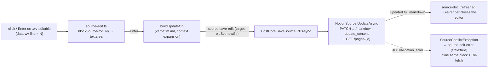

# Notion writes (click-to-edit block editing)

**Status:** implemented. Builds on [notion-source-view.md](notion-source-view.md) (the markdown-API render) and
supersedes the "no write-back" row in [web-and-source-tabs.md](web-and-source-tabs.md) — that verdict predated
Notion's markdown **update** endpoint, which supports targeted, formatting-safe edits without rebuilding an editor.

The user clicks (or Tab+Enter onto) a block of a rendered Notion page, edits its markdown source in place, and
Enter writes it back to Notion. Human-driven only — Claude edits Notion through Notion MCP, not through Weavie.
V1 scope is **editing existing blocks**: no append, create, delete, or reorder, and no table-cell / code-fence /
column editing.

## Why formatting can't be clobbered

`PATCH /v1/pages/{id}/markdown` with `update_content: [{old_str, new_str}]` is an exact-match, must-match-once
search-and-replace over the page's enhanced markdown — the same representation `GET …/markdown` returns, where
*all* formatting is carried in-text (`<callout icon color>`, trailing `{color="…"}` attrs, ``).
Weavie never regenerates the page from the rendered view: ops are diffed against the **verbatim fetched
markdown**, so untouched blocks are never rewritten. The write path never uses `replace_content` (it would
destroy `<unknown/>` embeds and truncated tails) and never sends `allow_deleting_content` /
`replace_all_matches` — their absence is the safety rail. A stale `old_str` (the page changed in Notion) fails
server-side with `validation_error` — free optimistic concurrency, surfaced at the block as "re-fetch".

## The block ↔ line model

Notion emits **one block per line** (single-`\n`, tab-nested). The editable unit is one original markdown line;
every mapping, edit, and op is "original line index N".

- **Line map** — `normalizeNotionMarkdown` (`notion-transform.ts`) returns `NormalizedDoc { text, lineMap }`:
  normalized line → original line, `-1` for synthesized lines (blank separators, toggle-heading wrappers).
  `installLineStamps` (a markdown-it core rule, `lineMap` passed as render env) stamps `data-wv-line` — the
  *original* line index — onto paragraph/heading/list-item/blockquote tokens via `token.map`.
- **Editable marking** — the DOM walk (`notion-markdown.ts` `markEditableBlocks`) drops a stamp whose ancestor
  carries the same line (the blockquote owns its inner `
`) and marks stamped `p/h1–h6/li/blockquote` outside
  `table`/`pre` as `.wv-editable` (sanitizer allowlist carries `data-wv-line` through). Everything else —
  tables, fences, cards, mentions, column wrappers — renders with no affordance.
- **Edit ops** (`notion-edit.ts`, pure) — `blockSource` slices a line byte-exactly into
  `tabs + display + attrsRaw`; the editor shows only `display` (inline marks and `##`/`- `/`> ` prefixes are
  visible and editable; nesting tabs and `{color=…}` attrs re-attach verbatim on commit). `buildUpdateOp`
  newline-anchors the verbatim line and grows it with whole neighbor lines (alternating up/down) until it
  occurs exactly once in the document; `new_str` is the identical context with only the target line replaced.
  Refusals (surfaced inline, never munged): emptied drafts (deletion is out of scope) and multi-line drafts.

## Flow

- **Web** (`source-edit.ts`, the controller `SourceView` mounts): one edit at a time; commit disables the
  textarea (`Saving…`) until the host resolves it; blur with an *unchanged* draft cancels, a changed draft stays
  (never a silent discard). An edit is bound to the exact markdown string it opened against — a same-string
  re-render (theme switch) re-mounts the draft, a different string (the save's refresh) closes it and returns
  focus to the block. A list item keeps its nested list visible while editing.
- **Host** (`HostCore.Sources.cs` `SaveSourceEditAsync`): fire-and-forget like the fetch — every outcome
  resolves the block's saving state. Success re-posts `source-doc` from the PATCH response's full updated
  markdown (`PostSourceDoc`, shared with fetch); `SourceConflictException` → `source-edit-error {stale:true}`
  with a "Re-fetch (discards this edit)" action (it just re-posts `open-target`); anything else → `stale:false`.
- **Truncation flags ride beside the markdown**, never inside it: `SourceDoc(…, Truncated, UnknownBlocks)`
  renders as a web-side banner (`.wv-incomplete`), keeping the fetched markdown byte-exact for diffing.
  Truncated pages stay editable — `update_content` matches against the full page server-side.

## Keyboard surface

Three commands (`CoreCommands.cs`, handled web-side; context keys `sourceBlockFocused` / `sourceEditing`):
`weavie.source.editBlock` ("Edit Block", `Enter`, palette-visible), `weavie.source.commitEdit` (`Enter` while
editing), `weavie.source.cancelEdit` (`Escape` while editing). Blocks get `tabindex` + a tooltip naming the
effective key (read from the catalog, never hardcoded); the editor shows a hint row (`⏎ Save · Esc Cancel`).
Tab walks blocks, Enter edits, Enter/Escape commit/cancel — the whole loop is keyboard-reachable; a click on a
toggle heading still toggles (its heading edits from the keyboard).

## Testing

Per [integration-testing-strategy.md](integration-testing-strategy.md), nothing hits real Notion:

- **Pure units** — `notion-transform`: `lineMap` invariants across containers, toggle headings, lists, fences;
  stamp rule output. `notion-edit`: byte-exact reconstruction (incl. literal `{note}` braces), context
  expansion over duplicated lines/regions/document edges, refusals.
- **Full stack** (`HostCoreSourcesTests`, stubbed HttpClient) — the PATCH's URL/auth/exact body (proving no
  `allow_deleting_content`/`replace_all_matches`) and the refreshed `source-doc`; `validation_error` →
  `stale:true` and no doc; a 500 still resolves (`stale:false`); truncated fetch → clean markdown + flags.
- **e2e** (`source-editing.spec.ts`, `FakeNotionSource` — whose `UpdateAsync` enforces the real must-match-once
  contract; file flags `truncated`, `rejectEdits`) — edit round-trip keeping block color and callout icon/color,
  duplicate-paragraph disambiguation, Escape/Enter keyboard loop, stale error + Re-fetch, truncated banner.
- **Manual smoke against real Notion before relying on it** — the one empirical question automation can't
  answer is GET↔PATCH byte-fidelity (a mismatch fails *safe*: `validation_error`, never a wrong write). Cover:
  plain paragraph, colored block, callout child, a line adjacent to an `<unknown/>`, a truncated page.

## Deferred

Table cells, code fences, and column layout edits; block create/delete/reorder; append / page creation; batched
multi-block ops (`update_content` already takes an array — the message would grow an `ops` list); a
Claude-facing write tool (Notion MCP covers Claude).
