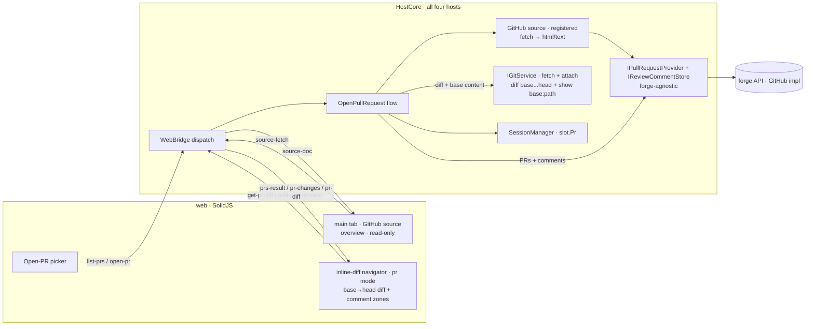
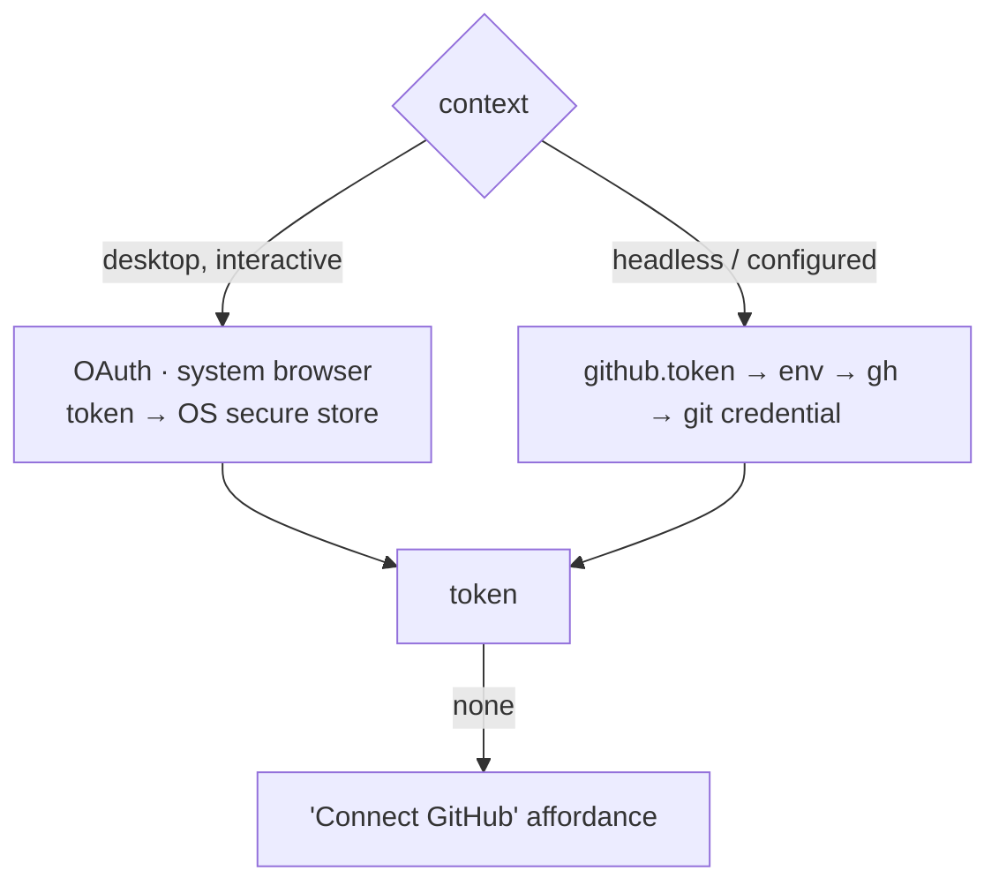
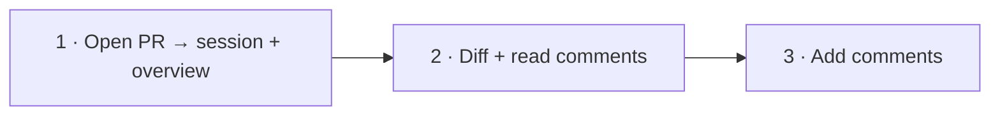

# Open PR

Turn a GitHub pull request into a Weavie session: check out the PR's branch in its own worktree, pull the
PR's review comments into the editor anchored to the lines they're about, and let the user reply to a thread
or leave a new comment without leaving Weavie.

> Status: **building**. Implemented and e2e-tested:
> - **Phase 1 — Open PR → session.** `IPullRequestProvider` (GitHub impl + token discovery),
>   `IGitService.FetchAsync`/`GetRemoteUrlAsync`, the `list-prs`/`open-pr` messages, the `OpenPrPrompt` picker,
>   the `weavie.pr.open` command.
> - **Phase 2 — the PR diff in the review surface.** Opening a PR computes the `base…head` diff
>   (`IGitService.MergeBaseAsync`/`DiffRefsAsync`/`ShowFileAtRefAsync`) and pushes `pr-changes`/`pr-diff`; the
>   editor's inline-diff navigator renders it in a read-only `pr` mode (walk files ←/→, hunks ↑/↓).
> - **Phase 3 — comments.** The forge-neutral `IReviewCommentStore` (GitHub impl + in-memory fake) loads a PR's
>   review comments; they anchor as threads (view-zones) on the diff lines, with a composer to **reply** and a
>   toolbar **Comment** action to add a new one (`add-pr-comment` → re-fetch → re-render).
>
> A Playwright spec (`open-pr.spec.ts`, against a stubbed provider + a local base/head workspace) drives the
> whole journey: pick PR → checkout → diff navigator → walk files → see a comment → reply → add.
>
> **Deferred** until the source-tab system ([web-and-source-tabs.md](web-and-source-tabs.md)) lands: the PR
> *overview source tab* and host-run *OAuth* (token discovery covers auth meanwhile).

## Why

Reviewing and addressing a PR today means bouncing between the GitHub web UI (to read the conversation) and
the editor (to make the change). Weavie already owns the two halves that matter — a session is a branch on its
own worktree ([multi-session-and-worktrees](multi-session-and-worktrees.md)), and the editor already has a
**diff-review surface**: the post-turn inline-diff navigator that walks a change set hunk-by-hunk and
file-by-file, with a floating toolbar, position label, and per-hunk actions ([turn-review](turn-review.md)).
"Open PR" joins them across **two surfaces, each the natural fit for its half**:

- **The PR overview** (title, description, conversation, checks, changed-file list) opens as the session's
  **pinned main tab**, rendered by a registered **GitHub source** — the source-tab mechanism that just landed
  ([web-and-source-tabs.md](web-and-source-tabs.md)). It's read-only, themed, Claude-readable, and reached by
  resolving the PR URL.
- **The code diff + commenting** lives in the editor's review surface: the PR's `base…head` diff is shown in
  **that exact same navigator you get when Claude ends a turn**, with the PR's comments anchored onto the hunks
  and a composer to answer in place.

So the PR *is* the session — worktree checked out on its head branch, Claude primed with its context, overview
in the main tab, code review in the editor. The read/write split is deliberate and falls out of the source
model (below).

## User journey

1. **Open PR** — `Ctrl/Cmd+Shift+P`-style command *"Open Pull Request…"* opens a picker listing the repo's
   open PRs (number, title, author, branch). Picking one creates (or switches to) a session checked out on the
   PR's head branch, and seeds Claude's first message with the PR title/body/URL.
2. **Read comments** — the session's review comments appear in the editor: a gutter glyph on each commented
   line, and a view-zone thread (author, body, timestamp) under it. A side list groups every comment by file so
   nothing is missed when the file isn't open. Outdated comments (the line moved since) are shown in the list,
   flagged.
3. **Add comments** — from a thread the user can **Reply**; from any line they can **Comment**. The draft posts
   back to GitHub via the API and the thread re-renders with the new comment.

## Architecture

The host owns all GitHub I/O; the web never sees the token and never calls GitHub directly. PR data crosses the
existing web↔host bridge as new message types, exactly like `new-session` / `list-branches` do today
([host-core-unification](host-core-unification.md)).



Why host-side: the token must never reach the renderer (untrusted surface), API calls need no CORS dance, and
every host (Win/Mac/Linux/Headless/Remote) inherits the feature by adding it to `HostCore`, not per-OS.

### Two seams: git for the diff, a forge-agnostic provider for PRs + comments

The work splits cleanly along what each piece actually needs:

- **The diff is git, not GitHub.** A PR's `base…head` diff is a local operation once both refs are fetched —
  no API call. It belongs on `IGitService` alongside the existing worktree operations, so it's the *same* diff
  machinery for any branch comparison (a fork's branch, a local topic branch, a PR), not a PR-only path.
- **PRs and comments are forge operations, behind a forge-agnostic interface.** Listing PRs and
  loading/adding comments do need a remote API — but the host shouldn't know it's *GitHub*. The seam is a
  provider-agnostic interface; **GitHub is one implementation**, so GitLab/Bitbucket/Gitea slot in later
  without touching the session flow or the editor. This is the same seam strategy as `IGitService` and the
  stubbed `claude` ([integration-testing-strategy](integration-testing-strategy.md)) — the integration harness
  runs against a fake provider.

**`IGitService` additions** (`Weavie.Core.Git`):

```csharp
Task FetchAsync(string repoDir, string remote, string refName, CancellationToken ct);                 // git fetch origin <ref>
Task<IReadOnlyList<DiffFile>> DiffRefsAsync(string repoDir, string baseRef, string headRef, CancellationToken ct); // base...head, name + ±counts
Task<string> ShowFileAtRefAsync(string repoDir, string refName, string path, CancellationToken ct);   // git show <ref>:<path> — the diff baseline
Task<string?> GetRemoteUrlAsync(string repoDir, string remote, CancellationToken ct);                 // remote URL → forge + repo selection
```

`DiffRefsAsync` feeds the `←`/`→` file axis (`pr-changes`); `ShowFileAtRefAsync` supplies each file's diff
**baseline** (current comes from the worktree on disk). Three-dot `base...head` diffs against the merge-base,
so it's exactly what GitHub shows.

**Forge-agnostic review provider** (`Weavie.Core.Review`, parallel to `Weavie.Core.Git`):

```csharp
public interface IPullRequestProvider {                       // discover + list PRs for a repo
    Task<IReadOnlyList<PullRequestSummary>> ListOpenAsync(RepoRef repo, CancellationToken ct);
    Task<PullRequestDetail> GetAsync(RepoRef repo, int number, CancellationToken ct);
}

public interface IReviewCommentStore {                        // load / add / reply — the "similar interface for comments"
    Task<IReadOnlyList<ReviewComment>> ListAsync(RepoRef repo, int number, CancellationToken ct);
    Task<ReviewComment> AddAsync(RepoRef repo, int number, NewReviewComment draft, CancellationToken ct);
    Task<ReviewComment> ReplyAsync(RepoRef repo, int number, long inReplyTo, string body, CancellationToken ct);
}
```

The DTOs are forge-neutral. `ReviewComment` carries what anchoring needs:
`{ id, path, line, side, originalLine, commitId, diffHunk, author, body, createdAt, inReplyTo, isOutdated }`.
`RepoRef { host, owner, name }` is derived from the remote URL.

**GitHub is the implementation.** `GitHubReviewProvider` (implementing both interfaces) is `HttpClient`-backed
against `https://api.github.com` (a `github.apiBaseUrl` setting leaves room for GitHub Enterprise). **Auth is
its concern, not the interface's** (see below). Which implementation the host constructs is chosen from the
remote URL: `GetRemoteUrlAsync` is normalized — `https://github.com/owner/repo(.git)`,
`git@github.com:owner/repo.git`, `ssh://git@host/owner/repo.git` — to `RepoRef` by taking the last two
non-empty path segments (stripping `.git`); the `host` selects the provider. The user never types owner/repo.

### The PR overview as a registered GitHub source

The overview tab is a **`source`** ([web-and-source-tabs.md](web-and-source-tabs.md)), not a bespoke surface: a
GitHub source plugin registered in Core the same way settings/commands are, which is also what exposes the PR's
text to Claude.

```ts
const githubSource: Source = {
  id: "github",
  match: (t) => /github\.com\/[^/]+\/[^/]+\/pull\/\d+/.test(t),   // claims PR URLs
  icon: githubMark,
  auth: githubOAuth,                                              // host-run, system browser, secure store
  fetch: async (target, token) => {                              // → { html, text, icon, title }
    // calls IPullRequestProvider/IReviewCommentStore + DiffRefsAsync, projects to html (human) + text (Claude)
  },
};
```

- **Read-only render — with one principled write exception.** The source *renders* read-only (description,
  conversation, checks, file list), which is exactly right for an overview. Writes split by **comment class**:
  - **Review comments** (inline, anchored to a diff line/hunk) are written from the **editor diff surface**
    (Phase 3), where you're looking at the code — never from the overview.
  - **PR-scoped / conversation comments** (the general thread) naturally belong to the overview, so **replying
    to the conversation from the overview** is the one sensible write here — but this stays **a detail of the
    GitHub source implementation, not the generic `Source` contract**. The generic interface remains
    read-only (`match`/`fetch`/`auth`/`icon`); the GitHub overview *internally* renders a reply composer and
    posts through `IReviewCommentStore` (its issue-comment path). So the generic model's "no write-back" holds
    unqualified — only this implementation reaches further, and only for an append-only comment, never the
    source's read `fetch`.
- **Routing + opening.** Resolving the PR URL matches the source and opens a `source` tab; the host also pins
  it as the session's main tab. Because routing is URL-based, **pasting a PR link** opens it natively too. A
  click on a file in the overview's file list routes through `reveal-file`, which in a PR session opens that
  file in the editor's `pr` diff mode — the overview is the entry into the code review.
- **Layering.** The source plugin is *presentation*; it consumes the same `IPullRequestProvider` /
  `IReviewCommentStore` / `IGitService` data layer the diff surface does, projecting it to `html`/`text`. One
  data layer, two renderings (native overview, Monaco diff).

## Authentication

Modeling GitHub as a **source** mostly settles this: the source model already prescribes a host-run **OAuth in
the system browser** with the token in the **OS secure store** (DPAPI / Keychain / libsecret), shared by every
source ([web-and-source-tabs.md](web-and-source-tabs.md)). So GitHub's `auth: OAuthDescriptor` is the *primary*
path — the same "Sign in" flow as Notion, not a GitHub-special mechanism — and the **secret-storage question is
answered** (the source store, no new "secret setting kind" needed). What remains GitHub-specific is registering
a Weavie GitHub **OAuth app/client** to point the descriptor at.

The one gap the source OAuth doesn't cover is **headless / remote** ([remote-sessions](remote-sessions.md)):
there's no system browser on a server, so an interactive flow can't run. There a **configured token** is the
answer. So the resolution is two-pronged, not a long precedence chain:

- **Desktop → OAuth (the source flow).** A *"Sign in to GitHub"* button → consent in the real browser →
  short-lived, refreshable token in the secure store. Fine-grained, *Pull requests: read/write* scope.
- **Headless / a token already on the box → discovery.** `github.token` setting (a fine-grained PAT) →
  `GITHUB_TOKEN`/`GH_TOKEN` env → `gh auth token` → `git credential fill`. This is legitimate server credential
  provisioning, and doubles as a zero-config convenience on a dev box that already has `gh`/a git credential.



Because both feed one resolved token into the GitHub provider, the provider doesn't care which produced it.
Auth stays the **GitHub implementation's** concern — the provider interfaces are credential-agnostic, and
another forge brings its own descriptor.

## Phase 1 — Open PR → session on its branch

The tractable, fully-testable core; reuses the existing attach-existing-branch machinery end to end.

**Messages** (added to `HostBoundMessage` / the `Dispatch` switch, mirroring `list-branches` / `new-session`):

- `→ list-prs { id }` ⇒ host replies `prs-result { id, prs: PullRequestSummary[] }`
- `→ open-pr { number, headRef, title }` ⇒ host runs the flow below; failure surfaces as a toast

**Host flow** (`OpenPullRequestAsync`, in `HostCore.Sessions`):

1. `git fetch origin <headRef>` so the PR branch exists locally (new `IGitService.FetchAsync`; validate
   `headRef` with the existing `GitService.IsValidBranchName` before it reaches git).
2. Attach a session on it via the existing `AttachExistingSessionAsync(headRef)` — which already de-dupes to an
   existing session, handles the primary-checkout case, provisions the worktree, and switches.
3. Record the PR on the slot (`SessionSlot.Pr`, see below) and seed Claude's first prompt with the PR
   title + URL + body for context.
4. Open the PR's URL through the resolver — matching the registered **GitHub source** — and **pin it as the
   session's main tab**, so the session lands on the PR overview. (Resolving a URL also means a pasted PR link
   does the same thing.)

**Source + auth.** Phase 1 registers the GitHub source (match + `fetch` → overview `html`/`text`) and wires its
OAuth (the source's host-run flow), since opening the overview tab needs both. The provider's `ListOpenAsync`
backs the picker; the source's `fetch` backs the tab. No secret store to build — the source model supplies it.

**UI.** An `OpenPrPrompt.tsx` modeled on `NewSessionPrompt.tsx`: a typeahead list of open PRs (number · title ·
@author · branch) with the same keyboard-first affordances. Reached by a new web command `weavie.pr.open`
(*"Open Pull Request…"*) with a default keybinding and a palette entry, plus an entry on the session-rail "+"
menu — every action advertises its shortcut, per the keyboard-first rule.

## Phase 2 — The PR diff in the post-turn review surface

A PR *is* a diff — `base…head` — so it renders in the **same inline-diff navigator the post-turn review uses**
([turn-review](turn-review.md)), not a second viewer. Switching to a PR session arms that surface fed with the
PR's diff; you walk it with the same chords (`↑`/`↓` hunks, `←`/`→` files), the same floating toolbar, and the
same `file i/N · change j/M` label. The comments anchor onto the hunks, and the per-hunk action is repurposed
from Keep/Revert to **Comment/Reply**.

### Feeding the PR diff into the existing renderer

The renderer already takes a `(baseline, current)` pair per file and computes hunk geometry with VSCode's
differ — that's what `turn-diff` carries today. The PR maps straight onto it:

- **baseline** = the file at the PR's merge-base (`git show <base>:<path>`, supplied by Core).
- **current** = the file on disk in the worktree (the PR head — and, naturally, any edits made since, so a fix
  the user/Claude just made shows as a further change over the PR).

So Phase 2 adds a **`pr` mode** to `inline-diff.ts` beside the existing `applied` / `review` / `view` modes,
reusing all of the navigation, labeling, and decoration code. It does **not** reuse the *turn-review state
machine* (the keep/revert baseline-advance is for your own working-tree edits, not for an already-committed
PR) — instead a parallel, simpler message set feeds the same UI:

- `→ pr-changes-request { number }` ⇒ `pr-changes { number, files: [{ path, name, added, removed }] }` — the
  file axis (the `←`/`→` walk), the PR analogue of `turn-changes`.
- `→ get-pr-diff { number, path }` ⇒ `pr-diff { number, path, baseline, current, comments: ReviewComment[] }` —
  one file's base→head pair plus the review comments anchored in it, the PR analogue of `turn-diff`.

The host builds these by composition: `pr-changes` from `IGitService.DiffRefsAsync(base, head)`, and each
`pr-diff` from `ShowFileAtRefAsync(base, path)` (baseline) + the worktree file (current) + `IReviewCommentStore.ListAsync`
(comments). The diff is pure git; only the comments touch the forge.

### Comments anchored on the diff

Each `ReviewComment` carries `(path, line, side, commitId, diffHunk)`. Within the file's diff the web renders
each thread as a **view-zone under its line** — the same view-zone mechanism the faded "accepted" band and
ghost-deletions already use — showing author, body, timestamp, collapsible to a gutter glyph. Because comments
ride the diff they sit exactly on the hunk they're about.

- **Outdated comments** (the line moved since the comment's `commitId`) can't be placed on the current diff, so
  they surface in the navigator's file label / a thread list for that file, flagged — never mis-anchored.
- **Untrusted content.** Comment bodies are external user input — sanitized through the existing `dompurify`
  path before rendering, like any markdown the app shows.

## Phase 3 — Adding comments

- **Reply** in a thread → `add-pr-comment { number, inReplyTo, body }` → `IReviewCommentStore.ReplyAsync`.
- **New comment** on the current hunk/line → `add-pr-comment { number, path, line, side, body }` →
  `IReviewCommentStore.AddAsync` (the host supplies `commitId` from the PR head). On success the host re-pushes that
  file's `pr-diff` so the thread re-renders; failure toasts and keeps the draft.
- The composer (a small editor input) is a view-zone, opened either from a thread's **Reply** or as the diff
  navigator's repurposed per-hunk action — where post-turn review shows **Keep**, PR mode shows **Comment**
  (`$mod+Enter`), reusing the toolbar's existing action slot and scope label. **Comment (`$mod+Enter`)** posts,
  Esc cancels — shortcut read from the command catalog and advertised on the button, per the keyboard-first rule.

## Session ↔ PR association

`SessionSlot` gains an optional `PullRequestRef Pr { number, title, url, headRef }`. It's:

- shown on the rail chip (a small PR badge + number) so a PR session is recognizable;
- persisted alongside the worktree/rail state so reopening Weavie restores the association and re-fetches
  comments;
- the key the comment messages use to know *which* PR the active session is reviewing.

## Testing

Per [integration-testing-strategy](integration-testing-strategy.md), stub the forge at the provider seam: a
`FakeReviewProvider` (implementing `IPullRequestProvider` + `IReviewCommentStore`) returns canned PRs and
comments so a full journey (picker → open-pr → fetch → branch checkout → diff render → comment → add) is
deterministic and never touches the network — the forge analogue of the stubbed `claude`. The diff half needs
no stub: `DiffRefsAsync` / `ShowFileAtRefAsync` run against a real throwaway git repo, like the existing
worktree tests. Pure units cover URL→`RepoRef` normalization and the token-source precedence. The
`npm run capture` recording drives the picker and the comment thread against the fake provider.

## Security

- Token stays host-side; never logged, never crosses the bridge to the web.
- Web-supplied `headRef` / branch names pass `GitService.IsValidBranchName` before reaching `git` (no
  option/ref smuggling), matching the existing trust boundary.
- `git fetch` uses an explicit `origin <ref>` refspec, never web-supplied raw refspecs.
- Comment bodies (external) are sanitized before render — both in the diff surface's view-zones and where the
  GitHub source projects the conversation into its `html` (the source is a trusted plugin, but the PR's *content*
  is still external user input it must sanitize).
- PAT scope guidance: fine-grained, *Pull requests: read/write* on the selected repos only.

## Phasing

1. **Open PR → session + overview tab.** `IPullRequestProvider` (list/get PRs) with the `GitHubReviewProvider`
   impl + repo selection from the remote URL, `IGitService.FetchAsync`, the `open-pr` flow, the picker/command,
   the registered **GitHub source** (`fetch` → overview) opened as the pinned main tab, and **OAuth** (the
   source's host-run flow) with token discovery as the headless/convenience fallback. ← the first PR.
2. **The PR diff in the review surface.** A `pr` mode in `inline-diff.ts` fed the `base…head` diff
   (`pr-changes` / `pr-diff` from `DiffRefsAsync` + `ShowFileAtRefAsync`), `IReviewCommentStore.ListAsync` with
   the comments anchored as view-zones on the hunks, the slot↔PR association + persistence, and `reveal-file`
   from the overview file list opening `pr` mode.
3. **Adding comments.** `IReviewCommentStore.AddAsync` / `ReplyAsync`, the composer.


## Open questions

- **OAuth app** — a Weavie GitHub OAuth app/client must be registered for the source's `auth` descriptor to
  point at (the source model supplies the *flow* + secure store; this is the GitHub-specific registration). Who
  owns/operates it?
- **Push/refresh** — poll the PR for new comments while a session is open, or refresh only on focus/manual? (The
  remote-session webhook plumbing could feed this later.)
- **Overview ↔ diff navigation** — the file list in the source overview links into the editor `pr` diff via
  `reveal-file`; confirm that a `reveal-file` in a PR session opens `pr` mode (not a plain file tab), and how the
  overview tab and the diff coexist on screen (the diff opens beside/over the pinned overview tab).
