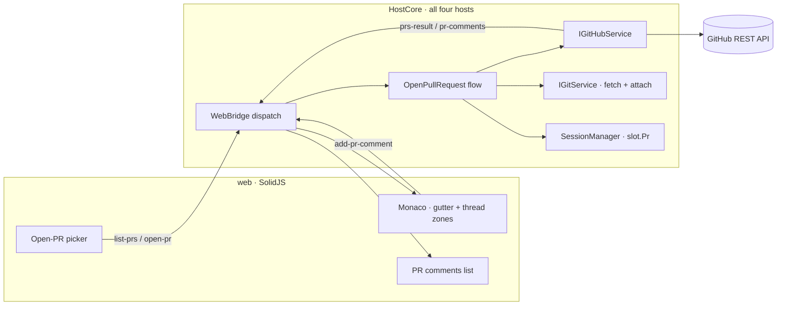
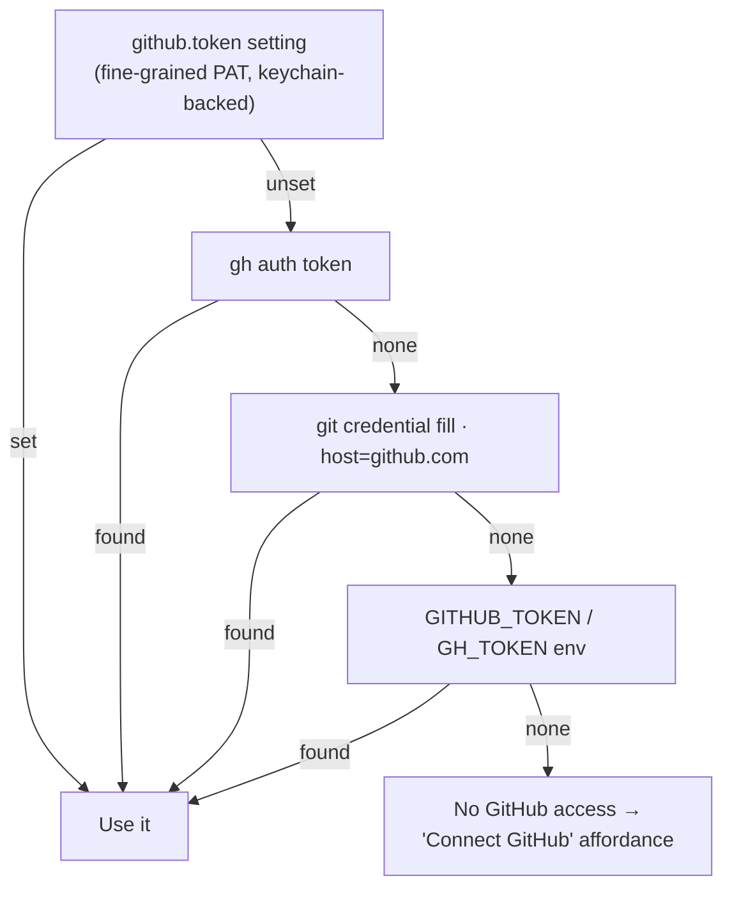
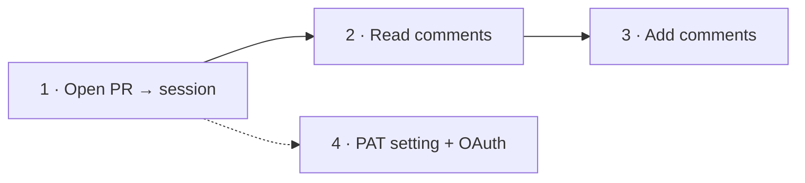

# Open PR

Turn a GitHub pull request into a Weavie session: check out the PR's branch in its own worktree, pull the
PR's review comments into the editor anchored to the lines they're about, and let the user reply to a thread
or leave a new comment without leaving Weavie.

> Status: **design** — no code yet. This spec is the plan; it's built in the phases at the end.

## Why

Reviewing and addressing a PR today means bouncing between the GitHub web UI (to read the conversation) and
the editor (to make the change). Weavie already owns the two halves that matter — a session is a branch on its
own worktree ([multi-session-and-worktrees](multi-session-and-worktrees.md)) and the editor already renders
per-line decorations + view-zone widgets for turn review ([turn-review](turn-review.md)). "Open PR" joins them:
the PR becomes the session, and its comments become first-class editor content the user can read and answer in
place, with Claude already checked out on the branch and primed with the PR's context.

## User journey

1. **Open PR** — `Ctrl/Cmd+Shift+P`-style command *"Open Pull Request…"* opens a picker listing the repo's
   open PRs (number, title, author, branch). Picking one creates (or switches to) a session checked out on the
   PR's head branch, and seeds Claude's first message with the PR title/body/URL.
2. **Read comments** — the session's review comments appear in the editor: a gutter glyph on each commented
   line, and a view-zone thread (author, body, timestamp) under it. A side list groups every comment by file so
   nothing is missed when the file isn't open. Outdated comments (the line moved since) are shown in the list,
   flagged.
3. **Add comments** — from a thread the user can **Reply**; from any line they can **Comment**. The draft posts
   back to GitHub via the API and the thread re-renders with the new comment.

## Architecture

The host owns all GitHub I/O; the web never sees the token and never calls GitHub directly. PR data crosses the
existing web↔host bridge as new message types, exactly like `new-session` / `list-branches` do today
([host-core-unification](host-core-unification.md)).



Why host-side: the token must never reach the renderer (untrusted surface), API calls need no CORS dance, and
every host (Win/Mac/Linux/Headless/Remote) inherits the feature by adding it to `HostCore`, not per-OS.

### GitHub access layer

A new `Weavie.Core.GitHub` namespace, parallel to `Weavie.Core.Git`, behind an interface so the session flow
and the integration harness can run against a fake (the same seam strategy as `IGitService` and the stubbed
`claude`, see [integration-testing-strategy](integration-testing-strategy.md)).

```csharp
public interface IGitHubService {
    Task<GitHubRepo?> ResolveRepoAsync(string repoDir, CancellationToken ct);              // owner/repo from origin
    Task<IReadOnlyList<PullRequestSummary>> ListOpenPullRequestsAsync(GitHubRepo repo, CancellationToken ct);
    Task<PullRequestDetail> GetPullRequestAsync(GitHubRepo repo, int number, CancellationToken ct);
    Task<IReadOnlyList<ReviewComment>> ListReviewCommentsAsync(GitHubRepo repo, int number, CancellationToken ct);
    Task<ReviewComment> AddReviewCommentAsync(GitHubRepo repo, int number, NewReviewComment draft, CancellationToken ct);
    Task<ReviewComment> ReplyToReviewCommentAsync(GitHubRepo repo, int number, long inReplyTo, string body, CancellationToken ct);
}
```

`GitHubService` is `HttpClient`-backed against `https://api.github.com` (a `github.apiBaseUrl` setting, defaulting
there, leaves room for GitHub Enterprise later). Each `ReviewComment` carries what anchoring needs:
`{ id, path, line, side, originalLine, commitId, diffHunk, author, body, createdAt, inReplyTo, isOutdated }`.

**Owner/repo resolution.** `ResolveRepoAsync` reads `git remote get-url origin` (a new `IGitService.GetRemoteUrlAsync`)
and normalizes the GitHub URL forms — `https://github.com/owner/repo(.git)`, `git@github.com:owner/repo.git`,
`ssh://git@github.com/owner/repo.git` — to `(owner, repo)` by taking the last two non-empty path segments and
stripping `.git`. The host enters the PR number from the picker; the user never types owner/repo.

## Authentication

This is the open design question. Weavie runs in two very different contexts — a **desktop app** on a dev's
machine, and a **headless/remote worker** on a server ([remote-sessions](remote-sessions.md)) — and the right
credential source differs between them. The options:

| Source | Setup cost | Works headless? | Secure storage | Notes |
| --- | --- | --- | --- | --- |
| `gh auth token` (GitHub CLI) | none *if installed* | rarely (gh seldom on servers) | gh owns it | correct scopes, zero config on a dev box |
| `git credential fill` (origin) | none *if pushing over HTTPS* | sometimes | OS helper (keychain/manager) | reuses the token the user already pushes with; SSH-only users have none |
| `GITHUB_TOKEN` / `GH_TOKEN` env | trivial | **yes** | none (process env) | standard server provisioning; "buried" as a *primary* desktop path |
| Fine-grained PAT (explicit setting) | manual create + rotate | **yes** | must be keychain, **not** `settings.toml` | minimal scope (PRs RW on chosen repos), expires ≤1y |
| OAuth device flow (Weavie GitHub App) | one click | yes | app-managed, refreshable | best UX; needs a Weavie-owned GitHub App + refresh handling |

### Recommendation — layered, discovery first, explicit override, OAuth later

Resolve the token through one `IGitHubTokenSource` with a clear precedence, so each context gets the right
answer without the user thinking about it:



- **Desktop, zero-config (the common case):** discovery via `gh` → git credential → env reuses auth the dev
  already has. Most users connect nothing.
- **Explicit, philosophy-aligned override:** a first-class `github.token` setting (discoverable, documented —
  per CLAUDE.md, not a buried env var) holding a **fine-grained PAT** scoped to *Pull requests: read/write* on
  the chosen repos. It takes precedence and is the answer when discovery can't work.
- **Headless / remote:** the env fallback is legitimate server credential provisioning here (not a hidden
  desktop toggle), and the `github.token` path also works since the worker can be configured with a secret.
- **Later — OAuth device flow** via a Weavie-owned **GitHub App**: a *"Sign in to GitHub"* button → approve in
  the browser → short-lived, refreshable, fine-grained user-to-server token. Best desktop UX; deferred only
  because it needs Weavie-owned app infrastructure (app registration + refresh-token handling). A GitHub App
  (not an OAuth App) is preferred for per-install fine-grained permissions and no exposed client secret in the
  device flow.

> **Why not OAuth first?** It's the best end state but the only option that needs infrastructure we don't have
> yet (a registered Weavie GitHub App). Discovery + PAT ship value immediately with no backend; the App slots in
> as a higher-precedence source without changing anything downstream.

### Secret-storage requirement (blocks the PAT path)

`settings.toml` is plaintext, so a raw PAT must **never** be written there. The `github.token` setting is
first-class and discoverable, but its *value* lives in the OS secret store — macOS Keychain, Windows Credential
Manager, libsecret on Linux — with the setting holding only a reference. This needs a new "secret" setting kind
(or a keychain-backed store beside `SettingsStore`); it's a prerequisite of the PAT path and is called out as
its own work item. Discovery-only (gh/credential/env) needs none of this and can ship first.

## Phase 1 — Open PR → session on its branch

The tractable, fully-testable core; reuses the existing attach-existing-branch machinery end to end.

**Messages** (added to `HostBoundMessage` / the `Dispatch` switch, mirroring `list-branches` / `new-session`):

- `→ list-prs { id }` ⇒ host replies `prs-result { id, prs: PullRequestSummary[] }`
- `→ open-pr { number, headRef, title }` ⇒ host runs the flow below; failure surfaces as a toast

**Host flow** (`OpenPullRequestAsync`, in `HostCore.Sessions`):

1. `git fetch origin <headRef>` so the PR branch exists locally (new `IGitService.FetchAsync`; validate
   `headRef` with the existing `GitService.IsValidBranchName` before it reaches git).
2. Attach a session on it via the existing `AttachExistingSessionAsync(headRef)` — which already de-dupes to an
   existing session, handles the primary-checkout case, provisions the worktree, and switches.
3. Record the PR on the slot (`SessionSlot.Pr`, see below) and seed Claude's first prompt with the PR
   title + URL + body for context.

**UI.** An `OpenPrPrompt.tsx` modeled on `NewSessionPrompt.tsx`: a typeahead list of open PRs (number · title ·
@author · branch) with the same keyboard-first affordances. Reached by a new web command `weavie.pr.open`
(*"Open Pull Request…"*) with a default keybinding and a palette entry, plus an entry on the session-rail "+"
menu — every action advertises its shortcut, per the keyboard-first rule.

## Phase 2 — Comments in the editor

On switching to a PR session, the host fetches its review comments and pushes them to the web; the web fetches
fresh on file open and after any add.

- **Anchoring.** Each comment carries `(path, line, side, commitId)`. The web renders, per commented line:
  a **gutter glyph** (comment icon) and a **view-zone thread** below the line — reusing the view-zone +
  decoration machinery the inline turn-review already owns (`src/web/src/editor/inline-diff.ts`), not a second
  rendering path. Threads collapse to the glyph; clicking expands.
- **Out-of-view + outdated.** A **PR comments panel** lists every thread grouped by file (clickable → reveal
  `file:line`, the existing `reveal-file` message), so comments on unopened files are visible. Comments whose
  line has moved since their `commitId` (`isOutdated`) render in the panel, flagged, rather than mis-anchored in
  the gutter.
- **Untrusted content.** Comment bodies are external user input — sanitized through the existing `dompurify`
  path before rendering, like any markdown the app shows.

`→ pr-comments-request { number }` ⇒ `pr-comments { number, comments: ReviewComment[] }`.

## Phase 3 — Adding comments

- **Reply** in a thread → `add-pr-comment { number, inReplyTo, body }` → `ReplyToReviewCommentAsync`.
- **New comment** on a line → `add-pr-comment { number, path, line, side, body }` → `AddReviewCommentAsync`
  (the host supplies `commitId` from the PR head). On success the host re-pushes that PR's comments so the
  thread re-renders; failure toasts and keeps the draft.
- A composer (small editor input) is the view-zone widget's expanded state; **Comment (Ctrl+Enter)** posts,
  Esc cancels — shortcut advertised on the button.

## Session ↔ PR association

`SessionSlot` gains an optional `PullRequestRef Pr { number, title, url, headRef }`. It's:

- shown on the rail chip (a small PR badge + number) so a PR session is recognizable;
- persisted alongside the worktree/rail state so reopening Weavie restores the association and re-fetches
  comments;
- the key the comment messages use to know *which* PR the active session is reviewing.

## Testing

Per [integration-testing-strategy](integration-testing-strategy.md), stub GitHub at the service seam: a
`FakeGitHubService` returns canned PRs and comments so a full journey (picker → open-pr → fetch → branch
checkout → comment render → add) is deterministic and never touches the network — the GitHub analogue of the
stubbed `claude`. Pure units cover URL→`(owner,repo)` normalization and the token-source precedence. The
`npm run capture` recording drives the picker and the comment thread against the fake.

## Security

- Token stays host-side; never logged, never crosses the bridge to the web.
- Web-supplied `headRef` / branch names pass `GitService.IsValidBranchName` before reaching `git` (no
  option/ref smuggling), matching the existing trust boundary.
- `fetch` uses an explicit `origin <ref>` refspec, never web-supplied raw refspecs.
- Comment bodies (external) are sanitized before render.
- PAT scope guidance: fine-grained, *Pull requests: read/write* on the selected repos only.

## Phasing

1. **GitHub access + auth discovery + Open-PR → session.** `IGitHubService` (list/get PRs, repo resolve),
   token discovery (gh → credential → env), `FetchAsync`, the `open-pr` flow, the picker, the command. No secret
   store needed. ← the first PR.
2. **Comments in the editor.** `ListReviewCommentsAsync`, the gutter/thread rendering, the PR panel, the
   slot↔PR association + persistence.
3. **Adding comments.** `AddReviewCommentAsync` / replies, the composer.
4. **Explicit `github.token` setting** (needs the secret-store work item) and, later, **OAuth device flow**
   via a Weavie GitHub App.


## Open questions

- **Secret storage** — build a keychain-backed secret setting kind, or keep the PAT entirely outside settings
  with only a keychain reference? (Prerequisite of the PAT path.)
- **OAuth** — is a Weavie-owned GitHub App in scope, and who operates the device-flow token exchange/refresh?
- **Comment scope** — inline *review* comments only at first, or also PR-level *issue* comments (the general
  conversation)? This spec covers review comments; issue comments are a small additive follow-up.
- **Push/refresh** — poll the PR for new comments while a session is open, or refresh only on focus/manual? (The
  remote-session webhook plumbing could feed this later.)
