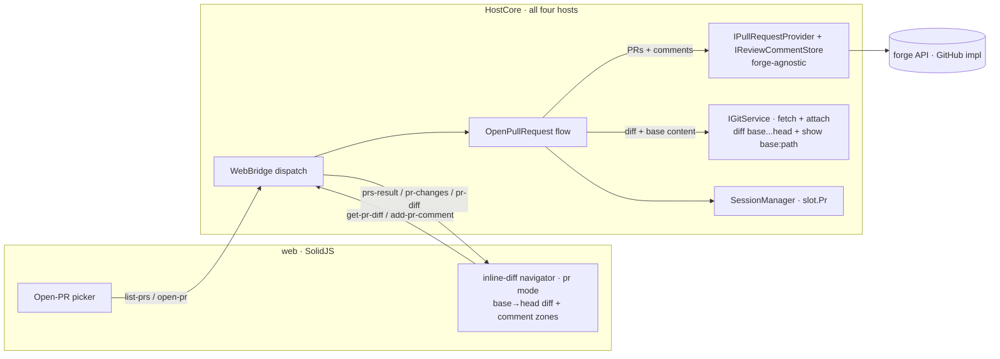
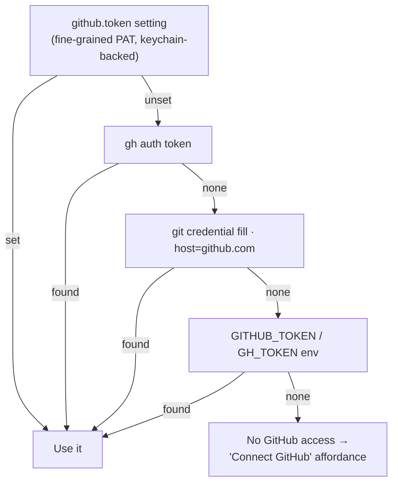
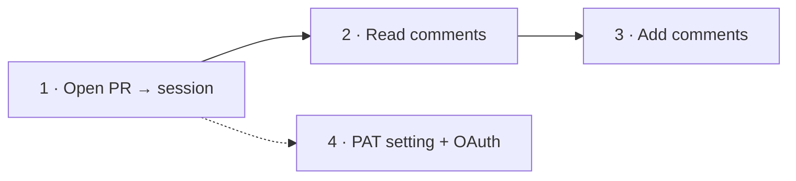

# Open PR

Turn a GitHub pull request into a Weavie session: check out the PR's branch in its own worktree, pull the
PR's review comments into the editor anchored to the lines they're about, and let the user reply to a thread
or leave a new comment without leaving Weavie.

> Status: **design** — no code yet. This spec is the plan; it's built in the phases at the end.

## Why

Reviewing and addressing a PR today means bouncing between the GitHub web UI (to read the conversation) and
the editor (to make the change). Weavie already owns the two halves that matter — a session is a branch on its
own worktree ([multi-session-and-worktrees](multi-session-and-worktrees.md)), and the editor already has a
**diff-review surface**: the post-turn inline-diff navigator that walks a change set hunk-by-hunk and
file-by-file, with a floating toolbar, position label, and per-hunk actions ([turn-review](turn-review.md)).
"Open PR" joins them: the PR becomes the session, **its `base…head` diff is shown in that exact same review
surface** — the same one you get when Claude ends a turn — and the PR's comments anchor onto that diff where
they belong, answerable in place, with Claude already checked out on the branch and primed with the PR's context.

## User journey

1. **Open PR** — `Ctrl/Cmd+Shift+P`-style command *"Open Pull Request…"* opens a picker listing the repo's
   open PRs (number, title, author, branch). Picking one creates (or switches to) a session checked out on the
   PR's head branch, and seeds Claude's first message with the PR title/body/URL.
2. **Read comments** — the session's review comments appear in the editor: a gutter glyph on each commented
   line, and a view-zone thread (author, body, timestamp) under it. A side list groups every comment by file so
   nothing is missed when the file isn't open. Outdated comments (the line moved since) are shown in the list,
   flagged.
3. **Add comments** — from a thread the user can **Reply**; from any line they can **Comment**. The draft posts
   back to GitHub via the API and the thread re-renders with the new comment.

## Architecture

The host owns all GitHub I/O; the web never sees the token and never calls GitHub directly. PR data crosses the
existing web↔host bridge as new message types, exactly like `new-session` / `list-branches` do today
([host-core-unification](host-core-unification.md)).



Why host-side: the token must never reach the renderer (untrusted surface), API calls need no CORS dance, and
every host (Win/Mac/Linux/Headless/Remote) inherits the feature by adding it to `HostCore`, not per-OS.

### Two seams: git for the diff, a forge-agnostic provider for PRs + comments

The work splits cleanly along what each piece actually needs:

- **The diff is git, not GitHub.** A PR's `base…head` diff is a local operation once both refs are fetched —
  no API call. It belongs on `IGitService` alongside the existing worktree operations, so it's the *same* diff
  machinery for any branch comparison (a fork's branch, a local topic branch, a PR), not a PR-only path.
- **PRs and comments are forge operations, behind a forge-agnostic interface.** Listing PRs and
  loading/adding comments do need a remote API — but the host shouldn't know it's *GitHub*. The seam is a
  provider-agnostic interface; **GitHub is one implementation**, so GitLab/Bitbucket/Gitea slot in later
  without touching the session flow or the editor. This is the same seam strategy as `IGitService` and the
  stubbed `claude` ([integration-testing-strategy](integration-testing-strategy.md)) — the integration harness
  runs against a fake provider.

**`IGitService` additions** (`Weavie.Core.Git`):

```csharp
Task FetchAsync(string repoDir, string remote, string refName, CancellationToken ct);                 // git fetch origin <ref>
Task<IReadOnlyList<DiffFile>> DiffRefsAsync(string repoDir, string baseRef, string headRef, CancellationToken ct); // base...head, name + ±counts
Task<string> ShowFileAtRefAsync(string repoDir, string refName, string path, CancellationToken ct);   // git show <ref>:<path> — the diff baseline
Task<string?> GetRemoteUrlAsync(string repoDir, string remote, CancellationToken ct);                 // remote URL → forge + repo selection
```

`DiffRefsAsync` feeds the `←`/`→` file axis (`pr-changes`); `ShowFileAtRefAsync` supplies each file's diff
**baseline** (current comes from the worktree on disk). Three-dot `base...head` diffs against the merge-base,
so it's exactly what GitHub shows.

**Forge-agnostic review provider** (`Weavie.Core.Review`, parallel to `Weavie.Core.Git`):

```csharp
public interface IPullRequestProvider {                       // discover + list PRs for a repo
    Task<IReadOnlyList<PullRequestSummary>> ListOpenAsync(RepoRef repo, CancellationToken ct);
    Task<PullRequestDetail> GetAsync(RepoRef repo, int number, CancellationToken ct);
}

public interface IReviewCommentStore {                        // load / add / reply — the "similar interface for comments"
    Task<IReadOnlyList<ReviewComment>> ListAsync(RepoRef repo, int number, CancellationToken ct);
    Task<ReviewComment> AddAsync(RepoRef repo, int number, NewReviewComment draft, CancellationToken ct);
    Task<ReviewComment> ReplyAsync(RepoRef repo, int number, long inReplyTo, string body, CancellationToken ct);
}
```

The DTOs are forge-neutral. `ReviewComment` carries what anchoring needs:
`{ id, path, line, side, originalLine, commitId, diffHunk, author, body, createdAt, inReplyTo, isOutdated }`.
`RepoRef { host, owner, name }` is derived from the remote URL.

**GitHub is the implementation.** `GitHubReviewProvider` (implementing both interfaces) is `HttpClient`-backed
against `https://api.github.com` (a `github.apiBaseUrl` setting leaves room for GitHub Enterprise). **Auth is
its concern, not the interface's** (see below). Which implementation the host constructs is chosen from the
remote URL: `GetRemoteUrlAsync` is normalized — `https://github.com/owner/repo(.git)`,
`git@github.com:owner/repo.git`, `ssh://git@host/owner/repo.git` — to `RepoRef` by taking the last two
non-empty path segments (stripping `.git`); the `host` selects the provider. The user never types owner/repo.

## Authentication

Auth is the **GitHub implementation's** concern — the provider interfaces are credential-agnostic, and another
forge's implementation would bring its own. This is the open design question for the GitHub one. Weavie runs in two very different contexts — a **desktop app** on a dev's
machine, and a **headless/remote worker** on a server ([remote-sessions](remote-sessions.md)) — and the right
credential source differs between them. The options:

| Source | Setup cost | Works headless? | Secure storage | Notes |
| --- | --- | --- | --- | --- |
| `gh auth token` (GitHub CLI) | none *if installed* | rarely (gh seldom on servers) | gh owns it | correct scopes, zero config on a dev box |
| `git credential fill` (origin) | none *if pushing over HTTPS* | sometimes | OS helper (keychain/manager) | reuses the token the user already pushes with; SSH-only users have none |
| `GITHUB_TOKEN` / `GH_TOKEN` env | trivial | **yes** | none (process env) | standard server provisioning; "buried" as a *primary* desktop path |
| Fine-grained PAT (explicit setting) | manual create + rotate | **yes** | must be keychain, **not** `settings.toml` | minimal scope (PRs RW on chosen repos), expires ≤1y |
| OAuth device flow (Weavie GitHub App) | one click | yes | app-managed, refreshable | best UX; needs a Weavie-owned GitHub App + refresh handling |

### Recommendation — layered, discovery first, explicit override, OAuth later

Resolve the token through one `IGitHubTokenSource` with a clear precedence, so each context gets the right
answer without the user thinking about it:



- **Desktop, zero-config (the common case):** discovery via `gh` → git credential → env reuses auth the dev
  already has. Most users connect nothing.
- **Explicit, philosophy-aligned override:** a first-class `github.token` setting (discoverable, documented —
  per CLAUDE.md, not a buried env var) holding a **fine-grained PAT** scoped to *Pull requests: read/write* on
  the chosen repos. It takes precedence and is the answer when discovery can't work.
- **Headless / remote:** the env fallback is legitimate server credential provisioning here (not a hidden
  desktop toggle), and the `github.token` path also works since the worker can be configured with a secret.
- **Later — OAuth device flow** via a Weavie-owned **GitHub App**: a *"Sign in to GitHub"* button → approve in
  the browser → short-lived, refreshable, fine-grained user-to-server token. Best desktop UX; deferred only
  because it needs Weavie-owned app infrastructure (app registration + refresh-token handling). A GitHub App
  (not an OAuth App) is preferred for per-install fine-grained permissions and no exposed client secret in the
  device flow.

> **Why not OAuth first?** It's the best end state but the only option that needs infrastructure we don't have
> yet (a registered Weavie GitHub App). Discovery + PAT ship value immediately with no backend; the App slots in
> as a higher-precedence source without changing anything downstream.

### Secret-storage requirement (blocks the PAT path)

`settings.toml` is plaintext, so a raw PAT must **never** be written there. The `github.token` setting is
first-class and discoverable, but its *value* lives in the OS secret store — macOS Keychain, Windows Credential
Manager, libsecret on Linux — with the setting holding only a reference. This needs a new "secret" setting kind
(or a keychain-backed store beside `SettingsStore`); it's a prerequisite of the PAT path and is called out as
its own work item. Discovery-only (gh/credential/env) needs none of this and can ship first.

## Phase 1 — Open PR → session on its branch

The tractable, fully-testable core; reuses the existing attach-existing-branch machinery end to end.

**Messages** (added to `HostBoundMessage` / the `Dispatch` switch, mirroring `list-branches` / `new-session`):

- `→ list-prs { id }` ⇒ host replies `prs-result { id, prs: PullRequestSummary[] }`
- `→ open-pr { number, headRef, title }` ⇒ host runs the flow below; failure surfaces as a toast

**Host flow** (`OpenPullRequestAsync`, in `HostCore.Sessions`):

1. `git fetch origin <headRef>` so the PR branch exists locally (new `IGitService.FetchAsync`; validate
   `headRef` with the existing `GitService.IsValidBranchName` before it reaches git).
2. Attach a session on it via the existing `AttachExistingSessionAsync(headRef)` — which already de-dupes to an
   existing session, handles the primary-checkout case, provisions the worktree, and switches.
3. Record the PR on the slot (`SessionSlot.Pr`, see below) and seed Claude's first prompt with the PR
   title + URL + body for context.

**UI.** An `OpenPrPrompt.tsx` modeled on `NewSessionPrompt.tsx`: a typeahead list of open PRs (number · title ·
@author · branch) with the same keyboard-first affordances. Reached by a new web command `weavie.pr.open`
(*"Open Pull Request…"*) with a default keybinding and a palette entry, plus an entry on the session-rail "+"
menu — every action advertises its shortcut, per the keyboard-first rule.

## Phase 2 — The PR diff in the post-turn review surface

A PR *is* a diff — `base…head` — so it renders in the **same inline-diff navigator the post-turn review uses**
([turn-review](turn-review.md)), not a second viewer. Switching to a PR session arms that surface fed with the
PR's diff; you walk it with the same chords (`↑`/`↓` hunks, `←`/`→` files), the same floating toolbar, and the
same `file i/N · change j/M` label. The comments anchor onto the hunks, and the per-hunk action is repurposed
from Keep/Revert to **Comment/Reply**.

### Feeding the PR diff into the existing renderer

The renderer already takes a `(baseline, current)` pair per file and computes hunk geometry with VSCode's
differ — that's what `turn-diff` carries today. The PR maps straight onto it:

- **baseline** = the file at the PR's merge-base (`git show <base>:<path>`, supplied by Core).
- **current** = the file on disk in the worktree (the PR head — and, naturally, any edits made since, so a fix
  the user/Claude just made shows as a further change over the PR).

So Phase 2 adds a **`pr` mode** to `inline-diff.ts` beside the existing `applied` / `review` / `view` modes,
reusing all of the navigation, labeling, and decoration code. It does **not** reuse the *turn-review state
machine* (the keep/revert baseline-advance is for your own working-tree edits, not for an already-committed
PR) — instead a parallel, simpler message set feeds the same UI:

- `→ pr-changes-request { number }` ⇒ `pr-changes { number, files: [{ path, name, added, removed }] }` — the
  file axis (the `←`/`→` walk), the PR analogue of `turn-changes`.
- `→ get-pr-diff { number, path }` ⇒ `pr-diff { number, path, baseline, current, comments: ReviewComment[] }` —
  one file's base→head pair plus the review comments anchored in it, the PR analogue of `turn-diff`.

The host builds these by composition: `pr-changes` from `IGitService.DiffRefsAsync(base, head)`, and each
`pr-diff` from `ShowFileAtRefAsync(base, path)` (baseline) + the worktree file (current) + `IReviewCommentStore.ListAsync`
(comments). The diff is pure git; only the comments touch the forge.

### Comments anchored on the diff

Each `ReviewComment` carries `(path, line, side, commitId, diffHunk)`. Within the file's diff the web renders
each thread as a **view-zone under its line** — the same view-zone mechanism the faded "accepted" band and
ghost-deletions already use — showing author, body, timestamp, collapsible to a gutter glyph. Because comments
ride the diff they sit exactly on the hunk they're about.

- **Outdated comments** (the line moved since the comment's `commitId`) can't be placed on the current diff, so
  they surface in the navigator's file label / a thread list for that file, flagged — never mis-anchored.
- **Untrusted content.** Comment bodies are external user input — sanitized through the existing `dompurify`
  path before rendering, like any markdown the app shows.

## Phase 3 — Adding comments

- **Reply** in a thread → `add-pr-comment { number, inReplyTo, body }` → `IReviewCommentStore.ReplyAsync`.
- **New comment** on the current hunk/line → `add-pr-comment { number, path, line, side, body }` →
  `IReviewCommentStore.AddAsync` (the host supplies `commitId` from the PR head). On success the host re-pushes that
  file's `pr-diff` so the thread re-renders; failure toasts and keeps the draft.
- The composer (a small editor input) is a view-zone, opened either from a thread's **Reply** or as the diff
  navigator's repurposed per-hunk action — where post-turn review shows **Keep**, PR mode shows **Comment**
  (`$mod+Enter`), reusing the toolbar's existing action slot and scope label. **Comment (`$mod+Enter`)** posts,
  Esc cancels — shortcut read from the command catalog and advertised on the button, per the keyboard-first rule.

## Session ↔ PR association

`SessionSlot` gains an optional `PullRequestRef Pr { number, title, url, headRef }`. It's:

- shown on the rail chip (a small PR badge + number) so a PR session is recognizable;
- persisted alongside the worktree/rail state so reopening Weavie restores the association and re-fetches
  comments;
- the key the comment messages use to know *which* PR the active session is reviewing.

## Testing

Per [integration-testing-strategy](integration-testing-strategy.md), stub the forge at the provider seam: a
`FakeReviewProvider` (implementing `IPullRequestProvider` + `IReviewCommentStore`) returns canned PRs and
comments so a full journey (picker → open-pr → fetch → branch checkout → diff render → comment → add) is
deterministic and never touches the network — the forge analogue of the stubbed `claude`. The diff half needs
no stub: `DiffRefsAsync` / `ShowFileAtRefAsync` run against a real throwaway git repo, like the existing
worktree tests. Pure units cover URL→`RepoRef` normalization and the token-source precedence. The
`npm run capture` recording drives the picker and the comment thread against the fake provider.

## Security

- Token stays host-side; never logged, never crosses the bridge to the web.
- Web-supplied `headRef` / branch names pass `GitService.IsValidBranchName` before reaching `git` (no
  option/ref smuggling), matching the existing trust boundary.
- `fetch` uses an explicit `origin <ref>` refspec, never web-supplied raw refspecs.
- Comment bodies (external) are sanitized before render.
- PAT scope guidance: fine-grained, *Pull requests: read/write* on the selected repos only.

## Phasing

1. **Provider + git diff + Open-PR → session.** `IPullRequestProvider` (list/get PRs) with the `GitHubReviewProvider`
   impl + repo selection from the remote URL, `IGitService.FetchAsync`/`DiffRefsAsync`/`ShowFileAtRefAsync`,
   auth discovery (gh → credential → env), the `open-pr` flow, the picker, the command. No secret store needed.
   ← the first PR.
2. **The PR diff in the review surface.** A `pr` mode in `inline-diff.ts` fed the `base…head` diff
   (`pr-changes` / `pr-diff` from `DiffRefsAsync` + `ShowFileAtRefAsync`), `IReviewCommentStore.ListAsync` with
   the comments anchored as view-zones on the hunks, the slot↔PR association + persistence.
3. **Adding comments.** `IReviewCommentStore.AddAsync` / `ReplyAsync`, the composer.
4. **Explicit `github.token` setting** (needs the secret-store work item) and, later, **OAuth device flow**
   via a Weavie GitHub App.


## Open questions

- **Secret storage** — build a keychain-backed secret setting kind, or keep the PAT entirely outside settings
  with only a keychain reference? (Prerequisite of the PAT path.)
- **OAuth** — is a Weavie-owned GitHub App in scope, and who operates the device-flow token exchange/refresh?
- **Comment scope** — inline *review* comments only at first, or also PR-level *issue* comments (the general
  conversation)? This spec covers review comments; issue comments are a small additive follow-up.
- **Push/refresh** — poll the PR for new comments while a session is open, or refresh only on focus/manual? (The
  remote-session webhook plumbing could feed this later.)
