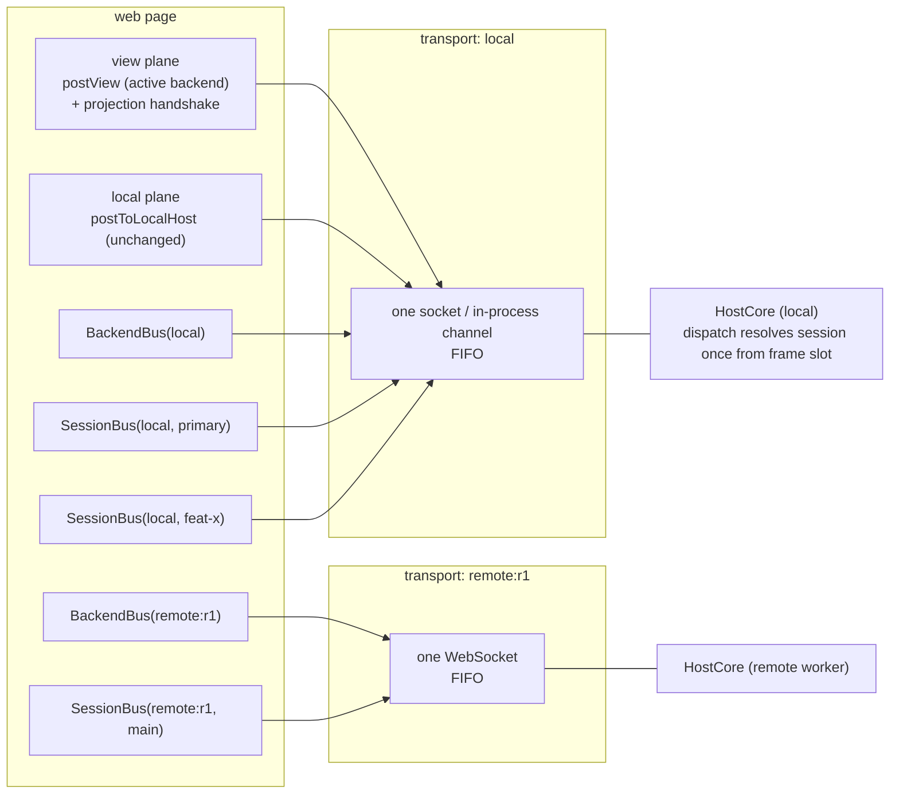
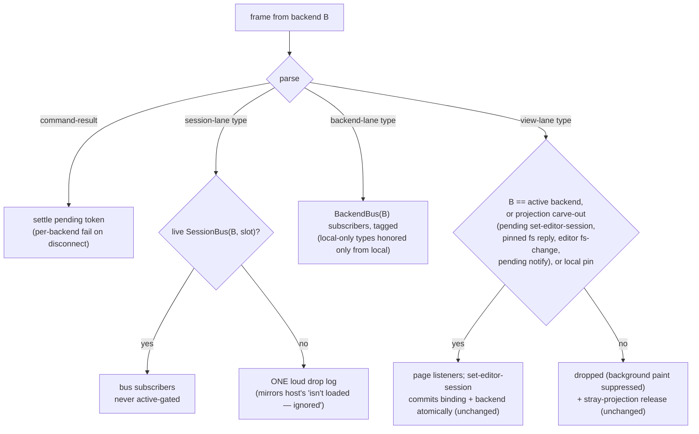
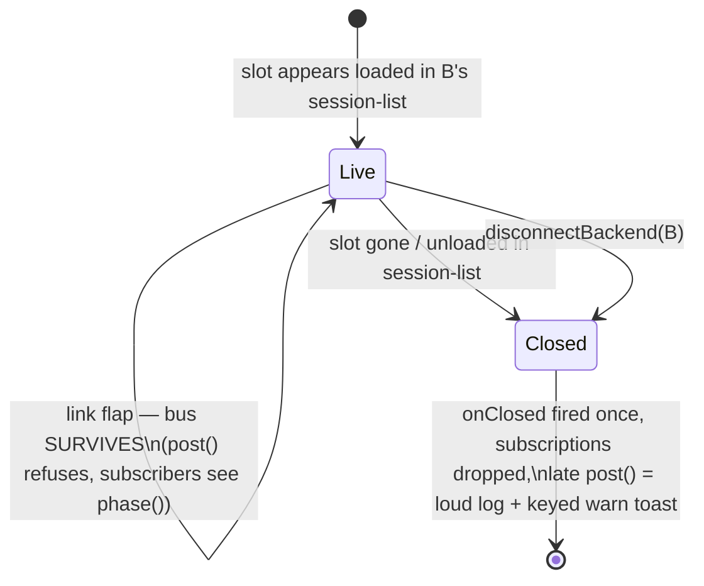

# Owned-channel bridge

The systemic fix for the bridge's ambient-addressing bug class: every web↔host frame with an owner
travels on a bus object that *is* its address, and ambient ("active backend" / "mounted session")
addressing survives only as an explicit, small view plane.

## Problem

The web↔host protocol has no single addressing rule. The default web sender (`postToHost`) resolves
"the active backend" at send time; the host resolves many verbs against "the mounted session"
(`_session`) at dispatch time. Both encode a single-backend, single-session assumption that
multi-session and multi-backend broke: "active == owner" fails in every switch and link-flap window.

Every incident in this class is that one root cause:

- `term-input` buffered in the reconnect outbox and replayed as stale keystrokes.
- `switch-session` buffered and replayed as stale navigation (PR #440).
- LSP frames posted to the active backend instead of the slot's owner, leaking the owning host's
  language server (PR #444).
- Inbound `lsp-data`/`lsp-exit` gated to the active backend, dropping a handoff-window reply.
- `agent-approval`/`agent-input` posting ambient from the legacy pane while the structured composer
  posts the identical verbs addressed — an Allow click can land on a backend that never heard of the
  slot.
- The review verbs (`keep-hunk`, `reject-hunk`, `keep-file`, `revert-file`, `undo-turn`) deferring
  across an async save-flush or confirm dialog, then posting ambient and resolving host-side against
  the mounted session — a switch committing inside the await applies a disk-mutating review action to
  the wrong session. `accept-turn`/`undo-turn` carry no identity at all.

### Census of the current state

Five send primitives coexist: `postToHost` (ambient), `postToBackend` (addressed),
`postToEditorBackend` (editor-owner), `postToEditorBinding` (immutable capture), `postToLocalHost`
(fixed local). 54 ambient call sites, ~28 of them owned traffic; 5 of those defer across an await
before posting. Host dispatch has 66 verbs: ~22 resolve against the implicit active session, ~13 by
slot, the rest genuinely global, path-routed, or projection-stamped. Host→web pushes carry no backend
identity (the receiving transport assigns it — sound, one HostCore per backend); slot-stamping varies
by feature: `session-attention` is slot-stamped and un-gated while `session-status` is slot-less and
active-gated. The inbound web demux is an accreted pile of carve-outs (active gate, a 16-type
cross-backend whitelist, a 5-type local-only whitelist, per-request fs pinning, editor-owner
`fs-change`, pending-backend `notify` and `set-editor-session` exceptions). `command-ack` rides
ambient and is safe only because inbound `run-command` happens to be active-gated. Terminals thread
each session's own backend through props while the structured agent pane threads `activeBackendId()`
— an equivalence that holds only by an unenforced invariant.

The recurrence is mechanical: the ambient primitive is the shortest code, features are built and
tested single-backend where active == owner always holds, and the invariant only breaks inside
switch/flap windows nothing exercises locally.

## Design

Three planes over the existing one-physical-connection-per-backend transport. Buses are logical;
there is no per-session socket.

- **Owned plane** — bus objects. A `BackendBus` per backend (backend-scoped, session-less control
  traffic) and a `SessionBus` per `(backendId, slot)` (everything a session owns). Holding the bus is
  the address: components receive the bus instead of loose `(backendId, slot)` pairs, the bus stamps
  identity outbound, and inbound owned frames are delivered only through their bus. Owned traffic
  flows both directions at all times, active or not — the old cross-backend whitelist exception
  becomes the rule.
- **View plane** — the explicit ambient remainder: page bootstrap (`ready`, `acquire-editor`,
  `monaco-ready`, `log`), the atomic editor-projection handshake (unchanged; see
  [editor-projection.md](editor-projection.md)), and genuinely "act on what I'm looking at" verbs.
- **Local plane** — `postToLocalHost` for machine-scoped concerns (clipboard, window, persisted
  prefs). Already correct; unchanged.

The owner-capture precedent is `openLspChannel` (PR #444): capture the owning backend at creation,
route everything there for life, check *that* link's phase. The bus generalizes it, and LSP becomes
one consumer.

### Bus topology



Buses of one backend share its socket, so outbound order across that backend's buses and its view
traffic is the socket's FIFO — `flushEditorSession` before `switch-session` keeps working.

### Inbound demux (web)

One demux at the transport boundary, synchronous, in arrival order, no per-lane queues:



`session-list` is ingested by the bus registry inside the demux, before fan-out, so a bus exists
before any frame that could name it — the host's `ready` replay pushes `session-list` before
terminal/agent resync, and the socket is FIFO.

### Bus lifecycle



- **Creation**: *loaded in `session-list`*, not merely present — nothing owned may flow to an
  unloaded session (the host would reject it). `BackendBus` lives exactly as long as the backend
  entry (`connectBackend`/local init → `disconnectBackend`).
- **Flap**: identity is `(backendId, slot)` and the session survives host-side, so the bus survives
  — what lets the warm LSP pool and xterm buffers persist across reconnects
  ([warm-lsp-across-switch.md](warm-lsp-across-switch.md)).
- **Teardown**: `onClosed(reason)` fires once. The LSP pool treats it as an exit and tears its client
  down, replacing `pruneUnloaded`'s session-list scanning. UI components derive from the rail and
  unmount first; an async straggler (a `keep-hunk` completing its flush after an unload) hits the
  closed-post backstop: loud log plus a keyed warn toast ("Session X was unloaded before the action
  applied") — the host's "isn't loaded — ignored" mirrored at the surface that meets the user.
- **Inbound is never buffered by a bus.** Late consumers re-pull through their existing protocols
  (`term-ready` → resync, agent replay, `get-turn-diff`). The host-side `SessionEditorChannel`
  remains the only hold-and-replay gate; it is view-plane (single editor surface), which is why it
  stays host-side.

### Offline policy

`post` on a bus whose **owning** link is not `online` refuses — returns `false`, logs loudly, never
buffers into the outbox. Surfaces disable/overlay off `bus.phase()` (not `activeBackendPhase()`);
chips and the switch pre-check keep their existing treatment. This deletes `dropWhileOffline` (its
two hardcoded types become the universal owned-plane rule) and closes the outbox-replay class at the
root: an owned frame either sends now or visibly fails now.

The one deliberate exception is explicit instead of transport-buried: `postReliable` for the acked
agent-input protocol (`agent-submit`, `agent-attachment-upload/remove`) — tracked until the
correlated `agent-*-state` ack, replayed on the owner's reconnect. `ReliableAgentFrames` moves from
`WebSocketTransport` (which JSON-sniffs every frame today) into `SessionBus`; the transport goes back
to dumb ordered bytes. Wire semantics unchanged.

## API sketches

### TypeScript (`src/web/src/bridge/bus.ts`)

Owned payload types lose their `slot` field — the bus stamps it. That, plus shrinking the ambient
sender's union, makes ambient sends of owned types unrepresentable:

```ts
/** Payloads a SessionBus can send; no slot/backendId fields — the bus stamps them. */
export type SessionOutbound =
  | { type: "term-input"; session: TermSession; dataB64: string }
  | { type: "term-ready"; session: TermSession; cols: number; rows: number }
  /* term-resize, term-cwd, term-paste-image, agent-interrupt, agent-set-control,
     agent-approval, agent-input, lsp-start, lsp-data, lsp-stop,
     accept-turn, undo-turn, review-undo, review-redo, keep-hunk, unkeep-hunk,
     reject-hunk, keep-file, revert-file, get-turn-diff, diff-against,
     new-scratch, save-scratch-as, save-scratch-named, discard-scratch, diff-resolved */;

export type SessionReliableOutbound =
  | { type: "agent-submit"; id: string; prompt: string; attachmentIds: string[]; skills: string[] }
  | { type: "agent-attachment-upload"; id: string; mime: string; dataB64: string }
  | { type: "agent-attachment-remove"; id: string };

/** Inbound frames owned by a session (slot-stamped on the wire). */
export type SessionInbound =
  | { type: "term-output"; session: TermSession; dataB64: string; replay?: boolean }
  /* term-exit, term-reset, agent-pane, agent-pane-batch, agent-pane-reset, agent-controls,
     agent-attachment-state, agent-submission-state, session-attention,
     pull-request-status, session-status (v2), lsp-data, lsp-exit */;

export type BusClosedReason = "unloaded" | "backend-removed";

export interface SessionBus {
  readonly backendId: string;
  readonly slot: string;
  /** Stamps slot, sends on the owner's transport. False = refused (offline/closed), already logged. */
  post(message: SessionOutbound): boolean;
  /** Tracked until its state ack, replayed on the owner's reconnect (the agent-input protocol). */
  postReliable(message: SessionReliableOutbound): void;
  on<T extends SessionInbound["type"]>(
    type: T,
    handler: (msg: Extract<SessionInbound, { type: T }>) => void,
  ): () => void;
  /** The OWNING link's live phase (reactive) — the offline overlay/disable source of truth. */
  phase(): BackendPhase;
  onClosed(handler: (reason: BusClosedReason) => void): () => void;
  readonly closed: boolean;
}

export interface BackendBus {
  readonly backendId: string;
  post(message: BackendOutbound): boolean; // switch-session, new-session, open-pr, layout-changed, lsp-reset, …
  request(message: BackendRequestOutbound): Promise<CommandResult>; // invoke-command; absorbs failPendingForBackend
  on<T extends BackendInbound["type"]>(type: T, handler: (msg: Extract<BackendInbound, { type: T }>) => void): () => void;
  phase(): BackendPhase;
  onClosed(handler: () => void): () => void;
}

/** Live bus lookup (reactive): null when the slot isn't loaded on a connected backend. */
export function sessionBus(backendId: string, slot: string): SessionBus | null;
export function backendBus(backendId: string): BackendBus | null;
/** The bus for the committed editor binding (projection railSessionId); null for legacy bindings. */
export function boundSessionBus(binding: EditorBinding): SessionBus | null;
```

**Acquisition**: the registry mints buses from `session-list` ingestion; components receive the bus
as a prop/argument resolved once at their creation seam — `TerminalView` takes `bus` instead of
`backendId` + `slot` (the mount-capture pattern made structural), likewise the composer stores,
`AgentPaneActions`, and `paste-image`. Not Solid context (buses cross non-JSX modules like the LSP
pool); not a field on `RailSession` (snapshot rows recreated per memo keep plain ids for rendering —
the click path resolves `sessionBus(...)` at the action). `session-store` re-derives its `byBackend`
map from the registry so `session-list` has one ingestion point.

The ambient sender shrinks:

```ts
/** View-plane only: bootstrap, projection handshake, look-at verbs. Owned types are not in this union. */
export function postView(message: ViewOutbound): void; // replaces postToHost
```

`postToHost` is deleted. `postToBackend` stops being exported (internal to the bus module and the
projection/fs machinery). `postToEditorBackend` / `postToEditorBinding` / the per-request
`editorRequestBackends` pinning are already owner-correct and stay, typed to the editor/fs sub-union.

### C# (`src/Weavie.Hosting`)

Dispatch resolves identity once at the top, then hands a `HostSession` down; handlers stop reading
`_session`:

```csharp
private enum MessagePlane { Session, Backend, View }
private static MessagePlane PlaneOf(string type) { /* one table — the C# mirror of the lane tables */ }

private void Dispatch(string type, JsonElement root, string json) {
	switch (PlaneOf(type)) {
		case MessagePlane.Session:
			// Slot present: exact resolution (unloaded slot = logged drop, today's SessionForSlot).
			// Slot absent: legacy page — resolve the active session (version-compat lane, not a fallback).
			if (SessionForSlot(root) is { } session) { DispatchSession(type, root, session); }
			break;
		case MessagePlane.Backend: DispatchBackend(type, root); break;
		case MessagePlane.View: DispatchView(type, root, json); break;
	}
}

// Handlers gain the resolved session as a required parameter (WV0001-clean):
private void AcceptTurn(HostSession session);
private void RejectHunk(HostSession session, JsonElement root);
```

Review-verb pushes route through the existing projection fence
(`DispatchEditorProjection(session, () => PushTurnChangesToWeb(session))`), so a review verb applied
to a non-mounted session mutates durable state but paints nothing — the invariant
[editor-projection.md](editor-projection.md) already states.

Outbound host additions: `session-status` gains `slot` and is pushed per session, un-gated (the web
footer selects by the committed binding); `host-info` gains `bridgeProtocol`.

## Verb classification

### Outbound (web → host)

| Message | Today | Target | Host resolution |
|---|---|---|---|
| `ready`, `monaco-ready`, `log` | ambient | **View** (bootstrap, per-transport hello) | unchanged |
| `acquire-editor`, `editor-projection-mounted`, `release-editor`, `active-editor-changed`, `open-editors-changed`, `editor-session-changed` | explicit target / binding-stamped | **Projection handshake** (view plane; unchanged) | unchanged |
| `fs-stat` / `fs-read` / `fs-write` | per-request backend capture | **Editor/fs** (unchanged; path-routed host-side) | unchanged |
| `reveal-file`, `list-dir`, `request-file-index`, `find-in-files`, `open-target` | ambient | **View** — navigation/queries of the visible surface; replies token- or path-correlated, re-issued on switch; misroute cost is a stray tab, never a state mutation | stays `_session` |
| `window-control`, `window-resize`, `menu-action`, `clipboard-*`, `open-url`, `add/remove-remote-agent`, `set-last-location`, `set-promoted`, `set-search-options`, `add-search-term`, `set-agent-default` | local | **Local** (unchanged; `Welcome.tsx`'s `menu-action` migrates off `postToHost`) | unchanged |
| `switch-session`, `new-session`, `open-pr`, `resolve-pr`, `list-prs`, `list-branches`, `list-refs`, `layout-changed`, `lsp-reset` | explicit `postToBackend` | **BackendBus** | unchanged |
| `invoke-command` | explicit `postToBackend` + token | **BackendBus.request** (absorbs `failPendingForBackend`) | unchanged |
| `command-ack` | **ambient** (safe only via the inbound active gate) | **BackendBus**, captured from the `run-command`'s origin backend | unchanged |
| `add-pr-comment` | **ambient** | **BackendBus**, captured when the review-comments push renders (forge-side op; PR number rides the frame) | unchanged |
| `set-source-token`, `source-save-edit` | **ambient** | **BackendBus**, captured at dialog/tab open from the `prompt-source-token` / `source-doc` origin (source tabs outlive backend switches; `_sources` is per-HostCore) | unchanged |
| `dismiss-suggestion` | **ambient** | **BackendBus** by origin of the `suggestions` push (dismiss-forever persists on the workspace that raised the card) | unchanged |
| `term-ready`, `term-input`, `term-resize`, `term-cwd`, `term-paste-image` | explicit + slot props | **SessionBus** | already slot |
| `agent-submit`, `agent-attachment-upload/remove` | explicit + slot | **SessionBus.postReliable** | already slot |
| `agent-interrupt`, `agent-set-control` | explicit + slot | **SessionBus** | already slot |
| `agent-approval`, `agent-input` | **ambient** + slot (the incident) | **SessionBus** | already slot |
| `lsp-start`, `lsp-data`, `lsp-stop` | owner-captured (PR #444) | **SessionBus** (absorbs `openLspChannel`'s capture) | already slot |
| `accept-turn`, `undo-turn`, `review-undo`, `review-redo`, `keep-hunk`, `unkeep-hunk`, `reject-hunk`, `keep-file`, `revert-file`, `get-turn-diff` | **ambient, slot-less**, several deferred across an await | **SessionBus** captured from the committed editor binding when the review renders — frames gain `slot` | `SessionForSlot`, resolved once; pushes via the projection fence |
| `diff-against` | **ambient, slot-less** | **SessionBus** — it seeds `SessionChangeTracker`, the same mutation class as the review verbs, not navigation | `SessionForSlot` |
| `new-scratch`, `save-scratch-as`, `save-scratch-named`, `discard-scratch` | **ambient, slot-less** | **SessionBus** via the editor binding (frames gain `slot`) | `SessionForSlot` |
| `diff-resolved` | ambient (host correlation-routes across loaded sessions) | **SessionBus** captured at `show-diff` render — closes the cross-backend hole id-correlation can't (ids are per-process) | unchanged |

### Inbound (host → web) lanes

| Lane | Types | Gate |
|---|---|---|
| **SessionBus** | `term-output/exit/reset`, `agent-pane`, `agent-pane-batch`, `agent-pane-reset`, `agent-controls`, `agent-attachment-state`, `agent-submission-state`, `session-attention`, `pull-request-status`, `lsp-data`, `lsp-exit`, `session-status` (gains `slot`) | never active-gated; no live bus = one loud drop |
| **BackendBus** | `session-list`, `set-layout`, `suggestions`, `recent-files`, `branches-result`, `prs-result`, `pr-resolved`, `command-result`; `remote-agents` / `rail-state` / `search-state` honored only from local (unchanged) | tagged with origin (today's `isSessionMessage` list, renamed to what it is) |
| **View** | everything else — `set-editor-session` + projection carve-outs, editor-channel pushes (`open-file`, `close-tab`, `show-diff`, `close-diff`), `fs-*` results (request-pinned), `fs-change` (editor owner), `turn-*`/`review-*`, `git-status`, `ref-link-base`, `file-index`, `dir-listing`, `find-in-files-results`, `focus-*`, `lsp-config`, settings pushes, `notify` (+ pending carve-out), `update-*`, `host-info`, `bridge-ready`, source/web-tab messages, `run-command`, local pins | active backend + the projection machinery, exactly as today |

No new inbound fields beyond `session-status.slot`: the page-painting pushes are already fenced
host-side by the projection state machine, and the session-owned streams already carry slots.

## Protocol compatibility across version skew

The connect handshake has no version negotiation today — `host-info { buildNumber,
readyReplayProtocol }` then the correlated `bridge-ready`. Skew is two-directional: the runner
auto-updates ([runner-auto-update.md](runner-auto-update.md)), so a remote worker can be older or
newer than the page.

**Decision: additive-only frame evolution plus a `bridgeProtocol` capability on `host-info`, with a
hard floor.**

- The new fields (`slot` on review/scratch verbs, `slot` on `session-status`) are additive. An older
  host ignores the unknown field and resolves `_session` — byte-for-byte today's behavior; the host's
  absent-slot lane keeps older pages working against new hosts. These lanes are version
  compatibility, documented as such, not silent fallbacks.
- `host-info` gains `bridgeProtocol: 1`, recorded per backend. Below the page's current protocol: a
  persistent, visible "this runner is older — update it" marker on the backend (the offline-chip
  treatment, not a console log). Below the page's floor (`MIN_BRIDGE_PROTOCOL`, initially 0): the
  backend is refused at connect — transport disposed, loud keyed toast, chips never join the rail.
  Fail loudly, never half-work. The floor rises only on a genuinely breaking change; this spec ships
  none.
- A hard version gate for this change was rejected: it would brick every existing runner for a change
  whose legacy behavior is exactly the status quo. The floor machinery exists from day one so the
  first real break has a place to land.

## Ordering and the handoff window

- **Per-backend FIFO is preserved end-to-end**: one socket per backend, send at post time, one
  synchronous demux dispatching all lanes in arrival order. Hard implementation rule: the demux
  introduces no per-lane queueing or microtask deferral — `term-reset` must still precede
  `set-editor-session` at the consumers, `focus-pane` must still follow the projection commit,
  exactly as the host emitted them. Per-session FIFO follows (a session's frames are a subsequence of
  its backend's stream). No cross-backend ordering exists today and none is added; the
  pending-backend/stamp machinery owns that window.
- **Owned traffic ignores `activeBackend`/`pendingBackend` entirely, both directions.** What remains
  ambient is precisely the view plane: the paint gate, the atomic `set-editor-session` commit, the
  pinned fs replies, the pending-backend `notify` admission, and stray-projection release. The ad-hoc
  boolean pile (`isSessionMessage`, `localMachinePush`, `editorReply`, `editorChange`,
  `pendingFailure`) reorganizes into the three named lane tables.
- **Review verbs during a handoff**: the controller captures `boundSessionBus(binding)` when the
  review projection renders; `afterFlush`'s await then posts on the captured bus, so a switch
  committing inside the await changes the binding but not the address, and the slot-stamped frame
  resolves host-side to the session whose hunk geometry and `guardText` it carries. The guard-text
  optimistic-concurrency check remains the last line of defense; it stops being the only one. Legacy
  bindings (old host, no `railSessionId`) have no bus — review verbs fall back to slot-less frames on
  the binding's backend, scoped to old hosts only.
- **Un-gating requires re-keying**: the active gate accidentally provides cross-backend dedup for
  slot-keyed web stores. `agentPaneAccumulator` and the agent-pane message store key by `slot` alone;
  local `main` and remote `main` would collide once background-backend frames deliver. Every per-slot
  web store re-keys by `(backendId, slot)` — naturally "state lives per bus" — in the same phase that
  un-gates the flow (`paneTitles` already keys this way; the pattern exists).

## Files

Web — `bridge.ts` (1880 lines) splits along its seams:

- `src/web/src/bridge/transport.ts` — `BridgeTransport`, `WebSocketTransport` (minus
  `ReliableAgentFrames`), native transports, backend map, phases, connect/disconnect. No
  message-type knowledge beyond the `ready`/`host-info`/`bridge-ready` control frames.
- `src/web/src/bridge/messages.ts` — the split unions (`ViewOutbound`, `BackendOutbound`,
  `BackendRequestOutbound`, `SessionOutbound`, `SessionReliableOutbound`, `LocalOutbound`, inbound
  unions) plus the lane tables — the single source of truth the demux and `PlaneOf` mirror.
- `src/web/src/bridge/bus.ts` — `SessionBus`/`BackendBus`, the registry, `session-list` ingestion,
  the demux hook, lifecycle events, the reliable-frame tracker, protocol-floor enforcement.
- `src/web/src/bridge/view.ts` — `postView`, `postToLocalHost`, correlated view requests.
- `src/web/src/bridge/projection.ts` — `EditorBinding`, the pending-backend commit,
  `postToEditorBinding`, `editorRequestBackends` (moved intact).
- `src/web/src/bridge.ts` — thin facade re-exporting the public surface (so ~60 imports don't churn
  in one commit); owned-send exports removed from it at the end.

Host:

- `HostCore.WebBridge.cs` — shrinks to `OnWebMessage` + `PlaneOf` + the three dispatchers + shared
  JSON helpers.
- `HostCore.WebBridge.Review.cs` (new partial) — the review/scratch handlers with their
  `HostSession` parameter and projection-fenced pushes (~500 lines out of a 1513-line file).
- `HostCore.Sessions.cs` — `SessionForSlot` unchanged; `session-status` push gains slot and un-gates.
- `ready`/`host-info` path — `bridgeProtocol`.
- No changes in `Weavie.Core`, `SessionEditorChannel`, `HostCore.EditorProjection.cs`, or any per-OS
  shell.

## Migration phases (each lands green)

1. **Protocol capability + host restructure.** `bridgeProtocol` on `host-info`; page-side
   floor/refusal + older-runner marker. Host: `PlaneOf`, three dispatchers, `HostSession`-parameter
   handlers, slot acceptance on review/scratch/`diff-against`, `session-status.slot`. Wire behavior
   identical for current pages. *Tests* (xUnit on the TestHost harness): `accept-turn` with a
   background slot mutates that session and paints nothing; slot-less legacy resolves `_session`;
   unloaded slot drops loudly.
2. **Bridge split + bus core, no consumer changes.** Extract the modules; lanes live, buses minted,
   session-stamped inbound delivered to buses *and* (temporarily) the legacy listener path. *Tests*
   (vitest, fake-socket style): stamped frame → right bus; no bus → single loud drop; arrival order
   preserved across interleaved lanes; `session-list` ingestion precedes delivery.
3. **Terminals + agent onto SessionBus.** `TerminalView`/`paste-image`/composer/controls/
   `AgentPaneActions` take the bus; per-slot stores re-key by `(backendId, slot)`;
   `ReliableAgentFrames` moves transport→bus; `dropWhileOffline` deleted. *Tests* (two-backend
   regression, `lsp-bridge-transport.test.ts` mold): an approval resolved after a handoff lands on
   the owner; `term-input` during the owner's flap is refused, never replayed; remote `main` and
   local `main` panes never cross.
4. **Review/editor verbs onto the captured binding bus.** Slot-stamped review + scratch +
   `diff-against` + `diff-resolved` + `get-turn-diff`. *Tests*: the flagship headless journey (fake
   claude at `ResolveClaudeLaunch`): session A has a pending review; `keep-file`'s flush is held; a
   switch to B commits inside the window; assert A's baseline advanced, B untouched, nothing painted
   over B. Tagged for the remote-transport delta.
5. **BackendBus adoption + ambient stragglers.** `invoke-command`/`list-*`/`new-session`/`open-pr`/
   `layout-changed`/`lsp-reset` on the bus; origin-captured `command-ack`, `add-pr-comment`,
   `set-source-token`, `source-save-edit`, `dismiss-suggestion`; `failPendingForBackend` folds into
   `BackendBus.request`. *Tests*: a command invoked on a disconnecting backend resolves `{ok:false}`;
   a source edit after a backend switch reaches the origin backend.
6. **Deletions + enforcement.** Deleted outright: `postToHost`, `dropWhileOffline`, transport-level
   `ReliableAgentFrames`, the `deliverFromHost` carve-out pile, `pruneForeignBackend` (owned flow
   un-strands cross-backend clients; the pool tears down on `onClosed`), `pruneUnloaded`, every loose
   `(backendId, slot)` prop pair, `postToBackend` from the public facade. A sweep proves no owned
   type is constructible outside the bus module.

## What does not change

Core's per-session model (`HostSession`, `SessionChangeTracker`, `LspController`, `DiffPresenter`);
the atomic editor projection and `SessionEditorChannel`; `ProcessSupervisor` and host lifecycle; one
physical connection per backend; fs path-routing and per-request pinning; the local plane; the
guard-text checks; the reliable agent-input wire protocol; terminal resync/replay.

## Risks and open questions

- **`invoke-command` stays backend-addressed**, resolved against the host's active session.
  Same-backend races are closed by socket FIFO, but a palette command issued during a cross-backend
  handoff still has a small window where the target's active session isn't the one on screen. Open:
  whether session-scoped commands should carry an explicit session id (several already do), making
  `invoke-command` slot-resolvable. Flagged for [commands.md](commands.md), not needed here.
- **Cross-backend warm LSP.** Deleting `pruneForeignBackend` makes keeping a remote worktree's client
  warm behind a local switch possible. Default in this change: clients survive on their owner bus,
  `configForPath` still maps only mounted-backend files, so background-backend clients idle rather
  than answer. The memory-vs-latency call gets its own decision.
- **Slot-keyed store census.** Phase 3 must enumerate every per-slot web store (agent accumulator,
  composer drafts, controls, submission state, attention); the two-backend collision test asserts on
  each. A missed one is exactly the silent cross-paint the gate used to hide.
- **`session-list` as the creation signal** assumes every owned-frame producer observes the slot
  first — verified for panes/composer (rail-derived) and the `ready`-replay order (session-list
  precedes resync). The demux's loud no-bus drop is the tripwire if a host path ever emits ahead of
  its list push; that log is a bug report, not a fallback.
- **Refusal-surface noise.** Keyed toast dedupe bounds it; the per-control choice
  (disable-and-explain vs toast) is settled per surface in phase 3 review, not globally.
