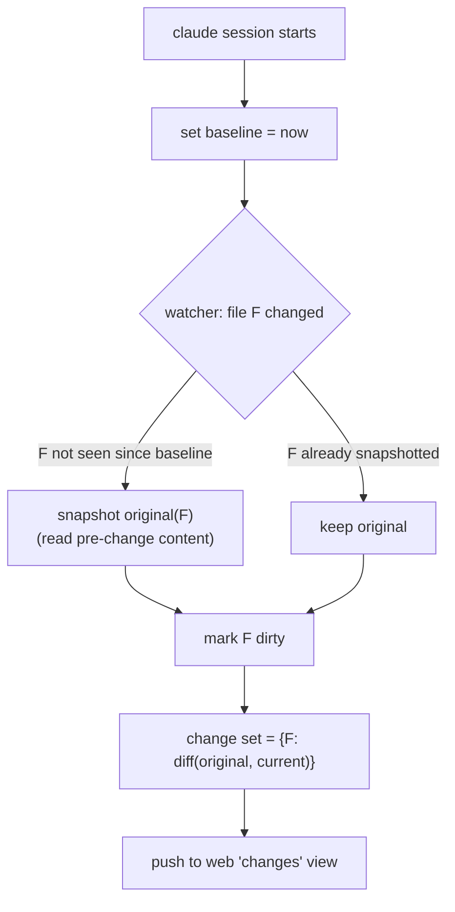

# Permission modes & change tracking

Status: proposed
Last updated: 2026-06-16

Two coupled features for the embedded `claude`:

1. A **permission-mode setting** (`default` / `acceptEdits` / `bypassPermissions`) so the user isn't
   forced to approve every edit.
2. A **change tracker** that shows a diff of everything Claude changed *this session* (and, later,
   *since the last turn*) with changed-line highlighting in the editor — and that keeps working when
   the permission mode means Claude stops asking.

The thesis: **decouple "seeing the diff" from "approving the diff."** Today the only way Weavie learns
about a Claude edit is the blocking `openDiff` review, which exists *because* Claude is asking
permission. The moment the user turns off prompting (the whole point of accept-edits / bypass), that
signal can disappear — so the diff view has to be driven by a permission-independent change source.

## Background: how edits surface today

Claude Code connects to Weavie as an IDE over the IDE-MCP server (`McpServer`, discovered via
`~/.claude/ide/<port>.lock`). When Claude proposes an edit in the **default** permission mode it calls
the IDE's `openDiff` tool; `McpServer.HandleOpenDiffAsync` hands a `DiffProposal` to the
`McpDiffPresenter`, which renders an editable Monaco diff and **blocks until the user keeps or
rejects** (`IDiffPresenter.PresentDiffAsync`). Keep → Weavie writes the file and returns `FILE_SAVED`;
Reject → `DIFF_REJECTED`, nothing written.

`openDiff` *is* the approval interaction. It is also — per the Claude Code docs — the **only** IDE
signal about a file change; there is no separate "file changed" notification an IDE receives.

### What the live run on 2026-06-16 established

Driving the running Win app and reading `[mcp]`/`[lsp]` host logs (`MainForm.cs:164`):

- **Default-mode `openDiff` works end to end** — `tools/call name=openDiff` → user confirmed →
  `openDiff KEEP -> saved …\temp\openDiff-probe.txt`.
- **`WorkspaceWatcher` already observes Claude's writes live** — `didChangeWatchedFiles` events
  streamed as Claude edited. This is the permission-independent change source we need, *already
  running*.
- **The watcher is extension-filtered** (`.ts,.tsx,.mts,.cts,.js,.jsx,.mjs,.cjs,.cs,.go`). The
  `.txt` probe file produced **no** watcher events — only the `.ts` files Claude touched did. A
  general change tracker must widen this.
- **`bypassPermissions` is not reachable via Shift+Tab** — it only activates when `claude` is
  launched with the flag. So bypass *requires* the launch-flag setting; it can't be reached from the
  default launch.

### Confirmed by a second live run (2026-06-16)

- **`acceptEdits` emits no `openDiff` at all.** In accept-edits the host log shows only
  `close_tab`/`getDiagnostics`/`closeAllDiffTabs` — never `openDiff`. Claude writes directly. So the
  change tracker is **mandatory** for accept-edits/bypass, not an optimization: it is the *only* way
  Weavie sees those edits.
- **Even default-mode `openDiff` is currently broken — a protocol non-conformance.** Claude opens the
  IDE diff *and* shows its own terminal permission prompt; the two are not synchronized. Root cause
  (verified against the reverse-engineering reference, `coder/claudecode.nvim`): the real `openDiff`
  accept response returns **two** content items — `FILE_SAVED` **and the full final file contents** —
  and the IDE **does not write the file** (*"we're handling it through MCP"*: Claude does the write
  from the returned contents). Weavie does the opposite (`McpServer.cs:396-397`): it **writes the file
  itself** and returns a **single** `FILE_SAVED` with no contents. So Claude never receives the
  accepted content, doesn't treat the IDE accept as the grant (its terminal prompt stays up), and when
  the user answers that prompt Claude does its own `Write` onto the file Weavie already created →
  *"already exists" / "not been read yet."* See [Part 3](#part-3--make-opendiff-protocol-conformant).

## Goals

1. Let the user pick how much Claude asks: `default` (ask on every edit), `acceptEdits` (auto-apply
   edits, no prompts), `bypassPermissions` (skip all permission checks).
2. Make it a real, discoverable [setting](settings.md) — off the "ask" baseline by default — not a
   buried env var or flag.
3. Show a **session change diff**: every file Claude changed since the claude session started, as a
   reviewable diff, with changed lines highlighted in the editor.
4. Keep that diff working in **all three modes**, including bypass where `openDiff` never fires.
5. Don't block Claude when the user has opted out of prompting.

## Non-goals (deferred)

- **`plan` mode.** Claude Code also has a read-only `plan` mode; it's a trivial fourth `AllowedValues`
  entry once the three are in, but it's not in this milestone's scope.
- **Per-turn diff ("since the last turn").** Needs a reliable turn boundary Weavie doesn't have yet
  (see [Open questions](#open-questions)). This milestone ships the **session** baseline + a manual
  re-baseline ("clear changes"); per-turn is a follow-up.
- **Inline accept/reject of individual hunks** in the change view. The change view is a *review*
  surface; `openDiff` remains the place to edit-before-keep in default mode.
- **Undo/revert of applied changes** from the change view. Later.

## Part 1 — the permission-mode setting

A single registered setting, declared in `CoreSettings.Register` alongside `claude.path`:

| key                     | kind   | default     | apply        | meaning                                            |
|-------------------------|--------|-------------|--------------|----------------------------------------------------|
| `claude.permissionMode` | String | `default`   | NextSession  | How much Claude asks before editing / running tools |

- **`AllowedValues = ["default", "acceptEdits", "bypassPermissions"]`** — a closed set, so it's a
  String with `AllowedValues` (not a new kind), enumerable via `listSettings`, and 1:1 with the CLI's
  `--permission-mode` values. The strings deliberately match Claude Code's own mode names.
- **`Apply = NextSession`** — the mode is passed as a launch flag, so a running claude keeps its mode
  and the next claude session picks up the change. (This mirrors `claude.path`, also `NextSession`,
  for the same reason: reopening the claude pane would destroy the conversation.)
- **`Aliases = ["permission mode", "accept edits", "auto accept edits", "skip permissions",
  "dangerously skip permissions", "yolo mode"]`** so *"stop asking me to approve every edit"* maps to
  `acceptEdits`.
- **Description** spells out the trade-off and that `bypassPermissions` skips *all* permission checks
  (the `--dangerously-skip-permissions` behavior) — surfaced to Claude via `listSettings` and written
  as the file comment.

### Mapping the setting to the launch flag

`TerminalController.ResolveClaudeLauncher` (both Win and Mac) appends the flag when the setting is not
`default`:

```csharp
string mode = _settings.GetString("claude.permissionMode") ?? "default";
if (mode is "acceptEdits" or "bypassPermissions") {
    claudeArgs.Add("--permission-mode");
    claudeArgs.Add(mode);
}
```

`--permission-mode bypassPermissions` is equivalent to the legacy `--dangerously-skip-permissions`
(confirmed against the CLI reference). The user can still cycle modes live with Shift+Tab inside the
TUI; the setting only chooses the **launch** mode — and is the *only* way to reach `bypassPermissions`
at all, since Shift+Tab can't.

> **Implementation note to verify at wiring time:** launching with `bypassPermissions` may trigger
> Claude Code's one-time "I accept the risk" acceptance screen in the claude pane. If so, document it
> (it's a Claude Code gate, not ours) — don't try to auto-dismiss it.

## Part 2 — the change tracker (permission-independent)

The diff view hangs off a `ChangeTracker` in `Weavie.Core`, fed by file-system events, **not** by
`openDiff`. This is what makes the view correct in accept-edits and bypass, where `openDiff` may never
arrive.

### Change source

Generalize the existing watcher rather than add a parallel one. `WorkspaceWatcher` is today scoped to
LSP language extensions (`WorkspaceWatcher.cs`); the tracker needs *all* files (minus the same noise
directories — `node_modules`, `.git`, `bin`, `obj`, `dist`, …). Make the extension filter optional
(`null` ⇒ all files), and run a tracking instance with no extension filter. The LSP instance keeps its
language filter unchanged.

### Baseline & diff

To show "what changed," the tracker records the **original** contents of a file the first time it
changes after the baseline, then diffs current-vs-original on demand:



Only files Claude actually touches are snapshotted, so the cost is proportional to the change set, not
the workspace. A **manual "clear changes"** action re-sets the baseline to now (drops all snapshots) —
this is the milestone's stand-in for per-turn baselining.

> **Snapshot timing caveat:** `FileSystemWatcher` fires *after* the write, so reading "the original"
> on the first event already sees the new content. The tracker must therefore capture each file's
> baseline content **eagerly at baseline time is too expensive** for a large tree — instead capture
> lazily but from a source that predates the edit. Options, in preference order: (a) diff against
> **git HEAD** when the workspace is a git repo (no snapshotting needed, exact and cheap); (b) when
> not a repo, fall back to snapshotting on first-touch and accept that a file already modified before
> the baseline shows from its baseline-time content. The git path is the common case for a code
> workspace and sidesteps the race entirely; the snapshot path is the non-repo fallback.

### Editor highlighting

For an open file in the change set, the host pushes its changed line ranges to the web app, which
renders them as Monaco line decorations (gutter + line background), reusing the diff computation
already used by `DiffView.tsx`. Opening a file not yet open routes through the existing
`open-file` bridge message (`FileOpener`).

## Part 3 — make `openDiff` protocol-conformant

This is a **bug fix, independent of the new modes** — default-mode `openDiff` is broken today (see the
confirmed findings above). It only matters in `default` mode, since `acceptEdits`/`bypass` don't call
`openDiff` at all. Bring `McpServer.HandleOpenDiffAsync` into line with the real protocol:

| on the diff being… | Weavie does today (wrong)                    | conformant behavior                                              |
|--------------------|----------------------------------------------|-----------------------------------------------------------------|
| **kept**           | writes the file; returns `[FILE_SAVED]`      | returns `[FILE_SAVED, <final contents>]`; **does not write** — Claude writes from the returned contents (preserving any edits the user made in Weavie's diff) |
| **rejected**       | returns `[DIFF_REJECTED]`                     | returns `[DIFF_REJECTED, <tab_name>]`                            |

Removing the server-side write means `McpServer` no longer needs its `IFileSystem` (it's used for
nothing else — `McpServer.cs:453`), so the field + constructor parameter come out, rippling to
`IdeIntegration`, both hosts' construction sites, and the MCP tests. The two existing tests that encode
the old behavior (`OpenDiff_Keep_SavesFileAndReturnsFileSaved`,
`OpenDiff_Reject_DoesNotSaveAndReturnsDiffRejected`) are rewritten to assert the two-item response and
that the server does **not** touch the filesystem.

There is **no mode-aware auto-keep presenter** — that idea assumed `acceptEdits` would still emit
`openDiff` for us to auto-resolve, which the live run disproved. In `default`, `openDiff` stays a
blocking Keep/Reject review (now conformant); in the other modes there is no `openDiff` and the change
tracker (Part 2) is the entire diff surface.

## Architecture / placement

```
Weavie.Core/
  Configuration/
    CoreSettings.cs        // + claude.permissionMode (String, AllowedValues, NextSession)
  Lsp/
    WorkspaceWatcher.cs    // extension filter becomes optional (null = all files)
  Changes/
    ChangeTracker.cs       // baseline + per-file original capture + diff; git-HEAD or snapshot
src/Weavie.Win/Hosting/ (and src/Weavie.Mac/Hosting/)
    TerminalController.cs  // ResolveClaudeLauncher appends --permission-mode
  Mcp/
    McpServer.cs           // openDiff conformance fix (2-item response, no server write, drop IFileSystem)
src/web/src/
    changes/               // the session-changes view (file list + Monaco diff + line decorations)
```

Both hosts already construct a `SettingsStore` and an `IdeIntegration`; the `ChangeTracker` is
constructed per claude session (baseline = session start), subscribes to the (generalized) watcher,
and pushes a `{ type: "changes", … }` bridge message the web app renders.

## Build sequence

1. **The setting** — register `claude.permissionMode` in `CoreSettings`; map it to `--permission-mode`
   in both `TerminalController.ResolveClaudeLauncher`s. Tests: launcher appends the flag for
   `acceptEdits`/`bypassPermissions`, omits it for `default`; `AllowedValues` rejects bogus values.
   Verify by setting it and confirming the claude pane launches in the chosen mode.
2. **`openDiff` conformance fix** (Part 3) — return `[FILE_SAVED, <contents>]` / `[DIFF_REJECTED,
   <tab_name>]`; stop the server-side write; drop `McpServer`'s now-unused `IFileSystem`; rewrite the
   two openDiff tests. This is shippable on its own — it makes default mode usable regardless of the
   rest. Verify live: keeping a diff in Weavie dismisses Claude's terminal prompt and writes once.
3. **Change tracker** — generalize `WorkspaceWatcher`'s filter; add `ChangeTracker` (git-HEAD diff
   with snapshot fallback, baseline + clear). Tests: a watched edit produces a change-set entry;
   clear re-baselines; git-repo vs non-repo paths.
4. **Web changes view** — file list + Monaco diff + editor line decorations, fed by the `changes`
   bridge message. Verify end to end: in accept-edits mode, Claude edits a file with no prompt and
   the change appears in the view with highlighted lines.

## Open questions

- **Per-turn baseline.** "Since the last turn" needs a turn boundary. Candidates: a future MCP signal
  from Claude marking turn start; an idle/burst heuristic over watcher events; or detecting prompt
  submission from the keystrokes Weavie forwards to the claude PTY (Enter after input). Deferred; the
  manual "clear changes" covers the need for now.
- **Snapshot race in non-git workspaces.** The git-HEAD path is exact; the snapshot fallback can miss
  the true pre-edit content for a file modified before the baseline. Acceptable for v1; revisit if
  non-repo workspaces become common.
- **Live Shift+Tab divergence is no longer a correctness problem.** Because the tracker is the diff
  surface in every non-default mode and `default`-mode `openDiff` is now conformant, a user cycling
  modes mid-session is handled regardless of what the launch setting said.
```