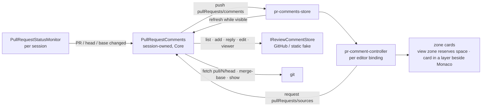

# PR review comments

A session whose branch has a pull request shows that PR's review threads inline in the editor — in the plain
editor, the applied review diff, and the unified review alike — whether or not the PR was opened with
**Open Pull Request**. The user can reply, leave a new comment on a PR line, and edit their own comments.
Supersedes the comment sections (Phase 2/3) of [open-pr.md](open-pr.md).

## Ownership

- **One source of truth.** The session's `PullRequestComments` holds the comment set for the PR the branch
  monitor detected. A review (`ReviewContext`) no longer owns comments. Refreshes run behind one gate, so the
  newest finished refresh is always the one published.
- **Posting is against the forge's PR head sha**, never local HEAD. The web maps the cursor's buffer line to a
  PR-head line; a line that exists only locally is refused before posting ("push it to comment on it"). A post
  carrying a stale head sha is rejected, and the fresh set is pushed.
- **Anchoring is on the live buffer.** The web diffs the file at the PR head (and at the merge-base for
  left-side comments) against the buffer, so threads follow local edits. A thread whose line changed locally
  sits after the replacement with a *Changed locally* badge and quotes the original line; left-side comments
  quote the removed line; outdated threads (the forge no longer anchors them) sit collapsed at the file's top.
- **Refresh follows visibility, not the agent.** Comments reload when the monitor reports a different PR, head,
  or base (a push moves their lines). Otherwise the web asks for a refresh while the user can see them — the
  selected session in a visible window — on selection, on returning to the window, and every minute. Each page is
  re-asked with its ETag, so an unchanged poll is a free 304, and an unchanged set isn't re-published.
- **Errors surface on the PR status chip** (warning colour, reason in its tooltip) and inline in the composer
  (a failed save keeps the draft).

## Cards, not view-zone DOM

Each thread reserves its height with an empty view zone and renders as a Solid card in a layer beside
`.monaco-editor` (`editor/zone-cards.tsx`). Keeping interactive DOM out of the view zone gives the textarea
real keyboard input (the workbench swallows keydowns inside Monaco, issue #218) and clamps the card to the
visible code width instead of the longest line.

## Commands

| Command | Default key | When |
|---|---|---|
| `weavie.pullRequest.comment` — reply to the thread on the cursor's line, else start a new comment | `$mod+alt+c` | `prCommentable` |
| `weavie.pullRequest.submitComment` | `$mod+Enter` | `prCommentFocused` |
| `weavie.pullRequest.cancelComment` | `Escape` | `prCommentFocused` |
| `weavie.pullRequest.toggleComments` — hide/show inline threads | `$mod+alt+Shift+c` | — |

`prCommentFocused` comes from focus (`[data-pr-comment-input]`), and the review chords exclude it, so
Ctrl+Enter in a comment box submits the comment instead of keeping a hunk.

## Out of scope

Resolving threads (GraphQL-only on GitHub), deleting comments, reactions, new comments on removed (left-side)
lines, avatars, and comments on fork PRs (branch detection matches `origin`'s owner).
