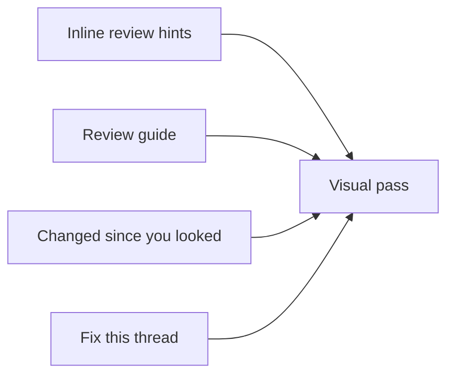

# PR review roadmap

Weavie's review surface is functionally ahead of GitHub's (editable diffs, durable Keep/Revert, comments that
follow local edits) but looks and feels worse. This roadmap splits the fix into independent features, each its
own session, branch, and PR. Reviews stay **for humans**: agent output informs the reviewer and never speaks in
their voice.

> Status: **planning**. Builds on [turn-review.md](turn-review.md), [diff-against.md](diff-against.md),
> [incremental-review-persistence.md](incremental-review-persistence.md), [open-pr.md](open-pr.md), and
> [pr-comments.md](pr-comments.md).

The four features run in parallel; the visual pass runs last, in the coordinating session, because it restyles
the same file headers and margins the others touch.

## 1. Inline review hints

Any agent's line-anchored review findings render inline in every review surface (turn, Diff Against, PR) —
subtler than a PR thread, but not invisible.

- **Capture.** A registry tool, `addReviewHint(path, line, severity, text)`, works for Claude and ACP agents
  alike. Agents learn to use it without Weavie-specific prompts through the ambient instructions
  (`weavie://instructions`) and an imperative tool description, so a generic "review this branch" skill
  produces hints. Claude Code's own `ReportFindings` tool (file + line per finding) is captured through the hook
  relay with no agent cooperation — **unverified**; prove the relay sees those calls first.
- **PR auto-review.** The existing seed prompt (`pr.autoReviewPrompt`) reports findings through the tool and
  keeps the summary in chat.
- **Presentation.** Anchored like PR threads (follow local edits; fade when their line changes). Next/previous
  and a show/hide toggle, as commands. Dismissible. Prominence is decided by **mockups** first: margin mark
  only, mark + inline one-line summary, expanded card — each beside a real PR thread card, light and dark.
- **Done when** an unmodified review skill run against a real agent produces inline hints.

## 2. Review guide

Turns a diff into a reading path: named groups of related hunks, in dependency order, with an attention heatmap.

- **Deterministic first.** Changed hunks; a dependency graph over *changed symbols only* from the running
  language servers (references/call hierarchy — never a workspace walk); signals: caller fan-out, public/exported
  surface changes, code changed without a test change, added branching, git churn. A file without a language
  server reports that its dependency signal is missing; it is never guessed.
- **Model second.** One typed ad-hoc inference call ([ad-hoc-inference.md](../concepts/ad-hoc-inference.md))
  per diff revision groups hunks by intent ("Add retry policy", "Thread it through 4 callers", "Mechanical
  rename"), orders the groups, and gives a one-line reason per score. Output is validated: every hunk in exactly
  one group, nothing invented; a failed validation is surfaced.
- **Surface.** Groups become review units (step, Keep/Revert a group); the file map becomes the heatmap; the file
  switcher follows reading order.
- Use `weavie-architect` before building.

## 3. Changed since you looked

After a PR updates (new commits or force-push), show only the author's new work.

- The persisted Keep baseline is already "what you reviewed", so the incremental diff is baseline → new head.
- Rebases would show base-branch changes as new work. Per changed file, replay the base movement
  (old merge-base → new merge-base) onto the reviewed content with `git merge-file`, then diff that against the
  new head. Files whose base→head patch is unchanged stay reviewed. No history walking.

## 4. Fix this thread

On your own PR, one command sends a review thread to the session's agent. The fix lands as a pending hunk linked
to the thread; keeping it posts a "Fixed in `<sha>`" reply.

## 5. Visual pass (coordinating session, last)

- Old/new line-number gutters; removed lines rendered as first-class lines, not ghost rows.
- Quieter file headers: actions on hover/focus, keybinding tooltips from the command catalog.
- A persistent file tree alongside the unified review.
- Start from side-by-side screenshots of the same PR in Weavie and GitHub (`weavie-tester`).

## Out of scope

CI failure annotations on lines; feeding review comments into Learn From Corrections; moved-code detection
(cheap via `git diff --color-moved`, revisit after the above); an "ask about this hunk" action (highlight-and-ask
already covers it).
