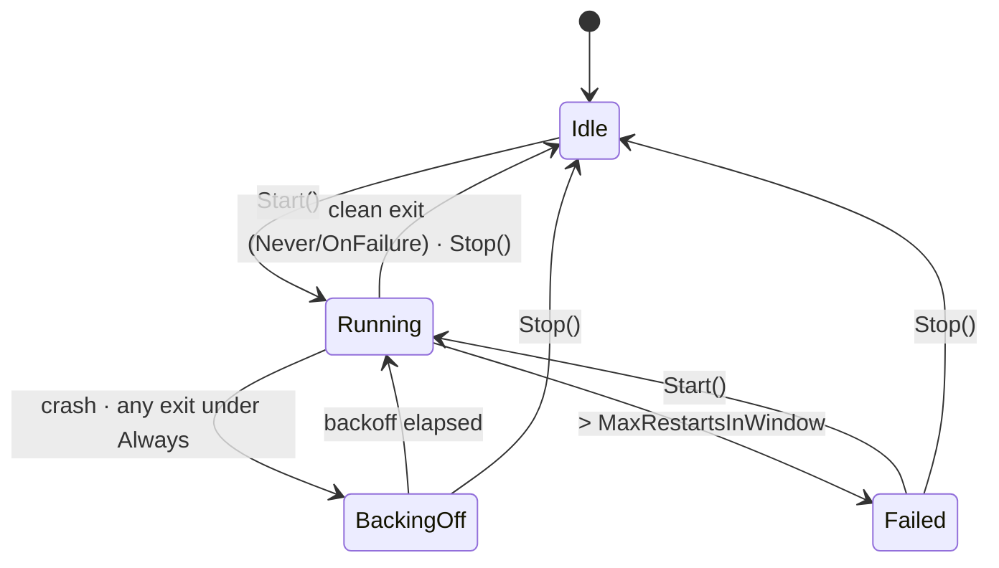

# Process supervisor

**Status:** core engine implemented + adopted by the terminal panes and the Vite dev server; further
adopters planned. Orphan-on-hard-kill is closed by a host-level kill-on-close Job Object (see below).

Weavie spawns several long-lived child processes (the embedded `claude` TUI, shell panes, language
servers, the dev server). Before this, each was managed ad-hoc by its own owner — none auto-restarted on
crash, there was no shared backoff or crash-loop protection, logging was scattered `Console.WriteLine`s, and
orphan cleanup was uneven. The supervisor is the one place that owns *process lifecycle*: launch, watch,
relaunch-with-policy, log, and clean teardown.

The hook relay (see [permission-modes-and-change-tracking.md](permission-modes-and-change-tracking.md)) is
**not** a supervised process — it is a transient, fork-per-tool-call helper that exits in milliseconds and
fails safe. Only *long-lived* children belong here.

## What "should it restart?" actually means

The motivating question: if your embedded `claude` crashes, you are left staring at a dead, empty panel —
what's the point? In an editor where the claude/shell pane is a permanent fixture, a stopped pane is never
the desired end state. So:

- **Crash** (non-zero / abnormal exit) → relaunch, with backoff.
- **Clean exit** (code 0) → under `Always` (the pane policy) it still relaunches; the clean-vs-crash
  distinction survives only as *timing* (a healthy run relaunches promptly; repeated crashes back off).
- **Crash-loop** (more than _N_ restarts inside a window) → **stop trying** and show a "stopped" notice.
  This is the *only* state that leaves a stopped pane, and only after we've tried hard — far better than
  hot-looping a broken binary and pinning a core.

## Engine

`Weavie.Core.Processes.ProcessSupervisor` owns the *policy and timing*, not the process handle. The caller
supplies two delegates, which keeps the supervisor agnostic to how a thing is spawned (a ConPTY terminal, a
`System.Diagnostics.Process`, anything):

- `start(SupervisedLaunch launch)` — launch a fresh instance and wire its exit back through
  `launch.NotifyExited`. `launch.Attempt` (0 = first, ≥1 = restart) lets the caller announce a restart in
  the UI. An exception thrown here is treated as a failed launch (a crash) and feeds the backoff/breaker.
- `stop()` — kill/dispose the current instance; must be a safe no-op when nothing runs.

`launch.NotifyExited(int exitCode)` is called from the child's exit callback (any thread). The handle ties
the exit to the specific instance, so a stopped predecessor's late exit is ignored rather than misattributed
to its replacement (which would restart a healthy child); an exit arriving while not `Running` is also ignored.

### Tunables (`SupervisionOptions`)

| Option | Default | Meaning |
| --- | --- | --- |
| `Policy` | (required) | `Never` / `OnFailure` (restart on crash only) / `Always` (restart on any exit) |
| `InitialBackoff` | 500 ms | delay before the first restart |
| `BackoffMultiplier` | 2.0 | growth per consecutive crash |
| `MaxBackoff` | 30 s | ceiling on the delay |
| `HealthyAfter` | 10 s | a run lasting this long resets the consecutive-crash count |
| `CrashLoopWindow` | 60 s | sliding window for the breaker |
| `MaxRestartsInWindow` | 5 | restarts allowed in the window before tripping `Failed` |

Backoff is `min(MaxBackoff, InitialBackoff × Multiplier^(consecutiveCrashes−1))`. A run lasting at least
`HealthyAfter` resets `consecutiveCrashes`, so an occasional crash after a long healthy run restarts promptly
rather than at a grown delay. Timing flows through an injectable `ISupervisorClock` so tests drive backoff
and the window deterministically (no real waiting).

### State machine

`StateChanged` carries `(State, ExitCode?, RestartCount)`. `ExitCode` is set when a process exit drove the
transition and `null` for a launch or an intentional `Stop`/`Dispose` — which lets a UI tell a real exit
(show a "process exited" notice) apart from a deliberate teardown (stay quiet, the pane is being reset).

### Logging

Structured `SupervisorLogEntry(Name, Level, Message)` go to an injected sink. Today the controllers route
them to the console (the existing convention). A per-process log file under `~/.weavie` is a planned sink;
per the no-buried-flags rule, any verbosity toggle lands as a **setting**, off by default — never an env var.

## Adopters

**Implemented — terminal panes** (`Weavie.Win` + `Weavie.Mac` `TerminalController`, both `claude` and
`shell`): policy `Always`. A crash relaunches with backoff; the supervisor reuses the existing
`term-reset` → `term-ready` → `Start` web handshake for intentional restarts (a `terminal.shell` change),
and on a supervised restart writes a one-line `[weavie] … restarting…` notice into the pane via the normal
`term-output` channel (no web-protocol change). A crash-loop trip prints a "stopped" notice and posts
`term-exit`.

**Implemented — Vite dev server** (`WebDevServer`, Debug only): policy `Always`. Each instance binds its own
free port (picked once, held for its lifetime) and spawns Vite with `--strictPort`; a mid-session crash is
relaunched on the same port, so the WebView's origin stays valid and its HMR client just reconnects. Bring-up
failure stops the supervisor so the error page's Retry gets a clean start. This per-instance port (vs. a fixed
5173 that a second instance silently *reused*) is what lets multiple worktrees / Debug instances run side by
side without cross-talk.

**Planned:**

- **Language servers** (`LspConnection` / `LspBridgeServer`): policy `OnFailure` (or `Always`). Caveat: a
  restarted LSP needs the full `initialize` handshake replayed and open documents re-synced — the `start`
  delegate must own that re-init, so this is more than dropping the supervisor in. Not yet wired.
- **Hook-bridge pipe server lifecycle:** the loopback pipe server is in-process (lives with the host), so it
  isn't supervised; only note that the *relay* it talks to is transient and exempt.

## Orphan prevention (hard kill)

`ProcessSupervisor` owns *graceful* teardown — its `stop` delegate kills the tree on a clean shutdown. But the
supervisor is managed code in cross-platform Core, and the orphan problem is the host dying with **no managed
code running** (a debugger Stop, a crash): no `Dispose`, no `stop`, nothing. The only thing that reaps children
then is an OS primitive. On Windows that's a **Job Object** with `JOB_OBJECT_LIMIT_KILL_ON_JOB_CLOSE`
(`Weavie.Win.Hosting.ChildProcessJob`, installed once at `Program.Main`): the host process is assigned to the
job, children inherit it, and when the host dies by any means the OS closes the job handle and terminates
everything still inside. This covers *every* child (Vite, ConPTY shells, language servers, `claude`), not just
supervised ones — so it's the backstop behind the supervisor, not a replacement for it. Mac/Linux hosts need
their own equivalent (`PR_SET_PDEATHSIG` / a process group) — not yet wired.

## Follow-ups

- File logging to `~/.weavie/logs/<name>.log`, with a verbosity **setting**.
- A "processes" status panel in the UI, driven by `StateChanged` (state + restart count per child).
- Extend the kill-on-close orphan guard to the Mac/Linux hosts (`PR_SET_PDEATHSIG` / a process group); only
  the Windows host has it today (see *Orphan prevention* above).
