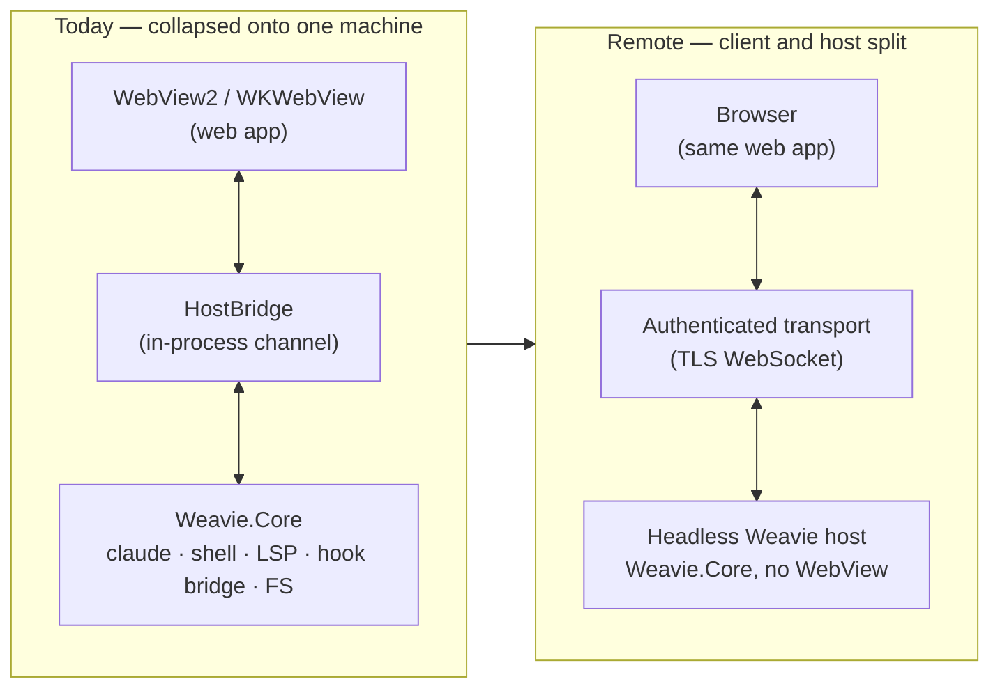
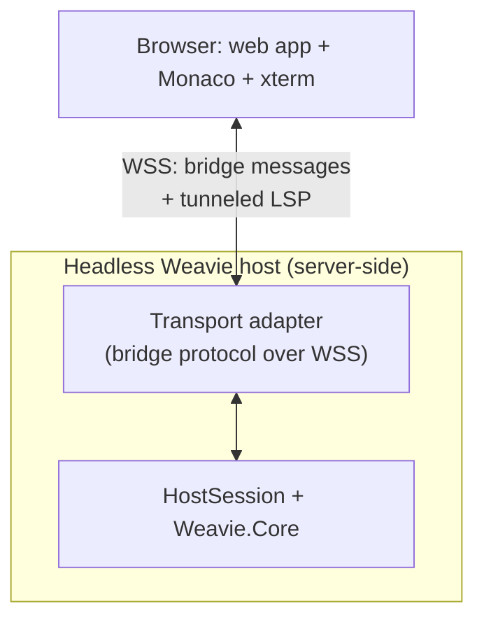

# Remote host (web Weavie)

**Status:** aspirational — *not being built*. This is a **guardrail doc**: it records the target
shape of a web/remote Weavie so day-to-day decisions don't quietly foreclose it. Nothing here is on a
roadmap; the ask is only that we keep the seams it depends on intact (see [Invariants](#invariants-keep-these-true)),
which costs us nothing today.

## The goal

A **web version of Weavie**: the user opens a browser, and the full Weavie experience — the embedded
`claude` TUI, shell panes, the Monaco editor, the change feed — runs against a workspace that lives on
a machine *somewhere else* (a cloud box, a dev container, their own desktop reached remotely).

The natural comparison is Claude Code's own remote/web mode, **except the remote part is the entire
Weavie backend**, not just `claude`. In remote Weavie the spawned `claude` is one of several
server-side children; the browser is a thin client that renders pixels and forwards input. Concretely:
PTYs, the hook bridge, language servers, process supervision, settings, and filesystem access all stay
on the **host**, and the host just happens to no longer be the user's local machine.

## Why this is more feasible than it looks

Weavie is a **C#/.NET 10 Core engine** fronted by native hosts (`Weavie.Win` = WinForms + WebView2,
`Weavie.Mac` = AppKit + WKWebView), both of which load the **same Vite/Solid.js web app**. It is *not*
Electron, and crucially the native host and the web UI talk over a **fully serializable JSON message
protocol** — `src/web/src/bridge.ts` (`HostBoundMessage` / `WebBoundMessage`). That file already
contemplates running detached from a native host:

> When running in a plain browser (dev), the host handler is absent and outbound messages are no-ops —
> by design, never a thrown error.

So the host↔web boundary is **already the remoting seam**. A local Weavie build simply *collapses the
client and the host onto one machine* and lets the WebView channel stand in for a network. The web
version un-collapses them. Most of the backend does not move or change — it was always "local to the
host"; we're only relocating the host.

## What crosses the network — and what doesn't

This is the part worth being precise about, because the instinct ("everything has to be rebuilt for
the web") is wrong. The embedded `claude` and its whole support cast stay **co-located with the host**,
so the connections between them never touch the network:

| Subsystem | Endpoints | In remote mode |
| --- | --- | --- |
| **Embedded `claude`** (PTY child) | host ⟷ `claude` | **stays host-local.** PTY, env injection, supervision all server-side. |
| **Hook bridge** (`Weavie.Core/Hooks`) | `claude` ⟷ host, current-user-only **named pipe** | **stays host-local.** `claude` and the pipe server are both on the host — the pipe never crosses. |
| **IDE-MCP + registry MCP** (`Weavie.Core/Mcp`) | `claude` ⟷ host, loopback WS + token | **stays host-local.** Consumed by the server-side `claude`, not the browser. |
| **Shell pane** (PTY child) | host ⟷ shell | **stays host-local.** Terminal *output* reaches the browser only as `term-output` chunks over the bridge — same as today. |
| **Terminal I/O** | host ⟷ web, base64 chunks over bridge | **already remote-shaped.** It's a remote-terminal protocol in all but name (`term-input`/`term-output`/`term-resize`). |
| **LSP bridge** (`Weavie.Core/Lsp`) | **web editor (Monaco)** ⟷ host, loopback WS + token | **crosses the network.** This is the one consumer that lives in the browser, so its connection must move onto the authenticated transport. |
| **Filesystem** (`IFileSystem`) | host-side reads/writes | **stays host-local**, but workspace identity stops being "the process cwd." |
| **Settings / keybindings / themes** (`~/.weavie`) | host disk | **stays host-local** — but it's now *the host's* `~/.weavie`, per-user. |

The upshot: the hook bridge's "a web page **cannot open a pipe at all**" security property (see
[concepts/hook-bridge.md](../concepts/hook-bridge.md)) **survives remoting for free** — in the remote
model the browser is on a different machine entirely, so it was never a candidate to reach the pipe.
The two boundaries that genuinely change trust posture are **the bridge transport itself** and **the
LSP connection**, both of which go from "implicitly trusted because same machine" to "explicit
authenticated network boundary."

## The transport seam

`HostBridge` (one per native host: `Weavie.Win/Hosting/HostBridge.cs`, `Weavie.Mac/Hosting/HostBridge.cs`)
is the *only* thing that needs replacing. Today it marshals `bridge.ts` messages over the WebView's
script-message channel. A headless host swaps it for a WebSocket adapter that speaks the **same**
`HostBoundMessage`/`WebBoundMessage` JSON — Core is untouched, the web app is untouched, only the pipe
between them changes.

Two things make this credible rather than hand-wavy:

- The protocol is **already pure data** — JSON with base64 binary, no handles, no pointers, no
  synchronous round-trips that assume zero latency. (`postToHost` is fire-and-forget; replies come back
  as their own messages.)
- There is **already a latency harness** in the protocol (`latency-live`, `benchmark-result`,
  `run-benchmark`). The team already treats input-to-render latency as a first-class concern — exactly
  the thing a network link stresses.

## Invariants — keep these true

These are the load-bearing guardrails. Honoring them is cheap now and is the entire point of writing
this down; violating them is how "web Weavie" quietly becomes impossible.

1. **The host↔web boundary stays a fully serializable message protocol.** `bridge.ts` messages remain
   pure JSON (+ base64) — never a native handle, file descriptor, pointer, or anything that only means
   something inside one process. If a feature needs the host and the web to share state, it shares it as
   *messages*, not memory.
2. **Never assume zero latency or zero per-message cost.** No chatty synchronous request/response that
   blocks the UI on a host round-trip; keep large payloads (terminal output, file contents, diffs)
   chunked or lazily fetched, the way they are today. Respect the latency harness — if a change
   regresses it locally, it will be worse over a wire.
3. **Keep `Weavie.Core` host-agnostic.** Native-only concerns — window chrome, WebView lifecycle, the
   custom title bar, OS dialogs — live in `Weavie.Win`/`Weavie.Mac`, never in Core. A headless host
   must be able to drive Core with *no* windowing system present. (This is already the convention; the
   guardrail is "don't erode it.")
4. **Keep the embedded-`claude` side host-local.** `claude`, the MCP servers, and the hook bridge talk
   only to the host, never to the browser. Don't introduce a path where `claude` (or its hooks/MCP)
   needs to reach the web client directly — that's what keeps the hook-bridge pipe security model intact
   remotely and keeps the MCP token off the network.
5. **All filesystem access goes through `IFileSystem`.** Feature code never reaches for `System.IO`
   directly (`Weavie.Core/FileSystem`). A remote or virtualized workspace FS is then a single swap, not
   a hunt-and-replace.
6. **Don't hardcode "the workspace is the process cwd / local `$HOME`."** Route workspace and user
   identity through the session abstraction (`HostSession`) so a host can one day serve more than one
   workspace. Settings/keybindings/themes resolve relative to *a* user's `~/.weavie`, not *the*
   machine's.
7. **Don't let auth lean *solely* on co-location for anything that could cross the wire.** The hook
   bridge's pipe ACL is fine (it never crosses). But the LSP bridge and the bridge transport must be
   designed so their "loopback + token" posture can become "TLS + real auth" without a redesign — i.e.
   token verification stays a clean, swappable layer, not an assumption baked into call sites.

## Phased path (if we ever build it)

Sequenced so each phase is independently useful and the security cost is deferred to where it's
actually incurred.

- **Phase 0 — maintain the seams (ongoing, free).** Just hold the [invariants](#invariants-keep-these-true).
  No code; this doc is the deliverable.
- **Phase 1 — headless host, single-user, loopback.** Add a `Weavie.Host` entry point (or a `--serve`
  mode of an existing host) that runs `Weavie.Core` with no WebView and exposes the bridge protocol over
  a **local** WebSocket; point the existing web app at it instead of the WebView channel. The web app
  already no-ops without a native host, and a Vite dev server already exists (`WebDevServer`), so this is
  mostly the transport adapter from [The transport seam](#the-transport-seam). No new trust boundary yet
  (loopback, same user).
- **Phase 2 — remote, single-tenant.** Put **TLS + authentication** on the bridge WebSocket and fold the
  **LSP connection** onto the same authenticated transport (tunnel it, or give it co-equal auth). This is
  the "Claude Code Remote, but the whole backend" milestone: your browser, your one box, reached over the
  network.
- **Phase 3 — multi-tenant (explicitly out of near-term scope).** Per-user workspace isolation,
  sandboxing, host pooling/quotas. The genuinely hard, expensive phase — called out here only so Phases
  1–2 don't accidentally assume a single global user (see invariant 6).

## Code map (the seams this depends on)

- `src/web/src/bridge.ts` — the host↔web message protocol; **the** remoting contract.
- `Weavie.Win/Hosting/HostBridge.cs`, `Weavie.Mac/Hosting/HostBridge.cs` — the in-process transport to
  be mirrored by a headless WebSocket adapter.
- `Weavie.Core` (`HostSession` and below) — the host-agnostic engine that becomes the server-side host
  unchanged.
- `Weavie.Core/Lsp/LspBridgeServer.cs` — the one browser-consumed loopback service that must move onto
  the remote transport.
- `Weavie.Core/Hooks/` — the hook bridge, whose pipe-ACL security model is *preserved* by remoting
  (browser is off-machine); see [concepts/hook-bridge.md](../concepts/hook-bridge.md).
- `Weavie.Core/FileSystem/IFileSystem.cs` — the abstraction that keeps the workspace swappable.
- `Weavie.Core/Processes/ProcessSupervisor.cs` — already host-side; supervises the server-side children
  identically whether the host is local or remote. See [process-supervisor.md](process-supervisor.md).
