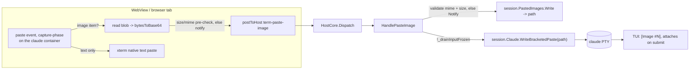

# Remote image paste into Claude

Status: **built (remote/browser-served path), verified by tests + the real `claude` TUI.** Native-WebView
Ctrl+V image paste is a scoped follow-up (see [Native WebView](#native-webview-the-one-gap)).

Pasting an image into the embedded `claude` pane works when the backend is remote/headless — where Claude
can't reach any OS clipboard. The image is captured in the browser, shipped to the backend, written to a
scratch file there, and its **path injected into the claude PTY as a bracketed paste**, which the TUI renders
as an `[Image #N]` chip and attaches on submit.

## Why path-injection (and not a clipboard or a protocol push)

Claude Code ingests an image exactly two ways: the **OS clipboard** (native APIs — unavailable on the
headless/remote Linux backend, which has no clipboard, and where Claude's Linux clipboard-image support
doesn't exist) or a **file path in the prompt**. There is no PTY/escape-sequence route for image *bytes*, and
the IDE-integration channel that pushes `selection_changed` ("⧉ N lines selected") is text/selection-only — it
carries no image message, and the protocol is Claude-defined, so Weavie can't invent one. Empirically:

- A **bare path in the prompt is natively multimodally attached** (`claude -p … --allowedTools ""` read back a
  hand-built PNG's pixel colors — no tool read possible).
- Injecting that path **as a bracketed paste** (`ESC[200~<path>ESC[201~`) makes the TUI render a clean
  `[Image #N]` chip; the raw path never shows. Bare path, not `@`-prefixed.

So temp-file-plus-path isn't a workaround — it's what Anthropic's own IDE integration and every community
extension do. All backend work is filesystem + PTY, so it lives once in `Core`/`HostCore` with **zero** per-OS
code (unlike the text clipboard, which needed `IHostPlatform.ReadClipboard`).

## Flow

- **Web** (`src/web/src/terminal/paste-image.ts`, wired in `TerminalView.tsx`, claude pane only): a
  capture-phase `paste` listener pre-empts xterm's textarea handler for image items only (`preventDefault` +
  `stopImmediatePropagation`); text pastes fall through untouched. Pre-checks size (mirrors the host cap) so
  oversize bytes never ride the bridge, then posts `term-paste-image { slot, session, mime, dataB64 }` to the
  **active** backend.
- **Host** (`HostCore.PasteImage.cs`): drain-guard → validate MIME→extension + decoded size (reject with a
  `Notify`) → `PastedImageStore.Write` (host picks the filename; the client never supplies a path) →
  `TerminalController.WriteBracketedPaste(path)`.
- **Storage** (`PastedImageStore`, `WeaviePaths.WorkspacePastedImagesDir`): a per-session subdir keyed by
  worktree digest (`~/.weavie/workspaces/<id>/pasted-images/<digest>/paste-N.<ext>`), outside the workspace so
  it never reaches the tree/index/git. Wiped on session unload (`HostSession.DisposeAsync`).

## Decisions

- **Event, not a command.** Driven by the native paste gesture carrying image bytes (only reachable inside the
  event); no palette action to advertise. Mirrors how browser-served **text** paste already rides the native
  paste event rather than `weavie.terminal.paste`.
- **Claude pane only.** A pasted path in a shell would just try to run; the host targets `.Claude` regardless
  of the message's `session`, and the web only attaches on the claude pane.
- **Allowlist + cap are one source of truth** (`PastedImageMedia`): png/jpeg/gif/webp, `MaxBytes` = 5 MB
  (Claude's per-image limit). The web mirrors the values; the **host is the authoritative gate**. A rejected
  paste (bad type / oversize) is surfaced as a toast — never a silent drop.
- **Cleanup on unload only.** `PastedImages.Clear()` in `DisposeAsync` covers the normal path. No blanket
  boot-time wipe: it would delete a concurrent same-workspace instance's live images (a risk scratch's
  keep-set GC deliberately avoids), and a hard-crash orphan is a few KB in a hidden dir.

## Native WebView: the one gap

On a **browser-served** shell (the remote target) `weavie.terminal.paste` declines, the Ctrl+V keydown falls
through, and the DOM `paste` event fires — the capture handler works. On a **native WebView** that command
consumes Ctrl+V and `preventDefault`s it, suppressing the DOM paste event, so the handler never fires there.
The host path is unconditional; only the web *capture* depends on the paste event reaching the DOM. Native
desktop already ingests clipboard images via Claude's own OS-clipboard support (macOS/Windows), so this is a
genuine remote-only fix. Extending to native WebView Ctrl+V (making the paste command fall through on all
hosts, or a per-OS clipboard-image read) is a follow-up, not folded in silently.

## Tests

- `HostCorePasteImageTests` (headless, at the PTY seam): a pasted PNG writes a scratch file with the right
  bytes/extension and injects `ESC[200~<path>ESC[201~` into the claude PTY; each allowed MIME maps to its
  extension; a disallowed type / oversize paste is toasted and never written; a shell-named paste never
  reaches the shell; a paste is suppressed while input is frozen for an update.
- `PastedImageStoreTests` (Core): sequential `paste-N` allocation, byte-exact writes, `Clear` on unload, and
  the `PastedImageMedia` allowlist.
