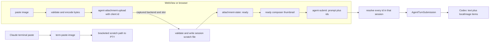

# Remote image paste into agents

Status: **built and covered at the browser, host bridge, provider, and PTY seams.**

Pasting an image into an agent works when the provider runs on a remote/headless machine that cannot read the
desktop clipboard. The browser captures the image bytes, or a native WebView reads them through the local host,
then routes them to the backend and session captured at paste time.

Claude and structured agents intentionally meet at the scratch-file boundary but use different delivery
contracts. Claude receives a bracketed-pasted path in its PTY. A structured composer uploads each attachment,
waits for the owning backend to acknowledge it, then submits the prompt and exact attachment ids as one turn;
Codex serializes their resolved paths as app-server `localImage` input items.

## Why Claude uses path injection

Claude Code ingests an image from the OS clipboard or from a file path in the prompt. A remote/headless process
cannot read the desktop clipboard, and there is no PTY escape sequence for image bytes. Injecting the scratch
path as a bracketed paste makes the TUI render its normal `[Image #N]` chip, so the legacy terminal surface keeps
that native interaction. Codex uses the same backend-local scratch path through its structured input protocol.

## Flow

- **Web** (`agent/composer-store.ts` and `agent/pasted-images.ts`): the thumbnail stays `transferring` until
  `agent-attachment-state` returns. Submit is disabled until every attachment is ready. The draft clears only
  after that exact backend accepts the submission.
- **Host** (`HostCore.PasteImage.cs`): upload validates the MIME and decoded size, writes a host-chosen path,
  and stages the client id in that session's `AgentAttachmentStore`. Submit resolves every id before invoking
  the provider once. Missing, removed, duplicate, or cross-session ids reject the entire submission without
  consuming ready attachments.
- **Provider** (`AgentTurnSubmission`): text and attachments are an atomic provider-neutral input. The Codex
  adapter maps it to one `turn/start` request; a future structured provider implements the same contract without
  depending on Codex payloads.
- **Claude compatibility** (`terminal/paste-image.ts`): the terminal-backed provider keeps the immediate
  `term-paste-image` route and bracketed PTY paste. It never enters the structured attachment contract.
- **Storage** (`PastedImageStore`): files live in a per-session hidden workspace-data directory outside the
  repository. Removing a staged attachment deletes it; remaining files are cleared on session unload.

## Decisions

- **One paste command, two clipboard sources.** Browser-served sessions use the DOM paste event because it
  carries the bytes. Native WebViews run `weavie.agent.paste`, read the local OS clipboard, then upload to the
  captured backend. Both paths feed the same composer store and attachment protocol.
- **Paste-time routing is immutable.** The web captures backend id and slot before any asynchronous clipboard
  read or blob encoding. Switching sessions cannot redirect the bytes or acknowledgement.
- **Submission is atomic.** Images are not accumulated invisibly inside a provider. A provider receives one
  explicit text-and-attachments value only after all client ids resolve in the requested session.
- **Remote operations are replayable and idempotent.** The WebSocket transport retains unacknowledged uploads
  and submissions and resends them after reconnect. The host treats duplicate attachment ids as the same staged
  upload and retains accepted submission receipts by id, so a lost acknowledgement neither strands the composer
  nor runs a turn twice. Removed and consumed attachment ids become session-scoped tombstones, preventing an
  older in-flight upload from resurrecting a discarded thumbnail or leaving a second staged file.
- **The host is authoritative.** The web mirrors the PNG/JPEG/GIF/WebP allowlist and 5 MB limit for fast user
  feedback; the host validates both again before writing bytes.
- **Failures stay visible and recoverable.** Failed thumbnails keep their error, rejected submissions keep the
  draft and attachments, and every upload/submission receives an acknowledgement.

## Native WebView and remote sessions

The native paste command reads the clipboard through the **local** host, which owns the desktop even when a
remote backend drives the page. The handler captures the remote backend and slot before that asynchronous read.
Claude sends the legacy terminal message to that backend; a structured pane uploads into its captured composer.
Browser-served shells let Ctrl/Cmd+V fall through to the DOM paste event instead.

## Tests

- `HostCoreStructuredAttachmentTests`: remote upload is byte-exact, submit claims each id once,
  submit-before-upload rejects without consuming it, and removal deletes its scratch file.
- `HostCorePasteImageTests`: Claude writes the expected scratch file and bracketed PTY sequence; invalid and
  oversized data is rejected; native clipboard reads return the platform image.
- `CodexAppServerProtocolTests` and `CodexAppServerSessionTests`: attachments become `localImage` items in the
  same turn as the text prompt.
- `composer-store.test.ts`: paste-time backend routing, acknowledgement gating, exact attachment ids, and
  backend/session state isolation.
- `paste-image.test.ts` and `PastedImageStoreTests`: DOM image extraction, allowlisting, byte-exact storage,
  and cleanup.
