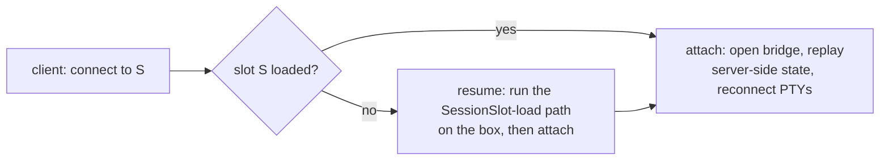

# Remote sessions

Status: **working (web mechanism), reconnection model specified** — register a remote agent, then New
Session shows a **location** picker (default | agent name); picking a remote spins up a worktree on the
remote box with its Claude/terminal/editor pointed at the remote filesystem, and it joins the rail
alongside local sessions. Verified end-to-end via the headless host. The [use-case
scope](#use-cases-and-scope) and the [reconnection model](#reconnection-attach-resume-durability) —
attach vs resume on the `SessionSlot` model, exclusive-lease, persistent terminal scrollback, the
durability boundary — are specified here but **not yet built**. Container isolation, a server-side
(non-`localStorage`) session registry with ownership + attach-by-URL, and per-session
LSP-over-the-bridge are follow-ups.

## Use cases and scope

A session is one thing everywhere: a `HostCore` + worktrees behind the bridge. The use cases differ on
only **two axes** — (1) *where the `HostCore` runs* (in-process / a box the developer owns / someone
else's container), and (2) *who creates the session and how a client discovers + attaches to it* (local
UI / a server-side registry / an agent-emitted attach URL). **Isolation (containers) and running the app
are orthogonal layers on top of that, not part of the session model.**

1. **Local solo — most common.** In-process `HostCore`, worktrees. If a developer runs the app across
   several worktrees, making it tolerate multiple instances is *their* concern for now (Weavie may inject
   a per-session port/env as a convenience, but does not own it — see non-goals). Most work lives here.
2. **Remote solo, multi-machine.** A runner on a box the developer owns; the developer roams between
   machines, attaching/detaching to the *same* sessions — including sessions another of their machines
   created. Forces a **server-side session registry** (not `localStorage`) and the attach model below.
3. **Company remote agents (Claude Code Cloud-style).** The agent platform builds the container, runs off
   main, and the services are already up; Weavie provisions **nothing**. The startup script boots a
   headless worker that self-registers and emits a signed **attach URL** the owner clicks to attach in
   their local Weavie. "Like (1), but remote." Adds: the worker ships as a layer the company drops into
   their image, ownership stamped at creation, and attach-by-URL in the client.
4. **Company-provisioned backends.** A single-tenant box per developer (e.g. their own EC2) **collapses
   to (2)** plus provisioning automation (a script/Weavie spins up the box + installs the runner); the
   session model is identical. The multi-tenant managed-fleet variant is **out of scope** (a separate
   Codespaces/Coder/Gitpod-class product with its own identity/auth/billing surface).

The *creator* axis (who mints `{ url, token }`) is detailed in [The three
scenarios](#the-three-scenarios--one-primitive-different-creators): local UI for (1)/(2)/(4) vs an
out-of-band startup script for (3).

### Non-goals

- **Running the app under development** (compose, dev servers, debugging). "Bring up my microservice
  stack" is how Weavie *runs an app to debug* — a separate run/debug feature — not how it does sessions,
  and it must not drive the session model. (The microservice-coordination problem that wants per-stack
  network namespaces lives there, not here.)
- **Weavie provisioning containers.** In (3) the container is external; (1)/(2)/(4) are plain machines.
  Container isolation stays the deferred opt-in below (a `ProcessSupervisor` `start`/`stop` delegate).
- **Multi-tenant managed hosting** — many developers' sessions on one shared box with per-user credential
  isolation. That is the separate product noted in use case (4).

## How the frontend aggregates backends

Each backend — the local/default host and every registered remote runner's worker — is a pristine,
unmodified `HostCore`. The **web frontend connects to several at once** and designates one **active**
backend that drives the page; the rail merges every backend's `session-list` (tagged by location) so
local + remote sessions sit together. The two rules:

- **session-list / session-status are aggregated from all backends** (the rail). Everything else
  (terminals, editor, layout, diffs) is delivered to the page **only from the active backend**, so a
  background backend can never paint over what's on screen.
- **Switching to a session on another backend** just rebinds the page to it: its normal switch reply
  (`term-reset` → the panes re-emit `term-ready`, plus `set-editor-session`) re-attaches the terminals
  and editor, and `fs-*` / `term-input` then flow to that backend — so a remote session's Claude and
  editor read/write the remote disk. New Session at a location sends `new-session` to that backend.

Registration is client-side for now (`localStorage`, a "+ Add remote agent…" entry in the New Session
location picker that stores the runner URL + token). The local host resolves nothing; the web calls the
runner's `GET /backend` (CORS-enabled) to discover the worker URL+token and opens its bridge. Moving the
registry to a synced Weavie setting is a follow-up.

> **Updated after the host-core unification** ([host-core-unification.md](host-core-unification.md)):
> the session model (`new-session`, worktrees, the rail) moved out of `Weavie.Win` into shared
> `Weavie.Hosting/HostCore`, and **every host drives it — including Headless via `HeadlessPlatform`**.
> Two consequences: (1) a single `Weavie.Headless` is now *multi-session* — connect to one and New
> Session creates worktrees inside it, exactly like local; (2) any remote-session wiring lands once in
> shared code and is runnable + capturable via Headless. This collapsed the earlier "spawn a process
> per session" design (Option C): per-session **processes on the same box** buy little once HostCore
> isolates each session's claude/PTY/MCP in-process, so the runner now provisions **one multi-session
> backend per workspace**, and real isolation is an opt-in **container** tier, not a process tier.

Weavie can run a session's *backend* — the embedded `claude`, the shell PTY, the file provider, the
LSP servers, change tracking — on a **remote host**, while the editor and terminal *rendering* stay
local. This spec describes how.

## The one idea

Everything that must sit next to `claude` already sits behind a single seam: `IHostBridge`
(`MessageReceived` / `PostToWeb(json)`). `Weavie.Headless` already runs the *entire* `Weavie.Core`
session graph behind that seam over a WebSocket (`/weavie-bridge`). So a remote backend is just
**`Weavie.Headless`, running on another machine, with the bridge crossing the network** — nothing in
the graph has to move or change, because the PTYs, the IDE-MCP loopback servers, the hook pipe, the
LSP servers, and local disk are all co-located *with the backend*, which is exactly where they need
to be. The only thing on the wire is the bridge JSON stream.

```
Local (rendering only)              Remote host (the whole graph = Weavie.Headless)
  Monaco / xterm.js / LSP client      FileProvider · PTYs(claude+shell) · LSP servers · hooks · disk
        |                                   |
        +------ bridge JSON over wss --------+   (the only thing that crosses the network)
```

The corollary: the loopback/named-pipe pieces (IDE-MCP, hook bridge, LSP) are **not** remoting
problems. They are local *to the backend*. The one genuinely new wiring item is tunnelling the LSP
client↔server WS over the bridge instead of loopback (see [Deferred](#deferred)).

## What runs where

| Layer | Runs | Reaches the other side via |
| --- | --- | --- |
| Rendering — Monaco, xterm.js, layout, palette, LSP **client** | Always local (WebView / browser) | bridge JSON only |
| Backend graph — `FileProviderService`, PTYs, LSP **servers**, IDE-MCP, hooks, change tracking | Wherever the backend is; moves as one unit (`Weavie.Headless`) | services bridge messages against disk/processes local to it |

The editor is **not** relocated. Monaco renders locally and never touches a disk — it reads/writes
through `fs-read` / `fs-write` / `fs-stat` bridge messages serviced by `FileProviderService` *in the
backend graph*, against the backend's own disk. When the backend is remote, Monaco is already editing
remote files. The `IFileSystem` abstraction is **not** the remoting mechanism (the backend just uses
`LocalFileSystem` against the host it runs on); the bridge message protocol is.

LSP cannot be inverted (local server, remote files): a language server reads most of a project —
closed files, `tsconfig`/`go.mod`/`Cargo.toml`, dependency trees, its own indexing/watching —
**directly from disk by path**, and there is no protocol path for it to fetch arbitrary file contents
from the client. So the server runs remote, next to the files; only the protocol messages cross to a
local client. (This is the VS Code Remote / JetBrains Gateway model.)

## The runner

The long-lived thing on the box is **not** a session backend itself. It is a small **manager** that
provisions, auths, and supervises **one multi-session `Weavie.Headless` worker per workspace** and hands
the client that worker's `{ url, token }`. Worktree sessions are created *inside* the worker by the shared
`HostCore` (New Session → `new-session` → a `git worktree`), exactly like local — the runner does not
manage individual sessions.

```
RUNNER daemon  (long-lived, one auth'd control endpoint)
  ├─ control plane:  ensure / connect to the workspace backend
  └─ per workspace:  a supervised, multi-session Weavie.Headless worker @ host:PORT (its own token)
                       ↳ New Session inside it → git worktree on the box (HostCore)   → rendering
```

Why this shape (and not a process per session):

- **HostCore already isolates the expensive, crash-prone per-session parts** — each `HostSession` owns
  its own claude PTY + supervisor + IDE-MCP + hook bridge, in-process. A separate OS process per session
  on the *same box* adds management cost for little extra isolation (same filesystem, OS, creds, resource
  pool). So the worktree case is one multi-session worker.
- **Real isolation is a container tier, not a process tier.** When you need a security boundary /
  resource caps / reproducible env, wrap the worker in a **container** (per workspace, or per session if
  truly needed). That is the spawn-delegate axis — `ProcessSupervisor` with a container `start`/`stop`
  instead of a process `start`/`stop` — and it is the deferred opt-in.
- **No reverse proxy, no registration.** The worker is self-describing via its URL; the manager hands
  back `{ url, token }` and gets out of the data path. The frontend connects **directly** to the worker
  (we assume the client can always open a connection to the box). The manager never relays bridge traffic.

### Control plane

A small auth'd HTTP surface on the runner (token via `Authorization: Bearer <t>` or `?token=<t>`,
matching the runner token):

| Method | Route | Does |
| --- | --- | --- |
| `GET` | `/backend` | Ensure the workspace's worker is running; return `{ url, status, workspace }`. |
| `GET` | `/` | A minimal landing page: ensure the backend, offer one "Open Weavie" link into it. |

`status` is derived from the worker's `ProcessSupervisor` state (`starting` / `running` / `failed` /
`stopped`). The backend `url` host is derived from the control request's `Host` header (so reaching the
runner at `box:9000` yields a backend URL at `box:<port>`) — no public-host config needed.

### The worker

`GET /backend` (and runner startup) ensures one worker:

1. Allocate a free port and a per-worker token.
2. `ProcessSupervisor` (policy `OnFailure`) wrapping
   `Weavie.Headless --port <p> --bind <host> --workspace <repo-root> --token <t>`.

The worker serves the full Weavie web UI at its URL **and** the bridge at `/weavie-bridge`. The bridge
upgrade **requires** the token (`?token=`); the page is reached at `…/?token=<t>` and `bridge.ts` carries
that token onto the `auto` bridge URL. Inside the app, **New Session creates a worktree on the box** via
the shared `HostCore` flow (recorded in the worktree registry, reconciled against `git worktree list`, so
nothing leaks) — no runner involvement per session.

## The three scenarios — one primitive, different creators

The shared currency everywhere is `{ url, token }` + the existing bridge. Only *who mints it* differs:

1. **Self-hosted (AWS dev box) — primary.** Install the runner on the box; it runs one multi-session
   worker for the workspace. Connect to it and New Session creates worktrees on the box, like local.
   Later: container isolation, same interface, connect just takes longer. Testable entirely on loopback
   (run the runner as a separate process, connect to `127.0.0.1`) — needs no cloud.
2. **Claude Code Cloud Agent.** The container *is* the isolation boundary, so there is no
   runner-as-a-service to build — the **startup script is the creator**: it boots a headless and emits
   `{ url, token }` (a URL with an embedded token), which the user pastes into Weavie. Same primitive,
   creation done once out-of-band.
3. **Developing Weavie.** Same as (2), but the headless serves the web assets too, so the dev just
   points a **browser** at the worker URL and sees both web and backend changes from the branch.

## Auth & transport (first cut → hardening)

- **Explicit remote mode; auth keys off the mode, not token presence.** `Weavie.Headless` resolves a
  `ListenMode` once at startup: `Local` (loopback, no auth) or `Remote(bind, token)`. Remote listening is
  opt-in (`--remote`) and the `Remote` case **carries a required token** — so the auth gate is enabled by
  `listen is Remote`, never by "is a token set." A network interface can be bound **only** via `Remote`,
  which mandates the token, so an exposed-but-unauthenticated host is unrepresentable; contradictory flags
  (`--bind` non-loopback without `--remote`, `--remote` without a token, `--token` without `--remote`) all
  **fail closed at startup** (exit 1). The runner spawns workers with `--remote --token <t>`.
- **Single default-deny gate (no per-endpoint checks).** Each host enforces auth in **one** middleware:
  when a token is set, *every* request must present it (constant-time compare of a 128-bit CSPRNG token)
  **except** an explicit, narrow allowlist. On the worker that allowlist is "a real static asset file
  that isn't `index.html`"; on the runner there's no exception (CORS preflight is handled upstream). So a
  newly added endpoint — and the document, the bridge, and any unknown path — is gated automatically; you
  have to *consciously* allowlist something to make it public. (Verified: unknown paths return 401 on
  both hosts.) Token presented via `Authorization: Bearer` or `?token=`.
- **MCP / registry-MCP / LSP are never network-exposed.** They bind `127.0.0.1` only (hardcoded, not
  affected by `--bind`) and additionally require their own per-session token — so the file-read/write and
  tool surfaces are reachable only from the worker's own box, never over the network.
- **CORS `*` on the runner is safe** because auth is a bearer token, not an ambient cookie — a malicious
  origin can't set the `Authorization` header without already knowing the token.
- **TLS (built).** `--tls tailscale` (turnkey: the runner runs `tailscale serve`, terminating with the node's
  trusted `*.ts.net` cert) or `--tls proxy` (bring your own terminator) fronts the loopback endpoints so the app
  reaches them as `wss://`; an exposed bind without TLS now **fails closed**. See
  [tls-on-the-runner.md](tls-on-the-runner.md).
- **Hardening (deferred):** moving the WS token from a `?token=` query to a `Sec-WebSocket-Protocol` subprotocol
  and the document token to a cookie (so it never sits in URLs/history, now that the wire is encrypted);
  constant-time compare on the loopback MCP/LSP tokens.

## Reconnection: attach, resume, durability

A client (re)connecting to a session never picks between two verbs — it always asks the box "connect me
to session S," and the **server** resolves it against the same `SessionSlot` loaded/unloaded model used
locally:



- **Attach** (slot loaded, backend process live): open the bridge, replay server-side state (terminal
  scrollback, editor tabs, change feed), reconnect to the running PTYs. **Lossless** — the running app
  and a mid-turn `claude` survive untouched, because they run on the box independent of any viewer.
- **Resume** (slot cold — box rebooted, worker crashed, or the slot was unloaded): run the *identical*
  `HostCore`/`HostSession` load path on the box — re-create the worktree session, `claude --continue`,
  reopen persisted tabs, conditional `setupCommand`, spawn PTYs, wire IDE-MCP/hook-bridge/change-tracker
  — *then* attach. There is **no new restoration logic**; resume is the local reconcile-on-open / lazy-load
  behavior executed on the worker. It is lossy only for non-durable state (boundary below).

So "attach" is "ensure the slot is loaded (resume if not), then bind a viewport." Two remote-specific
constraints on resume:

- **Its inputs live on the box, not the client.** The `claude` transcript, `editor-session.json`, the
  worktree, and the session registry/ownership are all server-side; the client carries **zero** session
  state (which is *why* a different machine resumes the same session). Backend-state restoration is shared
  and runs on the box; per-client view state (rendering settings, focus, scroll) is re-applied locally on
  attach and is never "resumed" server-side.
- **Load can be observed in progress.** A client may attach while `claude --continue` or `setupCommand`
  is still running, so the load path reports progress and attach renders a "resuming…" state rather than
  a half-built session.
- `setupCommand` is **conditional**: skipped on an intact worktree, re-run only when the worktree had to
  be recreated (a wiped box).

### One viewer at a time (exclusive lease) — v1

v1 grants one client an **exclusive lease** on a loaded slot; another machine attaching takes the lease
(the previous client detaches). This delivers the roam-between-machines promise (use cases 2/3/4) for the
cost of a single feature — server-side replayable state — and sidesteps the hard parts of multi-client:
interleaved input to one PTY, synchronized editor/cursor state, and LSP (which is modeled around a
*single client owning document sync*, so two clients with divergent buffers make the server's view
incoherent — it would need one language server per client or an authoritative-editor follow-mode).
**Mirrored / shared attach** (two live viewers) is a deferred opt-in: output fan-out is a broadcast loop
over a set of sockets, but shared input arbitration + synchronized editing + LSP multiplexing are the
real, Live-Share-class cost.

### Durability boundary

What survives a detach (attach) versus an unload/crash (resume):

| State | Detach → attach | Unload/crash → resume |
| --- | --- | --- |
| Claude conversation | yes (process live) | yes — `claude --continue` from the last *settled* transcript point; only the single in-flight step is lost and re-runs |
| Running foreground process (e.g. dev server) | yes (runs on the box) | **no** — a process whose host tree died can't be resurrected; restart it |
| Terminal scrollback | yes (server-side buffer) | shown **faded** from the on-disk log (below); not live |
| Editor tabs | yes | yes — `editor-session.json` on the box |
| Worktree | yes | yes — on the box's disk |
| Per-client view (rendering, focus, scroll) | re-applied locally | re-applied locally |

### Don't auto-unload live work

A mid-turn `claude` and a running foreground process are **live work** and must never be auto-unloaded —
a crash mid-turn is unavoidable and rare, but an *unload* mid-turn is self-inflicted loss. The
`session.idleUnloadMinutes` policy gates on a "has live work?" check; the **hook bridge already supplies
the signal** for `claude` (it sees every PreToolUse/PostToolUse, so the box knows when a turn is active
versus sitting at an idle prompt). A graceful unload may snapshot more than a crash (flush scrollback),
but both land on the same resume path.

### Persistent terminal state (tmux-shaped, not tmux)

The backend owns terminal screen/scrollback state so a detached or cold client can render a coherent
screen — the tmux/mosh model, built **into the worker** rather than shelled out to tmux (`ProcessSupervisor`
already owns PTY lifetime; the delta is a per-PTY replay buffer). The two PTYs are asymmetric:

- **Shell** has no durable state, so its **output** stream is tee'd to a capped on-disk log (output, not
  input — input echoes back as output anyway, and logging input would capture echo-off secrets) with a
  marker written on each process (re)start. On attach the log replays to catch a fresh client up; on
  resume everything before the last marker renders **faded** ("ran before the restart, gone") and the new
  shell streams live below. Capping trims at newline boundaries (naive byte-truncation can cut
  mid-escape-sequence and corrupt replay). This on-disk log is the cheap form of a server-side
  headless-terminal model; the full-fidelity form (maintain screen+scrollback, serialize on attach) is
  the *same* mechanism that powers live attach-replay, if it's ever needed.
- **Claude** is a full-screen redrawing TUI whose meaningful state (the conversation) is already durable
  in its transcript, so it is **not** tee'd; resume reconstructs it via `--continue` and lets it repaint.

**Same-backend session switching does not use replay at all.** Each loaded session keeps its own pair of
xterms mounted on the page; switching sessions is pure show/hide (the host stops muting and tags every
`term-*` message with the session `slot` so each session's output streams to its own xterm). Because the
visible terminal is never torn down or re-fed, switching is instant and faithful — no reset, no replay,
no garbled redraw. The on-disk scrollback log is therefore only for **cold** (re)attach — a page refresh,
a never-yet-viewed background slot's first paint, a cross-backend attach, or a resumed/rebooted worker —
where the page genuinely has no live xterm. Replay fidelity there (raw-byte replay of an interactive
shell) stays imperfect by design; the polished path is the live switch.

## Deferred

- **LSP over the bridge (built).** LSP JSON-RPC now rides the one authed bridge (tagged by slot + channel like
  the terminal), so remote editing gets language features and inherits `wss://` for free. See
  [lsp-over-bridge.md](lsp-over-bridge.md) and [tls-on-the-runner.md](tls-on-the-runner.md).
- **Container isolation.** A second pair of `ProcessSupervisor` `start`/`stop` delegates (run a
  container running headless instead of a local process); the control plane and frontend are unchanged.
- **Native-shell verification.** The multi-backend logic lives entirely in the shared web, so the native
  shell gets it by construction (its local backend is the in-process host via the native transport;
  remotes are WebSockets). Built + verified via headless here; still to be run on a native shell over a
  real Tailscale link.
- **Synced agent registry.** Registration is `localStorage` today; move it to a Weavie setting so it
  persists/syncs and can be managed from the capability registry (and by Claude).
- **Multiple workspaces per runner.** Today the runner serves one configured workspace; keying workers
  by workspace (and a small registry) generalizes it.
- **Cross-origin hardening.** The runner control plane currently returns `Access-Control-Allow-Origin: *`
  (token-gated); pair with TLS + tighter origins.
- **Reconnection build-out.** The model is specified in [Reconnection](#reconnection-attach-resume-durability).
  **Built (static-verified):** (1) **per-session live terminals** — every loaded session keeps its own
  `claude`+`shell` xterm mounted on the page; the host tags each `term-*` message with the session `slot`
  and no longer mutes background sessions or resets/re-attaches on switch, so switching sessions is pure
  show/hide (instant, faithful, no replay). WebGL is mounted only for the visible session's panes (one GPU
  context per visible pane, not per session). (2) **server-side terminal scrollback** for the *cold*
  (re)attach path — the shell PTY's output is tee'd to a capped on-disk log per worktree (`ScrollbackLog`,
  keyed via `WeaviePaths.WorkspaceTerminalLogFile`), replayed on `term-ready` with the previous process's
  output faded above the live stream; gated by `terminal.persistScrollbackKb` (0 disables); claude is not
  tee'd (it rides `--resume`). Still unbuilt: the exclusive lease, resume vs attach off the remote
  `SessionSlot`, and the "has live work?" unload guard.
- **Mirrored / shared attach.** Two live viewers at once — output broadcast + arbitrated input +
  synchronized editing + LSP multiplexing. Deferred opt-in beyond the v1 exclusive lease.
- **Server-side session registry + ownership + attach-by-URL.** Required by use cases 2/3: enumerate
  sessions from the box (not the client), tag each with an owner, and let an agent-emitted signed URL
  deep-link a client straight onto a session. Distinct from the *agent* registry below.
