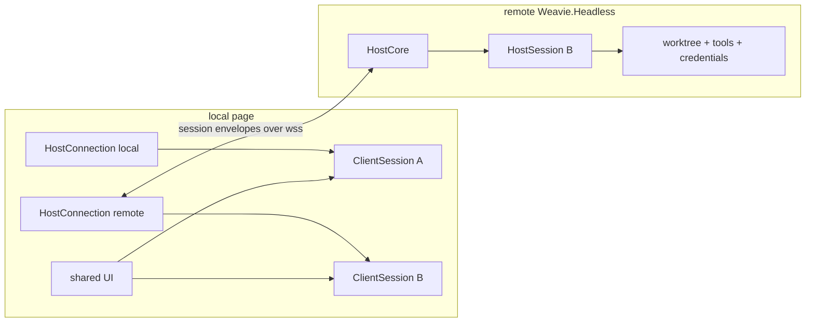

# Remote sessions

**Status:** implemented for registered single-workspace runners.

A remote backend is the same `HostCore` graph as a native workspace, hosted by `Weavie.Headless` and reached
through an authenticated WebSocket. The page may keep several local and remote `HostConnection` objects open
at once. Every connection and every session continues processing its own traffic; selecting a session changes
presentation only.

## Placement

```mermaid
flowchart LR
    subgraph client["local page"]
        UI["shared UI"]
        HC1["HostConnection local"]
        HC2["HostConnection remote"]
        CS1["ClientSession A"]
        CS2["ClientSession B"]
        UI --> CS1 & CS2
        HC1 --> CS1
        HC2 --> CS2
    end

    subgraph worker["remote Weavie.Headless"]
        CORE["HostCore"]
        S["HostSession B"]
        DISK["worktree + tools + credentials"]
        CORE --> S --> DISK
    end

    HC2 <-->|"session envelopes over wss"| CORE
```

Rendering stays in the local page:

- Monaco and xterm;
- command palette, rail, layout, and notifications;
- LSP clients.

Workspace-dependent services stay beside the remote files:

- agent and shell processes;
- file provider and workspace watcher;
- language servers;
- hook bridge, IDE-MCP, change tracking, git, and reviews.

Files and LSP use the remote session bus. No local filesystem abstraction pretends remote paths are local.

## Client aggregation

The web owns one `HostConnection` per connected backend. A connection owns:

- its transport and connection phase;
- host bus and host incarnation;
- full session catalog;
- one `ClientSession` per exact live address;
- host-scoped settings/catalog state.

`registerHostFeature` installs a host feature on every current and future connection.
`registerSessionFeature` does the same for every current and future `ClientSession`. Feature authors do not
enumerate backends or filter messages by the selected backend.

The rail combines the catalogs. A session chip holds its actual `ClientSession`, so selecting a local or
remote chip is the same operation. Selection:

1. changes the local render source;
2. detaches the old view if it was on another host;
3. attaches the new exact session view.

Background sessions still receive terminal output, agent events, editor state, LSP, status, and attention.
An agent completion on an unfocused remote session therefore updates its transcript and may play the local
notification sound.

## Runner and worker

The runner is a control plane for one configured workspace. `GET /backend` ensures its supervised
multi-session `Weavie.Headless` worker is running and returns the current page URL. The web derives the worker
bridge and media URLs from that response.

The runner root is also the canonical browser entry. The user submits the runner token once; the runner stores
it in a host-only persistent cookie, waits for the worker, establishes the worker's token-derived cookie, and
redirects to its clean page URL. Cookies cross ports on the same hostname, so neither credential enters a URL,
script, DOM, or referrer. `/backend` deliberately ignores that browser cookie and remains Bearer-only for the
permissive-CORS native remote-agent path.

The worker credential is a 128-bit, versioned HMAC derivation of the configured runner token and normalized
workspace root. It is distinct from the runner credential but stable across runner restarts, so retained browser
storage and an installed PWA keep working. Persistent deployments must configure the same generated 128-bit
runner token on every start; the convenience token generated when none is configured intentionally rotates both
credentials. Secured modes also pin the worker port, preserving the PWA's origin across restarts.

Worktree sessions are created inside the worker through the same shared `HostCore` flow used locally. The
runner does not create one process per session and does not relay the message stream.

Registered agents are persisted by the local host as `{name, url, token}`. The page resolves `GET /backend`
on every connection attempt, so a restarted runner may advertise a new worker port without leaving a stale
endpoint cached in the client. Changing the runner token or workspace identity rotates the worker token too.

## Authentication and TLS

Headless has two explicit listen modes:

- local loopback mode;
- remote mode, which requires a token.

Binding a network interface without remote mode or providing remote mode without a token fails at startup.
The worker applies one default-deny authentication gate to the document, bridge, media, and other endpoints,
apart from its narrow static-asset allowlist.

The runner supports TLS termination through Tailscale or an explicit proxy mode. An exposed runner or worker
without TLS is rejected. See [tls-on-the-runner.md](tls-on-the-runner.md).

IDE-MCP, the hook bridge, and language-server processes remain loopback/local to the worker. Only the
authenticated host message bus crosses the network.

## Handshake and reconnect

Every WebSocket open starts a fresh `connection.hello` request. Until hello returns:

- the connection is not online;
- session envelopes are buffered by exact address;
- no buffered envelope enters a `ClientSession`.

Hello replaces the authoritative catalog. Buffered traffic is released only for addresses present in that
catalog; old incarnations are discarded. Each live session then receives `lifecycle.sync`, which publishes
its editor, LSP, terminal/agent, review, status, file-index, git, and related snapshots.

A socket drop:

- rejects outstanding host and session requests;
- aborts inbound page handlers;
- leaves the catalog and owned client state available for rendering as disconnected state;
- starts transport reconnect with visible status.

Arbitrary mutations are never replayed. If a request lost the connection before its response, the caller
gets a transport failure. Snapshot sync restores durable state after the next hello.

## Multi-page behavior

The headless transport supports multiple physical peers. Events broadcast; responses are unicast by
`(peer, requestId)`. Each exact session may have one attached presentation peer for transient browser actions.
A later attach displaces the previous view and cancels its outstanding view requests.

That view binding is not a collaborative-editor protocol or an input authorization lease. Durable state and
session messages remain owner-addressed. True simultaneous collaborative editing would require its own
authoritative-buffer and input-arbitration design.

## Durability boundary

Loaded sessions and their processes live on the worker independently of which page is selected. A reconnect
to the same running worker recovers state from those live owners.

Worker restart restores only persisted state:

- worktrees and the loaded-slot overlay;
- provider conversation state supported by the agent runtime;
- per-slot editor-session persistence and session-owned backend state explicitly stored on disk;
- configured terminal scrollback policy.

Foreground processes and other in-memory work cannot survive their worker process ending. This architecture
does not claim process resurrection.

## Required coverage

- catalogs from multiple hosts coexist;
- messages from every host reach only their owning `HostConnection` and `ClientSession`;
- cross-host selection publishes exact detach/attach without rerouting domain traffic;
- remote background completion produces attention;
- a delayed file/LSP response cannot repaint another session;
- a socket drop rejects pending requests;
- reconnect waits for hello, validates incarnations, then syncs sessions;
- two peers using the same textual request id receive only their own response;
- exposed unauthenticated or non-TLS configurations fail closed.

See [session-message-bus.md](session-message-bus.md) and
[host-core-unification.md](host-core-unification.md).
