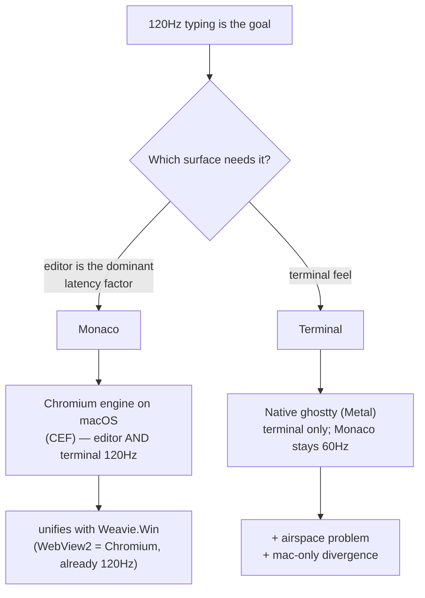

# Rendering engine & 120Hz refresh rate

The vault's GUI & Platform note calls a **120Hz display "the single biggest lever" for perceived
typing latency**. On macOS, Weavie's editor and terminal are stuck at **60Hz** — not because of the
display, but because of the **web engine** hosting them. This doc captures what was measured, why,
and the resulting fork for the stack.

## Measured on the dev machine (M1 Max, built-in Liquid Retina XDR, macOS 26.3, on AC)

The OS display is in 120Hz ProMotion mode (`NSScreen.maximumFramesPerSecond = 120`). A max-demand
`requestAnimationFrame` probe (animate a compositor-driven element every frame for 3s, report the
median frame interval) gives:

| Engine | p50 frame | implied Hz |
|---|---|---|
| **WKWebView** (`Weavie.Mac`) | 17 ms | **60 Hz** |
| **Chromium** (Google Chrome — same engine as WebView2) | 8.3 ms | **120 Hz** (min 7.3ms/137Hz) |

Same web content, same display. The difference is the engine.

## Why: it's WKWebView, and it's about *where* it renders

- **WKWebView caps/paces `requestAnimationFrame` at 60fps on macOS** (WebKit bugs
  [173434](https://bugs.webkit.org/show_bug.cgi?id=173434),
  [294338](https://bugs.webkit.org/show_bug.cgi?id=294338)). A hard cap on macOS 13–15; on 26.3 it's
  not strictly hard (the probe saw sporadic 91Hz) but it still effectively serves ~60Hz for normal
  content. In-app WKWebViews inherit this regardless of the panel.
- **Chromium** drives its own compositor + display-link frame scheduling, so it is not subject to
  WebKit's pacing and reaches the panel's 120Hz.
- This is a property of **the compositor the pixels go through**, not of the terminal/editor
  library. So *any* web-rendered surface — xterm.js, a ghostty-WASM build, Monaco — is 60Hz under
  WKWebView. Only a surface rendered **outside** WebKit (a native GPU view, or a Chromium engine)
  escapes it.

## The fork

| Path | Monaco | Terminal | Airspace | One codebase | Notes |
|---|---|---|---|---|---|
| Stay WKWebView | 60Hz | 60Hz | no | yes | simplest; status quo on mac |
| Native ghostty | **60Hz** | 120Hz | **yes** | no | terminal-only; reopens airspace; `Weavie.Win` stays xterm.js |
| **CEF (Chromium) on mac** | **120Hz** | **120Hz** | no | yes | coherent; matches the Windows engine |

## Conclusions

- **ghostty is the wrong lever for typing latency.** It makes only the *terminal* 120Hz and leaves
  **Monaco — the dominant latency factor — at 60Hz**, while reopening the airspace problem (the web
  UI can't composite over a native Metal surface; the openDiff pane / splitter / overlays would need
  native handling) and forking the terminal architecture (the new `Weavie.Win` stays xterm.js).
  ghostty's legitimate, *separate* justification is terminal **render quality** (GPU glyphs,
  ligatures, shell-integration feel) — not refresh rate.
- **`Weavie.Win` already runs Chromium (WebView2) and is already 120Hz-capable.** macOS WKWebView is
  the lone 60Hz outlier.
- **The coherent path to 120Hz everywhere is CEF (Chromium) in the macOS shell** — editor and
  terminal both at 120Hz, all-web (no airspace), one engine across platforms. Cost: hosting CEF from
  .NET on macOS has no paved path, so it is its own real integration effort (and a larger binary).
- **Or accept 60Hz on mac** if the feel is acceptable (the R15 gut-check passed at roughly this
  rate). The honest test is typing in the real app, awake and focused.

## libghostty embedding — scoping notes (if terminal render quality is later pursued)

- `include/ghostty.h` is the C embedding API, but its header states it is "not meant to be a general
  purpose embedding API (yet)", documented only in Zig source, with ghostty's own Swift macOS app as
  the sole consumer.
- No shared `libghostty.dylib` ships (the C API is static-linked into the `ghostty` executable and
  exported). A dylib must be **built from Zig source** or extracted from **GhosttyKit's** prebuilt
  xcframework.
- Precedents (ghostling, Kytos, GhosttyKit) are all **Swift** — there is **no .NET/C# P/Invoke
  precedent**. The surface is a Metal-backed NSView with callback-heavy app/runtime config and
  involved key-event structs. Treat as a multi-day, leading-edge native spike with a hard
  go/no-go (render a shell in a bare NSView at 120Hz from C# before touching WKWebView composition).

## Resolution (2026-06-16): stay WKWebView, flip the WebKit flag → 120Hz

**Solved cheaply — no CEF, no ghostty.** WKWebView's 60Hz pace is controlled by the WebKit feature
flag **`PreferPageRenderingUpdatesNear60FPSEnabled`** (the same toggle in Safari → Feature Flags →
DOM). Turning it **off** lets WKWebView render at the panel's full refresh. Confirmed **120Hz** in
the app on this machine.

- Mechanism: `Weavie.Mac/Hosting/WebKitFeatureFlags.cs` enumerates the **class** property
  `+[WKPreferences _features]`, finds that flag, and calls `-[WKPreferences _setEnabled:NO forFeature:]`
  on the configuration's preferences before the `WKWebView` is created. (Private SPI — fine for this
  app, not App Store safe; guarded by `respondsToSelector:`, no-ops to 60Hz if WebKit ever drops it.)
- This gives the 120Hz lever to the **entire web UI** — Monaco *and* the terminal — all-web, no
  airspace, no platform divergence, and parity with the Chromium engine `Weavie.Win` already uses.
- **Consequence:** ghostty and CEF are both off the table *for latency*. ghostty would only be worth
  revisiting later for premium terminal **render quality** (GPU glyphs/ligatures), never for Hz; the
  CEF analysis above stands only as a recorded "what if".

Diagnostics retained in `Weavie.Mac`: `WEAVIE_DEBUG_PERFORMANCE=1` enables the latency HUD/meter (and
gates the `WEAVIE_FPSPROBE=1` probe and `WEAVIE_AUTOBENCH=1` benchmark sub-flags); the app logs
`NSScreen.maximumFramesPerSecond` at startup.
