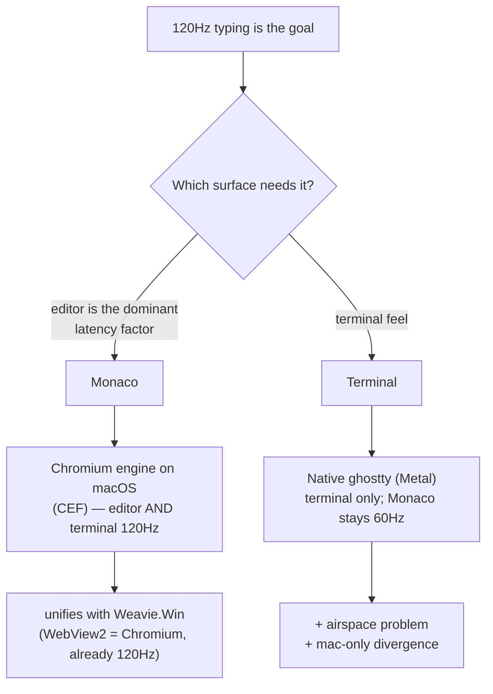

# Rendering engine & 120Hz refresh rate

The vault's GUI & Platform note calls a **120Hz display "the single biggest lever" for perceived
typing latency**. On macOS, Weavie's editor and terminal are stuck at **60Hz** — not because of the
display, but because of the **web engine** hosting them. This doc captures what was measured, why,
and the resulting fork for the stack.

## Measured on the dev machine (M1 Max, built-in Liquid Retina XDR, macOS 26.3, on AC)

The OS display is in 120Hz ProMotion mode (`NSScreen.maximumFramesPerSecond = 120`). A max-demand
`requestAnimationFrame` probe (animate a compositor-driven element every frame for 3s, report the
median frame interval) gives:

| Engine | p50 frame | implied Hz |
|---|---|---|
| **WKWebView** (`Weavie.Mac`) | 17 ms | **60 Hz** |
| **Chromium** (Google Chrome — same engine as WebView2) | 8.3 ms | **120 Hz** (min 7.3ms/137Hz) |

Same web content, same display. The difference is the engine.

## Why: it's WKWebView, and it's about *where* it renders

- **WKWebView caps/paces `requestAnimationFrame` at 60fps on macOS** (WebKit bugs
  [173434](https://bugs.webkit.org/show_bug.cgi?id=173434),
  [294338](https://bugs.webkit.org/show_bug.cgi?id=294338)). A hard cap on macOS 13–15; on 26.3 it's
  not strictly hard (the probe saw sporadic 91Hz) but it still effectively serves ~60Hz for normal
  content. In-app WKWebViews inherit this regardless of the panel.
- **Chromium** drives its own compositor + display-link frame scheduling, so it is not subject to
  WebKit's pacing and reaches the panel's 120Hz.
- This is a property of **the compositor the pixels go through**, not of the terminal/editor
  library. So *any* web-rendered surface — xterm.js, a ghostty-WASM build, Monaco — is 60Hz under
  WKWebView. Only a surface rendered **outside** WebKit (a native GPU view, or a Chromium engine)
  escapes it.

## The fork

```mermaid
flowchart TD
    G["120Hz typing is the goal"] --> Q{Which surface needs it?}
    Q -->|editor is the dominant<br/>latency factor| E[Monaco]
    Q -->|terminal feel| T[Terminal]
    E --> CEF["Chromium engine on macOS<br/>(CEF) — editor AND terminal 120Hz"]
    T --> GH["Native ghostty (Metal)<br/>terminal only; Monaco stays 60Hz"]
    GH --> AIR["+ airspace problem<br/>+ mac-only divergence"]
    CEF --> UNI["unifies with Weavie.Win<br/>(WebView2 = Chromium, already 120Hz)"]
```

| Path | Monaco | Terminal | Airspace | One codebase | Notes |
|---|---|---|---|---|---|
| Stay WKWebView | 60Hz | 60Hz | no | yes | simplest; status quo on mac |
| Native ghostty | **60Hz** | 120Hz | **yes** | no | terminal-only; reopens airspace; `Weavie.Win` stays xterm.js |
| **CEF (Chromium) on mac** | **120Hz** | **120Hz** | no | yes | coherent; matches the Windows engine |

## Conclusions

- **ghostty is the wrong lever for typing latency.** It makes only the *terminal* 120Hz and leaves
  **Monaco — the dominant latency factor — at 60Hz**, while reopening the airspace problem (the web
  UI can't composite over a native Metal surface; the openDiff pane / splitter / overlays would need
  native handling) and forking the terminal architecture (the new `Weavie.Win` stays xterm.js).
  ghostty's legitimate, *separate* justification is terminal **render quality** (GPU glyphs,
  ligatures, shell-integration feel) — not refresh rate.
- **`Weavie.Win` already runs Chromium (WebView2) and is already 120Hz-capable.** macOS WKWebView is
  the lone 60Hz outlier.
- **The coherent path to 120Hz everywhere is CEF (Chromium) in the macOS shell** — editor and
  terminal both at 120Hz, all-web (no airspace), one engine across platforms. Cost: hosting CEF from
  .NET on macOS has no paved path, so it is its own real integration effort (and a larger binary).
- **Or accept 60Hz on mac** if the feel is acceptable (the R15 gut-check passed at roughly this
  rate). The honest test is typing in the real app, awake and focused.

## libghostty embedding — scoping notes (if terminal render quality is later pursued)

- `include/ghostty.h` is the C embedding API, but its header states it is "not meant to be a general
  purpose embedding API (yet)", documented only in Zig source, with ghostty's own Swift macOS app as
  the sole consumer.
- No shared `libghostty.dylib` ships (the C API is static-linked into the `ghostty` executable and
  exported). A dylib must be **built from Zig source** or extracted from **GhosttyKit's** prebuilt
  xcframework.
- Precedents (ghostling, Kytos, GhosttyKit) are all **Swift** — there is **no .NET/C# P/Invoke
  precedent**. The surface is a Metal-backed NSView with callback-heavy app/runtime config and
  involved key-event structs. Treat as a multi-day, leading-edge native spike with a hard
  go/no-go (render a shell in a bare NSView at 120Hz from C# before touching WKWebView composition).

## Resolution (2026-06-16): stay WKWebView, flip the WebKit flag → 120Hz

**Solved cheaply — no CEF, no ghostty.** WKWebView's 60Hz pace is controlled by the WebKit feature
flag **`PreferPageRenderingUpdatesNear60FPSEnabled`** (the same toggle in Safari → Feature Flags →
DOM). Turning it **off** lets WKWebView render at the panel's full refresh. Confirmed **120Hz** in
the app on this machine.

- Mechanism: `Weavie.Mac/Hosting/WebKitFeatureFlags.cs` enumerates the **class** property
  `+[WKPreferences _features]`, finds that flag, and calls `-[WKPreferences _setEnabled:NO forFeature:]`
  on the configuration's preferences before the `WKWebView` is created. (Private SPI — fine for this
  app, not App Store safe; guarded by `respondsToSelector:`, no-ops to 60Hz if WebKit ever drops it.)
- This gives the 120Hz lever to the **entire web UI** — Monaco *and* the terminal — all-web, no
  airspace, no platform divergence, and parity with the Chromium engine `Weavie.Win` already uses.
- **Consequence:** ghostty and CEF are both off the table *for latency*. ghostty would only be worth
  revisiting later for premium terminal **render quality** (GPU glyphs/ligatures), never for Hz; the
  CEF analysis above stands only as a recorded "what if".

Diagnostics retained in `Weavie.Mac`: `WEAVIE_DEBUG_PERFORMANCE=1` enables the latency HUD/meter (and
gates the `WEAVIE_FPSPROBE=1` probe and `WEAVIE_AUTOBENCH=1` benchmark sub-flags); the app logs
`NSScreen.maximumFramesPerSecond` at startup.

## Linux (2026-08-18): WebKitGTK caps at 60Hz on a 240Hz panel

The same question on `Weavie.Linux` (GTK3 + WebKitGTK 4.1), measured on an NVIDIA/Wayland box with a
240Hz LG UltraGear. Flipping `PreferPageRenderingUpdatesNear60FPS` — the lever that solved macOS — is
already done in `Weavie.Linux/Native/WebKit.cs` and changes nothing here.

Each layer measured independently (`tools/` holds the probes):

| layer | measured | verdict |
|---|---|---|
| panel / compositor / driver (Firefox `requestAnimationFrame`) | 721 frames/3s = **240Hz** | fine |
| `gdk_monitor_get_refresh_rate` | **240.023 Hz** | fine |
| DRM connector match (EDID size vs GDK's) | `card1-HDMI-A-1` 697x392mm, matches | fine |
| **GTK3 frame clock** (`gtk-tick.cs`) | 708 ticks/3s = **236Hz**, p50 4.17ms | fine — not the ceiling |
| GTK4 frame clock (`gtk4-tick.cs`) | 182 ticks/3s = **60.7Hz**, p50 16.67ms | a port to webkitgtk-6.0 would be *worse* |
| **bare WebKitGTK window** (`webkit-fps.cs`) | 180 frames/3s = **exactly 60.0** | the cap |

Conclusions:

- **The cap is inside WebKitGTK, not Weavie.** A window containing nothing but a moving box measures
  the same 60.0, and every surface the app renders inherits it.
- **It is not the vblank monitor's pacing.** `WEBKIT_FORCE_VBLANK_TIMER=1` should free-run at 62.5fps
  (the monitor's `sleep_for(milliseconds(1000 / 60))` — integer division, so 16ms, not 16.67ms) and on
  the SHM path it does, giving 188 frames/3s. On the DMA-BUF path it still lands on exactly 180, so
  something downstream imposes 60 regardless of the clock WebKit uses.
- **GTK3 is not the ceiling and GTK4 is worse**, which removes the obvious "port the host" answer.
  Measure before porting: GTK3's clock only falls back to its hardcoded 16667us when presentation
  timings give it nothing, and here it gets them.
- **NVIDIA explicit sync is forced off** by `LinuxGraphicsCompatibility` (WebKit bug 280210, still
  NEW upstream, affecting 2.46 through 2.50.5). Without it a bare WebKitGTK window dies with
  `Error 71 (Protocol error) dispatching to Wayland display`, so the implicit-sync path cannot be
  A/B'd against explicit sync while that bug is open — it remains the prime suspect for the cap.

Open: whether WebKit's `DisplayLink` believes the display is 60 or 240 (`WEBKIT_DISPLAY_REFRESH_THROTTLE_FPS`
set to a non-factor makes it log the rate through `WTFLogAlways`). That answer decides between an
upstream WebKitGTK report and chasing the DMA-BUF present path.

### The cap follows the accelerated buffer path, not the toolkit

Extending the measurement to GTK4's renderers and WebKit's GTK4 build (same machine):

| path | measured |
|---|---|
| GTK4 frame clock, `GSK_RENDERER=cairo` (software) | 695 ticks/3s = **231.7Hz** |
| GTK4 frame clock, `GSK_RENDERER=gl` / `ngl` | 173-180 ticks/3s = **60Hz** |
| GTK4 frame clock, `GSK_RENDERER=vulkan` | `Error 71 (Protocol error)` |
| webkitgtk-6.0 (GTK4), default renderer | `Error 71 (Protocol error)` — GTK4 defaults to Vulkan |
| webkitgtk-6.0 (GTK4), `GSK_RENDERER=gl` | 189 frames/3s = **62.5Hz**, p50 16.00ms |
| webkitgtk-6.0 (GTK4), `GSK_RENDERER=cairo` | 189 frames/3s = **62.5Hz**, p50 16.00ms |

So the split is not GTK3 against GTK4: on this NVIDIA/Wayland box every **software** buffer path reaches
the panel's rate (GTK4 cairo 231.7Hz, WebKit's SHM renderer free-running at its 62.5Hz timer) while every
**accelerated** one lands on exactly 60. Mesa also logs `failed to create dri2 screen` for `10de:2684`
under GTK4, so its GL renderers are not on a healthy path to begin with.

That closes the port question. webkitgtk-6.0 runs once GTK4's default Vulkan renderer is replaced (that
renderer hits the same protocol bug on its own, with no WebKit involved), and it then measures 62.5Hz on
both `gl` and `cairo` — a p50 of exactly 16.00ms, which is the vblank monitor's `1000 / 60` integer-millisecond
timer, not a display rate. So **WebKit's GTK4 build never receives vblanks here at all**, and no WebKit
configuration on this machine exceeds ~63Hz while the toolkit beneath it reaches 231-236Hz.

Caveat on the GTK3 reading above: that probe ticks a `GtkDrawingArea` with no draw handler, so its 236Hz
clock does not prove GTK3 is presenting accelerated frames at that rate — only that its clock is not the
thing imposing 60.
