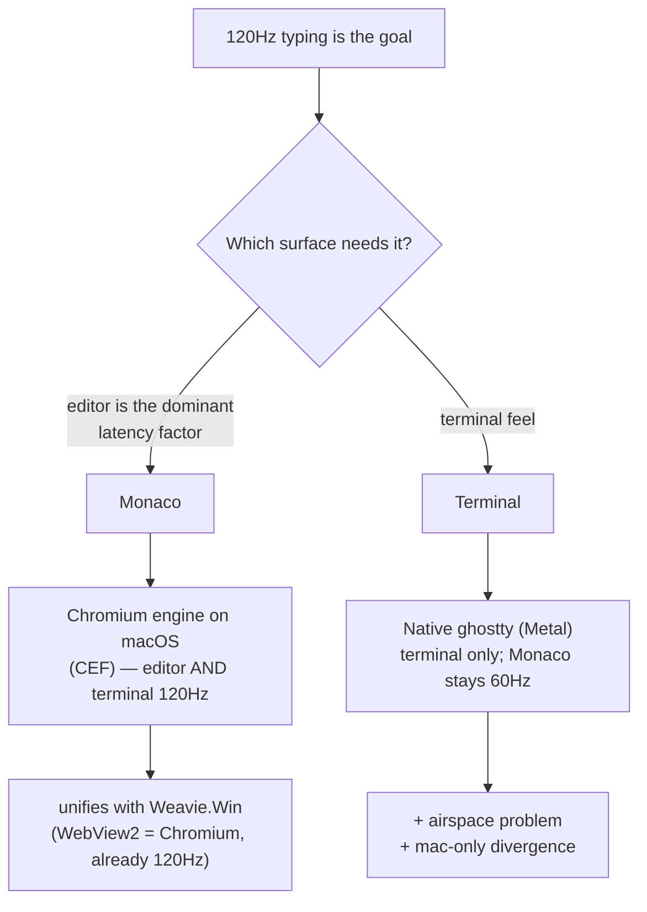

# Rendering engine & refresh rate

The vault's GUI & Platform note calls a **120Hz display "the single biggest lever" for perceived
typing latency**. On macOS, Weavie's editor and terminal are stuck at **60Hz** — not because of the
display, but because of the **web engine** hosting them. This doc captures what was measured, why,
and the resulting fork for the stack.

## Measured on the dev machine (M1 Max, built-in Liquid Retina XDR, macOS 26.3, on AC)

The OS display is in 120Hz ProMotion mode (`NSScreen.maximumFramesPerSecond = 120`). A max-demand
`requestAnimationFrame` probe (animate a compositor-driven element every frame for 3s, report the
median frame interval) gives:

| Engine | p50 frame | implied Hz |
|---|---|---|
| **WKWebView** (`Weavie.Mac`) | 17 ms | **60 Hz** |
| **Chromium** (Google Chrome — same engine as WebView2) | 8.3 ms | **120 Hz** (min 7.3ms/137Hz) |

Same web content, same display. The difference is the engine.

## Why: it's WKWebView, and it's about *where* it renders

- **WKWebView caps/paces `requestAnimationFrame` at 60fps on macOS** (WebKit bugs
  [173434](https://bugs.webkit.org/show_bug.cgi?id=173434),
  [294338](https://bugs.webkit.org/show_bug.cgi?id=294338)). A hard cap on macOS 13–15; on 26.3 it's
  not strictly hard (the probe saw sporadic 91Hz) but it still effectively serves ~60Hz for normal
  content. In-app WKWebViews inherit this regardless of the panel.
- **Chromium** drives its own compositor + display-link frame scheduling, so it is not subject to
  WebKit's pacing and reaches the panel's 120Hz.
- This is a property of **the compositor the pixels go through**, not of the terminal/editor
  library. So *any* web-rendered surface — xterm.js, a ghostty-WASM build, Monaco — is 60Hz under
  WKWebView. Only a surface rendered **outside** WebKit (a native GPU view, or a Chromium engine)
  escapes it.

## The fork


```mermaid
flowchart TD
    G["120Hz typing is the goal"] --> Q{Which surface needs it?}
    Q -->|editor is the dominant<br/>latency factor| E[Monaco]
    Q -->|terminal feel| T[Terminal]
    E --> CEF["Chromium engine on macOS<br/>(CEF) — editor AND terminal 120Hz"]
    T --> GH["Native ghostty (Metal)<br/>terminal only; Monaco stays 60Hz"]
    GH --> AIR["+ airspace problem<br/>+ mac-only divergence"]
    CEF --> UNI["unifies with Weavie.Win<br/>(WebView2 = Chromium, already 120Hz)"]
```

| Path | Monaco | Terminal | Airspace | One codebase | Notes |
|---|---|---|---|---|---|
| Stay WKWebView | 60Hz | 60Hz | no | yes | simplest; status quo on mac |
| Native ghostty | **60Hz** | 120Hz | **yes** | no | terminal-only; reopens airspace; `Weavie.Win` stays xterm.js |
| **CEF (Chromium) on mac** | **120Hz** | **120Hz** | no | yes | coherent; matches the Windows engine |

## Conclusions

- **ghostty is the wrong lever for typing latency.** It makes only the *terminal* 120Hz and leaves
  **Monaco — the dominant latency factor — at 60Hz**, while reopening the airspace problem (the web
  UI can't composite over a native Metal surface; the openDiff pane / splitter / overlays would need
  native handling) and forking the terminal architecture (the new `Weavie.Win` stays xterm.js).
  ghostty's legitimate, *separate* justification is terminal **render quality** (GPU glyphs,
  ligatures, shell-integration feel) — not refresh rate.
- **`Weavie.Win` already runs Chromium (WebView2) and is already 120Hz-capable.** macOS WKWebView is
  the lone 60Hz outlier.
- **The coherent path to 120Hz everywhere is CEF (Chromium) in the macOS shell** — editor and
  terminal both at 120Hz, all-web (no airspace), one engine across platforms. Cost: hosting CEF from
  .NET on macOS has no paved path, so it is its own real integration effort (and a larger binary).
- **Or accept 60Hz on mac** if the feel is acceptable (the R15 gut-check passed at roughly this
  rate). The honest test is typing in the real app, awake and focused.

## libghostty embedding — scoping notes (if terminal render quality is later pursued)

- `include/ghostty.h` is the C embedding API, but its header states it is "not meant to be a general
  purpose embedding API (yet)", documented only in Zig source, with ghostty's own Swift macOS app as
  the sole consumer.
- No shared `libghostty.dylib` ships (the C API is static-linked into the `ghostty` executable and
  exported). A dylib must be **built from Zig source** or extracted from **GhosttyKit's** prebuilt
  xcframework.
- Precedents (ghostling, Kytos, GhosttyKit) are all **Swift** — there is **no .NET/C# P/Invoke
  precedent**. The surface is a Metal-backed NSView with callback-heavy app/runtime config and
  involved key-event structs. Treat as a multi-day, leading-edge native spike with a hard
  go/no-go (render a shell in a bare NSView at 120Hz from C# before touching WKWebView composition).

## Resolution (2026-06-16): stay WKWebView, flip the WebKit flag → 120Hz

**Solved cheaply — no CEF, no ghostty.** WKWebView's 60Hz pace is controlled by the WebKit feature
flag **`PreferPageRenderingUpdatesNear60FPSEnabled`** (the same toggle in Safari → Feature Flags →
DOM). Turning it **off** lets WKWebView render at the panel's full refresh. Confirmed **120Hz** in
the app on this machine.

- Mechanism: `Weavie.Mac/Hosting/WebKitFeatureFlags.cs` enumerates the **class** property
  `+[WKPreferences _features]`, finds that flag, and calls `-[WKPreferences _setEnabled:NO forFeature:]`
  on the configuration's preferences before the `WKWebView` is created. (Private SPI — fine for this
  app, not App Store safe; guarded by `respondsToSelector:`, no-ops to 60Hz if WebKit ever drops it.)
- This gives the 120Hz lever to the **entire web UI** — Monaco *and* the terminal — all-web, no
  airspace, no platform divergence, and parity with the Chromium engine `Weavie.Win` already uses.
- **Consequence:** ghostty and CEF are both off the table *for latency*. ghostty would only be worth
  revisiting later for premium terminal **render quality** (GPU glyphs/ligatures), never for Hz; the
  CEF analysis above stands only as a recorded "what if".

Diagnostics retained in `Weavie.Mac`: `WEAVIE_DEBUG_PERFORMANCE=1` enables the latency HUD/meter (and
gates the `WEAVIE_FPSPROBE=1` probe and `WEAVIE_AUTOBENCH=1` benchmark sub-flags); the app logs
`NSScreen.maximumFramesPerSecond` at startup.

## Linux (2026-08-19): GTK 4 + a display-sync library → 240Hz

Measured on CachyOS (kernel 7.1.8), KDE/KWin 6.7.4 Wayland, NVIDIA 610.57.04 / RTX 4090, LG UltraGear at
240.023Hz. The Linux host rendered every surface at exactly **60Hz**; it now measures **240.3Hz** (p50
4.00ms) in the running app. Two independent caps had to come off, and each was proved load-bearing by
measuring with the other one already lifted.

Flipping `PreferPageRenderingUpdatesNear60FPS` — the whole fix on macOS — changes nothing here, because
neither cap is that preference.

### Establishing that the machine was never the problem

| probe | result |
|---|---|
| raw `wl_egl` + EGL client (`es2gears_wayland`) | **240.6 FPS** |
| GTK 3 window, cairo (SHM) drawing | 236.6Hz, frame timings complete, `refresh_interval` 4166us |
| GTK 3 window, `GtkGLArea` | **59.7Hz**, timings *never* complete, `refresh_interval` 0 |
| GTK 4 window, `GtkGLArea` | **229.5Hz**, timings complete, `refresh_interval` 4166us |
| GTK 3 under XWayland (`GDK_BACKEND=x11`) | 59.3Hz — XWayland is its own 60Hz ceiling |

NVIDIA, KWin, and the dma-buf path all reach 240. Only GTK 3's accelerated path does not.

### Cap 1 — GDK 3's frame clock free-runs at a hardcoded 60Hz for GL windows

`gdk/wayland/gdkwindow-wayland.c` deliberately clears `pending_commit` for a GL frame ("it'll be done
implicitly by `eglSwapBuffers()`"). `on_frame_clock_after_paint` then returns early, so GDK never requests
a `wl_surface.frame`, never sets `awaiting_frame`, and never records frame timings. With no complete
timings, `gdk/gdkframeclockidle.c` falls back to its `FRAME_INTERVAL` of **16667us**. That is the 60Hz, and
it is not reachable from outside GTK: the fix lives behind `_gdk_frame_clock_freeze`/`_thaw`, which GTK 3
does not export.

WebKitGTK's UI process paints through `gdk_cairo_draw_from_gl`, so the window is always a GL window — and
it sends `FrameDone` to the web process from `paint()`, so the web process inherits the cap too. That
handshake is what earlier investigation mistook for a WebKit-internal pacer.

**Fix: `Weavie.Linux` now runs on GTK 4 + webkitgtk-6.0**, whose frame clock is driven by real presentation
feedback on every path. A GTK 3 host with a *perfectly working* 240Hz vblank monitor still measures exactly
60.0Hz; the same page on GTK 4 measures 223Hz. The port is not optional.

### Cap 2 — WebKit's DRM vblank monitor never constructs

`DisplayVBlankMonitorDRM::create()` needs a connected DRM connector whose EDID millimetres *exactly* equal
`gdk_monitor_get_*_mm`, **and** a working `drmWaitVBlank`. Otherwise WebKit silently uses
`DisplayVBlankMonitorTimer` — nominal 60fps, `sleep_for(1000 / 60)` — and a p50 of exactly **16.00ms** is
that timer's fingerprint. Both preconditions fail on an ordinary desktop:

- **The sizes disagree by 3mm.** EDID stores the physical size twice: whole centimetres in the base block
  (what the kernel puts on the connector — 700x390 here) and exact millimetres in the detailed timing
  descriptor (what the compositor hands GDK — 697x392). Any monitor that is not a whole number of
  centimetres reproduces this, on every driver.
- **`drmWaitVBlank` returns `EOPNOTSUPP` (errno 95).** `nvidia_drm` has a `vblank` module parameter —
  *"Enable drm vblank notification support (1 = enable, 0 = disable (default))"* — and it is off by
  default. (Earlier notes recorded the wrong errno: libdrm's `drmWaitVBlank` returns `-1` with `errno`
  set, not `-errno`, so `strerror(-ret)` prints nonsense. WebKit's own logging has the same bug.)

**Fix: `src/Weavie.Linux/native/weavie-display-sync.c`**, a 200-line library the host `dlopen`s with
`RTLD_GLOBAL` before GTK, so it sits in front of libdrm for this process:

- `drmModeGetConnector` reports the size the compositor reports, for any connected connector within the
  one centimetre that EDID's own rounding can explain.
- `drmWaitVBlank` forwards to the driver and, only when the driver has no vblank to wait on, answers on a
  monotonic grid at that CRTC's refresh rate. The compositor still vsyncs what the cadence produces; this
  only replaces WebKit's hardcoded-60 timer with the display's real period.

`Native/DisplaySync.cs` loads it and registers the monitors GDK reports (re-registering on display change).
No `LD_PRELOAD` and no re-exec: an in-process `dlopen(RTLD_GLOBAL)` before libdrm is loaded is enough.

### Measuring it

`tools/refresh-rate.cs` runs the shipping engine both ways:

```
dotnet run tools/refresh-rate.cs                                     # 60 Hz, p50 16.00ms — WebKit's floor
dotnet run tools/refresh-rate.cs --display-sync <built .so>          # 228 Hz, p50 4.00ms
```

| stack | measured |
|---|---|
| GTK 3 + webkit2gtk-4.1, vblank monitor working at 240 | **60.0Hz** (p50 17.00ms) |
| GTK 4 + webkitgtk-6.0, stock | 60Hz (p50 16.00ms) |
| GTK 4 + webkitgtk-6.0, vblank working but sizes not reconciled | 58Hz (p50 16.00ms) |
| GTK 4 + webkitgtk-6.0, both fixes | **228Hz** (p50 4.00ms) |
| the real Weavie app, both fixes | **240.3Hz** (p50 4.00ms) |

### Renderer

GTK 4 defaults to its Vulkan renderer, which measures ~140Hz against ~228Hz for its GL renderer on this
NVIDIA box. `LinuxGraphicsCompatibility` therefore asks for `GSK_RENDERER=gl` when `nvidia_drm` is loaded
and the user has not chosen one themselves.

### What the port changed beyond the frame rate

- Window **position** is no longer saved or restored: GTK 4 has no client-side positioning on either
  backend (GTK 3 already had none on Wayland). Size and maximized state still round-trip.
- The clipboard and the folder picker are async in GTK 4; both are bridged back to the synchronous answer
  the host bus expects through one nested main loop (`Native/MainLoopWait.cs`) — the same nesting GTK 3
  did inside `gtk_clipboard_wait_for_text` and `gtk_native_dialog_run`.
- `gtk_clipboard_store` has no GTK 4 equivalent; clipboard persistence after exit is the compositor's
  clipboard manager's job now.
- X11 global hotkeys own a private X connection watched on the main loop, because GTK 4 removed
  `gdk_window_add_filter`. The grabs run under an error handler that records failures instead of Xlib's
  default one, which exits the process.
- The window icon comes from the themed name `LinuxDesktopIdentity` already installs, so the host no
  longer links gdk-pixbuf.
