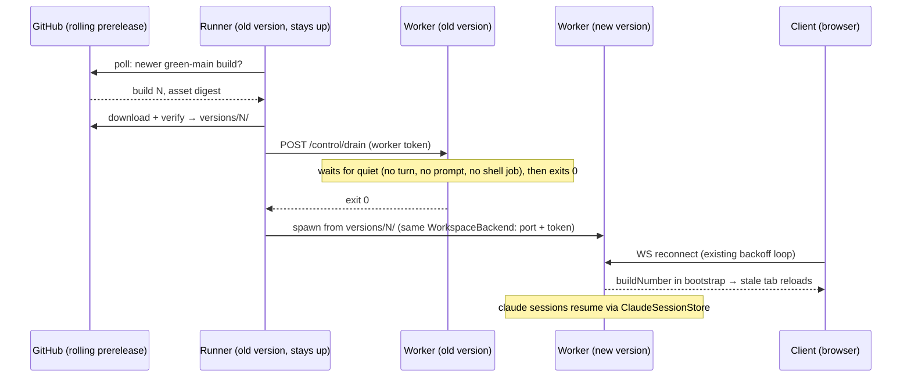

# Runner auto-update

**Status:** draft — design agreed and pressure-tested against the code; not yet built.

The runner (`src/Weavie.Runner`) is a long-lived daemon on a dedicated box. Today it runs whatever
build it was started from, forever; getting a new version means SSH-ing in, rebuilding, and
restarting by hand. This spec makes the **worker** (`Weavie.Headless`, the process that actually
changes day-to-day) auto-update from CI builds of green `main`, while the **runner itself stays on
its version until restarted** — deliberately.

## Design principle: update the workers, not the updater

A self-updating runner (symlink flip + exit 0 + external supervisor restart) has a fatal flaw: when
the *new* version crashes on startup, nobody is alive to roll back — a headless box bricks until
someone SSHes in. Inverting it dissolves the problem:

- The runner — a thin, rarely-changing control plane — keeps executing its current version and
  **supervises the swap**. A new worker that crash-loops is observed by old, known-good code
  (`ProcessSupervisor`'s breaker), which rolls back to the previous version. Rollback is a
  supervised decision, not a dead-man's switch. No external supervisor (systemd) is required.
- The worker bundle is where merges land (`Weavie.Core`/`Hosting`/`Headless` + the web UI, which
  the worker serves itself), so worker-only updates cover the code that actually moves.
- The runner still upgrades **lazily**: the downloaded bundle contains both binaries, and a
  managed install launches the runner through the `current` symlink — any restart (manual or
  crash) comes up on the newest version. "Runner keeps its version until restarted" is the
  implementation, not a policy.



## Version identity: the existing build number

Builds are already versioned: `Directory.Build.props` stamps `VersionPrefix =
0.1.$(GITHUB_RUN_NUMBER)`, `HostCore.BuildNumber` (`src/Weavie.Hosting/HostCore.cs:238`) reads it
(and throws if missing), and it reaches the web bootstrap as `__WEAVIE_SHELL__.buildNumber`. That
number is the update system's **single identity** end to end: the `versions/<N>/` directory key,
the poll comparison, the skew check, and the client-reload signal. It is monotonic, which makes
"newer" and `minRunnerVersion` plain integer comparisons — no SHA ordering, no semver ceremony.
The web bundle needs no version of its own: the page and its assets are served by the same worker
that injects `buildNumber`, so the bootstrap value *is* the bundle's version marker.

## Update source: rolling prerelease per green `main` commit

`.github/workflows/release.yml` already builds the exact payload: the `runner-linux-x64` job
publishes `Weavie.Runner` with `Weavie.Headless` staged into `worker/` and the web `dist` bundled —
one artifact is the complete deploy. Changes:

- **Trigger on green `main`**: run the runner-linux-x64 publish via `workflow_run` on the CI
  workflow's success on `main`.
- **Publish as a rolling GitHub prerelease** (tag `main-latest`, assets replaced each run) rather
  than an Actions artifact: release assets are fetchable with a plain bearer token (or anonymously
  on a public repo) and carry a `digest` in the API response; Actions artifacts need the Actions
  API and expire. Requires `contents: write` on that job (the workflow is `contents: read` today).
- The bundle carries a small `manifest.json`: `{ buildNumber, spawnContract }`, written by the
  publish itself (an MSBuild target — CI never hand-assembles it). `spawnContract` is a generation
  integer declared once (`SpawnContractVersion` in `Directory.Build.props`) and compiled into the
  runner as assembly metadata, so bundle and runner compare the same single-sourced number.
- The asset **is the managed layout**: a tarball extracting to `versions/<N>/…` plus a `current`
  symlink. Installing — with or without any intent to auto-update — is extracting it into
  `~/.weavie/runner/` and launching `current/Weavie.Runner`; the auto-updater manages the same
  layout a manual install creates, so there is no separate bootstrap step and no installer.

The runner polls the Releases API for a build number above its staged-latest, honoring rate limits
(unauthenticated: 60 req/h; the fixed cadence stays well under it).

## Disk layout & version resolution

```
~/.weavie/runner/
  versions/
    1412/            # full publish bundle: Weavie.Runner, worker/Weavie.Headless.dll, wwwroot, …
    1418/
  current -> versions/1418/     # what a runner (re)start executes; re-pointed after verify
  state.json                    # staged, confirmed-good, and bad build numbers
```

- The layout is not auto-update-specific: with `--auto-update` **off**, a runner launched from
  `current` runs that version until someone extracts a newer tarball or restarts it — workers
  spawn from its co-located `worker/` via the existing probe, unchanged. The flag only adds the
  poller on top of the same layout.
- The release tarball intentionally has no mutable `state.json`. On first open, the runner validates
  and adopts the build selected by `current`; `current` is also authoritative after a crash between
  its swap and the state write. Version directories are immutable: staging reuses an existing build
  only when its manifest and worker are valid, and never deletes it. The `current` symlink itself is
  replaced with an atomic rename.
- Downloads land in a temp dir and move into `versions/<N>/` only after the asset digest verifies
  against the API's `digest` field — never a partially-extracted version dir.
- **Workers are always spawned from a concrete, resolved version path** — never through the
  `current` symlink. The worker's `AppContext.BaseDirectory` is where it serves `wwwroot` from
  (`src/Weavie.Headless/Program.cs`), per request; a worker running "through" the symlink would
  start serving the *new* web assets the instant `current` is re-pointed, while still running the
  *old* backend — an asset/bridge mismatch the reload signal cannot fix. `HeadlessLauncher` takes
  a spawn-time path provider (a required `Func<string>`; no optional param) that returns the
  staged version's real `worker/Weavie.Headless.dll` path.
- **The hook relay is the deliberate exception** to "never through `current`": the Claude
  `--settings` file bakes the relay through the symlink — `<root>/current/worker/weavie-hook-relay`,
  via `ManagedRunnerLayout.CurrentRelayPath` — *not* the worker's resolved version dir. A claude can
  outlive the worker that spawned it (a detached `claude daemon`, or one not relaunched on the
  bounce) and would otherwise hold a hook path into a since-pruned version dir — a dangling
  `weavie-hook-relay: not found` on every hook. The relay is version-independent (it forwards over a
  per-hook named pipe), so riding `current` is safe; the accepted cost is that a backwards-incompatible
  relay change needs the surviving claude restarted.
- Retention: the confirmed-good version plus the staged one; older dirs are pruned only when no
  live process (runner *or* worker) was spawned from them, and pruning is logged with the freed
  path. The rollback target is derived from `state.json` — no second symlink to keep in sync.

## Update flow

The runner owns orchestration; every step that touches the worker's lifecycle runs **behind
`BackendManager`'s existing `_gate`** (new methods on it, e.g. `RestartInPlace`), because
`Ensure()` fires on any `/backend` hit and must not race the updater into disposing the supervisor
or minting a new token/port. When auto-update manages the backend, `Ensure`'s `Failed` branch no
longer re-provisions — the updater owns that transition and **preserves the `WorkspaceBackend`'s
port and token**, which is what keeps reconnecting tabs (token is baked into the served page) and
the TLS-front mapping (pinned worker port, `TailscaleServeFront` maps once at construction) valid
across the swap.

1. **Poll** (only when `--auto-update` is on): a release build number above the staged one →
   download, verify digest, check `manifest.json`'s `spawnContract` against the runner's own
   generation (an unsatisfiable bundle is *not* applied — see *Version skew*), extract to
   `versions/<N>/`, re-point `current`, record as staged.
2. **Announce**: the runner tells the worker an update is staged; the worker pushes an
   *update-pending* state to connected clients.
3. **Drain**: the runner requests drain on a token-gated worker control endpoint. The worker owns
   the gate, and draining never asks the user to confirm anything — updates apply automatically at
   the first quiet moment. A startup `503` from the worker is retryable: the process is running but
   its Core graph is not ready to drain yet. It has two phases:
   - **Pending** — the box is busy. Everything keeps working normally; new prompts are allowed and
     simply extend the wait. A passive *update pending* indicator names what is holding the update.
     There is **no drain timeout** — a busy box holds the update until quiet, and *restart now* (a
     command) lets the user accelerate; it is never automatic.
   - **Restarting** — the moment the gate is satisfied, the worker **stops forwarding terminal
     input** and pushes a *restarting* state the client renders as a full-UI blocking overlay
     ("Updating…"), then exits `0`. The overlay spans exit → reconnect → reload-when-stale →
     dismiss, typically a few seconds; it is the visible surface of the server-side input stop
     (the authoritative mechanism — a lagging client cannot race it). If a session flips to
     `Working` after commit but before exit (a prompt that was already in flight — `Working` is
     only set when the `UserPromptSubmit`/`PreToolUse` hook arrives), the worker aborts the
     commit, resumes input, and returns to pending. The residual race is bounded by hook latency
     at the commit instant — accepted and stated, not papered over.

   The gate is: **no session `Working`, `NeedsInput`, or `Waiting`** — `Working`/`NeedsInput` is an
   in-flight turn or a pending permission prompt whose tool call a kill would discard; `Waiting` is a
   turn that *ended* but armed a self-continuation that a restart would destroy (see below) — **and no
   shell pane with a foreground job** (`tcgetpgrp` on the pane's PTY differs from the shell's own
   process group). The shell condition exists because unattended is the normal case: killing a dev
   server or build left running in a pane at 3am is silent destruction no pending-UI warning excuses.
   A genuinely idle prompt drains; a *waiting* session or a running job holds the update, named in the
   indicator. Notes on the gate:
   - There is no aggregate today — `SessionStatusMachine` is per-session and the loaded-session
     set is private to `HostCore`. The gate is a new Core-owned seam (all hosts get it). The
     foreground-job check is a small PTY-shim addition.
   - `Starting` **drains**: it's the machine's initial state (a claude pane with no activity yet —
     including a worker no client has connected to, which sits at `Starting` indefinitely), has no
     in-flight turn, and resumes deterministically.
   - `Waiting` **holds**: a turn that ends with a pending one-shot scheduled wakeup or an in-flight
     background task looks `Idle` but will resume itself, and a restart kills the pending step (the
     motivating incident: an overnight "wait 15m then check CI" loop restarted away, and — nothing
     connected to resume it — a night of progress was lost). `SessionStatusMachine` reads it straight
     from the `Stop` hook's two registries: a `session_crons` entry with `recurring:false` (a one-shot
     wakeup; `ScheduleWakeup` / a dynamic loop) or any in-flight `background_tasks` entry. A
     `recurring:true` cron is **excluded** — a standing routine survives the restart and would hold the
     update forever. `Waiting` clears the instant a turn ends with those registries empty.
   - **Background shell jobs** (`&`, `nohup`) are invisible to the foreground check and die at
     restart; the pending indicator says so.
4. **Restart**: the runner sees the clean exit and respawns the same `WorkspaceBackend` from the
   staged version. `ProcessSupervisor` supports this — a clean exit under `OnFailure` lands in
   `Idle`, and `Start()` runs again from there — but the update path must go **`Stop()` →
   `Start()`**: only `Stop()` clears the crash-history window, and a rollback that skips it would
   inherit the bad version's crashes and insta-trip the breaker on the known-good version.
   The drain callback signals the Generic Host's `ApplicationStopping`; Headless's lifetime wait
   must drive `StopAsync` through `ApplicationStopped` so the worker process can actually exit.
5. **Confirm**: the runner probes the worker's control endpoint, which reports its `BuildNumber`;
   the number answering marks that version confirmed-good in `state.json`. (The runner never speaks
   the bridge, so confirmation is an HTTP probe, not a WS handshake.) Confirmation means "boots and
   serves" — a build that comes up but crash-loops under later real use is already confirmed, and
   recovery for that is the supervisor's normal re-provision path, not an update rollback.
6. **Recover**: claude sessions resume through the existing `ClaudeSessionStore` / `--resume`
   machinery (`docs/specs/claude-session-resume.md`, implemented, including failed-resume
   self-heal). Recovery is **conversation-lossless and rail-lossless**; only non-primary editor
   tabs are lost:
   - The loaded/active rail state is restored from a per-workspace overlay (`SessionStore`,
     `~/.weavie/workspaces/<id>/sessions.json`): every worktree session that was loaded comes back
     loaded and `--resume`s, and the session that was active comes back active — the box returns as
     the user left it, zero clicks. The git-reconciled worktree set stays the source of truth; the
     overlay only records which of those were live and which was active, so a worktree removed
     out-of-band is simply not restored. See `src/Weavie.Hosting/HostCore.SessionState.cs`.
   - Non-primary editor tabs are in-memory only (`HostSession.cs` mirrors only the primary to the
     persisted store), so worktree sessions lose open tabs. `docs/specs/remote-sessions.md`
     specifies on-box durability for this but it is unbuilt; this spec inherits that gap and does
     not block on it.
   - Shell *processes* die — the shells themselves and any background jobs; foreground jobs can't
     be hit by an automatic drain (the gate blocks on them), only by an explicit *restart now*.
     Server-side scrollback replays faded from the on-disk log.

## Failure & rollback

- New worker **crash-loops**: the supervisor's breaker trips → the runner (behind the same gate)
  records the build as bad in `state.json` (never retried; a newer build supersedes it), re-points
  `current` at the confirmed-good version, and respawns from it via `Stop()` → `Start()`. A
  rollback is a loud event — picker page and update UI, not a log line.
- **Download/verify failure**: staged state is unchanged; the failure is surfaced on the picker
  page and the next poll retries.
- **A runner restarted mid-update** (staged ≠ confirmed at boot) re-runs the apply flow at startup,
  so the confirm/rollback machinery also covers a bad build spawned by a fresh runner — the swap is
  always watched by known-good code.
- **The tab cannot report a dead worker**: if the rollback build also fails to start, connected
  tabs have no server left to learn from (the overlay persists over the reconnect loop); the truth
  lives on the picker page, which names the failure.
- Nothing prunes a version any live process was spawned from.

## Client experience

- The existing WS reconnect loop (`src/web/src/bridge.ts:783`) rides out the bounce: same worker
  port and token, capped backoff, `ready` re-push on reconnect. Because the update path preserves
  the `WorkspaceBackend` rather than falling through to `Ensure`'s re-provision (which would mint
  a new token and orphan every open tab), a reconnecting tab needs no new credentials.
- **Version reload**: the client compares the `__WEAVIE_SHELL__.buildNumber` it booted with
  against the one the reconnected worker's bootstrap push reports; a mismatch (a tab from before
  the update) force-reloads, picking up the new assets from the same origin. Dev builds all stamp
  the same number, so dev never reload-loops.

## Surfacing (no silent states)

Per the no-silent-fallback rule, every update state the user could care about is visible where the
user is:

- *Update pending — waiting on <the busy thing>* (a working session, an open permission prompt, a
  session waiting on a scheduled task, a foreground shell job; background jobs will be terminated) —
  a passive indicator in the web UI
  with a *restart now* action. Updates never require confirmation: the indicator informs, and
  restart-now accelerates. Restart-now is a **command** (palette + default keybinding + advertised
  on the button, per the commands standard), not a bespoke button.
- *Updating…* — the full-UI blocking overlay from the restart commit through reconnect/reload.
- *Updated to build N* / *rolled back from build N* — web UI notice + picker page.
- *Runner is behind (build R < N) — restart the runner to apply* — picker page; runner staleness
  is otherwise invisible by design.
- *Update requires a newer runner — restart the runner to continue updating* — when the bundle's
  `spawnContract` generation exceeds the runner's.

## Version skew: the spawn contract

Old runner ⟷ new worker must agree on the launch surface: the argv contract
(`--remote --port --bind --workspace --token`) and the expectation that the worker serves the
bridge and control endpoints on the given port. This contract is **frozen**; a change to it ships
with a bumped `spawnContract` generation in `manifest.json`, which the runner checks against its
own compiled-in generation *before* applying a bundle — never a silently-spawned worker that can't
start.

The page/worker bridge evolves additively during the same rolling swap. Each socket negotiates its ready
replay protocol through `host-info`: workers that advertise protocol 1 must send the correlated replay-tail
marker, while an absent field identifies a legacy worker whose `host-info` completes connection setup. The
client never carries that decision across reconnects because the next worker may be a different build.

## Configuration

Runner CLI/env surface, matching the existing `RunnerOptions` pattern (args → env → default):

- `--auto-update` / `WEAVIE_RUNNER_AUTO_UPDATE=1` — off by default.
- `--github-token` / `WEAVIE_RUNNER_GITHUB_TOKEN` — required for a private repo; anonymous
  otherwise.

Poll cadence is fixed (15 min) — a knob would be a liability before anyone needs it.

## Implementation seams

- **Worker drain gate (Core-first):** a `HostCore` drain seam — public busy aggregate over the
  loaded sessions' `Status` plus the shells' foreground-job probe (PTY shim: `tcgetpgrp`), the
  commit-phase input stop, the pending/restarting pushes, and a drain-complete callback — so every
  host gets it. HTTP surface: token-gated `/control/drain` + `/control/status`
  (reports `BuildNumber`) in `src/Weavie.Headless/Program.cs`, covered by its existing
  default-deny middleware; exit via `IHostApplicationLifetime.StopApplication`.
- **Runner:** `UpdatePoller` + `VersionStore` (layout, `state.json`, symlink, realpath resolve);
  orchestration methods on `BackendManager` behind `_gate`; `HeadlessLauncher` takes the
  spawn-time path provider; `RunnerOptions` gains the two flags; `PickerPage` gains the status
  lines.
- **Tests:** drain gate at the `HostCore` seam with the stubbed claude
  (`TerminalController.ResolveClaudeLaunch`) driving hook-fed status, on `headless`; supervisor
  `Stop()`→`Start()` crash-history hygiene against `ISupervisorClock`; `BackendManager`
  restart-in-place vs a concurrent `Ensure`; full journey (drain → respawn → reconnect → chip
  reload → `--resume` arg asserted) on `headless`.

## Out of scope (deliberately)

- **Runner self-restart** (even in the zero-workers window) — reopens the unsupervised-swap
  problem for marginal gain; revisit if runner staleness becomes a real pain.
- **PTY survival across worker restarts** (fd handover / broker process) — drain + `--resume`
  makes worker bounces conversation-lossless, which is the bar v1 sets.
- **Worktree-session view-state durability** (open editor tabs) — specified in
  `docs/specs/remote-sessions.md`, unbuilt, and an independent improvement.
- **Multi-workspace rolling updates** — the runner manages a single `WorkspaceBackend` today
  (`src/Weavie.Runner/BackendManager.cs:16`); per-workspace drain becomes relevant only if that
  changes.
- **Non-Linux runners** — the release pipeline ships `runner-linux-x64` only.
