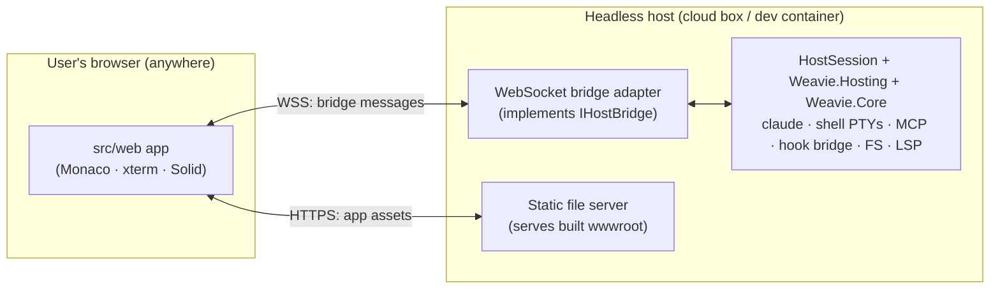

# Headless serve host (browser-connectable Weavie)

**Status:** partially implemented. The **web frontend transport** and an **end-to-end test harness**
are landed and verified on Linux (this doc's [Web side](#web-side-landed) and
[Testing](#testing-landed)). The **C# serve host** is specified here but **not yet built** — it depends
on the shared `Weavie.Hosting` / `IHostBridge` layer introduced by the Linux-host work (PR #3), and is
intended to land once that merges.

## Goal

Run Weavie's whole backend headless on a machine (a cloud dev container, a remote box) and let a user
open it in an ordinary **browser** — no native window, no WebView, no VNC. This is **Phase 1** of the
`remote-host.md` guardrail spec ("headless host, single-user, loopback"): the same `src/web` app and the
same `Weavie.Core` engine, with the **in-process bridge replaced by a WebSocket**.

The motivating need: a remote agent session (Claude Code on the web) builds and edits Weavie on Linux
but cannot run the native Win/Mac shells, so host↔web features (e.g. PR #2's editor-session restore)
were never exercised anywhere — "verified" but dead. A headless serve host makes the *real* web talk to
the *real* host on Linux, so those features can be driven and tested in CI, and a human can connect to a
live session.

## The one seam: the bridge transport

The native shells (`Weavie.Win`/`Weavie.Mac`/`Weavie.Linux`) and the web app already talk over a fully
serializable JSON protocol (`src/web/src/bridge.ts`, `HostBoundMessage`/`WebBoundMessage`). The shells
carry it over the WebView's in-process script-message channel; the serve host carries the **same JSON**
over a WebSocket. Nothing else moves — `Weavie.Core` and the web app are untouched in shape.

## Web side (landed)

`bridge.ts` picks a transport once at module load:

1. **native** — `window.webkit.messageHandlers.weavie` present → the in-process channel (desktop shells).
   Unchanged.
2. **websocket** — no native channel, but a bridge URL is advertised → a `WebSocketTransport` that
   buffers sends until the socket opens (so the very first `ready` from `main.tsx` is never lost),
   reconnects with capped backoff, and feeds inbound frames through the same `deliverFromHost` dispatch
   the native channel uses. The page cannot tell a WebSocket host from a native one.
3. **none** — neither present (a plain browser on the dev server) → outbound is a no-op, nothing is
   received, never throws. The pre-existing dev behavior, preserved.

The bridge URL comes from (first wins):

- `?weavie-bridge=ws://host:port/path` — a query override, handy for manual testing;
- `window.__WEAVIE_BRIDGE_WS__` — injected by the serve host before navigation (like `__WEAVIE_FONTS__`).
  The literal value `"auto"` derives a same-origin `ws(s)://<location.host>/weavie-bridge` — the common
  case where the serve host serves both the page and the socket.

So the serve host's only web-facing obligations are: **serve the built app**, and **inject
`window.__WEAVIE_BRIDGE_WS__ = "auto"`** (or a concrete URL) into `index.html`.

## C# side (to build — depends on `Weavie.Hosting`)

A new headless host project (working name `Weavie.Serve`, `net10.0`, no UI framework). It reuses the
host-agnostic pieces the Linux-host PR extracted into `Weavie.Hosting` (keyed on `IHostBridge`:
`TerminalController`, `FileOpener`, `McpDiffPresenter`) plus `Weavie.Core` (`HostSession` and below),
exactly as the native shells do. Concretely:

- **`WebSocketHostBridge : IHostBridge`** — the whole adapter. `PostToWeb(json)` sends the string over
  the active WebSocket; inbound text frames raise `MessageReceived`. This is the in-process
  `HostBridge`'s twin, one `IHostBridge` implementation over a different pipe. (One connection drives one
  workspace session in Phase 1.)
- **An HTTP server** (Kestrel) that serves the built web assets (the `wwwroot` the host build already
  produces) and exposes the `/weavie-bridge` WebSocket upgrade. It injects `__WEAVIE_BRIDGE_WS__="auto"`
  into the served `index.html`.
- **Session wiring** — on a new bridge connection, stand up the same graph a native host builds in its
  `ready` handler: `EditorSessionStore`, `LayoutStore`, the IDE/registry MCP servers, the LSP bridge, the
  terminal controllers (claude + shell), the file provider — then push the persisted layout + editor
  session on `ready`, identically to `WorkspaceWindow.WebBridge.cs` / `AppDelegate.cs`. The bulk of this
  is already host-agnostic; the serve host is mostly *transport + lifetime*, not new behavior.

### What does not move (from `remote-host.md`)

`claude`, the hook-bridge named pipe, and both MCP servers stay **host-local** — they talk only to the
host, never to the browser, so the hook-bridge security model survives for free. The **one** browser-
consumed loopback service that must ride the authenticated transport is the **LSP bridge**
(`Weavie.Core/Lsp`); Phase 1 can keep it on its existing loopback WS (same machine) and fold it onto the
remote transport in Phase 2.

## Testing (landed)

`src/web/e2e/` drives the **built** app in headless Chromium against a `MockHost` (an in-process stand-in
that serves `dist/` and speaks the bridge over a WebSocket, answering the `fs-*` file provider from an
in-memory map). `bridge.spec.ts` proves, in a real browser:

- a plain browser connects over the WebSocket transport, its pre-open `ready` is buffered and delivered,
  and a host-pushed `notify` renders as a toast (outbound + inbound round-trip);
- with no bridge advertised, the page boots silently and error-free (the dev/plain-browser path).

Run with `npm run e2e` (builds `dist`, then `playwright test`); `npm run e2e:install` fetches Chromium.
When the C# serve host lands, it should serve the same `dist` and pass the same suite unchanged — and the
suite extends naturally to the editor-session restore round-trip the `MockHost` is already shaped for
(seed a file, push `set-editor-session`, assert the editor reopens it).

## Connecting to a live session (infra, out of scope here)

Reaching the serve host from outside the sandbox is a runner/network concern, not a code one: a forwarded
port, or a userspace/loopback tunnel (e.g. Tailscale) on the box. The serve host itself only needs to
bind a port and serve; how that port is exposed is configured at the runner level.

## Security posture

- **Phase 1 (loopback / same user):** no new trust boundary; the bridge WS binds loopback like the LSP
  bridge does today.
- **Phase 2 (remote):** TLS + real auth on the bridge WS, and the LSP connection folded onto it. Keep
  token verification a swappable layer (per `remote-host.md` invariants 2 & 7) so this is an add, not a
  redesign. Until then the serve host must **not** be bound to a public interface without a tunnel in
  front.
