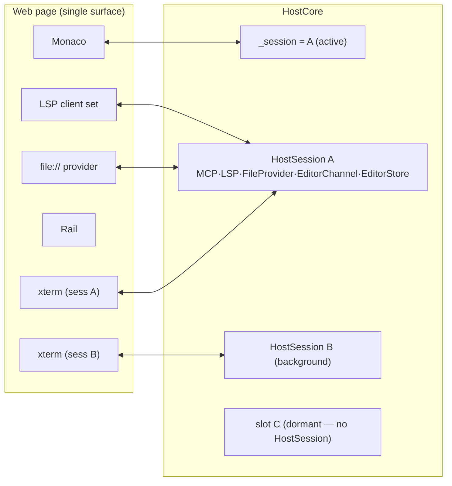

# Session isolation invariants (editor / MCP / LSP)

Status: living spec. Born from a full pass over every editor/MCP/LSP call asking "what happens when
the session is active vs. inactive vs. dormant, in the primary checkout vs. a worktree?". The bugs
this pass found are listed at the bottom with their fixes; the invariants above are what the code and
the tests now enforce.

## The core shape

One window = one web page = **one** of each shared UI surface:

- one Monaco editor (one set of file working copies, one active file, one tab strip),
- one LSP client set (one `monaco-languageclient` per language),
- one file `file://` provider, one omnibar/quick-open index, one file browser.

…but **N sessions** in the host (`HostCore`), each a `HostSession` rooted at its own worktree, each
with its own claude TUI, shell, IDE-MCP + registry servers, LSP bridge, `FileProvider`, `FileOpener`,
`DiffPresenter`, `EditorChannel`, `EditorStore`, change tracker, status, browser, file index,
`EditorSession`. Exactly **one** session is *active* (`HostCore._session`); the rest are *background*
(loaded but muted) or *dormant* (unloaded — no live `HostSession` at all).

Terminals are the exception to "one surface": every **loaded** session keeps its own live xterm pair
on the page, shown/hidden by the rail's active flag. So terminal output is never muted — only the
single editor is shared and therefore gated.

## The two invariants everything reduces to

1. **Output isolation.** Anything the host pushes onto a *shared* surface (the editor, the LSP
   client, the file index, the inline review) must come from the **active** session, or be **held**
   by a background session and replayed on switch-in. A background session must never write onto a
   shared surface. (Terminals are per-session panes, so they stream always.)

2. **Input attribution.** Anything the page sends that mutates *session* state must reach the session
   it actually belongs to — not "whichever session happens to be active when the message arrives."
   Page→host messages cross an async boundary, so a session **switch** can land between a message
   being produced and being processed. The message must therefore self-identify its owner, by an
   explicit **owner id** (editor-session / active-editor / open-editors) or by the **path** it names
   (fs-read/write/stat), and the host must route by that — failing **loudly** when it can't.

If a message can't be attributed, we do **not** guess. We log loudly and refuse, because a silent
mis-route is exactly the class of bug ("background edits and worktrees acting up") this pass exists to
kill.

## Surface inventory

### Page → host (input attribution)

| message | belongs to | how it's routed | switch-race safe? |
|---|---|---|---|
| `term-input/resize/ready` | the slot it names | `TerminalFor` (slot id → session, else active) | yes (slot-tagged) |
| `fs-stat/read/write` | the session that **owns the path** | `ResolveFsSession(path)` (longest workspace-root prefix; scratch→active) | yes (path-tagged) |
| `editor-session-changed` | the **owner** stamped on the last `set-editor-session` | owner-id guard vs `_session`; reject+log on mismatch | yes (owner-tagged + web cancels pending on seed) |
| `active-editor-changed` | the **owner** of the editor | owner-id guard vs `_session` | yes (owner-tagged + web cancels pending on seed) |
| `open-editors-changed` | the **owner** of the editor | owner-id guard vs `_session` | yes (owner-tagged) |
| `diff-resolved` | the session that **owns the diff id** | `ResolveDiffSession(id)` (globally-unique ids); log on unknown | yes (id is process-unique) |
| `reveal-file`, `list-dir`, `new-scratch`, `save-scratch-as`, `discard-scratch`, `get-turn-diff`, `accept-turn`, `undo-turn`, `invoke-command` | the **active** session (user-driven; only the active session is interactable) | `_session` | n/a (user can only drive the active session) |
| `switch-session`, `new-session`, `delete-session*`, `list-branches`, `command-ack`, layout/window/menu | workspace-level | by id / token / `_layout` / `_shell` | yes |

### Host → page (output isolation)

| push | gating | re-projected on switch? |
|---|---|---|
| terminal output | per-session pane, never muted | n/a |
| editor output (show-diff/open-file/close-tab) | `SessionEditorChannel` — posts only while active, else holds | yes (`Activate` replays reveals + re-renders held diff) |
| changes / turn diff / turn reset | gated on `IsActiveSession` | yes (`PushReviewStateOnSwitch`) |
| session status | gated on `IsActiveSession`; session-list always | yes |
| LSP watcher file changes | gated on `IsActiveSession` | n/a (active only) |
| LSP config (`lsp-config`) | pushed on switch | yes (`PushLspConfigToWeb` → web `rebindLanguageServices`) |
| editor session (`set-editor-session`) | pushed on switch | yes (carries owner id) |
| file index | pushed on switch (stale-walk guarded) | yes |

### MCP (per session — each session's claude calls its **own** IDE/registry server)

| tool | reads/writes | active vs background |
|---|---|---|
| `openDiff` | `PermissionModeDiffPresenter`→`McpDiffPresenter`→`EditorChannel` | active: rendered & blocks; background+default-mode: **held** & blocks until switch-in; auto-keep modes: resolved immediately, no UI |
| `openFile` / `close_tab` | `FileOpener` / presenter → `EditorChannel` | active: posted; background: held + replayed |
| `getCurrentSelection` / `getLatestSelection` | `EditorStore.Active` | active: live; background: **empty** (store cleared on deactivate — the user isn't looking at it) |
| `getOpenEditors` | `EditorStore.OpenEditors` | active: live; background: **empty** (same) |
| `getDiagnostics` | — | returns `[]` always (diagnostics not yet wired through the bridge — see Known gaps) |
| settings/layout/commands/theme | workspace-global stores | identical in any session |

### LSP

- Each session has its own `LspBridgeServer` rooted at its worktree. A language server subprocess is
  spawned **per web-socket connection**, and only the **active** session's page client connects (after
  `rebindLanguageServices`). So **background sessions spawn no language servers** — no csharp-ls per
  parked worktree.
- On switch: host pushes the incoming session's `lsp-config`; the web tears every client down (pinned
  to the old bridge/worktree) and reconnects to the new bridge. The outgoing bridge's server processes
  die when their sockets close.
- `LspBridgeServer.DisposeAsync` awaits every client task so all server processes are reaped before a
  worktree can be removed (Windows won't `git worktree remove` with a live cwd handle).

## Fail-loud policy

A mis-attributed or out-of-place message is a **bug we want to see**, never something to paper over:

- fs op whose path no session owns → refuse with a clear reason (`ReadNotFound`/`WriteError`) **and**
  `Log` it.
- fs op routed to a non-active session → serve it (data safety) but `Log` the anomaly (it means a
  stale tab / upstream race we should chase).
- editor-session/active-editor/open-editors with an owner id ≠ active session → **reject + Log**.
- `diff-resolved` for an unknown diff id → `Log` (a switch-race or double-resolve).
- `term-*` naming a slot that's no longer loaded → `Log` before falling back.

## Known gaps (documented, not yet closed)

- **getDiagnostics returns `[]`.** Diagnostics are not bridged from the LSP/Monaco markers to the MCP
  tool, so the embedded claude always sees "no errors". Real, but orthogonal to session isolation.
- **Background openDiff in default mode blocks invisibly.** A background claude in *default* mode that
  calls `openDiff` is held by its `EditorChannel` and blocks until the user switches to that session.
  This is by design (default mode requires a human review), but it means the session sits at
  "Working" with nothing visible until switched in. Surfaced via status + the held-diff replay; a
  future affordance could badge "waiting for review" on the rail chip.

## The bugs this pass fixed

- **F1 — editor-session switch-race → cross-worktree tab contamination.** The page's debounced
  `editor-session-changed` carried no owner and the host applied it to `_session`; a host-initiated
  switch (new/fork/delete-fallback) let a pending send land on the wrong session, writing one
  worktree's tabs into another's `EditorSession`. On the next switch-in those foreign paths were
  reopened against a worktree that doesn't have them → the repeating `open failed … nonexistent file`
  loop. Fix: web cancels the pending send when `set-editor-session` seeds it; both sides carry an
  owner id and the host rejects + logs a mismatch.
- **F2 — active-editor/open-editors switch-race.** Same root; the wrong session's `EditorStore` got
  the update, so a background claude's `getCurrentSelection`/`getOpenEditors` (and the pushed
  `selection_changed`) reflected another session. Fixed by the same owner-id guard.
- **F3 — fs routed by active session, not by path.** `fs-read/write/stat` went to `_session`'s
  `FileProvider`, which refuses any path outside *its* root. During a switch (and for any stale tab) a
  read for session A's file while B is active became a spurious `FileNotFound` ("Unable to read
  file"), and the web's `rebindSession()` flush of the outgoing session's working copies (an
  `fs-write`) landed on the new session and was refused → **lost edits**. Fixed by routing fs to the
  session that owns the path.
- **F4 — background EditorStore staleness.** A backgrounded session kept reporting its last active
  file/selection to its claude. Fixed by clearing `EditorStore` on deactivate; the page re-emits on
  switch-in.
- **F5 — diff ids not globally unique + diff-resolved routed to active.** Each session numbered its
  diffs from `diff-1`, and `diff-resolved` went to `_session`; a switch between render and resolve
  could resolve a *different* session's `diff-1`. Fixed by process-unique ids routed to the owning
  presenter.
- **F8 — no test coverage.** The whole hosting/session-routing layer had no test project. Added
  `Weavie.Hosting.Tests` plus Core-level routing helpers, covering every row above.
