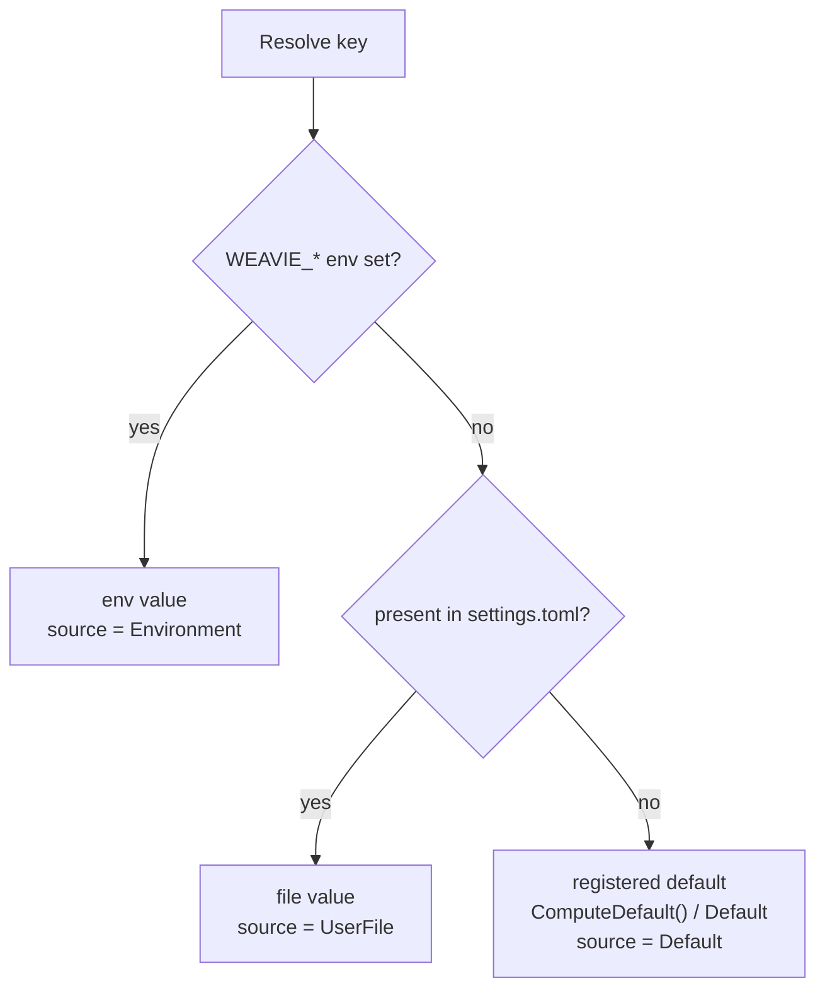
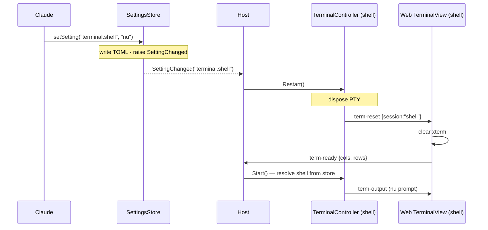

# Settings

Status: implemented
Last updated: 2026-06-16

Implemented in `Weavie.Core/Configuration/` (`SettingDefinition`, `SettingsRegistry`, `SettingsStore`,
`CoreSettings`, `ExecutableFinder`) + the `listSettings`/`getSetting`/`setSetting` tools on
`McpServer`, with reaction wiring in both hosts (`TerminalController.Restart()` + the web `term-reset`
handler). Verified end to end on Windows: driving `setSetting terminal.shell = "nu"` over MCP against
the running app reopened the shell pane running nushell (`temp/settings-implementation-notes.md`).

A few spec gaps were resolved the strict / least-surprising way during implementation:

- **Resolution runs `Validate` on the env and file layers** (not only at `Set` time): an invalid
  env/file value is logged loudly and falls through to the next layer, rather than being served. This
  is what preserves the old "bad `WEAVIE_WORKSPACE` falls back to home" behavior generically.
- **Malformed file at runtime keeps the last-good resolved state** (only the *first* load with a
  malformed file falls back to defaults), so a transient half-typed save never thrashes reactions.
  Writes are refused while malformed, regardless.
- **Shell launch flags are chosen by shell name**, not hardcoded: PowerShell gets `-NoLogo`; other
  shells (nushell, cmd, bash, …) launch bare. The macOS claude wrapper keeps using a POSIX login
  shell (separate from `terminal.shell`, which may be nushell) to `exec` the `claude.path` binary.
- **Path values are written as TOML literal (single-quoted) strings** when they contain a backslash
  and no quote, so Windows paths round-trip without escaping.

Settings is the first concrete instance of the
[Claude-facing capability registry](../concepts/mcp-registry.md) concept: configuration values are
*declared* in Core and surfaced to the embedded Claude as MCP tools, so the user can change them by
talking to Claude.

Weavie has no persistent configuration today — every knob is an environment variable read once at
startup (`WEAVIE_WORKSPACE`, `WEAVIE_SHELL`/`SHELL`, `WEAVIE_CLAUDE`, plus dev/debug toggles). This
spec introduces a user-level settings system that is:

- **OS-portable but dev-friendly** — one file at `~/.weavie/settings.toml` on every platform.
- **Schema-driven** — settings are *declared* in code (kind, default, description, validation), so
  one registry powers defaults, validation, env-var overrides, the MCP tool surface, and the
  natural-language "tell Claude to change it" flow.
- **Env-overridable** — every setting has a derived `WEAVIE_*` env var that wins over the file.
- **Editable conversationally** — the embedded `claude` changes settings through MCP tools on the
  IDE server that already exists; no new process, no CLI (for now).
- **Reactive** — a setting change is detected and acted on live (e.g. changing the shell reopens
  the terminal), not just stored.

## Goals

1. Persist user-level settings across runs in an OS-appropriate, easy-to-edit location.
2. Make every setting overridable by an environment variable for dev/CI.
3. Let the user change settings by talking to the embedded Claude
   (e.g. *"set my weavie shell to nushell"*).
4. React to changes immediately where it makes sense (reopen the terminal on a shell change).
5. Validate strictly — reject bad values loudly; never silently swallow or "fix" them.
6. Lay a foundation future plugins (and the commands registry) can extend.

## Non-goals (deferred)

- **`weavie config` CLI verb.** Wanted eventually, but there's no `weavie` on PATH today (the app
  is a GUI exe). The CLI will be a thin wrapper over the same Core store, so deferring it costs
  nothing architecturally. MCP is the only editing surface in this milestone.
- **Workspace/project-level settings** (a per-workspace `settings.toml`). Now built: a setting
  declares `Scope = Workspace` and resolves env > workspace file > user file > default, keyed per
  workspace. Stored **out of the repo** under `~/.weavie/workspaces/<id>/settings.toml` (never in
  source control), so a cloned repo can't ship an auto-run setup command; committed in-repo settings
  behind a trust prompt are a deliberate later feature. See
  [test-running-and-workspace-setup.md](test-running-and-workspace-setup.md).
- **In-app settings UI** (web panel over the bridge). Later.
- **Secrets.** Settings are plaintext. API keys / tokens do **not** belong here; a separate
  secret-storage mechanism is out of scope.

## Storage location

A single resolution rule on all platforms:

```
~/.weavie/settings.toml
```

Resolved from the user profile / home directory
(`Environment.GetFolderPath(Environment.SpecialFolder.UserProfile)`), correct on Windows, macOS, and
Linux. Chosen over OS-standard config dirs (`%APPDATA%`, `~/Library/Application Support`,
`$XDG_CONFIG_HOME`) because it is trivial to `cd ~/.weavie` and hand-edit, identical everywhere, and
mirrors `~/.claude` — the tool Weavie weaves. The `~/.weavie/` directory is created on first write
and is the natural home for future per-user state; this spec only defines `settings.toml`.

**Workspace overlay.** `Scope = Workspace` keys (e.g. `test.profile`, `worktree.setupCommand`) don't
live in the repo — they persist to a per-workspace file, `~/.weavie/workspaces/<id>/settings.toml`
(`<id>` = `WorkspaceId.ForPath(root)`, the same keying as terminal logs and pasted images). Keeping
them out of source control means configuring a workspace never touches the repo, and an untrusted
clone can't inject a committed, auto-executed setup command. `SettingsStore` takes the root→file
mapping as an injected resolver so tests stay off a real `~/.weavie`.

## File format — TOML

TOML, parsed and written with [Tomlyn](https://github.com/xoofx/Tomlyn) (NuGet, MIT — one new
dependency on `Weavie.Core`). Chosen over JSON/JSONC for hand-editability:

- Native `#` comments and section grouping (`[plugins.acme-linter]`) that maps cleanly onto plugin
  subtrees.
- **No backslash-escaping for Windows paths** — literal (single-quoted) strings:
  `claude.path = 'C:\Users\me\claude.exe'`.
- Tomlyn parses into a **syntax tree (`DocumentSyntax`) that preserves comments and formatting on
  round-trip**, which gives us comment preservation essentially for free.

```toml
# weavie settings — ask the embedded Claude to "list weavie settings" for all keys

# Shell for the plain terminal pane
terminal.shell = "nu"

# Path to the claude binary (auto-detected if unset)
claude.path = 'C:\Users\me\claude.exe'

[plugins.acme-linter]   # unknown subtrees are preserved verbatim on write
severity = "error"
```

**Document shape.** The store writes known leaf settings as **dotted keys at the document root**
(`terminal.shell = "nu"`), one key per line, so each setting is a self-contained line that can carry
its own description comment. `[plugins.*]` tables and any other unknown subtree are treated as
opaque and preserved byte-for-faithful on round-trip — never reshaped or stripped.

### Comments: description-above-the-line

Reads and writes go through Tomlyn's `DocumentSyntax` so existing comments and formatting survive a
round-trip. On write, the store additionally **injects a known setting's registry `description` as a
`#` comment directly above its line when that line has no leading comment** — so the file
self-documents as keys are first written, without clobbering a comment the user wrote themselves.
Unknown/plugin keys are never annotated and their trivia is left untouched.

Deferred refinement: re-propagating a changed registry description onto keys that *already* carry a
(possibly user-edited) comment. Not worth the surprise for now.

### Atomic writes

Serialize the `DocumentSyntax` to text, write `settings.toml.tmp`, then atomically replace
`settings.toml`, so a crash mid-write never corrupts the file.

### Malformed / missing file

- **Missing** — treated as an empty document: every setting resolves to its default. The file and
  `~/.weavie/` are created on the first write.
- **Malformed** (TOML parse error) — *strict, non-destructive*: resolution falls back to defaults
  (env vars still apply), the parse error is surfaced loudly to the host log, and the broken file is
  **left intact**. `setSetting` **refuses to write** while the file is unparseable (so we never
  clobber the user's content) and returns an error telling the user to fix or delete the file. This
  honors strict enforcement without bricking the app over a typo.

## The settings registry

Settings are declared in code. The registry is the single source of truth for what exists, its kind,
default, docs, validation, env var, and how a change applies. Core registers its settings at
startup; plugins (future) contribute additional definitions the same way.

```csharp
public enum SettingKind { String, Bool, Int, Path }

// How a changed value takes effect — reported to Claude by setSetting, and the contract the
// host's change-reaction wiring honors.
public enum ApplyMode {
    Live,            // observers reflect it immediately, nothing restarts
    ReopensTerminal, // the affected terminal pane(s) restart to apply (shell)
    NextSession,     // existing sessions keep the old value; the next one started picks it up
    RestartRequired, // needs a full app restart
}

public sealed record SettingDefinition {
    public required string Key { get; init; }                 // "terminal.shell"
    public required SettingKind Kind { get; init; }           // explicit + authoritative (see below)
    public required string Description { get; init; }         // → MCP + the file's "# " comment
    public IReadOnlyList<string> Aliases { get; init; } = []; // "shell", "my shell" — NL hints
    public IReadOnlyList<string>? AllowedValues { get; init; }// closed set on a String → JSON Schema "enum"
    public object? Default { get; init; }                     // static default…
    public Func<object?>? ComputeDefault { get; init; }       // …or computed (platform auto-detect)
    public Func<object?, ValidationResult>? Validate { get; init; }  // open-ended checks only
    public ApplyMode Apply { get; init; } = ApplyMode.NextSession;

    // Derived: "terminal.shell" -> "WEAVIE_TERMINAL_SHELL". No per-setting registration needed.
    public string EnvVar => "WEAVIE_" + Key.ToUpperInvariant().Replace('.', '_');
}
```

### Kinds vs constraints (the design rule)

A `SettingKind` exists only when it carries distinct **parse / coerce / normalize behavior**. A mere
*constraint* on values (an allowed set, a numeric range, must-exist-on-disk) is a validator or a
structured constraint — **not** a kind.

- `String` / `Bool` / `Int` — distinct parsing of the env-var string / JSON value. ✅ kinds.
- `Path` — earns its place through path *behavior*: `~` expansion and resolving a relative path
  against the workspace. (Without that behavior it would just be `String` + a validator.)
- ~~`Enum`~~ — deliberately **not** a kind. An enum has no distinct parse behavior; it is `String`
  parsing plus a set membership constraint. It is expressed as a `String` with `AllowedValues`.

**`AllowedValues` vs `Validate`** — both reject bad input, but they differ in introspectability,
which is the whole point of the MCP/NL layer:

- `AllowedValues` (closed set, structured) — the system can *enumerate* the options: `listSettings`
  exposes them, error messages auto-list them, a future UI renders a dropdown, and it maps 1:1 onto
  JSON Schema `enum` in the tool input schema. Membership validation is auto-derived; you don't
  write a `Validate` for it. Applies to `String` settings.
- `Validate` (open-ended predicate) — for checks that can't be enumerated. Returns a
  `ValidationResult` (ok / message). Opaque to the system by nature.

The two initial real examples sit on opposite sides, neither needing an `Enum` kind:

- `terminal.shell` → `String` + `Validate` (resolvable on PATH). **Open-ended** — you can't list
  every shell.
- a future `theme` → `String` + `AllowedValues = ["dark","light"]`. **Closed set** — structured,
  so Claude and the UI can read the options.

### Coercion

Values arrive as untyped strings (env vars) or JSON (MCP) and are coerced to the declared `Kind`;
mismatches are rejected, never guessed:

- **From an env-var string:** `Bool` accepts `true`/`false` (case-insensitive); `Int` is an
  invariant integer parse; `String`/`Path` are taken verbatim. Then `Path` normalization and any
  `AllowedValues`/`Validate` checks run. A value that fails to parse is a loud error.
- **From an MCP JSON value:** `String`/`Path` expect a JSON string, `Bool` a JSON bool, `Int` a JSON
  number. A type mismatch is rejected by `setSetting`.

### Env-var override convention

Every setting's env var is **derived** from its key — `WEAVIE_` + the key uppercased with `.` → `_`:

| key              | env var                  |
|------------------|--------------------------|
| `workspace`      | `WEAVIE_WORKSPACE`       |
| `terminal.shell` | `WEAVIE_TERMINAL_SHELL`  |
| `claude.path`    | `WEAVIE_CLAUDE_PATH`     |

There are **no legacy aliases** — Weavie is not launched, so the existing names (`WEAVIE_SHELL`,
`WEAVIE_CLAUDE`) are renamed to the derived form and their call sites updated. The OS-standard
`SHELL`/`pwsh`/`zsh` discovery is **not** an env alias — it is the *computed default* for
`terminal.shell` (the lowest-precedence layer), which is the correct place for "what shell does the
system suggest."

### Resolution order (highest wins)



A per-workspace `.weavie/settings.toml` slots in between the env and user-file layers for
`Scope = Workspace` keys (resolved against the active workspace root); see
[test-running-and-workspace-setup.md](test-running-and-workspace-setup.md).

```csharp
public ResolvedValue Resolve(string key) {
    var def = _registry.Require(key);                          // unknown key -> throw (strict)
    var env = Environment.GetEnvironmentVariable(def.EnvVar);
    if (env is not null) return new(Parse(def, env), SettingSource.Environment);
    if (_doc.TryGet(key, out var fileValue)) return new(fileValue, SettingSource.UserFile);
    return new(def.ComputeDefault?.Invoke() ?? def.Default, SettingSource.Default);
}
```

### Writes and the env-shadow warning

`setSetting` requires an **exact registered key**. Unknown keys are rejected (optionally with
near-match suggestions) — fuzzy/natural-language mapping is the LLM's job, done by reading the
catalog from `listSettings`, never by the store guessing. The store always writes the explicit value
(even if it equals the current default).

Because env vars win over the file, writing a setting while its env var is set won't change the
*effective* value. Per the strict-enforcement principle, `setSetting` reports this loudly instead of
silently no-opping:

```csharp
public SetResult Set(string key, JsonElement value) {           // value arrives as JSON (MCP)
    var def = _registry.Require(key);                           // strict: unknown -> error
    var coerced = Coerce(def, value);                           // kind mismatch -> error
    var result = def.Validate?.Invoke(coerced) ?? ValidationResult.Ok;
    if (!result.Ok) throw new SettingValidationException(key, result.Message);   // loud
    _doc.Set(key, coerced);                                     // into the TOML syntax tree
    SaveAtomic();
    RaiseChanged(key, ...);                                      // -> reaction hub (below)
    var shadow = Environment.GetEnvironmentVariable(def.EnvVar);
    return new SetResult {
        Written       = true,
        ShadowedByEnv = shadow is null ? null : def.EnvVar,     // "wrote it, but $ENV overrides"
        Apply         = def.Apply,                              // "your terminal will reopen"
    };
}
```

Note the boundary: **MCP speaks JSON, the file is TOML.** `setSetting`'s `value` is a JSON value;
the store coerces it to the declared kind via the registry and writes it into the TOML document. The
file format never leaks into the Claude-facing contract.

## Reacting to changes — the change hub

`SettingsStore` is the change hub. It raises a typed event that any component can subscribe to and
react to however it needs:

```csharp
public readonly record struct SettingChange(string Key, object? OldValue, object? NewValue, SettingSource Source);

public event Action<SettingChange>? SettingChanged;
public IDisposable Subscribe(string key, Action<SettingChange> handler);   // convenience: one key
```

`SettingChanged` fires from **two** sources:

1. **`setSetting`** (explicit, via MCP).
2. **A `FileSystemWatcher` on `settings.toml`**, *debounced* (~250 ms) and *parse-guarded*: a
   half-typed hand-edit never triggers a reaction; the store reacts only once the file settles into
   a clean parse, then **diffs the reloaded values against the current in-memory resolved values**
   and raises one change per key that actually differs.

The diff-on-reload also dedupes the store's own writes: after `setSetting` updates in-memory state
and raises its change, the watcher's subsequent reload sees no difference and raises nothing — so a
write never double-fires a reaction. Reactions run off the raising thread, so subscribers marshal to
the UI thread the same way `HostBridge.PostToWeb` already does (`BeginInvoke` on Windows,
`InvokeOnMainThread` on macOS).

`ApplyMode` is advisory metadata that `setSetting` reports to Claude *and* the contract the host's
wiring honors. Only `ReopensTerminal` has an active reaction wired in this milestone; `NextSession`
and `RestartRequired` settings simply get read fresh when the relevant session next starts.

### Shell change → reopen the terminal

The host subscribes to `terminal.shell` and reopens the shell pane(s), reusing the existing
ready/start handshake:



The claude pane is a different setting (`claude.path`) and is untouched. Reopening **kills that
pane's scrollback and any running command** — acceptable for an explicitly requested change, and the
debounce/parse-guard keeps a hand-edit from thrashing it. New plumbing required:

- `TerminalController.Restart()` — dispose the PTY and post `{type:"term-reset", session:<id>}` over
  the bridge.
- A `term-reset` inbound message handled in the web `bridge.ts` / `TerminalView`: clear that
  session's xterm and re-emit `term-ready` with the current cols/rows (which routes through the
  host's existing `OnWebMessage` → `controller.Start()`).

(If auto-reopening on *passive* hand-edits ever proves annoying, a later refinement can downgrade
the file-watch path to `NextSession` while keeping explicit `setSetting` on reopen. Not done now.)

## Initial registered settings

These three replace the current real env vars. The resolution logic currently inline in the two
`TerminalController`s (`ResolveWorkspace`/`ResolveShellLauncher`/`ResolveClaudeLauncher`) moves into
the registered settings' `ComputeDefault`/`Validate`, so Windows and macOS share one path.

| key              | kind   | default (computed)                                             | apply            | replaces            |
|------------------|--------|----------------------------------------------------------------|------------------|---------------------|
| `workspace`      | Path   | user profile dir; must exist                                   | RestartRequired  | `WEAVIE_WORKSPACE`  |
| `terminal.shell` | String | Win: `pwsh` → `powershell`; macOS: `$SHELL` → `/bin/zsh`       | ReopensTerminal  | `WEAVIE_SHELL`/`SHELL` |
| `claude.path`    | Path   | `claude` on PATH → native-installer location → bare `claude`   | NextSession      | `WEAVIE_CLAUDE`     |

`terminal.shell` carries `Aliases = ["shell", "my shell", "terminal shell"]` and
`Validate = resolve-on-PATH` so *"set my weavie shell to nushell"* maps cleanly and a bogus shell is
rejected at set time. `claude.path` is `NextSession` (not `ReopensTerminal`) on purpose — reopening
the claude pane would destroy the running conversation, so a new binary applies to the next claude
session.

**Dev/debug toggles stay raw env vars** and are intentionally *not* registered — not user-facing,
should not appear in `listSettings`: `WEAVIE_PTY_LOG`, `WEAVIE_AUTOBENCH`, `WEAVIE_FPSPROBE`,
`WEAVIE_SHOT_*`, `WEAVIE_DEBUG_INPUT`.

### Typography (fonts)

Implemented in `Weavie.Core/Configuration/FontSettings.cs` (registered from `CoreSettings`). Both
text surfaces — the Monaco editor and the xterm terminal — read their family, size, and weight from
settings. A single **global** default is inherited by both, and each surface may **override** any
axis. All nine are `ApplyMode.Live`: a change re-pushes the resolved fonts to the web app, which
applies them in place (Monaco `updateOptions`, xterm `options` + refit) — no restart, no PTY reopen.

| key                    | kind   | default                         | meaning                                  |
|------------------------|--------|---------------------------------|------------------------------------------|
| `font.family`          | String | cross-platform monospace stack  | global family (a CSS font-family stack)  |
| `font.size`            | Int    | `13`                            | global size in px (6–72)                 |
| `font.weight`          | String | `normal`                        | global weight (`normal`/`bold`/`100`–`900`) |
| `editor.font.family`   | String | `""` → inherit                  | editor family override                   |
| `editor.font.size`     | Int    | `0` → inherit                   | editor size override (0, or 6–72)        |
| `editor.font.weight`   | String | `inherit`                       | editor weight override                   |
| `terminal.font.family` | String | `""` → inherit                  | terminal family override                 |
| `terminal.font.size`   | Int    | `0` → inherit                   | terminal size override (0, or 6–72)      |
| `terminal.font.weight` | String | `inherit`                       | terminal weight override                 |

An override left at its **inherit sentinel** — empty family, `0` size, `"inherit"` weight — falls
through to the global value; otherwise the override wins for that surface only. The global `weight`
carries `AllowedValues` (the CSS keywords + numeric scale) so it maps 1:1 onto Monaco's `fontWeight`
and xterm's `FontWeight`; the override `weight` adds `inherit` to that set.

**Host → web plumbing.** `FontSettings.BuildJson` resolves the editor + terminal fonts to
`{ editor: {family,size,weight}, terminal: {…} }`. The host injects it as `window.__WEAVIE_FONTS__`
before navigation (no default-font flash on mount) and, subscribing to all nine keys, re-pushes it as
a `{ type: "fonts", … }` bridge message on any change. The web `fonts.ts` reads the injected global at
editor/terminal creation and applies live pushes via `onFontsChanged`.

The three-segment keys (`editor.font.size`) required lifting the TOML key writer's previous
two-segment cap (`SettingsStore.BuildKeySyntax`), which now appends dotted keys for arbitrary depth.

## MCP tools (the editing surface)

Four tools — `listSettings`/`getSetting`/`setSetting`/`clearSetting` — are served by `McpServer`
(`Weavie.Core/Mcp/McpServer.cs`) and dispatched in `HandleToolCallAsync`.

**They must run on the registry MCP server, not the IDE server.** Claude Code filters the IDE
connection's tool list down to a fixed allowlist before it reaches the model, so custom tools added to
the IDE server are invisible to Claude. Instead the host runs a second `McpServer` in `registryMode`
(advertising only these tools), registered with the spawned `claude` via a generated `--mcp-config`
(`~/.weavie/internals/mcp/weavie-<port>.mcp.json`: a `ws://` entry with the shared token as
`Authorization: Bearer`). Then the tools reach the model as `mcp__weavie__listSettings` etc. See the
[capability registry concept](../concepts/mcp-registry.md). All four return the standard MCP
`{"content":[{"type":"text","text":...}]}` envelope; `listSettings`/`getSetting` serialize their JSON
payload into that `text` field, and `setSetting`/`clearSetting` return a human-readable summary (errors set
`isError: true`).

### `listSettings`

No input. Returns the live catalog — what Claude reads to map natural language to an exact key, so it
carries descriptions, aliases, current value, source, default, and (when closed-set) allowed values:

```json
{ "settings": [
  { "key": "terminal.shell", "type": "string",
    "description": "Shell for the plain terminal pane",
    "aliases": ["shell", "my shell", "terminal shell"],
    "value": "nu", "source": "userFile", "default": "pwsh", "apply": "reopensTerminal" }
] }
```

`allowedValues` is included only for settings that declare it (e.g. a `theme` would carry
`"allowedValues": ["dark","light"]`).

### `getSetting`

Input `{ "key": "terminal.shell" }` → the resolved value and where it came from (`source`).

### `setSetting`

Input `{ "key": "terminal.shell", "value": "nu" }`. Validates against the registry; writes the user
file; returns a confirmation including the apply note and any env-shadow warning. Its description
instructs the model to **call `listSettings` first** to find the exact key rather than guessing.

### `clearSetting`

Input `{ "key": "terminal.shell" }` — the inverse of `setSetting`. Removes the key's user-file
override (`SettingsStore.Clear`, removing both the root dotted-key form `setSetting` writes and a
hand-edited `[table]` form) so the setting falls back to its env var or registered default, raising
the same `SettingChanged` event a `setSetting` would. Returns a summary noting whether an override was
actually present, the apply note, and any env-shadow warning (a still-set env var means the *effective*
value is unchanged). A key with no override is a no-op, not an error. Refuses to write while the file
is malformed, like `setSetting`.

### Worked flow: *"set my weavie shell to nushell"*

1. Claude calls `listSettings`, sees `terminal.shell` (aliases include "shell").
2. Claude resolves "nushell" → `nu` and calls `setSetting { key: "terminal.shell", value: "nu" }`.
3. Store validates `nu` is resolvable, writes `~/.weavie/settings.toml`, raises the change →
   the host reopens the shell pane.
4. Claude confirms: *"Set your terminal shell to nushell — I've reopened your terminal so it's
   live now."* (If `WEAVIE_TERMINAL_SHELL` were set, it would instead warn that the env var is
   overriding the file.)

## Architecture / placement

```
Weavie.Core/
  Configuration/
    SettingDefinition.cs     // the record + SettingKind / ApplyMode
    SettingsRegistry.cs      // register + Require(key) + catalog
    SettingsStore.cs         // TOML load/save (Tomlyn, atomic), Resolve, Set, watch, change hub
    CoreSettings.cs          // registers workspace / terminal.shell / claude.path
  Mcp/
    McpServer.cs             // + listSettings/getSetting/setSetting/clearSetting tools
```

Both hosts construct one `SettingsStore` and hand it to their `TerminalController`s and `McpServer`,
and subscribe to `terminal.shell` to drive the reopen. The per-platform resolution logic inline in
the `TerminalController`s collapses into the registered settings' `ComputeDefault`/`Validate`.

## Build sequence

1. **Core config module** — `SettingDefinition`, `SettingsRegistry`, `SettingsStore`
   (Tomlyn load/save + description-comment injection, atomic write, env+file+default resolution,
   coercion, validation, debounced parse-guarded `FileSystemWatcher`, `SettingChanged`/`Subscribe`).
   Register `workspace`, `terminal.shell`, `claude.path`; port the `TerminalController` resolution
   logic in; update both hosts to read from the store. Unit tests in `Weavie.Core.Tests`
   (resolution precedence, coercion per kind, unknown-key + comment preservation, atomic write,
   validation + `AllowedValues` rejection, malformed-file fallback + write-refusal, env-shadow
   reporting, change-diff on file edit / no double-fire on self-write).
2. **Reaction wiring** — `TerminalController.Restart()` + `term-reset` web handling; hosts subscribe
   `terminal.shell` → reopen. Verify a shell change reopens the pane.
3. **MCP tools** — `listSettings`/`getSetting`/`setSetting`/`clearSetting` on `McpServer`, wired to the
   store. Verify end-to-end by asking the embedded Claude to change the shell.

## Open questions

- **Description re-propagation** — see [Comments](#comments-description-above-the-line); deferred.
- **Plugin schema contribution** — exact mechanism (when/how a plugin registers definitions, lazy
  validation of namespaced `plugins.*` values) is left for the plugin/commands work.
