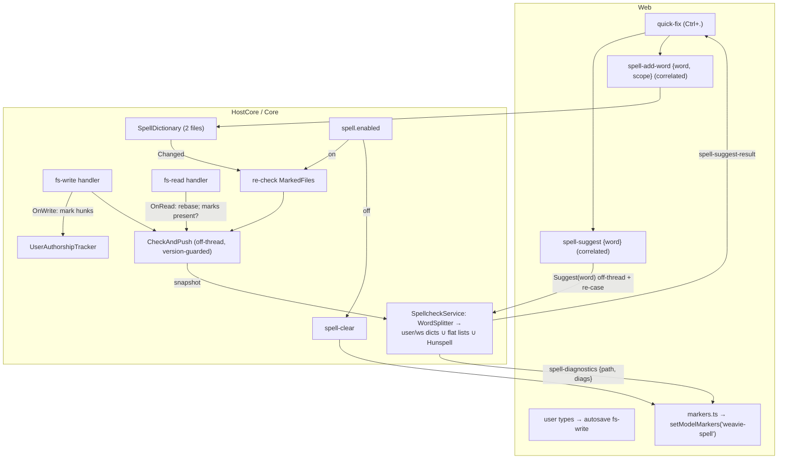

# Spell check as a typing aid

Status: proposed
Last updated: 2026-07-23

Weavie's spell check is deliberately a **typing aid for the human, not a file linter**. Most code in a
Weavie workspace is agent-written; squiggling a 500-line generated file teaches the user to ignore
squiggles. So the checker flags misspellings only in text the **user authored in Weavie's editor this
session** — comments, string literals, and identifiers alike — and stays silent everywhere else:

- **Agent-written lines are never checked.** The agent's typos are a review-time concern, not a
  typing-time one.
- **No provenance = quiet.** Pre-existing code and files reopened from a prior session are never
  checked. Flagging follows only from positive evidence that the user typed the text.
- **Zero tokens, fully deterministic.** A dictionary engine in Core; no model call anywhere.

Identifiers are safe to check under this scoping: a typo'd name is caught at the moment it is typed —
a one-word fix via quick-fix, not a cross-repo rename.

## Engine

In-process C# in Core — no child process, no runtime dependency, `ProcessSupervisor` correctly not
involved:

- **[WeCantSpell.Hunspell](https://github.com/aarondandy/WeCantSpell.Hunspell)** (NuGet, pure
  managed) checks natural-language words and produces suggestions. Hunspell is tri-licensed
  MPL 1.1/LGPL/GPL; Weavie consumes it under the **MPL election** (unmodified library dependency —
  the same arrangement JetBrains ships in its proprietary IDEs), recorded in
  `THIRD-PARTY-NOTICES.md`.
- **Vendored dictionaries** as embedded resources (`Weavie.Core/Spell/Data/`, ~0.8 MB): `en_US.aff` +
  `en_US.dic` (SCOWL-derived; upstream license file vendored beside them) plus cspell's MIT flat
  wordlists — software terms and per-language keywords — merged into one check-only
  `HashSet<string>`. Keyword lists are merged, not keyed by extension: no language detection in Core.
  The cost is a false-negative class (a typo colliding with another language's keyword passes), which
  is the correct side for a quiet typing aid to err on.
- en_US only for now; a `spell.locale` and non-English `.dic` vendoring land at the `SpellEngine`
  seam when wanted.

## The user-authored signal

`SessionChangeTracker`'s provenance mirror cannot supply the signal: it exists only for agent-touched
files (`RecordHandEdit` returns early otherwise) and leaves user edits unlabelled — "unlabelled"
conflates fresh typing with pre-existing text. A standalone **`UserAuthorshipTracker`**
(`Weavie.Core.Changes`, per session) holds a per-file `{text, per-line user mask, version}` mirror:

- **`OnRead(path, content)`** — every editor open/reload round-trips through `fs-read`. First read
  seeds an all-unmarked mirror (pre-existing stays quiet). A later read rebases: existing marks shift
  along `LineHunker` Equal alignment; changed lines are unmarked (agent and external edits arrive via
  watcher-driven reloads, so they shed marks rather than gain them).
- **`OnWrite(path, content)`** — fires only for Weavie-editor saves (autosave repeats them as the
  user types). Every changed hunk vs. the mirror is marked user-authored — including retypes over
  agent regions and edge prepends/appends (which the corrections tracker deliberately skips; here
  they are user typing and are checked). A write with no mirror seeds unmarked, then marks its hunks.
- **`Snapshot(path)`** → `(text, mask, version)` and **`MarkedFiles`** — re-checks read the in-memory
  mirror, never disk, and never walk the workspace. `version` increments per `OnWrite` and lets a
  late check result be dropped (below).

The tracker runs regardless of `spell.enabled`, so re-enabling has the full session's mask.

Scratch (untitled) buffers are covered for free: `FileProviderService` already serves the scratch
directory as a second allowed root, so they flow through the same seams.

## Checking and pushing

Checking is a pure function run at the `fs-write` seam, off the dispatch thread:

- **`SpellcheckService`** (per workspace, owned by `HostCore` beside `CorrectionCorpus`):
  `Check(text, mask)` tokenizes only masked lines and returns 1-based Monaco-ready
  `{line, startCol, endCol, word}` diagnostics; `Suggest(word)` returns top-5 re-cased suggestions.
- **`CheckAndPush(session, path)`** captures the snapshot's `version` before checking and drops the
  result if the file advanced meanwhile — two rapid autosaves can never land stale squiggles over
  fresh ones.
- **Triggers:** `fs-write` (after `OnWrite`); `fs-read` when the file already has marks (this is what
  restores markers on tab-reopen and page reload — the web drops pushes for closed models);
  dictionary `Changed` and `spell.enabled` turning on re-check all `MarkedFiles`; turning off pushes
  `spell-clear`.
- **Web:** `spell/markers.ts` maps `spell-diagnostics` onto the open model's markers (owner
  `weavie-spell`) and clears all on `spell-clear`. Markers are decoration-backed, so they shift with
  unsaved typing between autosaves; the next save refreshes them.

## WordSplitter

Pure static tokenizer (`Weavie.Core/Spell/WordSplitter.cs`); input one line, output pieces with
column ranges. Rules in order:

1. **Blank cheap skips:** URL-ish spans (`scheme://` through whitespace) and hex literals
   (`0x[0-9a-fA-F]+`).
2. **Tokenize** maximal runs of `[\p{L}\p{Nd}'_]`. A token > 40 chars mixing digits and mixed-case
   letters is skipped whole (base64/hash).
3. **Split into pieces** at `_`, at digit runs (digits are separators, never part of a piece), at
   lower→Upper boundaries, and after an Upper-run such that its last Upper starts the next piece
   (`HTTPServer` → `HTTP`, `Server`). Interior apostrophes stay (`don't`); edge apostrophes trim.
4. **ALL-CAPS:** a run (≥ 2) absorbs an immediately following `s/es/ed/ing` suffix into one piece
   (`URLs`, `APIs`), and any piece with an all-caps base is skipped — acronyms are unknowable, and
   absorption exists so `URLs` never leaks a spurious `s` piece.
5. **Minimum length 4** (cspell's floor; `teh` is never flagged — accepted, mirrors cspell).
6. **Lookup per piece:** user/workspace words → flat merged set → Hunspell `Check(piece)`, then
   `Check(lower)` for Title-case pieces. Unknown → diagnostic over the piece's exact range (the
   range is what a suggestion edit replaces).
7. **Inline directives:** one scan of the snapshot for `cspell:ignore` / `spell-checker:ignore`
   words, joined into that file's ignore set.

## Suggestions and the quick-fix

Suggestions ship in v1 but are **lazy** — `Suggest()` is Hunspell's expensive call (est. 5–100 ms),
so diagnostics carry none. When the quick-fix menu opens on a `weavie-spell` marker, the async code
action provider (`spell/quick-fix.ts`) awaits a correlated `spell-suggest` (the
`host-file-provider.ts` request pattern; a timeout rejects loudly and the menu still shows the
add-word actions) and offers:

- **`Change to "X"`** (top 5) — a text edit replacing only the marker's sub-token range, re-cased to
  the flagged piece's pattern: a Title-case piece title-cases the suggestion (`Recieve` inside
  `recieveMessage` → `Receive`), a lowercase piece takes the suggestion as returned (proper-noun
  suggestions survive).
- **`Add "X" to workspace dictionary`** / **`…user dictionary`** — dispatching the commands below.

## Dictionaries and add-word

Two plain wordlist files — one word per line, trimmed, deduped ordinal-ignore-case, atomic
temp+rename writes, a `Changed` event:

- `~/.weavie/dictionary.txt` — user-global.
- `~/.weavie/workspaces/<id>/dictionary.txt` — per-workspace, the `corrections.jsonl` precedent:
  out of the repo, so no trust prompt. A committed in-repo team dictionary is deferred with the
  committed-settings trust work (worth revisiting early — it is inert data, not executable config).

Commands `weavie.spell.addWord` ("Add Word to Workspace Dictionary") and `weavie.spell.addWordUser`
(`RunsIn = Web`, palette-visible, `ArgsSchema {word?}` — argument, else the marker at the cursor,
else a loud failure). No default chord: the keyboard path is the quick-fix on the squiggle, per the
`/learn` "default keybindings sparingly" precedent. No bespoke MCP tools — `runCommand` already
reaches the embedded Claude, and the files are plain text it can read.

Round-trip: quick-fix/palette/Claude → correlated `spell-add-word` → `SpellDictionary.Add` → reply →
command ack; `Changed` → re-check `MarkedFiles` → squiggle clears. Hand-edits to the files are picked
up on the next `Add` and at startup; a debounced watcher mirroring `SettingsStore`'s is a small
follow-up if that staleness annoys.

## Setting

`spell.enabled` — Bool, default **true**, `ApplyMode.Live`, aliases "spell check"/"spelling". Default
on is safe: quiet-by-provenance, zero tokens, no external runtime to be missing. Off → markers clear;
on → re-check restores from the still-running tracker.

## Failure surfaces (all loud, at the user)

- **Malformed vendored `.aff`/`.dic`/wordlist:** the lazy engine load throws → one error notify
  ("Spell check failed to load its dictionary — Weavie build defect: …") and the slot stays faulted
  (no retry storm). A unit test loads the real embedded assets, so a bad vendoring cannot ship.
- **Dictionary write failure:** correlated error → command ack failure → palette toast / Claude sees
  it.
- **Unanswered `spell-suggest`:** the correlated timeout rejects loudly; add-word actions remain.

## Performance

Engine data is process-wide and immutable, lazy-loaded inside the first off-thread check (est.
100–300 ms load, ~15–30 MB resident — measured, with `WordList` v7 query thread-safety confirmed, in
build step 1). A save checks a handful of masked lines — well under 1 ms. Ship cost ≈ 2 MB (assembly
+ embedded data).

## Testing

Per [integration-testing-strategy](integration-testing-strategy.md); the engine is deterministic C#,
so tests run the **real** Hunspell + splitter — only `claude` is faked:

- **Unit — `WordSplitter` (exhaustive):** every rule above, including exact column ranges.
- **Unit — `UserAuthorshipTracker` (exhaustive):** seed-marks-nothing; hunk marking incl. edge
  prepend/append and retype-over-agent; read-rebase shift/unmark; version monotonicity; no-mirror
  write; idempotent identical save; CRLF; empty file.
- **Unit — `SpellcheckService`:** flags only masked lines; keywords/terms/user words pass;
  directives honored; suggest re-casing; faulted-load surfaces once; stale-version result dropped.
- **Full-stack (Playwright, `headless`, event-waits only):** type a misspelling → squiggle;
  hook-driven agent write of the same word → no squiggle; retype over the agent's line → squiggle;
  reload → squiggle returns; quick-fix suggestion applies with case reconstruction; add-word clears
  the squiggle and lands in the file; `setSetting spell.enabled=false` over MCP clears, on restores.
- **`remote`:** nothing transport-sensitive remains (plain bridge messages, worker-local engine) —
  headless-only per the coverage matrix.

## Build order

1. Engine spike: NuGet + vendored assets + licenses + `THIRD-PARTY-NOTICES.md`; `SpellEngine` +
   asset-loading test; measure load/check/suggest, confirm thread-safety.
2. `WordSplitter` + exhaustive tests.
3. `UserAuthorshipTracker` + `SpellDictionary` + `WeaviePaths` entries + tests.
4. `SpellcheckService` (check over mask, suggest + re-casing, directives, version guard) + tests.
5. Host wiring: `FileProviderService` content-exposing read seam; `HostCore.Spell.cs` (bridge
   surface: `CheckAndPush`, `spell-suggest`, `spell-add-word`, re-check loop); WebBridge triggers;
   `SpellSettings` + reactions; dictionary ownership on `HostCore`.
6. Web: `markers.ts`, `quick-fix.ts`, `spell.ts`, command declarations; formatters.
7. Full-stack tests + reviewer + tester capture.

## Non-goals

- **No checking of agent output, ever** — not even opt-in here. A review-time spelling pass over
  agent hunks is a separate feature with a different surface (the diff/turn-review UI).
- **No model involvement.** A future "have Claude fix spelling" command would be a Core command
  reading the same tracker — out of scope.
- **No syntax-aware scoping.** All text on user-authored lines is checked; keyword wordlists stand
  in for grammar awareness.
