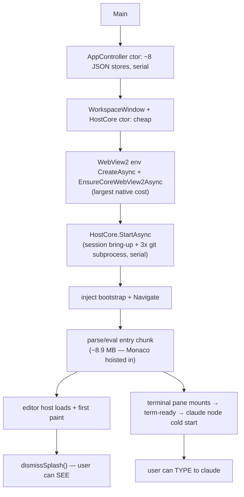

# Startup & typing latency

Where the ~2 s cold start and the keystroke path actually spend their time, and the concrete levers
to cut them. Findings are traced to `file:line` and, where measured, backed by a `vite build`.

## Summary

- **Typing is already tight.** The keystroke path (xterm → bridge → host → PTY) and the output path
  (PTY → host → bridge → xterm) are both synchronous and unbuffered in Weavie's own code. Nothing
  holds input or output for a frame. The only frame-scale delay is xterm.js's own
  `requestAnimationFrame` render coalescing — upstream, intended, and bounded by the display refresh
  (and the 120 Hz lever is already pulled, see
  [rendering-engine-and-refresh-rate.md](rendering-engine-and-refresh-rate.md)). There is no
  "buffer a frame before rendering" bug to fix. The remaining items are throughput micro-optimisations,
  not per-keystroke latency.
- **Startup has one dominant, fixable cause.** The app is *written* to lazy-load Monaco (the heaviest
  code by far), but two stray static imports drag the entire Monaco graph back into the first-paint
  entry chunk, defeating the split. Measured: the entry chunk is **~8.9 MB / 2.29 MB gzip**, almost
  all Monaco. Cutting the two imports restores the intended split and is the single biggest lever.
- **Two more structural startup costs:** the whole-screen splash is held until *Monaco* settles (so
  the terminal — the thing the user types into — is masked long after it's ready), and the host's
  WebView2 environment creation and `HostCore.StartAsync` (git + session bring-up) run **serially**
  though they're independent.

## How this was measured

`diagnostics.startupTiming` (off by default) appends `?startuptiming=1` to the index URL; the web then
logs `[startup/web] <phase> +<ms>` marks relative to navigation (`src/web/src/startup-timing.ts`).
Turn it on to time a real launch end to end.

**Measurement gap:** those marks are relative to *navigation*, so they cannot see the entire
pre-navigation host cost — process bootstrap, WebView2 environment creation, and `HostCore.StartAsync`
— which is where a large part of the 2 s lives. There is no host-side equivalent. Adding a
host-side phase log (gated on the same setting) is a prerequisite for trusting any host-side number.

---

## Typing latency

### Input path — keystroke → PTY byte (synchronous, no buffering)

```
keydown → term.onData → sendInput → postToHost → transport.send → host OnWebMessage → PTY WriteFile
```

- `src/web/src/terminal/TerminalView.tsx:209` `term.onData(sendInput)` fires synchronously from xterm's
  keydown handler; `:179` `sendInput` encodes and calls `postToHost` with no queue or timer.
- `src/web/src/bridge.ts:766` `postToHost` → `transport.send(JSON.stringify(...))` immediately. Native
  hosts (`bridge.ts:525`) hand straight to `webkit.messageHandlers.weavie.postMessage`; the WebSocket
  transport only buffers while mid-connect, never in steady state.
- Host intake is synchronous on the message thread: `src/Weavie.Win/Hosting/HostBridge.cs:28`
  (`OnWebMessageReceived`) and `src/Weavie.Mac/Hosting/HostBridge.cs:23` both invoke synchronously, no
  UI-thread marshal on the *inbound* path.
- `src/Weavie.Hosting/HostCore.WebBridge.cs:44` (`term-input`) → `TerminalController.Write`
  (`TerminalController.cs:363`, a short-held lock) → `WindowsConPtyTerminal.Write` →`WriteFile`
  (`WindowsConPtyTerminal.cs:214`).

No `requestAnimationFrame`, `setTimeout`, `queueMicrotask`, debounce, channel, or `Task.Delay` sits on
this path. Per-keystroke base64 + `JSON.stringify` is sub-microsecond on 1–4 byte payloads.

### Output path — PTY byte → pixel (synchronous, plus xterm's own frame)

```
PTY ReadFile → Output event → TerminalController.OnOutput → bridge.PostToWeb → web term.write
```

- The PTY read loop (`src/Weavie.Core/Terminal/WindowsConPtyTerminal.cs:251`, POSIX sibling
  `PosixPtyTerminal.cs:205`) fires each ≤8 KB chunk synchronously the instant `ReadFile` returns — no
  accumulate-and-flush timer.
- `src/Weavie.Hosting/TerminalController.cs:378` (`OnOutput`) forwards immediately via `PostToWeb`; no
  batching window, debounce, or coalescing.
- Web receive (`src/web/src/bridge.ts:486` `deliverFromHost`) and
  `src/web/src/terminal/TerminalView.tsx:256` `term.write(...)` are synchronous on message arrival.
- The one ~1-frame delay is **inside xterm.js**: `term.write` parses into its buffer and the WebGL
  renderer flushes dirty rows on a `requestAnimationFrame` tick, coalescing all writes in a frame into
  one GPU draw. This is the standard xterm design (it's what stops a flood of small writes melting the
  CPU) and is bounded by the display refresh (≈8 ms at 120 Hz). Not Weavie code; not worth forking.

### Micro-opportunities (throughput, not per-keystroke latency)

1. **Output marshal uses `ExecuteScriptAsync` + a JS-string-literal re-encode.** On the WebView hosts,
   `PostToWeb` wraps the (already base64-inflated) JSON as a JS string literal
   (`src/Weavie.Hosting/WebBridgeScript.cs:12`) and delivers it by *evaluating a script*
   (`src/Weavie.Win/Hosting/HostBridge.cs:51`, `src/Weavie.Mac/Hosting/HostBridge.cs:40`). The inbound
   path already uses the native message channel; the outbound path does not. On WebView2,
   `CoreWebView2.PostWebMessageAsString` delivers via the message event and skips both the literal
   re-encode and script parse/eval — meaningfully cheaper under a claude streaming flood. (macOS
   WKWebView has no host→web message channel, so it must stay on `evaluateJavaScript`; the web receive
   side can accept both.) This is a hot-path CPU win on bursts, not a typing-latency fix.
2. **Base64 round-trip on every chunk** (`TerminalController.cs:393` encode, `base64.ts:12` decode) is
   pure overhead riding the JSON-string bridge. Only worth it alongside a binary terminal channel; low
   priority and larger surface.

**Bottom line on typing:** no defect; leave the path alone. The 120 Hz flag (Mac) and WebView2's native
120 Hz (Windows) are the real perceived-latency levers and are already in place.

---

## Startup latency



### 1. Monaco is hoisted into the first-paint chunk — the dominant lever

The code intends to lazy-load Monaco: `src/web/src/editor/editor-controller.ts:399` does
`import("./editor-host")`, and `editor-host.ts` is otherwise reached only dynamically. But two static
value-imports from the entry graph pull the whole Monaco graph back into the entry chunk, so Rollup
must include it before first paint:

1. `src/web/src/App.tsx:71` → `src/web/src/lsp/lsp-client.ts:8` `import * as monaco from "monaco-editor"`
   (+ `monaco-languageclient`, `vscode-languageclient`, `vscode-ws-jsonrpc`).
2. `src/web/src/App.tsx:59` → `editor-controller.ts:8,16` static imports of `./comment-prose` and
   `./inline-diff`, both of which reach `./monaco-setup` and `@codingame/monaco-vscode-api`.

Either path alone forces all of Monaco into the entry. Measured on this tree: entry `main-*.js` =
**8,894 kB / 2,285 kB gzip**; the lazy `editor-host-*.js` chunk is only **6.6 kB** (its heavy deps were
hoisted away). The fix is to make both paths dynamic so they ride the existing `editor-host` boundary.

- **lsp-client:** `rebindLanguageServices` is used only in the `lsp-config` host-message handler
  (`App.tsx:537`). Make it `await import("./lsp/lsp-client")` on demand. (`startLanguageServices` is
  already called from inside the dynamic `editor-host.ts`, so this is the only eager leak.)
- **editor-controller:** keep the `import type` lines (erased), but load the runtime values
  (`createInlineDiff`, `firstChangedLine`, `createCommentProse`) dynamically inside `start()`'s `.then`
  — where `import("./editor-host")` already runs. `firstChangedLine` is also used in the `show-diff`
  handler (`editor-controller.ts:569`), but that handler is reached only once the editor host exists
  (`host?.beginReview(...)` short-circuits otherwise), so a captured reference is safe.

**Done (this branch).** Both paths were made dynamic. Measured before → after (`vite build`):

| First-paint `main` chunk | raw | gzip |
|---|---|---|
| Before | 8,894 kB | 2,285 kB |
| After | **721 kB** | **193 kB** |

Monaco now ships as its own lazy chunks loaded behind the `editor-host` boundary —`editor.api`
6,340 kB, `vscode-services` 743 kB, `lsp-client` 1,048 kB, `iconv-lite` 298 kB — in parallel while the
terminal is already interactive. `tsc`, `biome`, and the vitest suite pass. **Still needs a live
smoke test** of the editor/review path (open a file; trigger a claude openDiff) since vitest doesn't
exercise the real Monaco host.

### 2. The splash is gated on the editor, not the terminal

**Done (this branch).** `dismissSplash()` was called from exactly one place — the `.finally()` of editor
init (`editor-controller.ts`), so the whole-screen splash stayed up until Monaco downloaded, parsed, and
painted, even though the terminal is in the main chunk and ready far earlier. Now `TerminalView` fires a
once-only `onFirstRender` (off xterm's first `onRender`) and `App` passes `dismissSplash` to it, so the
reveal happens on the first painted terminal frame; the editor-ready dismiss stays as a fallback (both
idempotent) for layouts with no terminal. The editor pane fills in under the reveal when Monaco loads.

### 3. WebView2 env creation and `HostCore.StartAsync` run serially

`src/Weavie.Win/WorkspaceWindow.WebView.cs:32` (`CreateAsync` + `EnsureCoreWebView2Async`) fully
precedes `WebAppLauncher.LaunchAsync`, which `await`s `HostCore.StartAsync` before navigating
(`src/Weavie.Hosting/Web/WebAppLauncher.cs:31`). These are independent: WebView2 browser-process
bring-up doesn't depend on the session/git work, and vice versa. (The WebView2 user-data folder is
already persisted at `~/.weavie/internals/webview2` — not recreated per run.)

**Done (this branch).** `HostCore.StartAsync` is now idempotent (caches its run under a lock). The Win
shell starts the WebView2 environment task, then kicks off `StartAsync` so the
backend (sessions + git) builds while the browser process spins up out-of-process, then awaits the env;
the web launcher later joins the same cached run. In Debug the shared workspace server still owns resources
while Vite owns the hot-reload document origin. No thread-affinity change:
`CreateSession` still runs on the UI thread exactly as before, just interleaved with the env spin-up.
**Needs a runtime startup check** on Windows (Debug + Release).

### 4. Dedupe git work in `StartAsync`

**Dedupe done (this branch).** `StartAsync` resolved the rail label (one `git.IsRepositoryAsync` +
branch) and then `BuildWorktreeManagerAsync` checked `IsRepositoryAsync` a second time. A shared
`ProbeGitAsync` now runs is-repo once and feeds both the label and the (now-synchronous)
`BuildWorktreeManager`, dropping one git subprocess from the critical path.

**Reconcile-defer not done (deliberately).** `ReconcileWorktreesOnOpenAsync` (`git worktree list`) feeds
only the rail, which hydrates async via the `ready` burst, so it *looks* deferrable — but it mutates the
`SessionManager` slot set, and after navigation that set is also touched by UI-thread web-message
handlers. Making it fire-and-forget introduces a real `_sessions` race. Left awaited; only worth
revisiting with explicit `SessionManager` synchronization.

### 5. Parallelize the AppController store loads — recommend holding

`src/Weavie.Win/Hosting/AppController.cs` loads ~8 JSON stores serially in the constructor, each with a
`FileSystemWatcher`. Only `Settings`, `recents`, and `Keybindings` gate showing the window. In principle
the other five (theme/remote/rail/claude-sessions) could be deferred or parallelized — but the win is
only tens of ms on a constructor that can't `await` (so parallelizing means `Task.Run` + join, or an
async-factory restructure), against fields the window-open path reads immediately (ordering risk).
**Recommend holding until #6 lets us measure it** — the payoff is unproven and the churn/risk isn't
clearly worth it.

### What's already right (leave alone)

- **claude is spawned lazily**, on `term-ready` (`HostCore.WebBridge.cs:50` → `TerminalController.OnReady`),
  not eagerly on boot — so node cold-start overlaps the user orienting and never blocks "see the app".
  (With #1+#2 it starts sooner because the terminal mounts sooner; optionally `EnsureStarted()` right
  after `StartAsync` to begin it during bundle parse.)
- The ~200 TextMate grammars are lazily-fetched `?url` data assets, not in the JS bundle
  (`grammar-assets.ts`); registration runs in the editor chunk. No action.
- WebView2 user-data folder persisted; inline pre-JS splash paints before any JS.

---

## Ranked plan

| # | Change | Where | Impact | Risk |
|---|---|---|---|---|
| 1 | **DONE** — De-hoist Monaco from the entry chunk (made `lsp-client` + `editor-controller`'s diff/prose imports dynamic) | `App.tsx`, `editor-controller.ts` | **High** — 8.9 MB → 721 kB first paint (2.09 MB gzip off) | Done; needs a live openDiff smoke test |
| 2 | **DONE** — Dismiss splash on first terminal paint, not editor-ready | `TerminalView.tsx`, `App.tsx`, `index.html` | High (perceived) | Done; runtime check wanted |
| 3 | **DONE** — Overlap WebView2 env creation with `HostCore.StartAsync` (idempotent + Release kickoff) | `WorkspaceWindow.WebView.cs`, `HostCore.cs` | Medium | Done; runtime check wanted |
| 4 | **DONE (dedupe)** — one shared git probe; reconcile-defer skipped (race) | `HostCore.cs`, `HostCore.Sessions.cs` | Low–med | Low |
| 5 | Parallelize/defer non-critical AppController store loads — **recommend holding** | `AppController.cs` | Low (tens of ms) | Med (ordering) |
| 6 | Host-side startup timing marks (measurement) | host bootstrap, gated on `diagnostics.startupTiming` | Enables trusting host numbers | Low |
| 7 | Output via `PostWebMessageAsString` instead of `ExecuteScriptAsync` (throughput) | `HostBridge.cs`, `WebBridgeScript.cs`, `bridge.ts` | Med under flood; not typing latency | Medium |

#1–#4 are done on this branch (build/tsc/biome/vitest green; the two host changes and the splash change
still want a live Windows startup check). #5 is held pending measurement (#6). #6/#7 remain. Typing
needs no change beyond what's already shipped.
</content>
</invoke>
