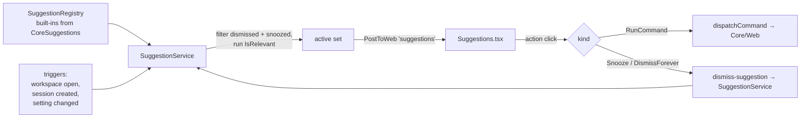

# Contextual suggestions

A Core-owned surface for **dismissible, contextual nudges** that teach the user what Weavie can do —
registered once in Core, evaluated against the current workspace, and rendered as small cards the user
can act on or dismiss. The first instance is the **workspace-setup** nudge (`workspace.setup`), which
offers to configure this repo's knowledge-shaped settings — the worktree setup command and the test
profile — when the repo looks like it needs it. (It supersedes the original worktree-only card; see
[test-running-and-workspace-setup.md](test-running-and-workspace-setup.md).)

## Why

Weavie has capabilities the user can't discover: settings, commands, and behaviors that only surface
if you already know to ask Claude for them. The worktree setup command is the sharp example — a repo
that wants `pnpm install` before work gets nothing, because no one tells the user the setting exists.

We need a *general* way to say "here's something you can do, right now, in this context" — not a one-off
banner. This spec defines that surface; its first user is the workspace-setup nudge.

The hard constraint: a nudge must **never spend model tokens or act without the user's say-so**. The
gate is the user clicking the suggestion — only then do we engage Claude, and we engage the *embedded
interactive session* (subscription-billed), never `claude -p`/SDK.

## Goals / non-goals

- **Goal**: register a suggestion in one place; have it evaluated, surfaced, actioned, and dismissed.
- **Goal**: actions map to commands, so each advertises its keybinding (the keyboard-first rule).
- **Goal**: per-workspace dismissal — "don't ask again" silences it here, not on the next repo.
- **Non-goal**: a notification *log* or history. A suggestion is live state; when it stops being
  relevant (or is dismissed) it disappears. Toasts (`notify`) remain the channel for transient events.
- **Non-goal**: a bespoke prompt-injection mechanism. We seed the same way `SeedFirstPrompt` does
  (write into the session's Claude input) but **pre-fill without submitting** rather than auto-Entering —
  see *Seeding safety*. A general readiness/idle signal is tracked under *Open questions*.

## Model

Mirrors `SettingDefinition` / `CommandDefinition`: declared records, registered in a registry.

```csharp
public sealed record SuggestionDefinition {
    public required string Id { get; init; }                          // "worktree.setupCommand"
    public required string Title { get; init; }                       // card headline
    public required string Body { get; init; }                        // one-line explanation
    public required Func<SuggestionContext, bool> IsRelevant { get; init; }
    public required IReadOnlyList<SuggestionAction> Actions { get; init; }
}

public sealed record SuggestionAction {
    public required string Label { get; init; }
    public required SuggestionActionKind Kind { get; init; }          // RunCommand | Snooze | DismissForever
    public string? CommandId { get; init; }                           // set iff Kind == RunCommand
    public string? ArgsJson { get; init; }                            // optional per-action args
}

public enum SuggestionActionKind { RunCommand, Snooze, DismissForever }

public sealed record SuggestionContext {
    public required string WorkspaceRoot { get; init; }
    public required SettingsStore Settings { get; init; }
    public required IFileSystem FileSystem { get; init; }
}
```

`IsRelevant` is a pure predicate over the context — no side effects, no model calls. It answers only
"should this card be showing right now?".

A `RunCommand` action is also treated as engagement: after its command dispatches, the suggestion is
snoozed (the user took the offer; stop showing it). `Snooze` is "not now" — hidden for this app run.
`DismissForever` persists per-workspace.

## Registry, evaluation, dispatch



- **`SuggestionRegistry`** — holds the definitions (`CoreSuggestions.Register(registry)`), same shape
  as `CommandRegistry`.
- **`SuggestionService`** — owns evaluation and dismissal state. `Evaluate()` builds the context, drops
  ids that are snoozed (in-memory set) or dismissed-forever (persisted store), runs each `IsRelevant`,
  and pushes the surviving set. It re-evaluates on the trigger points and exposes `Snooze(id)` /
  `DismissForever(id)`. It also owns the **bounded, memoized manifest probe**: kicked off asynchronously
  on workspace open (off the hot path, with a fail-open timeout — see below), cached per workspace and
  invalidated on switch, and it re-evaluates + pushes once the probe resolves. Re-evaluation on a
  frequent trigger reads the cached signal rather than re-walking the disk.
- **Triggers** — workspace open, after a session/worktree is created, and on `SettingChanged` for keys
  a suggestion depends on (so setting `worktree.setupCommand` makes the card vanish immediately).

## Dismissal — per-workspace

Dismissal is per-workspace *state*, not a global tunable, so it does **not** live in `settings.toml`.
It follows the per-workspace JSON pattern (`WorktreeRegistry`, `LayoutStore`):

- File: `~/.weavie/workspaces/<id>/suggestions.json`, via `WeaviePaths.WorkspaceDir(id)`.
- Atomic writes; malformed file backed up to `suggestions.json.bad` and reset (`JsonStoreFile.BackupBad`).
- Persists **only** `DismissForever` ids: `{ "version": 1, "dismissed": ["worktree.setupCommand"] }`.
- **Snooze** ("not now") is in-memory in `SuggestionService` — it clears on app restart, so a fresh run
  re-offers; "don't ask again" is the durable one. A brand-new repo has an empty file, so it always
  gets the offer.

## Web surface

A new ambient message (fan-out to every client, like `session-list`):

```jsonc
{ "type": "suggestions", "items": [
  { "id": "worktree.setupCommand", "title": "...", "body": "...",
    "actions": [ { "label": "Yes", "kind": "RunCommand", "commandId": "weavie.worktree.suggestSetupCommand" },
                 { "label": "Not now", "kind": "Snooze" },
                 { "label": "Don't ask again", "kind": "DismissForever" } ] } ] }
```

- **`Suggestions.tsx`** renders the items as dismissible cards. A `RunCommand` action button resolves
  its shortcut from the command catalog (`window.__WEAVIE_COMMANDS__` + `formatKey`) and shows it
  inline (`Yes (⌘…)`); unbound commands show just the label.
- Action handling: `RunCommand` → `dispatchCommand(commandId, args)`; `Snooze` / `DismissForever` →
  send `{ type: "dismiss-suggestion", id, forever }` to the host. The host applies the dismissal and
  re-pushes the (now shorter) active set.

## Commands added

Per the keyboard-first rule, the actionable nudge is backed by a real command (palette-visible, so it's
reachable without the card):

- **`weavie.worktree.suggestSetupCommand`** (`RunsIn = Core`, category "Worktree") — "Suggest a worktree
  setup command". No default keybinding (contextual). Handler seeds the active session's Claude (below).

`Snooze` / `DismissForever` are intrinsic to the suggestions surface, not commands — they have no
meaningful keybinding and exist only in the context of a shown card.

## First instance — the workspace-setup nudge

Registered in `CoreSuggestions`. (Originally a worktree-command-only card; generalized to configure all
knowledge-shaped workspace settings — see
[test-running-and-workspace-setup.md](test-running-and-workspace-setup.md).)

- **Id** `workspace.setup`, with `LegacyIds = ["worktree.setupCommand"]` so a user who dismissed the
  original card forever isn't re-nagged by the successor.
- **IsRelevant**: **either** `worktree.setupCommand` **or** `test.profile` is unconfigured (workspace-scoped
  reads via `SettingsStore.GetString(key, ctx.WorkspaceRoot)`, tested with `string.IsNullOrWhiteSpace`)
  **and** the repo has a recognizable dependency/build manifest. The manifest scan is **shallow, not root-only**: it checks
  the workspace root and up to two levels of subdirectories, skipping vendored/output dirs (`.git`,
  `node_modules`, `bin`, `obj`, `target`, `dist`). Root-only would miss exactly the repos that most need
  a setup command — Weavie's own checkout keeps `package.json`/`pnpm-lock.yaml` under `src/web/` with
  `weavie.slnx` + `.csproj` files at the root, and monorepos keep manifests in package subdirs.
  Recognized manifests: `package.json`, `pnpm-lock.yaml`, `Cargo.toml`, `go.mod`, `pyproject.toml`,
  `Makefile`, and `*.slnx`/`*.sln`/`*.csproj` (.NET — `dotnet restore`/`build` is the canonical setup,
  and was the notable omission). The scan keeps us from nagging on repos with nothing to install.
  (Dismissal filtering is handled by the service, not the predicate.)
- **Off the hot path.** The probe runs **asynchronously**, kicked off on workspace open — never inside a
  trigger — and the surviving set is re-pushed when it resolves, so the card simply appears a beat after
  open. The walk **short-circuits on the first manifest**, is capped structurally (root + ≤2 levels,
  minus the skip-list), and is **memoized per workspace** (see below) so it runs at most once per open,
  not per trigger.
- **Timeout (a scoped, deliberate exception).** The probe also carries a wall-clock timeout, a backstop
  against a pathologically slow or huge tree (e.g. a network filesystem) the structural cap alone
  wouldn't bound in time. This knowingly breaks the repo's no-safety-net-timeout rule, allowed here on
  one condition: it is made **honest by failing open**. On timeout the probe reports *manifest present*
  and shows the dismissible card — it never silently concludes "no manifest" and hides a deserved one
  (the anti-pattern the rule exists to stop). Failing open is also the better guess: a repo big or slow
  enough to exhaust the timeout almost certainly has dependencies worth a setup command. Because the
  probe is off the hot path, the timeout only bounds the background work; it never blocks the UI.
- **Actions**: `Yes` → `weavie.workspace.setup`; `Not now` → Snooze; `Don't ask again` →
  DismissForever.

**"Yes" engages Claude in the primary session.** The command handler seeds the **primary** session's
`Claude` controller (`PrimarySlot()`, `IsPrimary = true`) — not the *active* session — with the
`WorkspaceSetupPrompt` text (the same artifact the `/mcp__weavie__setup-workspace` MCP prompt serves),
which has Claude inspect the repo, propose `worktree.setupCommand` and `test.profile`, and ask the user
to confirm each in the Claude pane. The multi-line prompt is injected as a **bracketed paste** so the
TUI treats it as one paste rather than submitting line-by-line.

Claude reads the repo, proposes, **and asks the user to confirm in the Claude pane** — the confirmation
is conversational, which is exactly the desired "Claude figures it out and asks you to confirm". On
confirmation it persists each value through the existing `setSetting` MCP tool (routed to the workspace's
`.weavie/settings.toml`); the existing `ShellWorktreeProvisioner` picks up the setup command on the next
worktree create, and the run lenses pick up the test profile. No new save path. Because the values are
now set, the next `Evaluate()` (via `SettingChanged`) drops the card.

**Why the primary session — not the active one or a new one.** `worktree.setupCommand` is a global
setting that scopes every future worktree, so the conversation belongs to no particular worktree. The
*active* session may itself be a worktree, mid-turn, or one the user is typing in. The primary session
is the right host: always loaded, never unloadable, and rooted directly at `WorkspaceRoot`
(`AddPrimarySlot`, `IsPrimary = true`) — the same directory the manifest scan ran against. A *new*
session "reusing the main worktree" was considered and rejected: it isn't supported (every new-session
path allocates a fresh git worktree), and it's redundant — the primary session already **is** a session
rooted at the main worktree. A second session sharing `WorkspaceRoot` would also collide with the
primary on the two cwd-keyed stores (Claude-resume in `ClaudeSessionStore`, shell scrollback via
`WorkspaceId.ForPath`).

> **Seeding safety.** Even the primary session can be mid-turn or hold text the user is composing, so
> the handler must **not** blindly inject text + Enter. `SeedFirstPrompt`'s fixed-2.5s auto-submit is
> tuned for a just-spawned session and is **not** reused as-is here. v1 **pre-fills without submitting**
> (write the prompt into the Claude input, no Enter) and lets the user press Enter — so the prompt can
> never land in a busy session, and the click-to-engage gate stays explicit. See Open questions.

## Files touched

| Area | Change |
| --- | --- |
| `src/Weavie.Core/Suggestions/SuggestionDefinition.cs` | new — records + `SuggestionContext` + kinds |
| `src/Weavie.Core/Suggestions/SuggestionRegistry.cs` | new — registry (mirrors `CommandRegistry`) |
| `src/Weavie.Core/Suggestions/SuggestionService.cs` | new — evaluate, snooze, dismiss, push |
| `src/Weavie.Core/Suggestions/SuggestionDismissals.cs` | new — per-workspace persisted store |
| `src/Weavie.Core/Suggestions/CoreSuggestions.cs` | new — built-in suggestions (workspace setup) |
| `src/Weavie.Core/Commands/CoreCommands.cs` | declare `weavie.workspace.setup` |
| `src/Weavie.Hosting/HostCore.*.cs` | wire service, triggers, `suggestions` push, `dismiss-suggestion` handler, seed-command handler |
| `src/web/src/bridge.ts` | handle `suggestions`; send `dismiss-suggestion` |
| `src/web/src/.../Suggestions.tsx` | new — card surface |
| `src/web/src/App.tsx` | mount the surface |
| `docs/concepts/suggestions.md` + `CLAUDE.md` | one-line concept entry + link |

## Open questions / future

- **Seeding robustness.** v1 settles on **pre-fill-without-submit** (write the prompt, no Enter; the
  user presses Enter) — see *Seeding safety* above. Note there is **no** existing idle/turn-state signal
  to gate on: `ClaudeStartupWatcher` confirms the TUI *came up* (gated on output volume), it does not
  report whether a turn is in flight. A true "session is idle" signal would let us optionally auto-submit
  when safe; building one is deferred.
- **More suggestions.** Natural follow-ups: unbound high-value commands, a teardown-command nudge,
  surfacing capabilities the user has never invoked. The surface is built to absorb these without new UI.
- **MCP exposure.** Should Claude be able to `listSuggestions` / raise one? Out of scope for v1.
