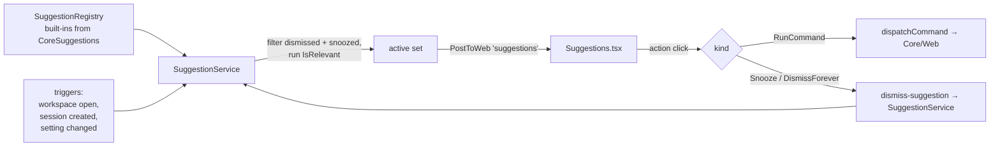

# Contextual suggestions

A Core-owned surface for **dismissible, contextual nudges** that teach the user what Weavie can do —
registered once in Core, evaluated against the current workspace, and rendered as small cards the user
can act on or dismiss. The first instance offers to configure `worktree.setupCommand` when the repo
looks like it needs one.

## Why

Weavie has capabilities the user can't discover: settings, commands, and behaviors that only surface
if you already know to ask Claude for them. The worktree setup command is the sharp example — a repo
that wants `pnpm install` before work gets nothing, because no one tells the user the setting exists.

We need a *general* way to say "here's something you can do, right now, in this context" — not a one-off
banner. This spec defines that surface and lands the worktree-setup nudge as its first user.

The hard constraint: a nudge must **never spend model tokens or act without the user's say-so**. The
gate is the user clicking the suggestion — only then do we engage Claude, and we engage the *embedded
interactive session* (subscription-billed), never `claude -p`/SDK.

## Goals / non-goals

- **Goal**: register a suggestion in one place; have it evaluated, surfaced, actioned, and dismissed.
- **Goal**: actions map to commands, so each advertises its keybinding (the keyboard-first rule).
- **Goal**: per-workspace dismissal — "don't ask again" silences it here, not on the next repo.
- **Non-goal**: a notification *log* or history. A suggestion is live state; when it stops being
  relevant (or is dismissed) it disappears. Toasts (`notify`) remain the channel for transient events.
- **Non-goal**: re-implementing prompt seeding. We reuse `SeedFirstPrompt` as-is; hardening it
  (readiness detection, pre-fill-without-submit) is tracked separately under *Open questions*.

## Model

Mirrors `SettingDefinition` / `CommandDefinition`: declared records, registered in a registry.

```csharp
public sealed record SuggestionDefinition {
    public required string Id { get; init; }                          // "worktree.setupCommand"
    public required string Title { get; init; }                       // card headline
    public required string Body { get; init; }                        // one-line explanation
    public required Func<SuggestionContext, bool> IsRelevant { get; init; }
    public required IReadOnlyList<SuggestionAction> Actions { get; init; }
}

public sealed record SuggestionAction {
    public required string Label { get; init; }
    public required SuggestionActionKind Kind { get; init; }          // RunCommand | Snooze | DismissForever
    public string? CommandId { get; init; }                           // set iff Kind == RunCommand
    public string? ArgsJson { get; init; }                            // optional per-action args
}

public enum SuggestionActionKind { RunCommand, Snooze, DismissForever }

public sealed record SuggestionContext {
    public required string WorkspaceRoot { get; init; }
    public required SettingsStore Settings { get; init; }
    public required IFileSystem FileSystem { get; init; }
}
```

`IsRelevant` is a pure predicate over the context — no side effects, no model calls. It answers only
"should this card be showing right now?".

A `RunCommand` action is also treated as engagement: after its command dispatches, the suggestion is
snoozed (the user took the offer; stop showing it). `Snooze` is "not now" — hidden for this app run.
`DismissForever` persists per-workspace.

## Registry, evaluation, dispatch



- **`SuggestionRegistry`** — holds the definitions (`CoreSuggestions.Register(registry)`), same shape
  as `CommandRegistry`.
- **`SuggestionService`** — owns evaluation and dismissal state. `Evaluate()` builds the context, drops
  ids that are snoozed (in-memory set) or dismissed-forever (persisted store), runs each `IsRelevant`,
  and pushes the surviving set. It re-evaluates on the trigger points and exposes `Snooze(id)` /
  `DismissForever(id)`.
- **Triggers** — workspace open, after a session/worktree is created, and on `SettingChanged` for keys
  a suggestion depends on (so setting `worktree.setupCommand` makes the card vanish immediately).

## Dismissal — per-workspace

Dismissal is per-workspace *state*, not a global tunable, so it does **not** live in `settings.toml`.
It follows the per-workspace JSON pattern (`WorktreeRegistry`, `LayoutStore`):

- File: `~/.weavie/workspaces/<id>/suggestions.json`, via `WeaviePaths.WorkspaceDir(id)`.
- Atomic writes; malformed file backed up to `suggestions.json.bad` and reset (`JsonStoreFile.BackupBad`).
- Persists **only** `DismissForever` ids: `{ "version": 1, "dismissed": ["worktree.setupCommand"] }`.
- **Snooze** ("not now") is in-memory in `SuggestionService` — it clears on app restart, so a fresh run
  re-offers; "don't ask again" is the durable one. A brand-new repo has an empty file, so it always
  gets the offer.

## Web surface

A new ambient message (fan-out to every client, like `session-list`):

```jsonc
{ "type": "suggestions", "items": [
  { "id": "worktree.setupCommand", "title": "...", "body": "...",
    "actions": [ { "label": "Yes", "kind": "RunCommand", "commandId": "weavie.worktree.suggestSetupCommand" },
                 { "label": "Not now", "kind": "Snooze" },
                 { "label": "Don't ask again", "kind": "DismissForever" } ] } ] }
```

- **`Suggestions.tsx`** renders the items as dismissible cards. A `RunCommand` action button resolves
  its shortcut from the command catalog (`window.__WEAVIE_COMMANDS__` + `formatKey`) and shows it
  inline (`Yes (⌘…)`); unbound commands show just the label.
- Action handling: `RunCommand` → `dispatchCommand(commandId, args)`; `Snooze` / `DismissForever` →
  send `{ type: "dismiss-suggestion", id, forever }` to the host. The host applies the dismissal and
  re-pushes the (now shorter) active set.

## Commands added

Per the keyboard-first rule, the actionable nudge is backed by a real command (palette-visible, so it's
reachable without the card):

- **`weavie.worktree.suggestSetupCommand`** (`RunsIn = Core`, category "Worktree") — "Suggest a worktree
  setup command". No default keybinding (contextual). Handler seeds the active session's Claude (below).

`Snooze` / `DismissForever` are intrinsic to the suggestions surface, not commands — they have no
meaningful keybinding and exist only in the context of a shown card.

## First instance — the worktree setup nudge

Registered in `CoreSuggestions`:

- **Id** `worktree.setupCommand`.
- **IsRelevant**: `worktree.setupCommand` resolves to empty **and** the repo has a recognizable
  dependency/build manifest at its root (`package.json`, `pnpm-lock.yaml`, `Cargo.toml`, `go.mod`,
  `pyproject.toml`, `Makefile`, …). The manifest check keeps us from nagging on repos with nothing to
  install. (Dismissal filtering is handled by the service, not the predicate.)
- **Actions**: `Yes` → `weavie.worktree.suggestSetupCommand`; `Not now` → Snooze; `Don't ask again` →
  DismissForever.

**"Yes" engages Claude via the embedded session.** The command handler calls `SeedFirstPrompt` against
the **active** session's `Claude` controller with an analysis prompt:

> Look at this repository and decide a single shell command suitable for the `worktree.setupCommand`
> setting — the one command needed to make a fresh checkout ready to work in (install dependencies,
> and a build step only if required before editing). Briefly explain your choice and ask me to confirm.
> On my confirmation, call the `setSetting` tool with key `worktree.setupCommand`. Don't run anything
> else.

Claude reads the repo, proposes, **and asks the user to confirm in the Claude pane** — the confirmation
is conversational, which is exactly the desired "Claude figures it out and asks you to confirm". On
confirmation it persists the value through the existing `setSetting` MCP tool; the existing
`ShellWorktreeProvisioner` picks it up on the next worktree create. No new save path, no new provisioner.

Because the value is now set, the next `Evaluate()` (via `SettingChanged`) drops the card.

> **Reuse note.** `SeedFirstPrompt` is reused unchanged — it auto-submits (text + Enter) after a fixed
> 2.5s delay into the active session. That's acceptable for the typical trigger (workspace just opened,
> Claude idle). Its known fragilities are tracked below, not fixed here.

## Files touched

| Area | Change |
| --- | --- |
| `src/Weavie.Core/Suggestions/SuggestionDefinition.cs` | new — records + `SuggestionContext` + kinds |
| `src/Weavie.Core/Suggestions/SuggestionRegistry.cs` | new — registry (mirrors `CommandRegistry`) |
| `src/Weavie.Core/Suggestions/SuggestionService.cs` | new — evaluate, snooze, dismiss, push |
| `src/Weavie.Core/Suggestions/SuggestionDismissals.cs` | new — per-workspace persisted store |
| `src/Weavie.Core/Suggestions/CoreSuggestions.cs` | new — built-in suggestions (worktree setup) |
| `src/Weavie.Core/Commands/CoreCommands.cs` | declare `weavie.worktree.suggestSetupCommand` |
| `src/Weavie.Hosting/HostCore.*.cs` | wire service, triggers, `suggestions` push, `dismiss-suggestion` handler, seed-command handler |
| `src/web/src/bridge.ts` | handle `suggestions`; send `dismiss-suggestion` |
| `src/web/src/.../Suggestions.tsx` | new — card surface |
| `src/web/src/App.tsx` | mount the surface |
| `docs/concepts/suggestions.md` + `CLAUDE.md` | one-line concept entry + link |

## Open questions / future

- **Seeding robustness.** Gate seeding on the existing `ClaudeStartupWatcher`/idle signal instead of the
  2.5s timer, and consider **pre-fill-without-submit** (write the prompt, no Enter) so we never inject
  into a busy session and the user presses Enter themselves. Deferred per direction.
- **More suggestions.** Natural follow-ups: unbound high-value commands, a teardown-command nudge,
  surfacing capabilities the user has never invoked. The surface is built to absorb these without new UI.
- **MCP exposure.** Should Claude be able to `listSuggestions` / raise one? Out of scope for v1.
