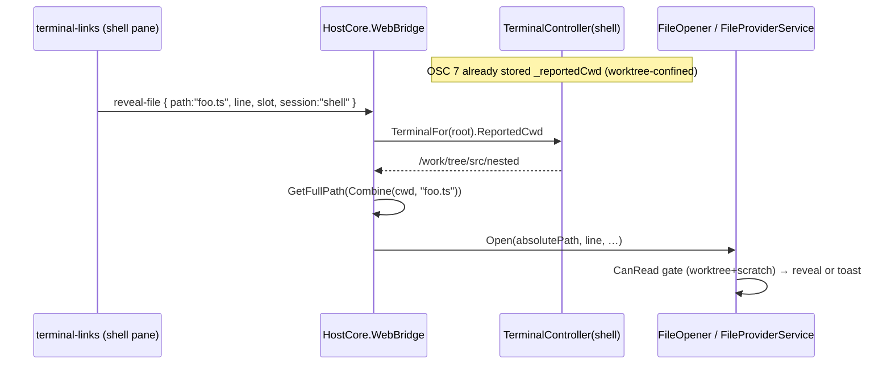

# Terminal file links resolve against the shell's live cwd

Filenames printed in the shell pane are clickable and open in the editor. A `path:line`, a tool-wrapped
path (`Edit(src/foo.ts)`), or a bare path with a separator is auto-detected in `terminal-links.ts` and
posted to the host as `reveal-file`. The problem this spec addresses: a *relative* reference (the common
`ls`/`find`/tool output) only opens the right file if the host resolves it against the directory the shell
is actually in — not the worktree root.

## The two halves

1. **Resolution** — a `reveal-file` from a terminal carries its pane (`slot` + `session`). The host reads
   that pane's last OSC 7 cwd and resolves a relative path against it. This is the enabling fix.
2. **Reporting** — the shell only reports its cwd (OSC 7) if configured to. Weavie injects a tiny startup
   snippet so bash/zsh report it on every prompt, so the cwd is known regardless of the user's own config.

## Resolution (host-side)

`reveal-file` flows straight to the active session's `FileOpener`, which historically resolved a relative
path against the worktree root. The web now stamps the originating pane on the message (the same `slot` +
`session` every `term-*` message already carries), and the host resolves against that pane's confined cwd
before opening:

Key properties:

- **The cwd is already the validated copy.** `TerminalController.OnCwdReported` confines the untrusted
  OSC 7 directory to the session's worktree before storing it; `ReportedCwd` just exposes that field. The
  untrusted string never round-trips out to the web and back.
- **Double confinement.** The resolved path still passes `FileProviderService.CanRead` (worktree + scratch),
  so a `reveal-file` with a `../../etc/passwd` payload is refused and toasts, exactly as before.
- **Non-terminal opens are unchanged.** A `reveal-file` with no pane (omnibar, MCP `openFile`), or from the
  Claude pane (fixed cwd, `ReportedCwd` null — Claude prints worktree-relative paths), resolves against the
  worktree root as it always did.

Bare *single-segment* filenames (a plain `foo.ts` with no separator) are still **not** linked: xterm draws
the link before any host round-trip, so there is no synchronous way to check the file exists, and linking
every `word.ext` in prose is worse than the payoff. `ls -R`/`find`/tool output — which carry separators —
resolve correctly, which is the common case.

## Reporting (shell integration)

Gated by the `terminal.shellIntegration` setting (**on by default**; a real, discoverable setting, not a
hidden env var). When on, `ShellTerminalProcess` launches bash/zsh through `ShellIntegration`, which
materializes small rc files under `~/.weavie/internals/shell-integration` and points the shell at them. The
integration **sources the user's own startup files unchanged** and only *appends* an OSC 7 emitter, so
aliases, prompt, and PATH are untouched.

| Shell | Mechanism | Deliberate note |
| --- | --- | --- |
| **bash** | `--rcfile <file> -i`; the file sources the login chain (`/etc/profile` + first of `~/.bash_profile`/`~/.bash_login`/`~/.profile`) then prepends an emitter to `PROMPT_COMMAND` | `--rcfile` makes bash interactive-non-login, so the file reproduces the login startup the plain `bash -l -i` had. This is a deliberate change from a true login bash. |
| **zsh** | `ZDOTDIR` → our dir with `.zshenv`/`.zprofile`/`.zshrc` stubs that source the user's counterparts by explicit path and add a `precmd` hook | `ZDOTDIR` redirects *all* startup files, so each stub restores it; we keep it on our dir through `.zshenv`/`.zprofile` (re-asserting in case the user's file changed it) so our `.zshrc` is reached, then restore it there so a later `.zlogin` loads normally. |
| **sh / fish / pwsh / powershell** | not covered — fall back to the plain interactive launch | fish/pwsh need their own prompt hook; follow-ups. |

The OSC 7 payload is `file://<host><pwd>`; the web drops the host part, so an empty/garbage `$HOSTNAME` is
harmless. OSC 7 fires at each prompt, so the cwd is accurate between commands (which is when a link is
clicked), not mid-command.

## Tests

- `TerminalControllerCwdTests` — `ReportedCwd` exposes the confined dir and stays null for an out-of-worktree report.
- `RevealFileResolutionTests` — full-host: a shell link resolves against the pane cwd; a pane-less link
  resolves against the worktree root; an escaping path is refused (toast, no open).
- `ShellIntegrationTests` — the per-shell launch args/env, and that the rc files source the user config while
  appending the emitter.
- `terminal-links.test.ts` — every `reveal-file` carries the originating pane.
