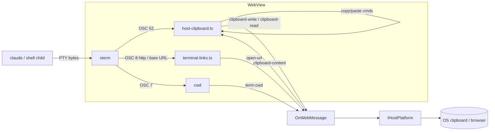

# Terminal ↔ host-OS actions

The embedded terminal (the Claude Code TUI and shell panes, xterm.js in the WebView) is otherwise an
opaque byte pipe: PTY output is base64-forwarded to xterm and parsed nowhere, so anything the child
asks the host OS to *do* — copy to the clipboard, open a browser, set a title, report its directory —
was silently dropped. This adds one **host-OS-actions** channel and hangs those capabilities off it.

## The channel

The web already round-trips native work through `postToHost` → `HostCore.OnWebMessage` → a per-host
seam (the `reveal-file` → `FileOpener` path is the template). The same shape carries the new actions:

- New `HostBoundMessage`s (web → host): `clipboard-write`, `clipboard-read`, `open-url`, `term-cwd`.
- New `WebBoundMessage` (host → web): `clipboard-content` (the reply to `clipboard-read`, correlated
  by `id`, mirroring the `fs-read` request/response pattern).
- Three required members on `IHostPlatform` (the ToggleWindow precedent — real on every desktop host,
  no-op on Headless/Test): `WriteClipboard(text)`, `ReadClipboard()`, `OpenExternalUrl(url)`.

Clipboard writes/reads go through the **host**, not `navigator.clipboard`: the WebView's clipboard
API is focus- and permission-gated (it throws when the document isn't focused — exactly the flakiness
being fixed), whereas the host owns the real OS clipboard unconditionally. `OnWebMessage` runs on each
native host's UI thread, so the platform clipboard calls (WinForms STA `Clipboard`, `NSPasteboard`,
GTK clipboard) need no extra marshaling.

## Capabilities

- **Clipboard copy.** `term.parser.registerOscHandler(52, …)` decodes Claude's OSC 52 ("set
  clipboard", its copy-on-highlight) and posts `clipboard-write`. An explicit `weavie.terminal.copy`
  command (`Ctrl+Shift+C` / `⌘C`, gated `terminalFocused`) copies `term.getSelection()` the same way;
  it declines (key falls through) when there's no selection.
- **Clipboard paste.** `weavie.terminal.paste` (`Ctrl+Shift+V` / `⌘V`, gated `terminalFocused`) reads
  the OS clipboard via the `clipboard-read`/`clipboard-content` round-trip and `term.paste()`s it.
  OSC 52 *read* requests (`52;c;?`) are denied — no clipboard exfiltration back to the child.
- **Open URL.** The OSC 8 `linkHandler` posts `open-url` for `http(s)` (it already revealed `file:`),
  and a bare-`http(s)` link provider makes printed URLs clickable. Fixes the OAuth/login flow, where
  Claude prints/links an auth URL. **Security:** terminal content is untrusted (a printed/OSC 8 link
  the user clicks), so the host re-validates the scheme and passes only absolute `http`/`https` to the
  OS opener — never `file://`, a UNC path, or a custom scheme (a `ShellExecute`/handler RCE vector).
  The web filters too, but the host dispatch is the authoritative gate; it never trusts the renderer
  alone.
- **Title (OSC 0/2).** Web-only: `term.onTitleChange` updates the pane header; no host round-trip
  (the title is already in the web).
- **cwd (OSC 7).** `term.parser.registerOscHandler(7, …)` posts `term-cwd`; the shell pane's
  `TerminalController` remembers it and relaunches there (Reopen Terminal lands where you were). The
  claude pane ignores it (it always runs in the IDE workspace). Best-effort — only shells configured
  to emit OSC 7 report it.

## Per-host clipboard / open-url

| Host | Clipboard | Open URL |
|---|---|---|
| Windows (WinForms) | `System.Windows.Forms.Clipboard` (UI/STA thread) | `ProcessStartInfo { UseShellExecute = true }` |
| macOS | `NSPasteboard.General` | `NSWorkspace.SharedWorkspace.OpenUrl` |
| Linux (GTK) | `gtk_clipboard_*` P/Invoke | `xdg-open` |
| Headless / Test | no-op (clipboard belongs to the remote browser — deferred) | no-op |

## Deferred

Bell → OS notifications (OSC 9 / 777 / `onBell`) is out of scope here — it needs its own design
(do-not-disturb, focus awareness, per-session opt-in) and rides the same channel when built.
