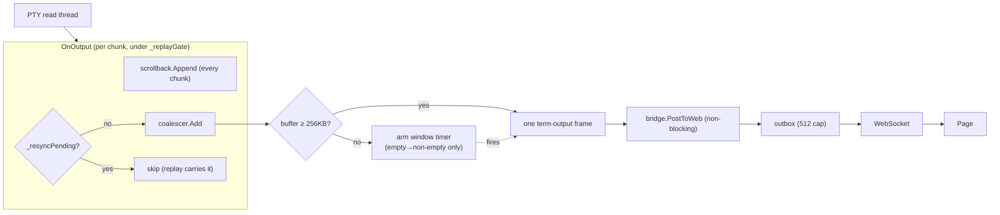

# Terminal output coalescing

## Problem

The headless bridge (`WebSocketHostBridge`) gives each connected page a bounded outbound queue of 512
**messages** and force-drops a connection whose queue overflows (`PostToWeb` → `Drop`, "outbound queue
full — page not keeping up"). `TerminalController.OnOutput` posts one `term-output` WebSocket frame per
PTY read chunk, so a burst of output (`seq 1 5000000` ≈ 38&#160;MB) becomes ~15000 frames and overruns
the 512-message queue almost instantly — the page is dropped and the UI freezes. Reconnect replays the
scrollback and re-floods, so a *continuous* producer (`yes`, `tail -f`, a chatty build) loops
indefinitely.

The queue is capped by message **count**, not bytes, so the fix is to send **fewer frames**, not less
data: coalesce PTY chunks into larger frames. This is producer-side batching — it must never block the
UI/hook thread (why the bridge drops rather than awaits), so it introduces no backpressure toward the
PTY.

## Design

`TerminalOutputCoalescer` (`Weavie.Core.Terminal`) sits between `OnOutput` and the bridge. Live chunks
accumulate and are emitted as one `term-output` frame when they reach a **256&#160;KB byte threshold**
or a **time window** elapses (`terminal.outputCoalesceMs`, default 16&#160;ms; `0` posts inline). A
38&#160;MB burst drops from ~15000 frames to ~150 — comfortably under the 512-message cap — while the
threshold, not the timer, bounds peak queue depth during a flood (256&#160;KB accrues in well under
16&#160;ms). Only the live post is deferred; `ScrollbackLog.Append` still sees every chunk immediately.

### Threading & ordering

Posts run **under the coalescer's lock**, so output order is preserved across the PTY, timer, and
boundary-flush threads (the same "post under a lock" shape `OnOutput` already used with `_replayGate`).
The coalescer never takes `_replayGate`; the lock order is always `_replayGate → coalescer`, so there
is no cycle. `PostToWeb` is non-blocking, so holding the lock across it is safe.

The buffer is drained or dropped at each boundary so a chunk reaches the page exactly once:

| Boundary | Action | Why |
|---|---|---|
| `OnReady`, scrollback pane | `Discard` | The bytes are in the log the replay rebuilds — posting them too would double-paint. |
| `OnReady`, no-scrollback pane | `Flush` | No replay for this pane; flush buffered output ahead of the mode-restore preamble. |
| `ResyncPane` | `Discard` | Buffered bytes are in the log; the coming replay carries them. |
| `PostExit` | `Flush` | The child's final output must precede the exit marker. |
| `PostNotice` | `Flush` | A notice (e.g. "restarting…") follows prior output and is not in scrollback. |
| `Dispose` | `Dispose` | Drop the buffer, disarm and release the timer. |

The timer is created disarmed and armed only on the empty→non-empty transition (fixed max latency, not
a per-chunk debounce that could hold a steady sub-threshold trickle forever). A `_disposed` flag under
the lock makes a timer callback in flight during teardown a no-op.

## Setting

`terminal.outputCoalesceMs` (Int, default 16, `0` = off) mirrors `terminal.persistScrollbackKb`: a real
terminal tunable, read once per session via `RequireInt`, and the deterministic seam the controller test
harnesses use (`0` = today's inline behavior). Preferred over constructor injection because the
controller already reads a sibling setting the same way — no construction-site ripple (there is no test
factory).

## Testing

- `TerminalOutputCoalescerTests` (Core) — buffer-until-flush, threshold inline-flush, discard, zero-window
  inline, dispose-silences-later-calls; all synchronous (a long window keeps the timer from firing).
- `TerminalControllerCoalesceTests` (Hosting) — batching holds output until a reattach flushes it before
  the mode preamble, and a resync discards it so the replay delivers it once (no double-paint).
- The four existing `TerminalController*Tests` run in inline mode (window `0`) — their subject is
  resync/reattach/replay mechanics, not batching.
- End-to-end: the headless flood (`seq 1 5000000`) no longer drops the page (the timer-flush path, only
  meaningfully exercised against the real bridge under overflow).
