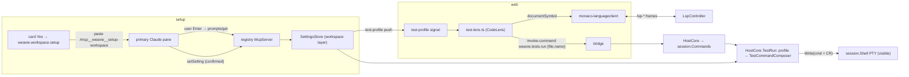

# Test running & workspace setup

Run buttons at each test block and a "run tests in file" command, with **zero per-language or
per-framework detection code in Weavie**. Test positions come from LSP `documentSymbol`; which symbols
are tests and what command runs them is **workspace-settings data**, authored once per workspace by
Claude through a generalized **workspace setup** flow that replaces the single-purpose
`worktree.setupCommand` nudge. Running a test writes the composed command into the session's shell
terminal — visible to the user and to Claude, never a hidden runner.

## Why

Test-runner integrations are the canonical N×M permutation trap: languages × frameworks, each an
adapter to write and maintain (VS Code solves it with an extension ecosystem; Weavie deliberately has
none). The escape is the mechanism/knowledge split: Weavie ships generic *mechanisms* (a code-lens
surface, a settings schema, a terminal-run command) and the resident model supplies the *knowledge*
(this repo's test patterns and run commands), inferred once and persisted as settings. No workspace
ever needs the matrix — it needs its own one or two cells.

LSP carries the discovery half. There is no standard LSP test capability (3.17/3.18), and test
code-lenses exist only in a few servers with bespoke payloads — but `textDocument/documentSymbol`
already yields test blocks as named, nested symbols. Verified empirically: tsserver's navigation tree
returns `describe('math') callback` containing `it('adds') callback`; Go and Python tests are plain
symbol conventions. The mapping from symbol to "this is a test named X" is a regex — data, not code.

## Goals / non-goals

- **Goal**: a run lens on each matched test symbol and a run-file command, from `documentSymbol` +
  workspace data only.
- **Goal**: runs happen in the session's shell pane — transparent, Claude-observable, no parallel
  execution path.
- **Goal**: one "Set up this workspace?" moment where Claude fills in *all* knowledge-shaped settings
  (worktree setup command, test profile) with explicit user confirmation per value.
- **Goal**: everything is commands — lens clicks, keybindings, palette, and Claude-over-MCP all
  compose the same `weavie.tests.*` ids.
- **Non-goal**: debugging, coverage, or parsed pass/fail state. The terminal output is the result UI.
- **Non-goal**: guessing. No profile → no lenses and a failed command with a pointer to setup; never
  a default command silently run (no-fallbacks rule).
- **Non-goal**: VS Code extension hosting. Test extensions require a Node extension host and the
  workbench UI stack; Weavie runs `monaco-vscode-api` in minimal services mode by design.

## Test profile (settings)

One `Workspace`-scoped key, `test.profile` (String kind holding a JSON array, `Validate` =
`TestProfile.TryParse`). This feature lands the **workspace settings layer** the settings spec
reserves: `<workspaceRoot>/.weavie/settings.toml`, resolution env > workspace > user > default.
`SettingDefinition` gains `SettingScope Scope` (default `User`); `setSetting` routes writes by scope
with an unchanged tool signature. `worktree.setupCommand` migrates to `Workspace` scope (reads still
fall through to the user file).

Each rule carries its own match *and* run knowledge, so multi-language repos are just multiple rules
— the executor uses the first rule whose glob matches the file:

```json
[
  {
    "glob": "**/*.test.ts?(x)",
    "symbol": "^(?:describe|it|test)\\((?:'|\")(.+?)(?:'|\")",
    "runOne": "pnpm vitest run ${file} -t ${name}",
    "runFile": "pnpm vitest run ${file}",
    "nameSeparator": " > "
  },
  {
    "glob": "**/*_test.go",
    "symbol": "^(Test\\w+)",
    "runOne": "go test ${fileDir} -run '^${name}$'",
    "runFile": "go test ${fileDir}"
  }
]
```

Rule fields: `glob` + `symbol` (regex over the symbol name; first capture = test name, no capture →
whole name) select tests; `runOne`/`runFile` are the command templates; optional `nameSeparator`
(default `" "`) joins captures along the ancestor symbol chain (nested `describe`s); optional
`header` is a regex matched against the source slice between a symbol's `range.start` and
`selectionRange.start` — the region that holds attributes/annotations/decorators (`[Fact]`, `@Test`)
— so attribute-based frameworks stay pure data (verified against csharp-ls, see below).

Placeholders `${file}` and `${fileDir}` (**absolute paths** — immune to wherever the user last
`cd`'d in the shell pane) and `${name}` — each substituted shell-quoted, never raw. `test.profile`
**unset** means unconfigured (setup card shows, no lenses); explicit `[]`
means "this repo has no tests" (card satisfied, no lenses). That unset/empty distinction is what
keeps "no buttons without a profile" a refusal rather than a silent guess.

**No bundled framework presets.** A shipped table of known framework rules would recreate the
language×framework matrix as maintained data. The setup prompt teaches only the *schema* and
placeholders; Claude derives each rule's globs and commands from the repo itself (package scripts,
`go.mod`, project files). Nothing in Weavie's code or data is framework-aware.

## Discovery & lenses (web)

The matcher runs in the web: the symbols already live there (`monaco-languageclient` per language),
the lens renders there, and Monaco owns the refresh lifecycle. New `src/web/src/tests/` folder:

- `test-profile.ts` — profile signal from `__WEAVIE_TEST_PROFILE__` pre-nav injection + `test-profile`
  bridge push (re-sent on `SettingChanged` for `test.profile`).
- `glob.ts` — small glob→RegExp (`**`, `*`, `?`, `{a,b}`), vitest-covered.
- `test-symbols.ts` — queries the document-symbol provider via
  `StandaloneServices.get(ILanguageFeaturesService)` (same deep-import style as
  `DocumentSemanticTokensFeature`), walks the tree against the file's matched rule (`symbol`, and
  `header` when present), composes ancestor-chain names with the rule's `nameSeparator`.
- `test-lens.ts` — `monaco.languages.registerCodeLensProvider({ scheme: "file" }, …)`: one lens per
  matched symbol + a run-file lens; `onDidChange` on profile push and language-client start. Lens
  titles advertise the resolved keybinding from the command catalog (`formatKey`), e.g.
  `▷ Run (⌘⌥R)` — CodeLens has no tooltip, so the title is where the shortcut lives.

## Commands

Declared in `CoreCommands`; `SuggestSetupCommand` is deleted.

| id | RunsIn | args | default key |
|---|---|---|---|
| `weavie.tests.run` | Core | `{ file, name? }` | — |
| `weavie.tests.runFile` | Core | `{ file? }` (defaults to active editor file) | `$mod+alt+t` |
| `weavie.tests.runAtCursor` | Web | none (innermost matched symbol at cursor → dispatches `weavie.tests.run`) | `$mod+alt+r`, `When = "editorFocused"` |
| `weavie.workspace.setup` | Core | none | — (palette-visible) |

`weavie.tests.run` is the one executor and is MCP-reachable, so Claude runs tests through the same
path the lens does. Its handler resolves the rule for `file` by glob, so multi-language repos route
each file to its own framework's commands.

## Terminal-run seam (Hosting)

`HostCore.TestRun.cs`, handlers registered per session in `WireSession` — an MCP invocation from a
worktree session's Claude runs in *that* session's shell with `${file}` relative to its worktree.

- No profile → `CommandResult.Failure("No test profile is configured — run 'Set Up This Workspace'
  first.")`, surfaced to the invoking surface (lens/palette via tokened `invoke-command`; verbatim to
  Claude via `runCommand`).
- Shell busy (`HasForegroundJob`) → failure + error toast. Never queued, never a second pane, never
  silently dropped.
- Compose via `TestCommandComposer` against the file's matched rule: POSIX single-quote escaping,
  or double-quote escaping when `terminal.shell` resolves to PowerShell; cmd.exe gets the same
  double-quote treatment — no cmd-specific escaping, exotic names fail visibly in the terminal.
  Then `session.Shell.Write(utf8(command + "\r"))` — plain write, not bracketed paste (paste
  markers to a shell that never enabled the mode print escape garbage).
- On success, post `focus-pane` for the shell so the user watches the run.

## Workspace setup flow

The `worktree.setupCommand` card generalizes to one **"Set up this workspace?"** suggestion
(`IsRelevant = ctx.HasBuildManifest && (setupCommand unset || test.profile unset)`; a persisted
`worktree.setupCommand` dismissal counts as dismissing the new id). "Yes" runs
`weavie.workspace.setup`, which pre-fills — never sends — the setup entry point into the primary
session's Claude, preserving the seeding-safety stance.

The setup brain ships as an **MCP prompt on the registry server**: `prompts/list`/`prompts/get` in a
new `McpServer.Prompts.cs` partial (registry mode only), with the text a maintained Core artifact
(`WorkspaceSetupPrompt.cs`). Claude Code surfaces server prompts as slash commands, so setup is
`/mcp__weavie__setup-workspace` — discoverable, re-runnable, zero tokens until invoked. Rejected
alternatives: skill/plugin injection (model-invoked discovery, needs plugin machinery beyond the
`--settings` file, no explicit user trigger) and keeping a seeded prompt string (not re-runnable or
discoverable; remains the fallback if the pasted slash command doesn't execute — see open questions).

**No server-initiated model call is involved.** An MCP prompt is fetch-and-inject: when the slash
command is invoked in the embedded interactive session (subscription-billed), Claude Code calls
`prompts/get` on the in-process registry server and injects the returned text into that session's
conversation. Weavie never runs `claude -p` or touches the API — same economics as the seeded
prompt, plus discoverability.

The prompt instructs Claude to: inspect the repo; propose `worktree.setupCommand` and the test
profile (teaching only the rule schema and placeholders — Claude derives globs and commands from the
repo); ask for confirmation; persist each confirmed value via `setSetting`; set `test.profile` to
`[]` explicitly when the repo has no tests; write only registered settings; run nothing else; and
**close by reporting what was decided** — each setting written, that they live in
`<root>/.weavie/settings.toml`, and that setup can be re-run anytime via
`/mcp__weavie__setup-workspace` or by editing that file.



## Build order

1. **Workspace settings layer** — `SettingScope`, workspace file load/watch/write routing; unit tests
   mirror `SettingsStoreTests` (precedence, scoped writes, malformed file → last-good).
2. **Test profile in Core** — `TestSettings`, `TestProfile.TryParse`, `TestCommandComposer` (+ quoting
   incl. injection attempts in `${name}`). Pure unit-tested.
3. **Run commands** — declarations + `HostCore.TestRun.cs` + `WireSession`. Headless journey with
   `echo RUN ${file}` templates: palette-invoke `runFile` → assert the shell xterm renders the line;
   busy-shell → error toast, nothing written. Collision-check the default keybindings here.
4. **Web lenses** — `tests/` folder, profile push/injection, lens provider, `runAtCursor`. Vitest for
   glob/matcher/name composition against captured tsserver/gopls symbol fixtures; one headless lens
   smoke gated on a real `typescript-language-server`.
5. **MCP prompts** — `McpServer.Prompts.cs` + `WorkspaceSetupPrompt`; xUnit list/get round-trip;
   fake-claude script fetches the prompt, calls `setSetting` → assert `.weavie/settings.toml` written
   and the card disappears.
6. **Setup flow swap** — new suggestion + `weavie.workspace.setup` + seeding; delete
   `SuggestSetupCommand`/`SetupCommandPrompt`; dismissal-id mapping. Gate: verify the pasted slash
   command executes in real Claude Code first (6a); otherwise seed the prompt's full text.
7. **Docs** — update `docs/specs/suggestions.md` and `docs/specs/settings.md` (workspace layer now
   real), CLAUDE.md concepts line if needed.

## Verified by experiment

Probed live servers (LSP stdio, `initialize` → `didOpen` → `documentSymbol`) rather than trusting
documentation:

- **tsserver**: the navigation tree includes test call expressions as named nested symbols —
  `describe('math') callback` containing `it('adds') callback` — so Jest/Vitest/Mocha blocks are
  discoverable with names and nesting.
- **csharp-ls 0.25**: a method symbol's `range` starts at its attribute lines while
  `selectionRange` is the bare identifier, so the `header` slice contains `[Fact]` /
  `[Theory] [InlineData(1)]` and a plain method's slice contains no attribute — `header:
  "\\[(Fact|Theory)\\b"` cleanly selects xUnit tests.
- **gopls**: `TestXxx` functions are flat symbols named `TestAdds` etc. (`symbol: "^(Test\\w+)"`).
  Known limitation: `t.Run("subtest", …)` subtests do **not** appear as symbols, so subtests get no
  individual lens — the enclosing `TestXxx` lens and `runFile` cover them.

## Resolved / open questions

1. **Pasted slash command (resolved)** — rather than depend on whether a bracketed-pasted
   `/mcp__weavie__setup-workspace` executes as a slash command in the TUI (unverifiable from the tree),
   the card seeds the prompt's **full text** via bracketed paste. This works regardless, single-sources
   the text from `WorkspaceSetupPrompt`, and handles the multi-line prompt as one paste. The slash
   command still exists (the MCP prompt) for re-running setup.
2. **Symbol-name drift** — the shapes above are empirical, not contractual. Mitigated by the
   regexes being workspace data (re-run setup to fix) plus captured-fixture tests for the common
   symbol shapes (tsserver, gopls, csharp-ls).
