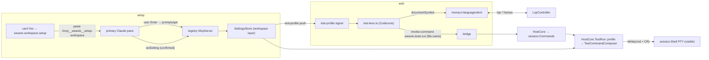

# Test running & workspace setup

Run buttons at each test block and a "run tests in file" command, with **zero per-language or
per-framework detection code in Weavie**. Test positions come from LSP `documentSymbol`; which symbols
are tests and what command runs them is **workspace-settings data**, authored once per workspace by
Claude through a generalized **workspace setup** flow that replaces the single-purpose
`worktree.setupCommand` nudge. Running a test writes the composed command into the session's shell
terminal — visible to the user and to Claude, never a hidden runner.

## Why

Test-runner integrations are the canonical N×M permutation trap: languages × frameworks, each an
adapter to write and maintain (VS Code solves it with an extension ecosystem; Weavie deliberately has
none). The escape is the mechanism/knowledge split: Weavie ships generic *mechanisms* (a code-lens
surface, a settings schema, a terminal-run command) and the resident model supplies the *knowledge*
(this repo's test patterns and run commands), inferred once and persisted as settings. No workspace
ever needs the matrix — it needs its own one or two cells.

LSP carries the discovery half. There is no standard LSP test capability (3.17/3.18), and test
code-lenses exist only in a few servers with bespoke payloads — but `textDocument/documentSymbol`
already yields test blocks as named, nested symbols. Verified empirically: tsserver's navigation tree
returns `describe('math') callback` containing `it('adds') callback`; Go and Python tests are plain
symbol conventions. The mapping from symbol to "this is a test named X" is a regex — data, not code.

## Goals / non-goals

- **Goal**: a run lens on each matched test symbol and a run-file command, from `documentSymbol` +
  workspace data only.
- **Goal**: runs happen in the session's shell pane — transparent, Claude-observable, no parallel
  execution path.
- **Goal**: one "Set up this workspace?" moment where Claude fills in *all* knowledge-shaped settings
  (worktree setup command, test profile) with explicit user confirmation per value.
- **Goal**: everything is commands — lens clicks, keybindings, palette, and Claude-over-MCP all
  compose the same `weavie.tests.*` ids.
- **Non-goal**: debugging, coverage, or parsed pass/fail state. The terminal output is the result UI.
- **Non-goal**: guessing. No profile → no lenses and a failed command with a pointer to setup; never
  a default command silently run (no-fallbacks rule).
- **Non-goal**: VS Code extension hosting. Test extensions require a Node extension host and the
  workbench UI stack; Weavie runs `monaco-vscode-api` in minimal services mode by design.

## Test profile (settings)

Four `Workspace`-scoped keys in the settings registry. This feature lands the **workspace settings
layer** the settings spec reserves: `<workspaceRoot>/.weavie/settings.toml`, resolution
env > workspace > user > default. `SettingDefinition` gains `SettingScope Scope` (default `User`);
`setSetting` routes writes by scope with an unchanged tool signature. `worktree.setupCommand`
migrates to `Workspace` scope (reads still fall through to the user file).

| key | kind | meaning |
|---|---|---|
| `test.match` | String (JSON array, `Validate` = `TestProfile.TryParse`) | rules like `{ "glob": "**/*.test.ts", "symbol": "^(?:describe\|it\|test)\\((?:'\|\")(.+?)(?:'\|\")" }`; first capture = test name (no capture → whole symbol name) |
| `test.runOne` | String | template, e.g. `pnpm vitest run ${file} -t ${name}` |
| `test.runFile` | String | template, e.g. `pnpm vitest run ${file}` |
| `test.nameSeparator` | String, default `" "` | joins name captures along the ancestor symbol chain (nested `describe`s): jest `" "`, vitest `" > "` |

Placeholders `${file}` (worktree-relative), `${fileDir}`, `${name}` — each substituted shell-quoted,
never raw. `test.match` **unset** means unconfigured (setup card shows, no lenses); explicit `[]`
means "this repo has no tests" (card satisfied, no lenses). That unset/empty distinction is what
keeps "no buttons without a profile" a refusal rather than a silent guess.

**Bundled defaults are prompt data, not runtime fallbacks.** `TestProfilePresets` (Core, const table:
vitest, jest, pytest, `go test`, `dotnet test --filter`) is never consulted when running; it is
embedded in the setup prompt so Claude proposes from it and the user confirms. C# is the weak case —
attributes don't appear in symbol names — so its preset matches by class/file convention, and a repo
where that fails gets file-level running only. Nothing in Weavie's code is C#-aware.

## Discovery & lenses (web)

The matcher runs in the web: the symbols already live there (`monaco-languageclient` per language),
the lens renders there, and Monaco owns the refresh lifecycle. New `src/web/src/tests/` folder:

- `test-profile.ts` — profile signal from `__WEAVIE_TEST_PROFILE__` pre-nav injection + `test-profile`
  bridge push (re-sent on `SettingChanged` for `test.*`).
- `glob.ts` — small glob→RegExp (`**`, `*`, `?`, `{a,b}`), vitest-covered.
- `test-symbols.ts` — queries the document-symbol provider via
  `StandaloneServices.get(ILanguageFeaturesService)` (same deep-import style as
  `DocumentSemanticTokensFeature`), walks the tree against the file's rule, composes ancestor-chain
  names with `test.nameSeparator`.
- `test-lens.ts` — `monaco.languages.registerCodeLensProvider({ scheme: "file" }, …)`: one lens per
  matched symbol + a run-file lens; `onDidChange` on profile push and language-client start. Lens
  titles advertise the resolved keybinding from the command catalog (`formatKey`), e.g.
  `▷ Run (⌘⌥R)` — CodeLens has no tooltip, so the title is where the shortcut lives.

## Commands

Declared in `CoreCommands`; `SuggestSetupCommand` is deleted.

| id | RunsIn | args | default key |
|---|---|---|---|
| `weavie.tests.run` | Core | `{ file, name? }` | — |
| `weavie.tests.runFile` | Core | `{ file? }` (defaults to active editor file) | `$mod+alt+t` |
| `weavie.tests.runAtCursor` | Web | none (innermost matched symbol at cursor → dispatches `weavie.tests.run`) | `$mod+alt+r`, `When = "editorFocused"` |
| `weavie.workspace.setup` | Core | none | — (palette-visible) |

`weavie.tests.run` is the one executor and is MCP-reachable, so Claude runs tests through the same
path the lens does.

## Terminal-run seam (Hosting)

`HostCore.TestRun.cs`, handlers registered per session in `WireSession` — an MCP invocation from a
worktree session's Claude runs in *that* session's shell with `${file}` relative to its worktree.

- No profile → `CommandResult.Failure("No test profile is configured — run 'Set Up This Workspace'
  first.")`, surfaced to the invoking surface (lens/palette via tokened `invoke-command`; verbatim to
  Claude via `runCommand`).
- Shell busy (`HasForegroundJob`) → failure + error toast. Never queued, never a second pane, never
  silently dropped.
- Compose via `TestCommandComposer` (POSIX single-quote escaping; PowerShell quoting off
  `terminal.shell`), then `session.Shell.Write(utf8(command + "\r"))` — plain write, not bracketed
  paste (paste markers to a shell that never enabled the mode print escape garbage).
- On success, post `focus-pane` for the shell so the user watches the run.

## Workspace setup flow

The `worktree.setupCommand` card generalizes to one **"Set up this workspace?"** suggestion
(`IsRelevant = ctx.HasBuildManifest && (setupCommand unset || test.match unset)`; a persisted
`worktree.setupCommand` dismissal counts as dismissing the new id). "Yes" runs
`weavie.workspace.setup`, which pre-fills — never sends — the setup entry point into the primary
session's Claude, preserving the seeding-safety stance.

The setup brain ships as an **MCP prompt on the registry server**: `prompts/list`/`prompts/get` in a
new `McpServer.Prompts.cs` partial (registry mode only), with the text a maintained Core artifact
(`WorkspaceSetupPrompt.cs`) embedding the presets table. Claude Code surfaces server prompts as slash
commands, so setup is `/mcp__weavie__setup-workspace` — discoverable, re-runnable, zero tokens until
invoked. Rejected alternatives: skill/plugin injection (model-invoked discovery, needs plugin
machinery beyond the `--settings` file, no explicit user trigger) and keeping a seeded prompt string
(not re-runnable or discoverable; remains the fallback if the pasted slash command doesn't execute —
see open questions).

The prompt instructs Claude to: inspect the repo; propose `worktree.setupCommand` and the test
profile (consulting the presets); ask for confirmation; persist each confirmed value via
`setSetting`; set `test.match` to `[]` explicitly when the repo has no tests; write only registered
settings; run nothing else.

## Build order

1. **Workspace settings layer** — `SettingScope`, workspace file load/watch/write routing; unit tests
   mirror `SettingsStoreTests` (precedence, scoped writes, malformed file → last-good).
2. **Test profile in Core** — `TestSettings`, `TestProfile.TryParse`, `TestCommandComposer` (+ quoting
   incl. injection attempts in `${name}`), `TestProfilePresets`. Pure unit-tested.
3. **Run commands** — declarations + `HostCore.TestRun.cs` + `WireSession`. Headless journey with
   `echo RUN ${file}` templates: palette-invoke `runFile` → assert the shell xterm renders the line;
   busy-shell → error toast, nothing written. Collision-check the default keybindings here.
4. **Web lenses** — `tests/` folder, profile push/injection, lens provider, `runAtCursor`. Vitest for
   glob/matcher/name composition against captured tsserver/gopls symbol fixtures; one headless lens
   smoke gated on a real `typescript-language-server`.
5. **MCP prompts** — `McpServer.Prompts.cs` + `WorkspaceSetupPrompt`; xUnit list/get round-trip;
   fake-claude script fetches the prompt, calls `setSetting` → assert `.weavie/settings.toml` written
   and the card disappears.
6. **Setup flow swap** — new suggestion + `weavie.workspace.setup` + seeding; delete
   `SuggestSetupCommand`/`SetupCommandPrompt`; dismissal-id mapping. Gate: verify the pasted slash
   command executes in real Claude Code first (6a); otherwise seed the prompt's full text.
7. **Docs** — update `docs/specs/suggestions.md` and `docs/specs/settings.md` (workspace layer now
   real), CLAUDE.md concepts line if needed.

## Open questions

1. **Pasted slash command** — does a bracketed-pasted `/mcp__weavie__setup-workspace` + user Enter
   execute as a slash command in the Claude Code TUI? The one mechanic not verifiable from the tree;
   resolve in step 6a. Fallback (seed the prompt's full text) keeps the artifact single-sourced.
2. **cmd.exe quoting** — POSIX and PowerShell are handled; cmd.exe quoting is a swamp. Proposal:
   `weavie.tests.run` fails loudly under cmd ("configure a POSIX shell or PowerShell for test
   running") rather than emit a maybe-mangled command. Needs a philosophy sign-off — it's a refusal,
   not a fallback.
3. **Shell cwd drift** — the user may have `cd`'d away; `${file}` is worktree-relative, so the run
   fails *visibly in the terminal*. Alternatives (absolute paths, `cd &&` prefix) mutate templates or
   shell state; recommendation is to accept the visible failure.
4. **Symbol-name drift** — tsserver's `describe('math') callback` shape is empirical, not
   contractual. Mitigated by the regexes being workspace data (re-run setup to fix) plus
   captured-fixture tests per bundled preset.
