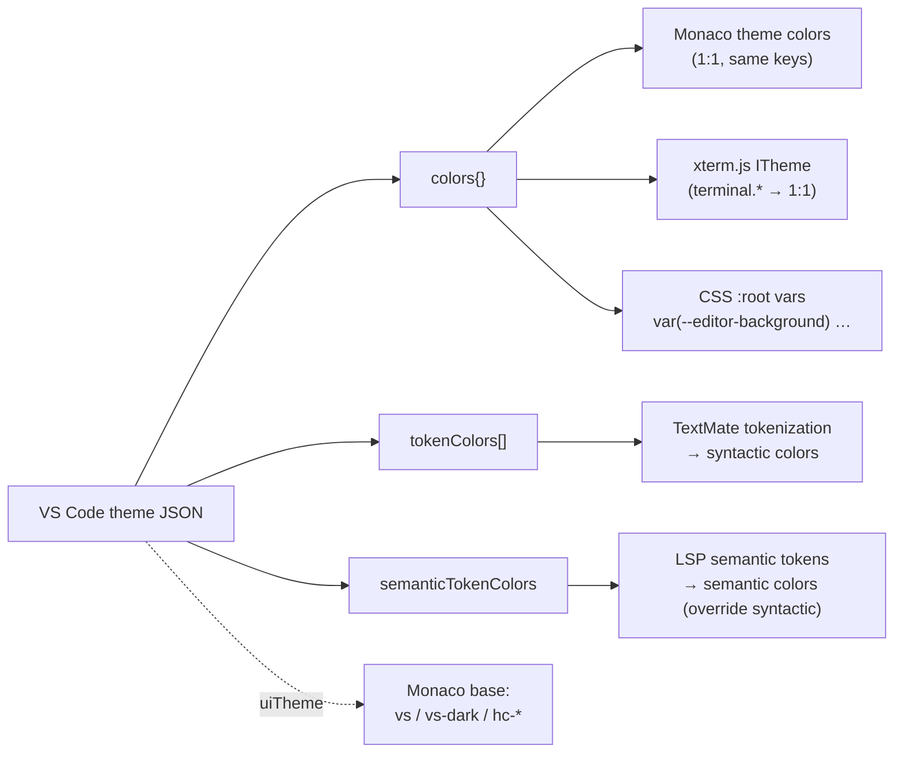
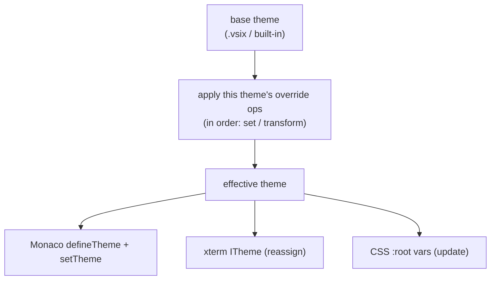
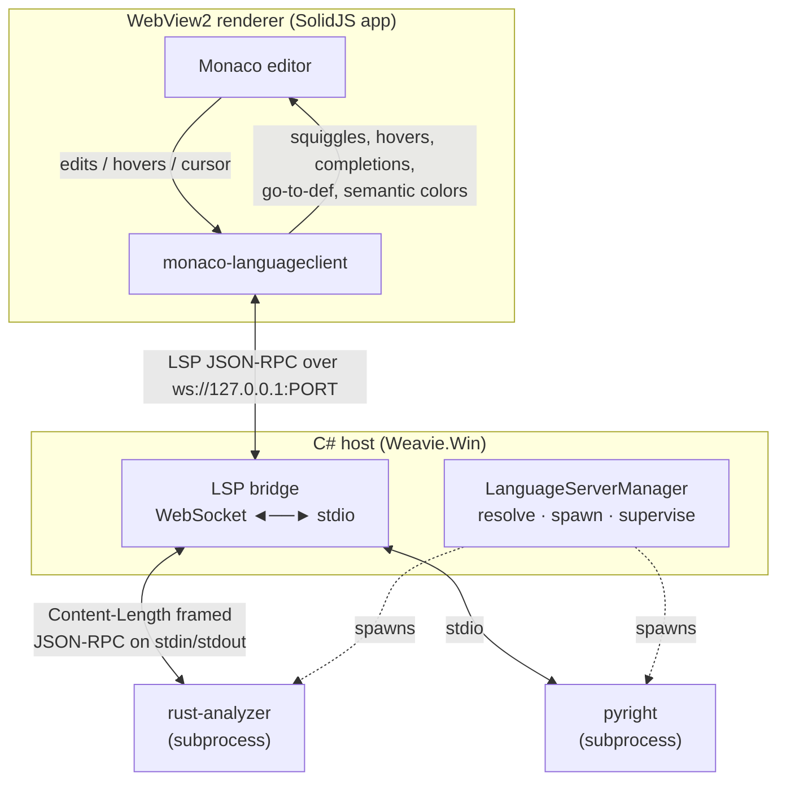
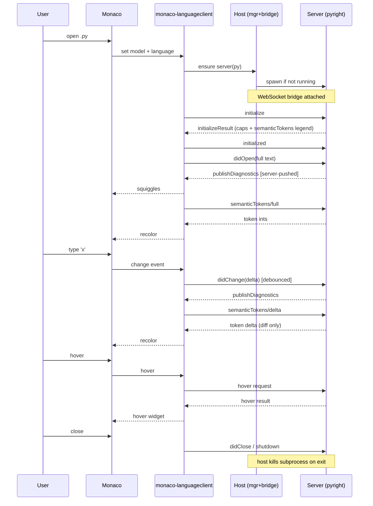

# Theming & Language Intelligence (LSP) — Design Spec

**Status:** Draft / design — ready to implement (bring-up plan in §16).
**Date:** 2026-06-16
**Scope:** How Weavie does (a) editor color themes reusing the VS Code theme ecosystem, with
user-tweakable **overrides** driven via Claude/MCP, and (b) language intelligence (LSP) including
semantic highlighting — without adopting VS Code's workbench, configuration, keybindings, commands,
or extension host.

---

## 1. Goals

- **Reuse VS Code color themes**, installable from the **Open VSX** registry (`.vsix`), and have
  them render *faithfully* — including **semantic highlighting** (class vs variable vs parameter,
  the "Visual Studio" classifier experience), not just regex-based syntax coloring.
- **User-tweakable theme overrides via Claude/MCP** — "make the background pure black", "make
  everything 20% darker", "brighten the comments" — layered on top of the active theme (§6).
- **Real multi-language LSP** (diagnostics, hover, go-to-def, completion, rename, semantic tokens)
  across the languages we choose to support.
- Keep Weavie's own UI: its SolidJS two-pane chrome, its xterm terminals, its bridge, its
  (separately-built) settings + MCP capability registry.
- **Fonts are plain settings**, decoupled from color themes (see §4).

## 2. Non-goals & hard constraints (the guardrails)

These are firm. They shape every decision below.

- **No VS Code workbench / no layout control.** Weavie owns its layout and windows. Nothing in the
  theming/LSP stack may render an activity bar, sidebar, panels, editor groups, or otherwise manage
  layout. *(This is the hard no.)*
- **No configuration service override** — no `settings.json`, no settings UI from the stack. A
  separate agent is building Weavie's own settings; the stack must not compete with it.
- **No keybindings / commands / quick-pick** from the stack.
- **No extension host.** We do **not** run arbitrary VS Code extension activation JavaScript.
- Settings *storage for the selected values* (active theme, override values, font family/size/weight,
  etc.) is **out of scope** here — owned by the settings agent. This spec **does** define how *themes
  themselves* are stored (§13) and how overrides compose & apply (§6).

## 3. Two color tables — the key mental model

A VS Code theme carries **two** independent coloring tables. Faithful rendering (and the semantic
highlighting we want) needs **both**:

| Table | Driven by | Nature | Example selector → color |
| --- | --- | --- | --- |
| `tokenColors` | TextMate **grammar** (regex) | **Syntactic** — fast, no server, often coarse/guessed | `entity.name.function` → `#DCDCAA` |
| `semanticTokenColors` | **LSP server** semantic tokens | **Semantic** — the compiler's truth | `class` → `#4EC9B0`, `parameter` → `#9CDCFE` |

They **layer**: TextMate paints instantly as you type; semantic tokens arrive async from the server
and **refine/override** on top, snapping identifiers to their true type/modifier.

> **Consequence:** semantic highlighting is an **LSP feature**, not a theme/grammar feature. The
> theme only supplies the *colors*; the *classification* comes from the language server. This is why
> theming and LSP are one project, not two.

## 4. Two layers: color theme vs typography (fonts)

By strong convention (VS Code, Sublime, Vim, terminals), **fonts are not part of a color theme.**
Weavie follows this:

- **Color theme** = colors only (both tables above), spanning all surfaces (editor, terminal, chrome).
- **Typography** = independent settings: editor font family/size/weight/lineHeight/ligatures, and a
  (possibly distinct) terminal font. Per-OS defaults like VS Code.
- Optionally, a later **"appearance preset"** may *reference* one color theme + one typography set
  for one-click looks — but as a convenience bundle, never the source of truth.

**Known bug to fix when this lands:** `editor/monaco-setup.ts` currently hardcodes a macOS-only stack
(`ui-monospace, "SF Mono", Menlo, monospace`) which silently falls back to generic `monospace`
(Consolas) on Windows. Either drop the override (let Monaco pick per-OS defaults, like VS Code) or set
an intentional cross-platform stack.

## 5. The color vocabulary — adopt VS Code's keys as our own

Do **not** invent a parallel naming scheme. Use VS Code's workbench color keys
(`editor.background`, `terminal.ansiRed`, `editorGroupHeader.tabsBackground`, …) as Weavie's own
semantic token names. Then "reuse a VS Code theme" — and "override a color" — is nearly free across
all three rendering systems:



Chrome CSS consumes `var(...)` named after VS Code keys, with fallbacks for keys a theme omits (many
themes skip `terminal.*` — derive from `editor.*` or a default ANSI palette).

## 6. Theme overrides (user tweaks, Claude-driven)

**Goal:** the user can tweak the active theme conversationally through Claude inside the editor —
"make the background pure black", "make everything 20% darker", "brighten the comments" — exposed via
MCP like the settings capability.

**Cheap by construction.** We already (a) use one color vocabulary (§5), (b) resolve→compile→apply
themes as a pure function with live re-application, and (c) have the MCP capability pattern from
settings. Overrides are just an extra input layer. Direct precedent: this *is* VS Code's
`workbench.colorCustomizations`, `editor.tokenColorCustomizations`, and
`editor.semanticTokenColorCustomizations` — sparse user patches over the active theme, keyed by the
same selectors. We mirror that model (and may mirror its JSON shape).

### Two independent axes (don't conflate them)
- **Scope** — *which theme* an override belongs to. Weavie: **per-theme** (see below).
- **Op kind** — *how* an override expresses a change: a per-key `set` or a whole-palette `transform`.

These compose freely: "darken **Dracula** 20%" is a per-theme `transform`; "set **Dracula**'s bg to
pure black" is a per-theme `set`. Per-theme scoping and transforms are *not* alternatives.

### Op kinds — an ordered override stack
Overrides are a **sparse, ordered list** of declarative ops applied on top of the base theme at
resolve time:

- **set** — a direct key override:
  `{ kind: "set", table: "colors"|"tokenColors"|"semanticTokenColors", key, value }`
  e.g. `{ set, colors, "editor.background", "#000000" }` → "background pure black". (last-write-wins per key)
- **transform** — a parametric op over a group of keys (so you don't hand-edit hundreds of colors):
  `{ kind: "transform", op: "darken"|"lighten"|"saturate"|"desaturate"|"contrast", amount, target }`
  e.g. `{ transform, darken, 0.20, "all" }` → "everything 20% darker".

Applied **in order**, so "darken all, then set bg pure black" leaves bg pure black. Ordered +
declarative ⇒ trivial **undo** (pop the last op), **inspect** (list ops), and **survival across
base-theme switches** (transforms re-derive; sets re-apply by key).

### Per-theme
Overrides are **per-theme** — keyed by theme id, layered on top of *that* theme, and they do **not**
follow you when you switch themes ("I tweaked Dracula" stays with Dracula). This matches the natural
mental model and keeps the resolver simple. *(A global "apply to every theme" layer is deferred — add
it later only if a real need shows up.)*

Resolution: `base theme → this theme's override ops (in order) → compile → apply live`.

### Composition pipeline (extends §5)

All three re-apply **live** (no reload) on every override change — Monaco `setTheme`, xterm theme
reassign, and CSS var update are all cheap.

### Why a `transform` primitive matters (not just `set`)
For "make everything 20% darker", a direct-key-only model would force Claude to read ~hundreds of
colors and emit a giant darkened patch — token-heavy and error-prone. A `transform` op lets Claude
express the *intent* in one call; the resolver does the color math. So palette-wide asks →
`transform`; specific asks ("bg pure black", "comments = #888") → `set`. The two example asks map
exactly to the two op kinds.

**Color math:** transforms operate in **OKLCH** for perceptually-even results (HSL lightness scaling
is an acceptable v1). **Preserve alpha** — many VS Code colors are 8-digit hex (overlay alpha);
transform only the color component.

### MCP surface (mirrors the settings capability)
Registered in Core, surfaced as IDE-MCP tools (names illustrative); all act on the **active theme's**
overrides:
- `theme.describe` — return active base theme + current effective palette + the override stack, so
  Claude can *see what it's working with* before tweaking.
- `theme.setOverride` — add a `set` op (one or many keys) to the active theme's overrides.
- `theme.applyTransform` — add a `transform` op to the active theme's overrides.
- `theme.removeOverride` / `theme.undoLast` / `theme.reset` — remove one / pop last / clear this
  theme's overrides.
- (Theme selection — `theme.list` / `theme.select` — belongs to the broader theme capability.)

### Storage / ownership boundary
Override **values are user settings** — exactly how VS Code models `*Customizations`. So their
*persistence* belongs to the **settings system (separate agent)**, like the selected-theme setting.
The **theming subsystem owns**: the override schema, the resolver/composition, the color-math, the
live application, and the MCP tools. Clean split; no overlap with the settings agent's storage work.

## 7. Rendering stack decision

**Leading choice: `@codingame/monaco-vscode-api` in services/editor mode**, importing **only** the
`theme`, `textmate`, and `languages` service overrides.

Rationale:
- It implements the **full** VS Code coloring pipeline coherently: TextMate `tokenColors`, semantic
  `semanticTokenColors`, the semantic-tokens provider wiring, and the legend mapping. Since semantic
  highlighting is a hard requirement, this matters.
- The maintained `monaco-languageclient` (our LSP client) is **already built on** `monaco-vscode-api`
  — so we're in this ecosystem for LSP regardless. Reusing its theme/textmate overrides avoids
  running a *second* tokenizer.
- **Layout safety:** layout/window control lives only in the **workbench/views** service and the
  workbench init entry point. Using the services/editor init + `monaco.editor.create()` into our own
  DOM renders **zero** chrome. The hard-no is honored by *not importing* those packages.

Alternative considered — **Shiki (`@shikijs/monaco`)**: lighter, faithful TextMate themes, but
highlight-only. It does **not** give the semantic-token theming or the LSP substrate, and pairing it
with `monaco-languageclient` would mean two tokenization stacks. Rejected *given the semantic
highlighting requirement*; would be the pick if we only wanted colors.

**Open decision (see §17):** accept `monaco-vscode-api`'s bundle weight + build integration in
exchange for faithful semantic theming + LSP substrate. Leaning yes.

## 8. Themes & grammars — acquire from Open VSX `.vsix`

A VS Code theme is contributed by an **extension** (`.vsix` = a ZIP). Both themes and TextMate
grammars are **declarative data** — they register with **no extension host and no extension JS**.

**Acquisition (host-side):** Open VSX has a REST API:
- search: `GET https://open-vsx.org/api/-/search?query=…&category=Themes`
- metadata: `GET https://open-vsx.org/api/{namespace}/{name}` → versions + `files.download`
- download the `.vsix`, unzip, read `package.json` → `contributes.themes[]` (and
  `contributes.grammars[]` / `languages[]`), resolve each theme JSON (handle `include` chains).

Do fetch + unzip + storage in the **C# host** (it owns the Weavie root `~/.weavie/`,
`LocalFileSystem`, and network; the WebView shouldn't). This also aligns with the **Claude-facing
capability registry** — "install/list/select theme" can later be registered commands surfaced over
IDE-MCP.

> Grammars come from `.vsix` (TextMate). LSP **servers do not** (see §9). Don't conflate them:
> *grammar source ≠ server source*.

## 9. LSP — the Zed/Neovim model (servers from recipes, not extensions)

VS Code's "install a language extension" fuses two jobs behind one button — **acquire the server**
and **launch+connect it** — and does both via the **extension host** running activation JS. We
rejected that host. Zed and Neovim (and Helix) instead use a **native client + per-language recipe +
host-spawned subprocess over stdio**. We adopt that:

- **Client:** `monaco-languageclient` in the WebView (the web-side equivalent of `vim.lsp` / Zed's
  Rust client). Language-agnostic: once a server is launched and piped, it connects identically.
- **Per-language = a recipe, not code:** where to get the server, how to launch it (`cmd` + args),
  which file types trigger it, root markers. Crib recipe data from **`nvim-lspconfig`** (launch /
  filetypes / roots) and the **Mason registry** (download sources).
- **Server management (C# host):** a `LanguageServerAdapter` per supported language, shaped like
  Zed's `LspAdapter`:

  ```
  LanguageServerAdapter
    Detect()         → on PATH / known install dirs            (Neovim "bring-your-own")
    Fetch()/Update() → download from github-release/npm/…      (Zed-style, optional, toggle)
    LaunchCommand()  → cmd + args
    metadata         → file extensions, language ids, root markers, default settings/initOptions
  ```

  **Resolution order per language:** user-set path → on `PATH` → auto-download (if enabled) → skip.
  (= Zed auto-manage + Neovim bring-your-own, in one.)

- **TS/JS — replace Monaco's bundled worker with `ts-go` immediately.** Monaco's in-browser
  TypeScript worker (single-file, no real `tsconfig` / `node_modules` / project-wide resolution) is
  **not** sufficient for a real editor. So TS/JS is a **first-class LSP language from day one**,
  served by **ts-go** (`tsgo` — Microsoft's native Go port of TypeScript, the basis for TypeScript 7;
  ships a native LSP server) as a host-spawned subprocess over the same stdio→WebSocket bridge as
  every other server. TS thus goes through the uniform `monaco-languageclient` path — no special
  in-browser case: drop the `ts.worker` wiring and **disable Monaco's built-in TS/JS language
  features** so the editor doesn't double-provide diagnostics/completions against the LSP.
  Acquisition: the `tsgo` native binary (e.g. via the `@typescript/native-preview` npm package),
  resolved by the TS `LanguageServerAdapter` like any other server. *Caveat:* tsgo / TS 7 is still
  **preview** — verify its LSP covers our hard requirement (**semantic tokens**) and the features we
  need; keep tsserver-based `vtsls` / `typescript-language-server` as a **fallback adapter** if gaps
  bite.

### Files change underneath the server (Weavie-specific)
Unlike a normal editor, **Claude edits files on disk** — directly, and via the IDE-MCP `openDiff`
apply flow. Language servers must hear about every such change or their diagnostics/types go stale:

- File **open in Monaco** → reconcile the on-disk change into the model; the normal `didChange` then
  notifies the server.
- File **not open** → the **host watches the workspace** (`FileSystemWatcher`) and forwards
  `workspace/didChangeWatchedFiles` to each affected server. Servers also *register* watch globs via
  `client/registerCapability` (`workspace/didChangeWatchedFiles`) — honor those.

This makes a host-side **file-watch → server** path **mandatory**, and couples the diff-apply flow to
LSP. It is the main correctness hazard unique to an agentic editor — design it in from the start,
don't bolt it on.

## 10. Process topology



Three transport hops, all LSP JSON-RPC, framed differently:
- **Monaco ↔ client:** in-process JS.
- **client ↔ host:** loopback **WebSocket** (same 127.0.0.1 pattern as the IDE-MCP server).
- **host ↔ server:** host is a dumb proxy — WS frame ↔ one `Content-Length`-framed message on the
  server's stdio. (= the `vscode-ws-jsonrpc` proxy from monaco-languageclient examples.) Spawning +
  piping reuses the host's existing ConPTY muscle.

## 11. Sequence flow



Triggering rules:
- **Connection** is triggered by opening a file whose language has an adapter — lazy, per workspace
  root (host already resolves the workspace).
- **Diagnostics** are **server-pushed** (`publishDiagnostics`) after open/change — never requested.
- **Hover / completion / definition / rename** are **pull / on-demand**, triggered by cursor/keys.
- **Semantic tokens** are pull + refresh: requested for the doc, `/delta` on change, and the server
  can fire `workspace/semanticTokens/refresh` to ask the client to re-pull.

## 12. Scoped vs semantic colors (explainer)

**Scoped (TextMate) colors** — the syntactic layer:
```
// comment   → comment.line.double-slash.ts
const        → storage.type / keyword
greet        → entity.name.function.ts      (it sits before "(")
name         → variable.parameter / variable.other.readwrite.ts
"hi"         → string.quoted.double.ts
```
A theme's `tokenColors` maps **dotted scope selectors** → colors with CSS-like specificity (more dots
= more specific). The grammar doesn't understand the code — it pattern-matches punctuation — so class
vs namespace vs local all look like bare identifiers. That's the ceiling of scope coloring.

**Semantic colors** — `textDocument/semanticTokens`, from the server that ran the compiler front-end:
- **token types:** `namespace, class, enum, interface, struct, typeParameter, type, parameter,
  variable, property, enumMember, function, method, macro, keyword, …`
- **token modifiers:** `declaration, readonly, static, abstract, async, deprecated, defaultLibrary, …`
- on the wire: a compact int array, **5 ints/token** `[ΔLine, ΔStartChar, length, typeIndex,
  modifierBitset]`, decoded against the **legend** the server announced at `initialize`.

This is exactly Visual Studio's classifier: color by what the compiler *knows it is*. It **overrides**
the TextMate baseline once it arrives.

## 13. Theme storage layout

Store the **raw VS Code theme JSON + a small manifest; convert at load.** The VS Code format is the
portable, lossless source of truth; the converter (scopes→Monaco via the textmate service,
colors→xterm/CSS) is a pure function applied at load. If we later improve the converter, every stored
theme improves with no re-install. (User **overrides** are *not* stored here — see §6: they're user
settings, owned by the settings agent.)

Themes live under the **Weavie root** `~/.weavie/` — the same cross-platform root that also holds
`settings/` and `internals/` (host caches, e.g. the WebView2 user-data folder) — in a `themes/`
folder. The root is resolved once via **`Weavie.Core.WeaviePaths`** (the single source of truth —
`WeaviePaths.Root` / `.Settings` / `.Themes` / `.Internals`); no subsystem hardcodes it.

```
~/.weavie/                           # Weavie root (cross-platform; also holds settings/, internals/)
  themes/
    index.json                       # [{ id, label, type, uiTheme, source:{registry,namespace,name,version}, path }]
    <namespace>.<name>-<version>/
      themes/<theme>.json            # raw VS Code theme JSON(s)
    (built-in themes bundled read-only with the app, merged into the same logical list)
```

- **Install unit = extension; selection unit = individual theme** (one extension can contribute
  several, e.g. Dark+/Light+). `index.json` enumerates individual themes, each pointing back to its
  source extension/version.
- Bundle 1–2 built-in defaults (read-only) so there's always something before any install.
- Licensing: Open VSX redistribution is its purpose; *user-initiated* install is the user's act. Only
  audit per-extension licenses if we ever *bundle* third-party themes by default.

## 14. Build / integration considerations

- **Assets:** the textmate/theme stack ships **oniguruma WASM** + grammars; servers/grammars are
  files that must be served. Under the `https://weavie.app/` virtual-host mapping this is doable but
  is real wiring (workers + asset paths).
- **Workers:** Monaco + the language services use web workers; ensure they load under the custom
  scheme (we already build Monaco workers as classic/iife for this reason).
- **Discipline:** `monaco-vscode-api` docs lean toward full-workbench examples — we must consciously
  stay in the minimal slice (see §18).
- **Version coupling:** `monaco-vscode-api` tracks specific VS Code versions; upgrades are real work.

## 15. Open implementation concerns

Beyond the happy-path flow, design these in (or consciously defer):

### Must design in
- **Server config pull (`workspace/configuration`).** Servers request their settings from the client
  (rust-analyzer, gopls, tsgo). The bridge must answer from an adapter-supplied defaults map (+ user
  overrides later via the settings system) or features silently degrade.
- **Lifecycle & status.** Lazy spawn (first file of the language); supervise (restart with backoff,
  cap, surface crashes); show **status** — starting / indexing (`$/progress`) / ready / crashed. Keep
  warm for the session; shut down on app exit. Don't casually restart (rust-analyzer/gopls indexing
  is expensive).
- **Model/URI lifecycle.** Monaco model create/dispose → LSP `didOpen`/`didClose`, real `file://`
  URIs (already via `monaco.Uri.file`). One server per `(language, workspace root)`; sub-projects are
  the server's job given the right root.
- **Files-change-underneath (§9).** Host `FileSystemWatcher` → `workspace/didChangeWatchedFiles`,
  incl. Claude/MCP edits; reconcile open models. Mandatory, not optional.
- **Latency invariant.** LSP stays **off the keystroke hot path** — all LSP I/O async + debounced,
  never in keydown→frame. Re-run the typing-latency gate after wiring to confirm no regression. This
  is the project's core value; treat a regression as a release blocker.
- **Loopback WS security.** Bind 127.0.0.1 only; gate the handshake with a per-session token / origin
  check (reuse the IDE-MCP lockfile-token pattern). One WS endpoint per server (isolates failures).
- **Disable Monaco's built-in TS** worker/defaults once an LSP provides TS, or
  diagnostics/completions double up.

### Know about (lighter)
- **Position encoding** (Monaco is UTF-16; gopls prefers UTF-8 — `monaco-languageclient` negotiates).
- **Debounce + cancellation** of in-flight completion/semanticTokens on new input.
- **Pull vs push diagnostics** (LSP 3.17 `textDocument/diagnostic`) — support both.
- **Server stderr + LSP trace** routed to the host log (like `[mcp]`) — essential during bring-up.

### Biggest unknowns — verify first
1. **Does the `monaco-vscode-api` stack build & load under the WebView2 `https://weavie.app/` scheme?**
   (oniguruma WASM + grammars + workers.) — answered by **M0**.
2. **Does tsgo's LSP emit semantic tokens** and the features we need? — answered by **M1**
   (fallback: vtsls).

## 16. Implementation phases — bring-up plan

Resequenced from a themes-first order: lead with the LSP harness on a **mature control server**,
because (a) `monaco-languageclient` rides `monaco-vscode-api`, so the first LSP spike *also* validates
the theme stack's build, and (b) bringing the pipeline up on a preview server (tsgo) would conflate
"pipeline broken" with "tsgo immature." Acquisition for all milestones is **bring-your-own (detect on
`PATH`)** — managed download (D2) comes later.

Each milestone must keep the build at **0 warnings** (`dotnet build`; web `npm run verify`) and must
not regress the typing-latency gate.

- **M0 — Harness on a mature control.** Stand up `monaco-vscode-api` (theme + textmate + languages,
  services/editor mode) + `monaco-languageclient` + the loopback WS↔stdio bridge (reuse the IDE-MCP
  loopback hosting pattern), against **vtsls / typescript-language-server** pointed at `src/web` (real
  tsconfig; dogfood #1). *Done when:* diagnostics, hover, completion, and **semantic tokens** are live
  on a `.ts` file, under the WebView2 custom scheme. De-risks the heavy stack build + the transport at
  once.
- **M1 — Swap to `ts-go`; A/B vs M0.** Same client/files, change only the server to `tsgo`. *Done
  when:* tsgo matches the vtsls baseline incl. semantic tokens; otherwise record the gaps and keep
  vtsls as fallback. Disable Monaco's built-in TS. This is the real test of "is ts-go sufficient."
- **M2 — C# via `csharp-ls`** (`dotnet tool install -g csharp-ls`) against the Weavie solution
  (dogfood #2). Note the later upgrade path to the Roslyn `Microsoft.CodeAnalysis.LanguageServer`
  (more capable, but heavier acquisition/launch — defer).
- **M3 — Go via `gopls`** against a scratch `.go` file (breadth; the reference server — most
  feature-complete LSP to validate against).
- **M4 — Harden into the real design.** Extract the `LanguageServerAdapter` registry; supervision +
  status; `workspace/configuration` responses; the **host file-watcher → `didChangeWatchedFiles`**
  incl. Claude/MCP edits (§9). Stops being three demos.
- **M5 — Themes + overrides.** Stack already proven at M0: wire colors → Monaco + xterm + CSS vars
  (resolve→compile→apply pure fn); built-in default theme; Open VSX install pipeline (§8, §13);
  per-theme `set` overrides + MCP; then `transform` overrides (OKLCH).

Later / optional: managed server download (D2); Mason-registry breadth; multi-root workspaces; Roslyn
LSP for C#.

## 17. Open decisions

- **D1 — Rendering stack:** accept `monaco-vscode-api` (theme+textmate+languages) for faithful
  semantic theming + LSP substrate, vs. lighter Shiki-only (no semantic theming). **Leaning
  monaco-vscode-api** because semantic highlighting is required. *Needs sign-off (bundle weight).*
- **D2 — Server install posture for v1:** ship bring-your-own only, or add Zed-style auto-download?
  (M0–M3 are bring-your-own regardless.)
- **D3 — First languages**: TS/JS via **ts-go** (replaces Monaco's worker, in from M1); then C#
  (csharp-ls), Go (gopls). *(D2 still applies: each server is a native binary — bring-your-own vs
  auto-download.)*
- **D4 — Font stack** resolution (drop override for per-OS defaults vs intentional cross-platform
  stack) — tracked with the typography layer.
- **D5 — Overrides transform model:** ordered declarative ops (re-derivable across theme switches,
  recommended) vs materialized patches; and color space for transforms (OKLCH vs HSL v1).
  *(Scope is decided: per-theme; a global all-theme layer is deferred — §6.)*

## 18. Guardrails — "do-not-import" list

To keep the hard-no (no layout/workbench, no config/keybindings/commands, no extension host):

- ❌ Any `@codingame/monaco-vscode-*views*` / workbench / layout service override or workbench init.
- ❌ `*-configuration-service-override` (file-backed settings + UI). Drive config in-memory,
  programmatically, from Weavie's own settings.
- ❌ `*-keybindings-service-override`, command/quick-access overrides.
- ❌ Extension **host** / running extension activation JS. Only **declarative** `.vsix` contributions
  (themes, grammars, language configs) via `registerExtension`-style data registration.
- ✅ Allowed: `theme`, `textmate`, `languages` service overrides; `monaco-languageclient`; editor
  created via `monaco.editor.create()` into Weavie's own DOM.

## 19. References

- VS Code color theme format (`colors`, `tokenColors`, `semanticTokenColors`, `semanticTokenScopes`)
  and customizations (`workbench.colorCustomizations`, `editor.tokenColorCustomizations`,
  `editor.semanticTokenColorCustomizations`).
- LSP spec: `initialize`, `textDocument/didOpen|didChange`, `publishDiagnostics`,
  `textDocument/hover|completion|definition|rename`, `textDocument/semanticTokens(/full|/range|/delta)`,
  `workspace/configuration`, `workspace/didChangeWatchedFiles`, `$/progress`.
- `@codingame/monaco-vscode-api` (service overrides; services vs workbench init).
- `monaco-languageclient` + `vscode-ws-jsonrpc` (WebSocket ↔ stdio proxy).
- Open VSX REST API.
- `nvim-lspconfig` (launch recipes), `mason.nvim` / `mason-registry` (install recipes), Zed
  `LspAdapter` (managed server pattern).
- `ts-go` / `tsgo` — Microsoft's native Go port of TypeScript (TS 7 language server), distributed as
  `@typescript/native-preview`. `vtsls` / `typescript-language-server` (tsserver-based fallback).
- C#: `csharp-ls` (.NET global tool), Roslyn `Microsoft.CodeAnalysis.LanguageServer`. Go: `gopls`.
- OKLCH / perceptual color spaces (for override transforms).
```
