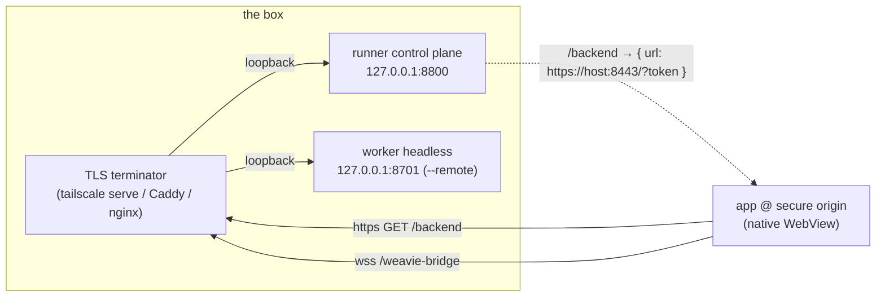

# TLS on the runner

A remote session's whole backend rides one WebSocket — the web↔host bridge ([lsp-over-bridge.md](lsp-over-bridge.md)
folded LSP onto it, so there is exactly **one** socket per backend to secure). This spec records how that
socket becomes reachable as `wss://` from the app, why the mechanism is a reverse-proxy contract rather than
Tailscale-specific code, and the turnkey Tailscale path layered on top.

## The constraint

The app's page runs in a **secure context** — a local `https://` virtual-host origin the WebView serves from
`wwwroot` (`SetVirtualHostNameToFolderMapping`; the hostname is a private alias, not a domain we own or resolve).
A secure context makes the browser refuse two things on connections the page's *script* opens:

- **mixed content** — it may open `wss://`, or `ws://` to **loopback**, but never `ws://` to a remote host;
- **untrusted certs** — a script-opened `wss://` to an untrusted cert fails silently (no click-through; that
  interstitial exists only for top-level navigation, which the app never does to a remote box).

So a remote backend must be `wss://` with a cert the **client OS already trusts**. That is the entire problem.
(It's why remote sessions "worked via headless": there the browser was pointed straight at the worker over an
insecure origin, so same-origin `ws://` was allowed. The native app is pinned to a secure origin.)

## The mechanism: advertise an external base, terminate TLS in front

Terminating TLS is a reverse proxy's job, not the runner's. The runner's only job is to **advertise an
`https://` worker URL** from which the page derives `wss://` — the web already does that scheme math
(`pageUrlToBridgeWs`, `resolveBridgeWsUrl`: `https → wss`), so **no web change is needed**. Everything binds
loopback; a TLS terminator in front maps a public https port to each loopback port.



This is owned by `ITlsFront` (internal to `Weavie.Runner`): it chooses the bind addresses and builds the URL
`/backend` returns. Three modes, selected by `--tls`:

| `--tls` | Binds | `/backend` url | TLS terminated by |
| --- | --- | --- | --- |
| `none` *(default)* | loopback only | `http://<reqHost>:<workerPort>/?token` | nobody — local / headless use |
| `proxy` | loopback | `https://<public-host>:8443/?token` | an operator-run terminator (`--public-host` required) |
| `tailscale` | loopback | `https://<magicdns>:8443/?token` | `tailscale serve` (the runner sets it up) |

**Fail closed.** `none` is allowed only on a loopback bind; a non-loopback `--bind`/`--worker-bind` without TLS
is **refused at startup** (the old raw-Tailscale-no-TLS posture is retired — exposing the runner now means
terminating TLS). `proxy` without `--public-host` is refused. Secured modes front loopback themselves, so they
ignore a network `--bind`.

### Why a fixed worker port

A terminator maps a public https port → the worker's loopback port, and that mapping must survive worker
restarts (the supervisor relaunches a crashed worker). So secured modes **pin** the worker's loopback port
(`--worker-port`, default `8701`) instead of allocating a random one — the front/proxy mapping set up once stays
valid across restarts. Local `none` mode keeps allocating a free port (nothing fronts a fixed one).

## The Tailscale turnkey path

`--tls tailscale` exists because a dev box / agent sandbox usually has **no public domain and sits behind NAT**,
and `tailscale serve` solves all three needs at once: a stable name (`<node>.<tailnet>.ts.net`), a
**publicly-trusted** cert for it (Let's Encrypt via Tailscale — zero client install), and NAT-traversing
reachability (required in userspace-networking mode, where a bound port is reachable *only* through `serve`).
Tailscale is already the remote-session substrate, so this adds no new dependency — only a thin
`ITailscaleCli` seam (so the front is unit-tested against a fake, no real daemon).

`TailscaleServeFront` at construction:

1. discovers the node's MagicDNS name (`tailscale status --json` → `Self.DNSName`);
2. maps the control + worker https ports (`tailscale serve --bg --https=<p> http://127.0.0.1:<loopback>`);
3. advertises `https://<magicdns>:8443/?token` and prints `https://<magicdns>` to register.

It **fails loudly** (and the runner exits) when tailscale is missing, logged out, or the tailnet lacks
HTTPS/MagicDNS — never a silent half-set-up state. Dispose clears both serve mappings.

```mermaid
sequenceDiagram
    participant APP as app (secure origin)
    participant TS as tailscaled (serve, *.ts.net cert)
    participant RUN as runner (loopback)
    participant WK as worker (loopback, --remote)
    APP->>TS: GET https://box.tnet.ts.net/backend (Bearer)
    TS->>RUN: proxied to 127.0.0.1:8800 (TLS terminated, trusted cert)
    RUN-->>APP: { url: https://box.tnet.ts.net:8443/?token }
    APP->>APP: pageUrlToBridgeWs → wss://box.tnet.ts.net:8443/weavie-bridge?token
    APP->>TS: wss upgrade (trusted cert, no mixed-content block)
    TS->>WK: proxied WS upgrade; remote mode token-gates, skips CSWSH
    Note over APP,WK: terminal + fs + LSP all ride this one wss
```

The terminator is interchangeable: the same loopback worker fronted by Caddy/nginx with a real-domain
Let's Encrypt cert is `--tls proxy --public-host <domain>`, no other change. A future **kernel-mode**
`tailscale cert` + Kestrel-direct-HTTPS front (the worker terminates TLS itself on a box with the tailnet IP
bound) is a fourth `ITlsFront` — the seam is in place; deferred until a case needs it.

## LSP reconnection resync

Completing the remote path closes the two deferred gaps from [lsp-over-bridge.md](lsp-over-bridge.md): an offline
LSP write-rejection that wasn't routed into recovery, and watched-file changes missed during a disconnect. Both
close with **one seam**: the host re-pushes the active session's `lsp-config` on every `ready`, and `ready` is
re-sent by the bridge transport on every reconnect. The page's existing `rebindLanguageServices` then tears down
language clients and reconnects them on fresh channels.

- **Attach** (a network blip; the worker survived): the host-side servers are alive; rebind sends `lsp-stop` for
  the old channels and `lsp-start` on fresh ones — a clean re-`initialize` + re-`didOpen`.
- **Resume** (worker restarted): the fresh worker had no channels; rebind's `lsp-start` lands on it, the stale
  `lsp-stop` is a tolerated no-op.

A fresh `initialize` + `didOpen` re-reads every open document from disk, so the missed-`didChangeWatchedFiles`
gap closes by construction (no event replay), and the rejected offline write is replaced by the post-reconnect
rebind. Background remotes are suppressed page-side, so only the active backend rebinds. **Accepted for v1:** a
blip re-initializes language servers (a cold index) rather than resuming the warm one — preserving the warm
server needs a server-side "channels survived" ack; deferred.

## Status

Built on `worktree-lsp-over-bridge`. Host + runner compile under the zero-warning gate; `Weavie.Runner.Tests`
covers the option parsing (modes, fail-closed, worker-port pinning) and the fronts (URL building, serve setup +
teardown, loud failures) against a fake CLI; `Weavie.Hosting.Tests` covers the reconnect resync; the black-box
`Weavie.Remote.Tests` still drive the real runner + worker over loopback. Remaining: an end-to-end run on a real
tailnet confirming completion/hover resolve over `wss://` with a trusted cert and no mixed-content block.
