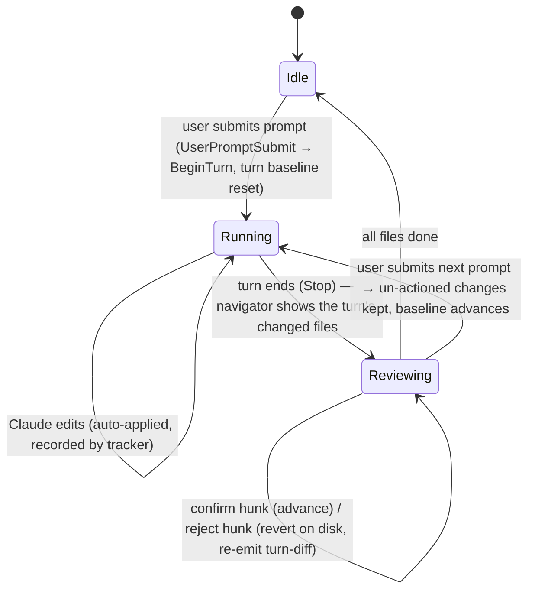

# Reviewing auto-applied changes (post-turn review)

Status: proposed
Last updated: 2026-06-19

A keyboard-first flow for reviewing what Claude changed during an autonomous turn in an **auto-apply
mode** (`acceptEdits` / `bypassPermissions`). You start a task, Claude runs a full turn without
stopping to ask, and then you walk the result file-by-file and diff-by-diff: open a file, land on its
first change, keep or revert each hunk, move to the next file. Doing nothing keeps the change — it was
already written to disk.

This builds directly on the hook-driven change tracker and the inline diff renderer that already
exist; it is mostly *new wiring and one new capability* (per-hunk revert), not a new subsystem. See
[permission-modes-and-change-tracking.md](permission-modes-and-change-tracking.md) and
[../concepts/hook-bridge.md](../concepts/hook-bridge.md) for the machinery this sits on.

## Thesis: review is post-hoc, so reject is the only action that touches disk

In `default` mode, `openDiff` is a **gate** — it blocks *before* the write, and Keep/Reject decides
whether the edit ever happens. In an auto-apply mode there is no gate: the edit is already on disk by
the time you look at it (that is the entire point of the mode). So review is **post-hoc**, and that
inverts what the two actions mean:

- **Reject = revert.** The only action that mutates the file — it undoes a change that already landed.
- **Confirm = mark-reviewed + advance.** A no-op for disk; the change is already there. It only moves
  your cursor and records "I looked at this."
- **Do nothing = keep.** Whatever you don't touch simply stays.

The "not acting auto-confirms next turn" behavior the user asked for **already falls out of the
existing turn model**: `SessionChangeTracker.BeginTurn()` (fired on `UserPromptSubmit`) re-baselines
every tracked file to its current content, so any un-actioned change silently becomes the new
baseline and the inline markers clear (`turn-reset`). We do not persist a review queue across turns —
the turn boundary does the right thing for free.

The asymmetry (reject is the heavy, disk-touching action; confirm is cosmetic) is the load-bearing
idea of this spec.

## Scope

- **In scope:** the `acceptEdits` and `bypassPermissions` modes, where edits auto-apply. These two are
  collectively "auto-apply modes" below.
- **Out of scope:** `default` mode. There, `openDiff` is still the blocking review surface and this
  flow does not apply. The post-turn navigator is suppressed in `default` exactly as `turn-diff`
  already is (`PushTurnDiffToWeb` is skipped in `default` — the per-edit `openDiff` is the review).

## What already exists (reused, not rebuilt)

- **Auto-apply modes** — `claude.permissionMode = acceptEdits | bypassPermissions` is built. The hook
  bridge auto-allows `PreToolUse`; `PermissionModeDiffPresenter.AutoKeepsEdits` auto-keeps `openDiff`.
  Edits land without prompts.
- **Per-turn change tracking** — `SessionChangeTracker` keeps `_turnBaseline[path]` (content at turn
  start) and exposes `TurnChanges()` and `GetTurn(path)`. `BeginTurn()`/`AcceptTurn()` re-baseline the
  turn. This is the source of truth for "what changed this turn."
- **Inline diff renderer** (`src/web/src/editor/inline-diff.ts`) — decorations + ghost view-zones + a
  floating toolbar + **hunk navigation** (`goToChange`, with every hunk anchor in `currentChangeLines`).
  It already has an `"applied"` mode for auto-applied turn changes.
- **Open-file-and-jump** — `EditorController.openFile(path, line)` plus `inline` hunk nav already do
  "open this file and land on a change."
- **Diff commands + keybindings** — `weavie.diff.nextChange` (`$mod+Down`), `prevChange` (`$mod+Up`),
  `accept` (`$mod+Enter`), `reject` (`$mod+Backspace`), `undo` (unbound).
- **Host↔web change messages** — `session-changes`, `change-diff`, `turn-diff`, `turn-reset` (host→web)
  and `get-change-diff`, `accept-turn`, `undo-turn` (web→host), built centrally in
  `ChangeMessages.cs`.

## Goals

1. After an auto-apply turn, surface a **turn-scoped list of changed files** as a navigator the user
   can drive entirely from the keyboard.
2. Selecting a file **opens it and lands on its first change**.
3. Within a file, **next/previous change** navigation plus **confirm** and **reject** *per change
   (hunk)*, not just per file or per turn.
4. **Reject reverts that one hunk on disk**, restoring the turn-start content for just those lines —
   and reverting a file Claude *created* this turn removes the file, rather than leaving it empty.
5. **Auto-advance**: finishing a file's changes moves to the next file in the list automatically.
6. **Un-actioned changes are kept** and are absorbed into the baseline at the next turn — no blocking,
   no queue that outlives the turn.
7. Every action **advertises its shortcut** (toolbar tooltips, palette, menu) per the project's
   keyboard-first rule; bindings are read from the command catalog, never hardcoded.

## Non-goals (deferred)

- **Per-hunk review in `default` mode.** `openDiff` already gates there; layering a second review
  surface on top is out of scope.
- **Staging / partial-accept semantics beyond keep-or-revert.** A hunk is kept (left as-is) or reverted
  to turn baseline. No "edit-then-keep" of an applied hunk (that is what `default`'s `openDiff` is for).
- **Cross-turn review history.** Once a turn is baselined, its review state is gone. We do not build a
  persistent audit log of accepted/rejected hunks here.
- **Reject → "tell Claude why".** Reject reverts; it does not send feedback to Claude. A follow-up could
  let a reject annotate the next prompt, but not in this milestone.

## The model

### Three layers, three owners

| Layer | Owner | Lifetime |
|---|---|---|
| Disk truth (file contents, turn baseline, the revert write) | **Core** (`SessionChangeTracker` + host) | session |
| Hunk geometry (which lines are a change) | **Web** (VSCode `linesDiffComputers`) | recomputed per render |
| Per-hunk review marks (confirmed vs pending, keyed by hunk identity) + per-file status | **Web** (ephemeral review session) | current turn |

Review state lives in the web because it does not survive a turn and never needs to: confirm has no
disk effect, and the turn boundary discards everything. Core owns only what touches disk.

### Turn lifecycle



The only new disk write is the **reject** transition; everything else is navigation and baseline
bookkeeping that already exists.

### Hunk identity & persistence

The user reviews hunk-by-hunk, and **reverting one hunk must not disturb the others** — not their
content and not their review marks. That requires each hunk to carry a **stable identity** that survives
the diff recompute a revert triggers (reverting changes the file, so the diff is recomputed and every
later hunk's line numbers shift).

There is a guarantee underneath that makes this sound, not just best-effort: **two separate hunks are
always separated by at least one equal line** — that is *what makes them two hunks instead of one*.
Reverting a hunk replaces its current lines with its baseline lines, making that region equal to the
baseline; it only ever **adds** equality. It can therefore never merge two neighbouring hunks (the equal
lines that separated them are still there), and it never alters any other hunk's text — only its line
numbers move. So a hunk's identity can safely be its **content signature**: `hash(baselineLines,
currentLines)` plus a document-order ordinal to disambiguate two textually identical hunks in one file.
That signature is stable across a revert (other hunks' content is untouched), across a confirm (no
content change at all), and across navigating away and back within the turn.

The web review session holds, per file, the set of **confirmed** signatures (and the reverted ones, so
they don't transiently flicker back before Core's re-emit lands). On every recompute it re-derives the
hunks and re-attaches each mark by signature. A file is **done** when no *pending* (unmarked) hunk
remains: confirmed hunks stay visible but de-emphasised ("kept"), reverted ones are gone. All of it is
dropped at the turn boundary — nothing persists across turns.

### How reject (per-hunk revert) works

This is the one genuinely new capability — today accept/undo operate on a whole turn or whole file.

The web has the authoritative diff: VSCode's `linesDiffComputers.getDefault().computeDiff(turnBaseline,
liveModel)` yields `LineRangeMapping`s, each with an `originalRange` (into the turn baseline) and a
`modifiedRange` (into the current file). To revert hunk *h*, its `modifiedRange` lines must be replaced
by its `originalRange` lines from the turn baseline.

To honor the hook-bridge security rule — *destructive UI actions operate on real file state, never on
content supplied over a message* — the splice happens in **Core**, sourcing the replacement text from
Core's own `_turnBaseline`. The web sends only **coordinates and a guard**:

1. **Web → host** `reject-hunk { path, baselineStart, baselineEndExclusive, currentStart,
   currentEndExclusive, guardText }`. Ranges are 1-based, end-exclusive (matching VSCode line ranges).
   `guardText` is the exact current text of `[currentStart, currentEndExclusive)` as the web sees it —
   the optimistic-concurrency check, not the content to write.
2. **Host (Core):** read the file's current content from the buffer-aware filesystem (the same source
   the tracker reads). Confirm `[currentStart, currentEndExclusive)` equals `guardText`; if it differs
   (a parallel agent or a later Claude edit moved the file), **abort and toast** "file changed —
   re-open to review," and re-emit a fresh `turn-diff` so the web re-renders against reality. No write.
3. On match, build the new content: current lines with `[currentStart, currentEndExclusive)` replaced
   by `_turnBaseline[path]` lines `[baselineStart, baselineEndExclusive)`. Write through the existing
   save path (`BufferStore.Save`, as `undo-turn` already does), then **update `_current[path]`** to the
   new content (this write is Weavie's own, so no `PostToolUse` fires to record it) and **re-emit
   `turn-diff`** for the file so the inline diff drops that hunk.
4. The web re-renders; the reverted hunk is gone, the cursor lands on the next hunk.

Because the web's `original` side is exactly the `turnBaseline` Core sent in `turn-diff`, the
`originalRange` indexes into the same text Core slices — the two never disagree about line numbering.

**Flush before revert.** Saves are debounced, so a buffer can be ahead of disk. Before issuing
`reject-hunk`, the web flushes the working copy (`flushSave`) so `guardText` reflects what Core will
read. After Core writes, `fs-change` reloads the model without marking it dirty (the existing path).

**Reverting a created file deletes it.** A file created this turn has an empty turn baseline, so its
whole content is a single added hunk (there are no baseline lines to split it on). Reverting that hunk
returns the file to its turn-start state — which is *non-existent*, not empty — so the revert **deletes
the file from disk** rather than leaving a 0-byte file. Deletion keys off **existence at turn baseline,
not emptiness**: a file that *existed but was empty* at turn start is restored to an empty file; one
that *did not exist* is deleted. The tracker records this when it first captures a file's turn baseline
(a `_turnCreated` set), and deletion fires only when a revert returns the file to its baseline content
*and* it was created this turn — for a created file, exactly "revert its one hunk." The existing
whole-turn `undo-turn` truncates-to-empty here instead; that is a bug to fix in passing, so per-hunk,
per-file, and whole-turn reverts all behave identically.

### How confirm works

Confirm is web-only — no host message, no disk write. It marks the current hunk's signature
**confirmed** and auto-advances to the next *pending* hunk. Manual `nextChange`/`prevChange` still walk
*all* hunks (so a confirmed one can be revisited), but the action loop only stops on pending ones. When
a file has no pending hunk left it is **done**, and the navigator auto-opens the next pending file at
its first pending hunk. Confirm-all-in-file marks every remaining hunk in the file confirmed at once.

Per-file status the navigator renders: `pending` (no hunk touched), `in-progress` (some confirmed or
reverted, some pending), `done` (none pending). Confirmed/reverted counts are shown for feedback. None
of it persists past the turn.

## The review navigator (UI surface)

Extend the existing `ChangesPanel` rather than add a parallel panel. Today it is session-scoped and
read-only (`view` mode). It gains a **turn-review mode**, selected when the permission mode is an
auto-apply mode and the current turn has changes:

- **Data source:** a new `turn-changes` host message (turn-scoped sibling of `session-changes`, built
  from `TurnChanges()`), carrying `{ path, name, added, removed }` per file plus letting the web attach
  per-file review status.
- **Selection:** `↑`/`↓` move the highlighted file; `Enter` opens it. Opening requests the file's
  `turn-diff` (via a new `get-turn-diff { path }`, sibling of `get-change-diff`), opens the file
  (`openFile`), and jumps to the first hunk (`inline.goToChange`).
- **Status dots:** each row shows pending / in-progress / done and a `+added / −removed` stat (already
  rendered) plus a small reverted-count when non-zero.
- **Auto-advance:** when a file reaches `done`, the navigator selects and opens the next `pending` file.
- **Header:** "Review changes (N files)"; a "confirm all" affordance (keep everything, mark the turn
  reviewed) maps to the existing `accept-turn`.

The navigator is a *rail of files*; the actual diff review happens in the editor, matching the "open
each one" shape of the vision and reusing the inline renderer.

## In-editor per-hunk flow

The inline diff's `"applied"` mode is extended from whole-turn Accept/Undo to **per-hunk** confirm/
reject driven off `currentChangeLines` (which already isolates every hunk):

- The floating toolbar's primary buttons become **Keep** (confirm this hunk) and **Revert** (reject this
  hunk), alongside the existing prev/next arrows. Tooltips show the live shortcuts via `formatKey` (e.g.
  `Keep (Ctrl+Enter)`), per the keyboard-first rule. The whole-turn actions move to a secondary
  affordance ("Keep all / Revert all in file").
- The cursor's current hunk is emphasized (the others dimmed) so "this is the one Keep/Revert acts on"
  is unambiguous.

### Commands & keybindings

The `acceptEdits`/`bypassPermissions`-mode review introduces a `when` context, `reviewActive`, set
while the navigator/inline review is the focus. The existing diff keys are **repurposed per-hunk** in
that context; their `default`-mode meaning is unchanged.

| Command id | Default key | Action in review context |
|---|---|---|
| `weavie.diff.nextChange` (existing) | `$mod+Down` | Move to next hunk |
| `weavie.diff.prevChange` (existing) | `$mod+Up` | Move to previous hunk |
| `weavie.diff.accept` (existing) | `$mod+Enter` | **Confirm** current hunk, advance |
| `weavie.diff.reject` (existing) | `$mod+Backspace` | **Revert** current hunk on disk, advance |
| `weavie.review.confirmFile` (new) | `$mod+Shift+Enter` | Confirm all remaining hunks in file → next file |
| `weavie.review.revertFile` (new) | `$mod+Shift+Backspace` | Revert the whole file to turn baseline |
| `weavie.review.nextFile` (new) | `$mod+Shift+Down` | Jump to next file in the navigator |
| `weavie.review.prevFile` (new) | `$mod+Shift+Up` | Jump to previous file |
| `weavie.review.open` (new) | `$mod+Shift+r` | Focus the review navigator |

New commands follow the standard path: declare in `CoreCommands.cs` (`RunsIn = Web`) with a default
keybinding, mirror the id in `src/web/src/commands/types.ts`, register a web handler in `App.tsx`. The
palette, MCP `runCommand`, and tooltip shortcuts come for free. `weavie.review.revertFile` reuses the
`undo-turn` path scoped to one file (or N `reject-hunk` splices); `confirmFile` is web-only.

## Message protocol (additions)

Built in `ChangeMessages.cs` so both hosts emit identical payloads.

**Host → web**

| type | when | payload |
|---|---|---|
| `turn-changes` | turn change set updates, auto-apply modes only | `{ files: [{ path, name, added, removed }] }` |
| `turn-diff` (existing) | per file, on change and after a revert | `{ path, name, baseline, current }` |
| `turn-reset` (existing) | turn boundary | `{}` |

**Web → host**

| type | when | payload |
|---|---|---|
| `get-turn-diff` | navigator opens a file | `{ path }` → host replies `turn-diff` |
| `reject-hunk` | user reverts a hunk | `{ path, baselineStart, baselineEndExclusive, currentStart, currentEndExclusive, guardText }` |
| `accept-turn` (existing) | confirm-all | `{}` |
| `undo-turn` (existing) | revert whole turn (and basis for `revertFile`) | `{}` (file-scoped variant adds `{ path }`) |

`turn-changes` is gated to auto-apply modes in the host push (mirroring how `turn-diff` is suppressed
in `default`).

## Architecture / placement

```
src/Weavie.Core/
  Changes/
    SessionChangeTracker.cs   // + _turnCreated (existed-at-turn-baseline bit per file);
                              //   RevertHunk(path, baselineRange, currentRange, guard): splice turn baseline into
                              //   current with concurrency guard, DELETE if the result is a created file's baseline;
                              //   update _current. + fix undo-turn/whole-file revert to delete created files too.
    ChangeMessages.cs         // + TurnChanges(tracker); existing TurnDiff reused for re-emit after revert
  Commands/
    CoreCommands.cs           // + weavie.review.{open,nextFile,prevFile,confirmFile,revertFile} + reviewActive when
src/Weavie.Win/  (and src/Weavie.Mac/)
    WorkspaceWindow.WebBridge.cs / AppDelegate.cs
                              // handle get-turn-diff, reject-hunk; push turn-changes; re-emit turn-diff post-revert;
                              // file-scoped undo-turn
src/web/src/
  changes/ChangesPanel.tsx    // turn-review mode: file rail, status dots, ↑/↓/Enter, auto-advance
  editor/inline-diff.ts       // applied mode → per-hunk Keep/Revert; emphasize current hunk; reject-hunk message
  editor/editor-controller.ts // turn-changes/get-turn-diff wiring; open-at-first-hunk
  commands/types.ts           // mirror new command ids
  App.tsx                     // register weavie.review.* handlers; reviewActive context key
```

## Build sequence

Each step is shippable on its own.

1. **Turn-review navigator (read-only).** Add `turn-changes` (host) + `get-turn-diff`, put `ChangesPanel`
   in turn-review mode, open-file-at-first-hunk, `↑`/`↓`/`Enter`, `weavie.review.open`. No disk action
   yet — you can walk the turn's files and hunks using the existing whole-turn Accept/Undo. Verify live
   in `acceptEdits`: after a multi-file turn, the navigator lists the files and Enter lands on the first
   change.
2. **Per-hunk confirm + persistent marks.** Introduce the stable hunk identity (content signature) and
   the per-file confirmed-set; repurpose `$mod+Enter` to confirm the current hunk in the `reviewActive`
   context; per-file status, auto-advance to next pending, `confirmFile`, `nextFile`/`prevFile`.
   Web-only; no Core change. Verify: confirming walks hunk→hunk→file→file, the marks survive leaving and
   re-opening a file, and the navigator shows progress.
3. **Per-hunk reject (the new Core capability).** Add `reject-hunk` + `SessionChangeTracker.RevertHunk`
   with the guard, the existence bit + delete-on-revert for created files, the post-revert `_current`
   update + `turn-diff` re-emit, and `$mod+Backspace` per-hunk in review context; `revertFile`. The
   step-2 confirm marks on *other* hunks must survive the revert recompute. Tests: revert a middle hunk
   restores exactly those lines and leaves the others' content *and confirm marks* intact; guard
   mismatch aborts without writing; reverting a created file deletes it (not truncate); restoring a
   was-empty file leaves a 0-byte file. Verify live: among several hunks revert one — only those lines
   return to turn-start, the rest stay as Claude left them; revert a newly-created file and watch its
   tab close.
4. **Polish.** Toolbar relabel (Keep/Revert) with `formatKey` tooltips, current-hunk emphasis, palette
   entries, the "confirm all" header action.

## Edge cases

- **User edits a file mid-review.** The inline diff already distinguishes user lines from Claude lines.
  A revert targets a hunk by current line range with a `guardText` check; if the user changed those
  lines, the guard fails and the revert aborts with a re-render rather than clobbering their edit.
- **Parallel agents / later Claude edit moves the file.** Same guard. The file-system is shared; a
  mismatch is expected sometimes and is handled by abort-and-re-render, never a blind overwrite. This
  matches the project's "don't fight concurrent edits" stance.
- **Mode switched mid-turn.** The navigator is shown for auto-apply modes; switching to `default`
  mid-turn hides it (the remaining changes are already on disk and become baseline at the next turn).
  Switching `default → acceptEdits` mid-turn surfaces whatever the turn has accumulated.
- **Reverting a created file deletes it** (see above), and the file may be open in a review tab. The
  delete goes out as an `fs-change` removal; the editor must close that tab cleanly rather than surface
  an "Unable to read file" error, and the navigator drops the row and auto-advances. No error toast, no
  orphan tab — that polish is part of the experience bar.
- **Binary / very large files.** The tracker is text-based already; the navigator inherits whatever the
  inline diff does today (no special handling added here).

## Open questions

- **`Stop`-hook driven "turn ended" signal.** The navigator should appear when the turn finishes. The
  hook settings already register `Stop`; confirm it reliably marks turn end (vs. relying on the next
  `UserPromptSubmit`) and drives the navigator's "turn complete" state.
- **Confirmed-hunk visual weight.** Confirmed hunks stay visible but de-emphasised so review progress
  reads at a glance. The exact treatment — gutter check, faded background, or collapse — is a design
  detail to settle live against the Weavie Dark palette.
```