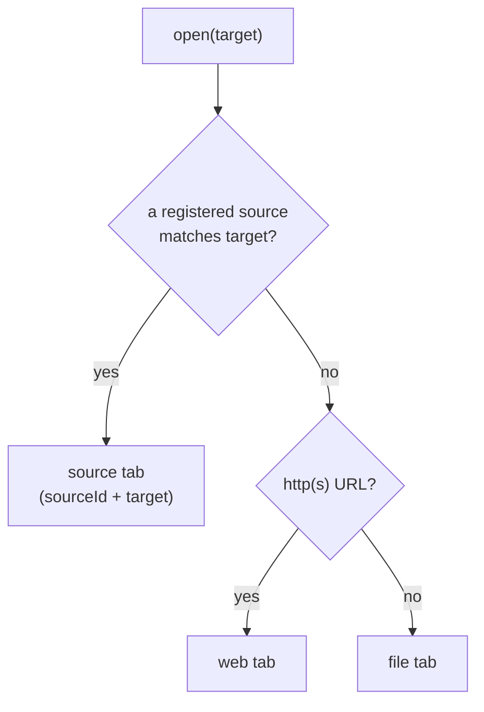
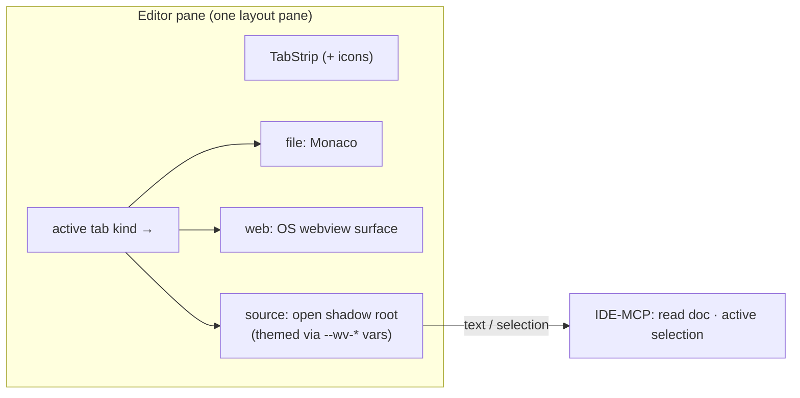

# Web & source tabs (browser and integration tabs in the editor tab bar)

**Status:** design. Builds directly on [editor-tabs.md](editor-tabs.md) (the tab strip, the ordered
open list, persistence) and the [capability registry](../concepts/mcp-registry.md) (how a source
plugin reaches Claude). No code yet.

Today every tab is a file. This spec generalizes the open list into a **kind-tagged** set so the *same*
tab bar can also hold a **web** page (an arbitrary URL in a real browser surface) and a **source** (a
third-party document — Notion first — fetched via its API and rendered natively). The motivating goal is
"open a Notion doc next to my code"; the general shape is "non-file things live in the editor tabs too."

This stays **inside the editor pane**. Like the tab strip itself, web/source tabs are *chrome inside the
existing editor pane*, not new layout panes — they must **not** touch `LayoutView`'s `KINDS`
(`src/web/src/layout/LayoutView.tsx`). The editor stays one layout pane; the active tab's *kind* decides
what renders inside it, exactly as the Source/Preview toggle already overlays `PreviewPane` over Monaco.

## Why this shape (the load-bearing decisions)

The long way round produced a few conclusions that the design now depends on. They are recorded here so
they are not re-litigated:

- **A source is fetched via its API and rendered by us — not the live web page in an iframe.** An
  `<iframe>` of Notion fails twice over: framing headers (`X-Frame-Options` / CSP `frame-ancestors`)
  blank the frame, and even with those stripped, **storage partitioning** (default in current Chromium,
  no embedder opt-out — only the *top-level* site can request unpartitioned storage) leaves the framed
  app logged-out. Header-stripping makes the page render but not authenticate; it is a dead end.
- **Auth for a source is a one-time, host-run OAuth in the *system browser*, never an in-app login.**
  Weavie is the OAuth *client* for the API, so the blessed native-app flow applies. This sidesteps
  Google's embedded-webview block (`disallowed_useragent`, which blocks WKWebView **and** WebView2 alike)
  because consent happens in the user's real browser, where even "Sign in with Google" works.
- **No API write-back / in-app editing of sources.** Editing through a REST API means rebuilding the
  source's editor, with no realtime, against rate limits, with no conflict resolution — strictly worse
  than the thing it clones, and true of every live SaaS doc (Sheets, Figma, Linear). Editing, if ever
  wanted, is "open the real app" (a `web` tab) or a system-browser handoff — see *Deferred*.
- **Render inline in an open shadow root, not a separate webview.** A separate webview would capture
  keyboard focus and hijack global shortcuts (the VS Code-webview problem). Inline rendering keeps one
  document, so capture-phase handlers keep `Ctrl+1` etc. host-owned; an **open** shadow root keeps the
  content readable by host code (find, Claude) while isolating CSS.

## Tab kinds

The open list becomes a discriminated union on `kind`. `file` is unchanged in shape; the `kind` field is
**absent ⇒ `file`**, so existing `editor-session.json` files round-trip untouched.

```ts
// src/web/src/editor/session-types.ts
type TabEntry = FileTab | WebTab | SourceTab;

interface FileTab {
  kind?: "file";                    // absent ⇒ "file"
  path: string;                     // also the tab's stable id
  viewState: EditorViewState | null;
  preview?: boolean; pinned?: boolean; scratch?: boolean;
}

interface WebTab {
  kind: "web";
  id: string;                       // stable per tab (url changes as you navigate)
  url: string;                      // current location
  history: { back: string[]; fwd: string[] };  // per-tab nav stack (persisted)
  pinned?: boolean;
}

interface SourceTab {
  kind: "source";
  id: string;                       // stable per tab
  sourceId: string;                 // which registered source plugin
  target: string;                   // resolved doc identity (e.g. a Notion page url/id)
  history: { back: string[]; fwd: string[] };
  pinned?: boolean;
}
```

- **Tab key.** The strip, commands, and MCP key on a tab **id**: a `file`'s id is its `path` (back-compat,
  nothing changes); `web`/`source` carry an explicit `id` because their `url`/`target` mutates as the user
  navigates within the tab. `preview` and `scratch` are file-only; `pinned` applies to all kinds.
- **Persistence.** `web`/`source` tabs persist their `url`/`target` + nav stack, never content — a source
  re-fetches on restore, a web tab reloads, mirroring "disk is the source of truth" for files. Inherits
  the atomic-write / malformed-backup handling from [editor-session.md](editor-session.md).

## Routing: resolving a target to a kind

Opening anything — a file-tree click, a pasted URL, a clicked link inside a doc — runs one **resolver**
with a fallback chain. This is also how a source claims a real URL the user pasted, so copying a Notion
link from the browser and opening it lands in the native renderer.



A source declares its **match predicate** (URL host/path patterns, optionally a custom scheme) as part of
its registration — capability-style, not hardcoded. First match wins; `web` is the catch-all for http(s);
`file` for local paths.

## Source plugins

A source is a **trusted** plugin (the VS Code-extension trust model: it can already run arbitrary code, so
its output is not an XSS boundary). It is **read-only**. It registers in Core the same way settings and
commands do (see [mcp-registry.md](../concepts/mcp-registry.md) — "Future plugins contribute declarations
the same way"), which is also what makes it visible to Claude.

```ts
interface Source {
  id: string;                       // e.g. "notion"
  match(target: string): boolean;   // routing predicate
  icon: IconRef;                    // brand icon (≈ favicon, but bundled / instant)
  auth: OAuthDescriptor;            // endpoints + scopes; host runs the flow, owns the token
  fetch(target, token): Promise<SourceDoc>;
}

interface SourceDoc {
  html: string;                     // display projection, rendered in the shadow root
  text: string;                     // clean markdown-ish projection, for Claude
  icon?: IconRef;                   // per-document icon (e.g. a Notion page emoji/image)
  title: string;
}
```

The split is deliberate: **plugins produce content; the host owns presentation, auth, routing, and the
tab.** A plugin is thin — match + fetch + map-to-`SourceDoc`. The host provides everything shared.

- **`html` vs `text`.** `html` is what the human sees; `text` is what Claude reads — both derived from one
  fetch. For Notion (whose API returns structured blocks) producing both is one pass over the same data,
  and it spares Claude from scraping rendered HTML.
- **Auth (host-run).** The host runs the OAuth consent in the **system browser** (loopback/redirect catch),
  stores the token in the OS secure store (DPAPI / Keychain / libsecret), and hands it to `fetch`. Plugins
  never implement login. This is host-facing, so it lives in `HostCore` with `IHostPlatform` supplying the
  open-external + secure-store bits (see [host-core-unification.md](host-core-unification.md)).

### Notion (first source)

`match` = `*.notion.so` / `notion.site` hosts. `auth` = a Notion OAuth integration (read scope). `fetch`
calls the Notion API, converts blocks → semantic `html` (host stylesheet owns the colors) **and** →
markdown `text`. `icon` = the Notion brand mark; `SourceDoc.icon` = the page's own emoji/image from the API.

## Rendering a source: open shadow root, themed, host-navigated

When a `source` tab is active, the editor pane hosts a shadow-root container fed the doc's `html`
(overlaying Monaco exactly as `PreviewPane` does today):

- **Open shadow root.** CSS is isolated to the shadow tree (no bleed into the app), but host code still
  reads the content for find, selection, and Claude. Open, never closed — closed would blind the host's own
  features.
- **Theming follows Weavie's mode, live.** The host publishes its theme as **CSS custom properties** on the
  shadow host (`--wv-*`); custom properties (and inheritable props like `color-scheme`) **pierce the shadow
  boundary** by design, so the content restyles when Weavie toggles dark/light. Plugins style against the
  provided variables (the contract), and for Notion the host stylesheet owns the colors outright since the
  adapter emits structural markup. (Same model as VS Code's `--vscode-*`.)
- **Global shortcuts stay host-owned.** Because this is inline (one document, not a separate webview),
  global commands are caught on the **capture phase** at the document root — they fire before any focused
  element in the doc, so a source can never eat `Ctrl+1`. This is the whole reason for inline-over-webview.
- **Links are intercepted, never followed.** A capture-phase click handler `preventDefault()`s every anchor
  and routes the href through the resolver — letting it navigate the host webview would destroy the app UI.
  Fragments (`#…`) scroll in place; `mailto:` etc. hand off to the OS. **Same-vs-new-tab honors the link's
  own semantics** (`target="_blank"` / modifier / middle-click → new tab; else navigate in place). Each tab
  keeps a **back/forward** stack.



## Find, selection, and Claude

These reuse one piece of machinery — text ranges over the open shadow content.

- **Find is a host feature.** Native `Ctrl+F` does **not** search shadow DOM, and would search the whole UI
  anyway. The host runs find scoped to the active source: walk the shadow tree's text, highlight matches via
  the **CSS Custom Highlight API** (paints ranges without mutating the plugin's DOM).
- **Selection → Claude** is the same range model pointed at the user's selection. It feeds the **same
  "active selection as context" channel** that file selections use — a source selection and a code selection
  reach Claude identically — surfaced as a command with a default keybinding (keyboard-first rule).
- **Claude reads the doc** via the registry: the active source's `text` is exposed as a readable resource,
  the way open files are. This is why the shadow root is open and why `fetch` produces `text`.

## Web tabs

A `web` tab is an arbitrary URL in a **real browser surface** — for public/no-login pages (docs, localhost
previews, a deployed app) and as the live/escape-hatch surface. Unlike a source, it is the actual page, not
our render.

- **Surface.** An OS webview child (`WebView2` / `WKWebView` / `WebKitGTK`) positioned by the host over the
  editor-pane rectangle (bounds published from the web layer over the bridge; a `HostCore` concern). It is a
  *top-level* browsing context, so it loads framing-protected sites and authenticates normally (first-party
  cookies) — the persistent profile/cookie store must be **persistent**, not ephemeral, so logins stick.
- **Z-order.** A native child sits above the DOM, so it's hidden while an overlay needs that space (command
  palette, modals) — the child-on-top + hide-on-overlay pattern. For Weavie's overlay set this is a small,
  enumerable set of triggers, not a constant tax.
- **Auth reality.** Most logins (email/password, most SSO) work in a top-level webview; **Google-SSO login
  is the one blocked** in an OS webview, so it degrades to "open in your real browser." Reading a source is
  unaffected (token-based).

> `web` is the heavier arm (native-webview compositing) and can be a later phase; the v1 deliverable is the
> tab-kind model + `source` (Notion). The resolver already falls back to `web`, so it can light up later
> without reshaping anything.

## Tab icons

Each tab shows an icon left of its title (as file editors do). One resolver, dispatching on kind — and only
`web` is async:

| Kind | Icon | Source | Loading |
| --- | --- | --- | --- |
| `file` | file-type glyph | an established open icon set (Seti / Material / vscode-icons), keyed by filename/extension | sync |
| `web` | site favicon → **globe** fallback | read from the webview itself (native favicon event where exposed, else a `<link rel=icon>` scrape); never a third-party favicon service; cache by origin | async |
| `source` | per-doc icon → plugin brand icon | `SourceDoc.icon` (e.g. a Notion page emoji) falling back to `Source.icon` | sync-ish |

`iconFor(tab)` lives in the web frontend; `web` favicons arrive over the bridge from the host. Monochrome
icons (globe) tint with the theme variables; brand glyphs stay full-color. `Source` gaining an `icon` field
is the only contract addition icons require.

## Wire messages (additions)

Extends the [editor-tabs.md](editor-tabs.md) set; entries below are new or widened.

| Direction | `type` | Meaning |
| --- | --- | --- |
| web → host | `open-editors-changed` | widened: each entry carries `kind` + `id` (+ `label`/`icon`); files keep `languageId`. |
| web → host | `source-fetch` | resolve + fetch a source `target` (host runs auth if needed) → `SourceDoc`. |
| host → web | `source-doc` | the fetched `{ html, text, icon, title }` for a tab. |
| web → host | `web-bounds` | the editor-pane rect (+ visibility) for positioning a `web` child webview. |
| host → web | `web-favicon` | favicon for a `web` tab's current origin. |

## Architecture placement

- **Web (SolidJS):** the tab-kind union + resolver in the session store; `TabStrip` gains the icon slot and
  renders kind-agnostically; a `SourceView` (open shadow root + theming + find + link interception) overlays
  the editor pane beside `PreviewPane`; `iconFor`. No `LayoutView.KINDS` change.
- **Core / `HostCore`:** the source registry (registered like settings/commands, surfaced on the registry
  MCP server); host-run OAuth + secure token store; for `web`, the native child-webview lifecycle + favicon
  events via `IHostPlatform` — so all four hosts inherit them, headless getting no-op browser surfaces.
- **Claude:** the active source doc exposed as a readable registry resource; selection on the existing
  active-selection channel.

## Deferred (explicit non-goals for v1)

| Item | Decision |
| --- | --- |
| **Source editing / write-back** | Out. API-write is strictly worse than the real editor (no realtime, rate limits, conflicts, fidelity chase). If ever wanted, editing is "open the real app" (a `web` tab) or a system-browser handoff + re-fetch — **never** an API write path. |
| **Live refresh** | Out. A source is a manual-refresh snapshot. No polling/webhooks in v1. |
| **In-doc embeds** | A rich embed inside a source (YouTube, Figma) renders as a card/link that opens a `web` tab, not an inline live frame. |
| **In-source keyboard nav** | Out. Only *global* shortcuts are guaranteed (capture-phase); navigating within a rendered doc is not a host feature in v1. |
| **`web` arm** | Defined here but phaseable after `source`; needs native-webview compositing. |
